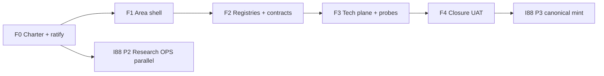

# Finance area full governance — programme roadmap (F0–F4)

> **Purpose.** Make Finance the first **full governed O5-1 area** after Data (I93),
> at the **Volvo operational finance bar**: semantic MDM, governed facts, automated
> cross-area contracts. **Absorbs** I88 P1 spine evidence; **does not** treat P1 as area closure.

## Dependency diagram

## F0 — Charter gate (thinking seat)

| Item | Deliverable |
|:---|:---|
| Research | [`research-finance-full-governed-area-2026-06-05/`](research-finance-full-governed-area-2026-06-05/) (minted) |
| Charter draft | `FINANCE_AREA_CHARTER.md` — five planes, Volvo bar, cross-area DC table |
| Decisions | Finance buildout inception in decision-log + **DECISION_REGISTER.csv** |
| Ratify | AskQuestion batch (programme scope, finops/ home, M2 threshold N) |

**Verification:** synthesis-before-tranche (internal_governance class); no CSV commit.

## F1 — Area shell (Composer) ✅ 2026-06-05

**Execution SSOT (complete):**

- Executor packet: [`finance-area-executor-packet-f1-2026-06-05.md`](finance-area-executor-packet-f1-2026-06-05.md)
- Tranche charter: [`finance-area-f1-tranche-charter.md`](finance-area-f1-tranche-charter.md)
- Two-seat workflow: [`finance-area-two-seat-workflow-2026-06-05.md`](finance-area-two-seat-workflow-2026-06-05.md)

| Deliverable | Closes AREA |
|:---|:---|
| `Finance/README.md` | AREA-13 |
| `Finance/Governance/canonicals/FINOPS_DISCIPLINE.md` | AREA-03, AREA-12 |
| `FINANCE_AREA_CHARTER.md` | AREA-02 |
| `process_list`: `pattern_area_buildout` on Finance umbrellas | AREA-14 |

**Verification:** `validate_area_completeness.py --matrix` → Finance ≥65%, charter/README/discipline gaps cleared.

**Operator gate:** `process_list` + `CANONICAL_REGISTRY` (see packet §5).

**Composer bootstrap:** paste packet §10 into Holistika — Execute mode (composer-2.5).

## F2a — Rev-rec + pricing + DC seeds (Composer) ✅ 2026-06-05

**Execution SSOT:** [`finance-area-executor-packet-f2a-2026-06-05.md`](finance-area-executor-packet-f2a-2026-06-05.md) · evidence: [`finance-f2a-execution-evidence-2026-06-05.md`](finance-f2a-execution-evidence-2026-06-05.md)

| Deliverable | Closes / elevates |
|:---|:---|
| `FINOPS_REVENUE_RECOGNITION_POLICY.md` (active) | Plane 2 doctrine; OPS-81-5 |
| `PRICING_TIER_REGISTRY.csv` + obligation registry + validator | AREA-08 **pass**; OPS-81-6 |
| 5 `DC-HOL-FINOPS-*` data-contract rows | FIN-05 |
| AREA-06 probe join fix (CONF via `capability_id`) | AREA-06 **pass** |
| `thi_finan_dtp_303` runbook pairing note | AREA-09 pilot |

**Verification:** synthesis 9/9; `validate_pricing_tier_registry.py`; `validate_hlk.py`; Finance matrix **88%**.

## F2b — Tax calendar (Composer; counsel gate)

| Deliverable | Closes / elevates |
|:---|:---|
| `FINOPS_TAX_CALENDAR.csv` | Plane 3; OPS-81-13 |
| `METRICS_REGISTRY.csv` finance metrics (≥8) | Semantic layer M4 (optional F2b/F4) |

**Verification:** AskQuestion before CSV commit; `validate_hlk.py`.

## F3 — Tech plane (Composer + operator SQL gate)

| Deliverable | Closes |
|:---|:---|
| Mirror apply FINOPS mirrors (SOP-HOLISTIKA_COMPLIANCE_MIRROR_DML_001) | AREA-10 evidence |
| `dataops_quality_check.py` FINOPS/DATA-FAM spine probes | DATA-02 |
| First `registered_fact` OR documented entity-gate SKIP | M3 partial |
| `akos-finance-ops.mdc` + `finance-ops-craft` skill | AREA-11 |
| Monthly recon report template + first run | M3 |

**Verification:** `validate_finops_ledger.py`, `dataops_quality_check.py --self-test`, linked Supabase counts.

## F4 — Closure (People + CFO)

| Deliverable | Closes |
|:---|:---|
| Area matrix **≥88% / 0 gaps** | Match I93 |
| `uat-finance-area-buildout-2026-06-05.md` | 11-section UAT |
| P1b pillar re-grade sweep | I88 M5 |
| Breakthrough digest → I79 | People propagation |
| Unblock I88 P3 after P2 report exists | R-IH-88-1 |

**Verification:** golden path + `validate_uat_report.py`.

## I88 relationship

| I88 phase | Relationship to F0–F4 |
|:---|:---|
| P1 (done) | **Spine evidence only** — superseded for area bar |
| P2 | Run **parallel** after F1 |
| P3 | **After** F4 + P2 |

## Mint backlog (OPS alignment)

| OPS / theme | F-phase |
|:---|:---|
| OPS-81-20 board reporting | F2 |
| OPS-81-5/6 rev-rec + pricing | F2 |
| OPS-81-13 tax calendar | F2 |
| OPS-86-18 COUNTRY quartet | F3 (Tech) or forward OPS |
| P1-F-04 Legal instrument back-ref | F2 schema + contract |

## Cross-references

- Master synthesis: [`research-finance-full-governed-area-2026-06-05/master-synthesis.md`](research-finance-full-governed-area-2026-06-05/master-synthesis.md)
- Intent regression: [`intent-regression-finance-bar-2026-06-05.md`](intent-regression-finance-bar-2026-06-05.md)
