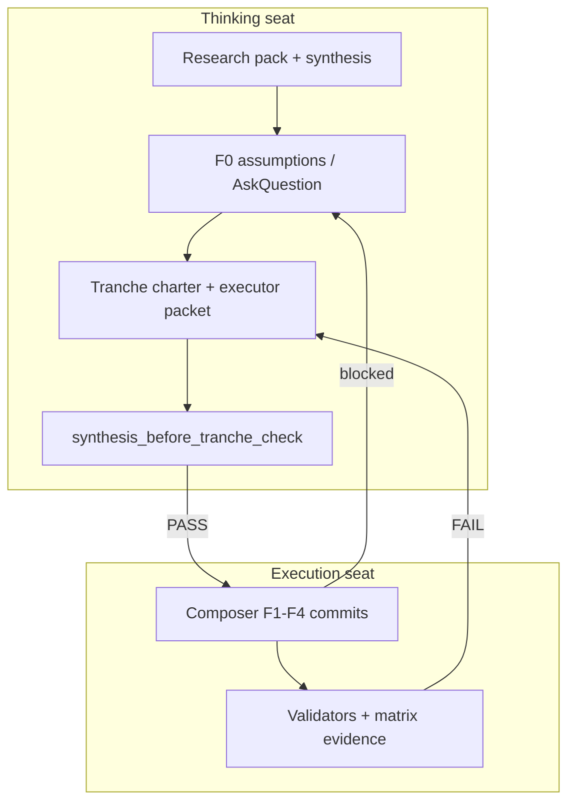

# Finance area buildout — two-seat workflow (F0–F4)

> **Practice, not theory.** This is the **second repo worked example** of
> thinking-seat → executor-packet → Composer execution, after I93 DATA. Use it
> for every Finance phase; copy the pattern for the next full-area programme.

## Roles

| Seat | Agent | Model | May write vault? |
|:---|:---|:---|:---:|
| Thinking | [planner.md](../../../../.cursor/agents/planner.md) | Opus-class | No (`readonly`) |
| Execution | [executor.md](../../../../.cursor/agents/executor.md) | **composer-2.5** | Yes (packet-bound) |
| Operator | You | — | Approves CSV gates + ratification |

## Programme map



## Per-phase rhythm (repeat every Fn)

| Step | Seat | Artifact | Tool |
|:---:|:---|:---|:---|
| 1 | Thinking | Research / evidence already in pack | Read-only |
| 2 | Thinking | **Tranche charter** `finance-area-f*-tranche-charter.md` | `synthesis_before_tranche_check.py` |
| 3 | Thinking | **Executor packet** `finance-area-executor-packet-f*.md` | Template: `_templates/executor-packet-template.md` |
| 4 | Operator | Approve CSV gates listed in packet §0/§5 | Chat / AskQuestion |
| 5 | Thinking | Paste **§10 bootstrap** into new Composer thread | Handoff marker |
| 6 | Execution | Implement §3 files only | composer-2.5 |
| 7 | Execution | Run §6 verification matrix | `validate_*` scripts |
| 8 | Execution | One commit + optional evidence stub | git |
| 9 | Operator | Review matrix + diff | — |
| 10 | Thinking | Author **next** packet OR closure UAT packet | — |

## Phase index

| Phase | Thinking deliverables | Execution packet | Operator gate |
|:---|:---|:---|:---|
| **F0** | Research pack (done); programme decisions; optional `DECISION_REGISTER` row | *No vault commit* — ratification only | AskQuestion scope / M2 / homes |
| **F1** | [f1-tranche-charter](finance-area-f1-tranche-charter.md) + [f1-executor-packet](finance-area-executor-packet-f1-2026-06-05.md) | Area shell | `process_list` + `CANONICAL_REGISTRY` |
| **F2a** | Rev-rec + pricing + DC seeds (stub packet) | Registries tranche A | CONF + contract CSV |
| **F2b** | Tax calendar (stub packet) | Registries tranche B | Tax registry CSV |
| **F3** | Mirror + recon spec (stub packet) | Tech plane | **SQL apply** (mirror DML) |
| **F4** | Closure UAT spec (stub packet) | UAT + matrix 88% | UAT sign-off |

**Parallel track:** I88 P2 Research OPS may start after **F1 complete** — do not block F2 on P2.

## Handoff markers (mandatory)

```text
=== OPUS DONE -> SWITCH TO COMPOSER ===
=== THINKING DONE — operator review ===
=== COMPOSER BLOCKED -> SWITCH TO OPUS ===
=== COMPOSER DONE — operator review ===
```

## Anti-patterns (do not)

| Anti-pattern | Why it fails |
|:---|:---|
| One mega-prompt "implement Finance like Data" | Composer re-scopes; misses CSV gates |
| Skipping tranche charter | Synthesis discipline exists to catch scope creep |
| F2 work inside F1 packet | Violates one-commit-per-phase; review nightmare |
| Automated PASS on I88 pillars without F4 re-grade | P1 overstated maturity |
| Minting I88 P3 canonical before F4 | R-IH-88-1 dependency |

## Evidence trail (where to look)

| Question | Go to |
|:---|:---|
| Why Finance full area? | [`research-finance-full-governed-area-2026-06-05/master-synthesis.md`](research-finance-full-governed-area-2026-06-05/master-synthesis.md) |
| What to run now? | Latest `finance-area-executor-packet-f*.md` |
| Honest maturity? | [`intent-regression-finance-bar-2026-06-05.md`](intent-regression-finance-bar-2026-06-05.md) |
| Mint / tool inventory? | [`finance-governance-traceability-inventory-2026-06-05.md`](finance-governance-traceability-inventory-2026-06-05.md) |
| Programme phases? | [`finance-area-buildout-roadmap-2026-06-05.md`](finance-area-buildout-roadmap-2026-06-05.md) |

## Fresh-thread rule

One **executor packet per Composer thread**. After F1 commit, open a **new** thread for F2a
with only the F2a packet + charter — do not continue an F1 thread (context drift).

## Cross-references

- Repo guide: [`docs/guides/cursor-two-seat-routing.md`](../../../../guides/cursor-two-seat-routing.md)
- I93 packets (pattern): [`docs/wip/planning/93-data-area-foundation-and-governance/master-roadmap.md`](../../93-data-area-foundation-and-governance/master-roadmap.md) §9 Composer packets
- Delegation rule: [`.cursor/rules/akos-aic-delegation.mdc`](../../../../.cursor/rules/akos-aic-delegation.mdc)
