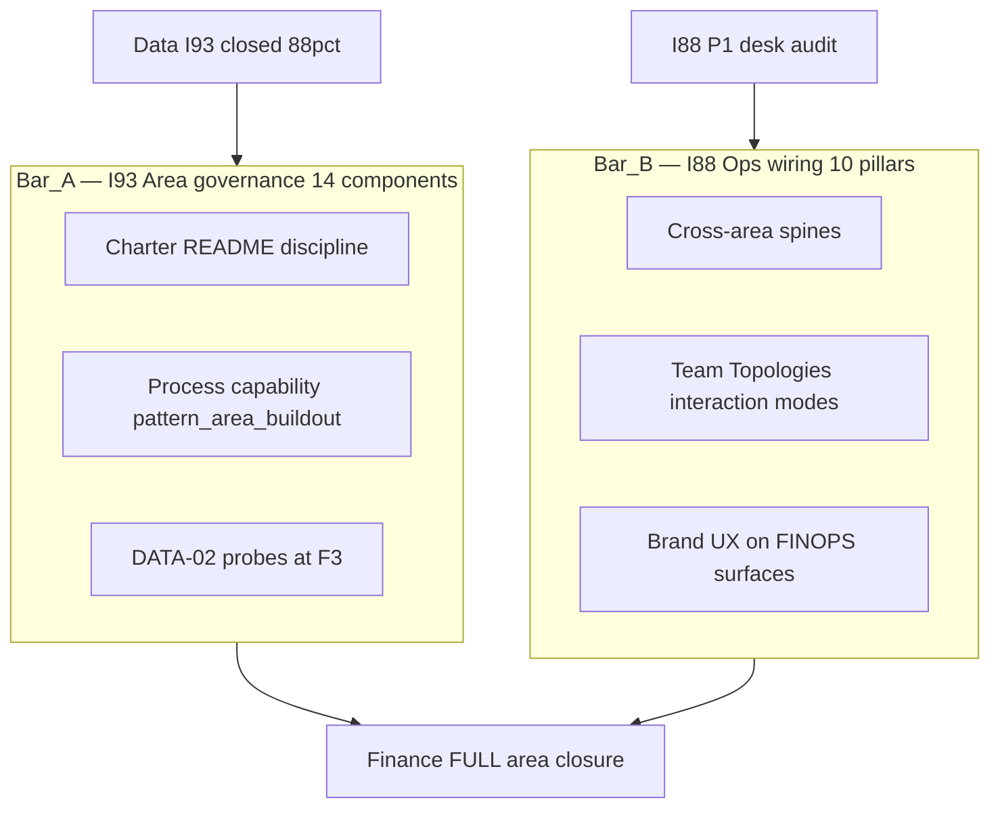

# Master synthesis — Finance as first FULL governed area (post-Data / I93)

## Executive summary

Your goal is not “another I88 desk audit.” It is to make **Finance** the first
**full governed O5-1 area** after **Data (I93)** — at the **Volvo bar**: finance
owns **semantic master data**, **governed facts**, and **automated cross-area
joins** so Marketing, RevOps, Legal, and Operations consume the same
`counterparty_id` / `engagement_id` / metric definitions.

**Today:** Finance scores **50%** on the 14-component area matrix (five gaps).
I88 P1 marked **8/10 pillars PASS** from doctrine presence — that **overstates**
operational maturity vs industry ReOps and vs your I81 five-plane model (only
plane 1 is populated; planes 2–5 are schema-only or counsel-held).

**Recommendation:** Launch programme **FINANCE-AREA-FULL** (phases F0–F4) as the
**primary** track; keep **I88 P2 Research OPS** parallel; treat P1 sweep as
**spine evidence only**, re-grade pillars after F2/F3 probes.

## Operator benchmark (Volvo bar) — what “all out” means

| Volvo-style signal | Holistika translation |
|:---|:---|
| Accountants as **data project managers** | Business Controller owns **data contracts** + metric catalog, not only SOP prose |
| **Semantic strength** (one counterparty = one truth) | Golden `FINOPS_COUNTERPARTY_REGISTER` + enforced joins to Stripe, ADVOPS, engagement |
| **Fully automated ops** | Stripe → queue → `registered_fact` + DLQ runbooks + monthly recon report |
| Finance elevates other areas | **DC-*** contracts: RevOps, Legal, People, Marketing, Data-FAM-GTM-CRM |

Industry anchors: DAMA MDM ([EXT-01]), R2R maturity ([EXT-02]), finance semantic layer ([EXT-03]), counterparty golden record ([EXT-05]), BCBS 239 rigor checklist ([EXT-06]), MKT dual hierarchy ([EXT-07–08]), RevOps–Finance alignment ([EXT-09]), data mesh finance products ([EXT-13]).

## Two bars — do not conflate

| Bar | Data today | Finance today |
|:---|:---|:---|
| **Area governance (14)** | **88%, 0 gaps** | **50%, 5 gaps** |
| **I88 Ops wiring (10)** | N/A (not deep example) | P1 **PASS-WITH-FOLLOWUP** (generous PASS count) |

## Finance 14-component matrix (2026-06-05)

| Component | Verdict | Gap action (F-phase) |
|:---|:---|:---|
| AREA-01 Parent tree | pass | — |
| AREA-02 Area charter | **gap** | F0–F1 `FINANCE_AREA_CHARTER.md` |
| AREA-03 Discipline charters | **gap** | F1 `FINOPS_DISCIPLINE.md` |
| AREA-04 process_list | pass | F1 `pattern_area_buildout` on umbrella rows |
| AREA-05 baseline roles | pass | Activate O2C/PTP when F2/F4 |
| AREA-06 CAP+CONF | partial | F2 seed 16 CONF rows |
| AREA-07 Canonical/PRECEDENCE | partial | F2 ratify finops/ owning_area |
| AREA-08 Dimension registries | **gap** | F2 metrics/tax/pricing registries |
| AREA-09 Paired SOP+runbook | partial | F2 fill runbook_path on thi_finan_dtp_* |
| AREA-10 Mirrors | skip | F3 live DATA-02 evidence |
| AREA-11 Cursor rule+skill | **gap** | F3 `akos-finance-ops` + craft skill |
| AREA-12 Quality Fabric | partial | F1 discipline → QF §6 cite |
| AREA-13 Area README | **gap** | F1 `Finance/README.md` |
| AREA-14 inherited_pattern | partial | F1 pattern_area_buildout on processes |

## I88 P1 re-grade (honest pillar posture)

| # | Pillar | P1 wrote | **Re-grade** | Why |
|:---|:---|:---|:---|:---|
| 1 | Strategy | PASS | **PWF** | OPS-81-20 judgment layer open |
| 2 | Recruitment | PWF | **PWF** | No activated CFO/BC human; OK per D-IH-81-P |
| 3 | Tools | PASS | **PASS** | Writer substrate real |
| 4 | Knowledge | PASS | **PWF** | Register populated but no semantic/metric catalog |
| 5 | Governance | PASS | **PWF** | Tax/adviser answers not encoded |
| 6 | Skills | PASS | **PASS** | Pydantic + validators |
| 7 | Comms | PWF | **PWF** | Board reporting SOP missing |
| 8 | Logistics | PASS | **PWF** | No live fact / recon drill |
| 9 | Brand | PWF | **PWF** | Correct |
| 10 | UX | PWF | **PWF** | CHARTER-class correct |

**Revised pillar score:** **2 PASS / 8 PWF** — overall still **PASS-WITH-FOLLOWUP**, but
**not** “9 of 10 exercised end-to-end.”

## Cross-area elevation (finance as semantic backbone)

Finance must **improve** sibling disciplines via **data contracts**, not more bridge SOPs alone.

| Boundary | Interaction mode (Team Topologies) | DATA-led uplift |
|:---|:---|:---|
| FINOPS ↔ RevOps | **X-as-a-Service** (bridge API/schema) | `DC-FINOPS-REGISTERED-FACT-001` + engagement view |
| FINOPS ↔ Legal | **Collaboration** → **XaaS** | `finops_counterparty_id` on FILED_INSTRUMENTS + `DC-LEGAL-FINOPS-INSTRUMENT-001` |
| FINOPS ↔ Marketing | **Collaboration** (capex) | `DC-MKT-FINOPS-CAPEX-001`; campaign_id grain |
| FINOPS ↔ People | **XaaS** (two-fact invariant) | `DC-PEOPLE-FINOPS-PAYOUT-001` |
| FINOPS ↔ Data | **Facilitation** (Data enables Finance) | Extend DATA-FAM-GTM-CRM probes: link orphans, fact lag, DLQ |
| FINOPS ↔ Tech Lab | **XaaS** (platform) | COMPONENT_SERVICE_MATRIX rows for Edge workers |

## Five falsifiable gates — Finance FULL closure (after Data)

| ID | Gate | Falsifiable test |
|:---|:---|:---|
| **M1** | All **5 I81 planes** have SSOT + owner + automated check | Validator matrix per plane |
| **M2** | Counterparty operational: all Stripe customers linked; register ≥ operator-N | SQL + `validate_finops_counterparty_register.py` |
| **M3** | ≥1 `registered_fact` per live plane + monthly recon &lt;0.1% variance | `reports/finops-recon-YYYY-MM.md` |
| **M4** | **≥8** metrics in `METRICS_REGISTRY` with definition/grain/owner | `validate_*` + BI spot-check |
| **M5** | Area matrix **≥88% / 0 gaps** + I88 Tier-1 spines **PASS** (not PWF) | `validate_area_completeness.py` + P1b sweep |

## People involvement (ratification chain)

| Role | Must ratify |
|:---|:---|
| **CFO / Founder** | Charter, canonical CSV tranches, M2 threshold N, plane-2 rev-rec policy |
| **Business Controller** | Counterparty semantics, contracts, recon sign-off |
| **CPO** | `pattern_area_buildout`, area-completeness dispositions |
| **CDO / Data Governance Lead** | `DATA_CONTRACT_REGISTRY` rows where Finance is producer |
| **PMO + System Owner** | F3 mirror apply + DDL gates |

## Top mint list (priority order)

1. `FINANCE_AREA_CHARTER.md`
2. `FINOPS_DISCIPLINE.md` (five planes + compose_FINOPS rule)
3. `FINOPS_REVENUE_RECOGNITION_POLICY.md`
4. `METRICS_REGISTRY.csv` finance rows + `FINANCE_SEMANTIC_LAYER.md`
5. `DATA_CONTRACT_REGISTRY` DC-FINOPS-* family (5 contracts from cross-area table)
6. `SOP-FINOPS_BOARD_REPORTING_CADENCE_001` (OPS-81-20)
7. `PRICING_TIER_REGISTRY.csv` + `FINOPS_TAX_CALENDAR.csv`
8. `.cursor/rules/akos-finance-ops.mdc` + `finance-ops-craft` skill

## Explicit non-goals (this programme)

- Minting I88 P3 `CROSS_AREA_OPS_WIRING_REVIEW_DISCIPLINE.md` before P2 + Finance F4
- Replacing gestoría with premature automated tax filing
- Moving all `finops/` CSVs without deprecation alias cycle (if relocating to Finance tree)

## Evidence base

- Source ledger v1 (13 rows): [`source-ledger.csv`](source-ledger.csv)
- Source ledger v2 (39 rows, pricing/tax/philosophy expanded): [`source-ledger-v2.csv`](source-ledger-v2.csv)
- Traceability mint vs deferred: [`finance-governance-traceability-inventory-2026-06-05.md`](../finance-governance-traceability-inventory-2026-06-05.md)

## Cross-references

- Programme phases: [`finance-area-buildout-roadmap-2026-06-05.md`](../finance-area-buildout-roadmap-2026-06-05.md)
- Intent regression: [`intent-regression-finance-bar-2026-06-05.md`](../intent-regression-finance-bar-2026-06-05.md)
- Prior P1 (spine evidence): [`p1-finops-pillar-sweep-2026-06-05.md`](../p1-finops-pillar-sweep-2026-06-05.md)
- I93 reference: [`docs/wip/planning/93-data-area-foundation-and-governance/`](../../../93-data-area-foundation-and-governance/)
