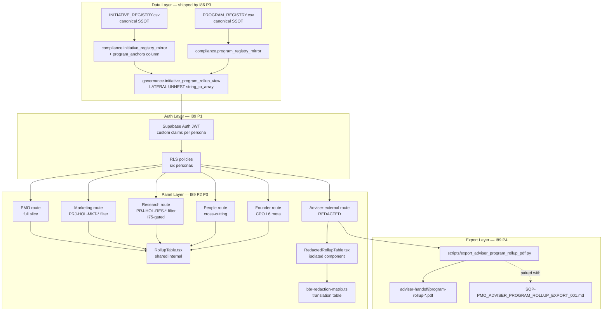
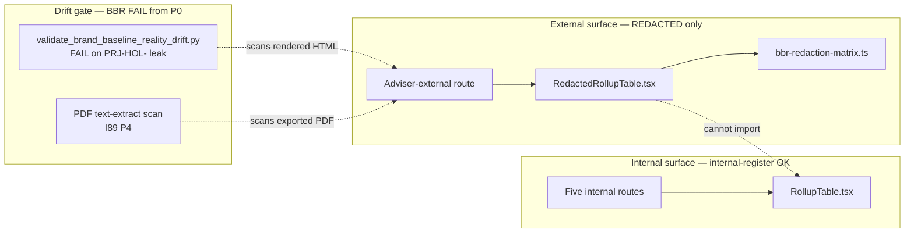
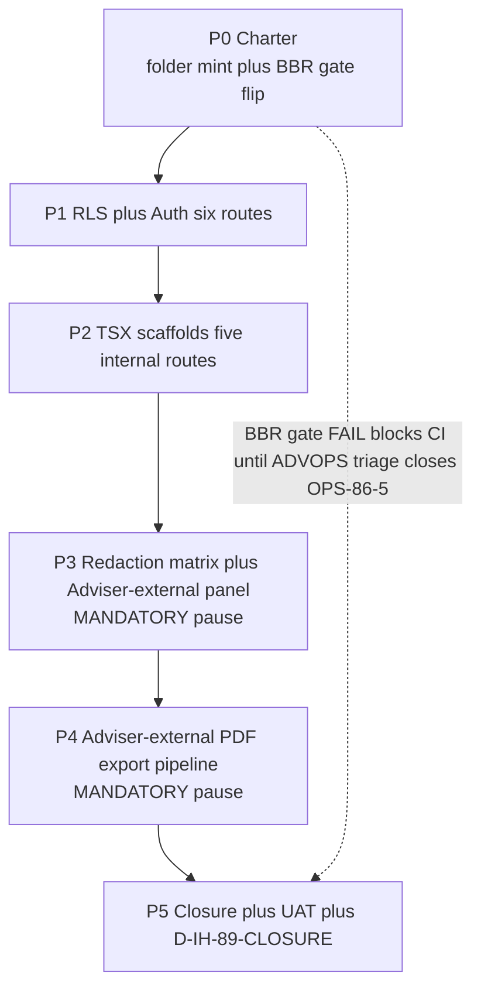

# I89 — HLK-ERP persona-rollup panel implementation

> **Forward-chartered from I86 P3** (D-IH-86-K, 2026-05-17; closure D-IH-86-N, 2026-05-17). I86 P3 shipped the **data layer** ([`governance.initiative_program_rollup_view`](../../../../supabase/migrations/20260517163648_i86_p3_initiative_program_rollup_view.sql)) + the **persona-view spec** ([`reports/persona-view-spec-2026-05-19.md`](../86-initiative-cluster-execution-coordinator/reports/persona-view-spec-2026-05-19.md)) + the **BBR drift-gate scope extension** ([`scripts/validate_brand_baseline_reality_drift.py`](../../../../scripts/validate_brand_baseline_reality_drift.py)). I89 ships the **TSX implementation** across six panel routes in the sibling [`hlk-erp`](https://github.com/FraysaXII/hlk-erp) repo — including the **Adviser-external REDACTED panel**, which carries **MANDATORY** public-prose pause-point treatment per [`akos-agent-checkpoint-discipline.mdc`](../../../../.cursor/rules/akos-agent-checkpoint-discipline.mdc) §"Pause-point depth heuristic".

> **Why this is a separate initiative (not part of I86).** I86 is an **operational coordinator** ("mints no SSOT" charter per I86 master-roadmap preamble). The Adviser-external view is **MANDATORY** public-prose pause-point territory — it deserves a dedicated initiative with proper P0 operator ratification, not a P3 stretch goal of an operational coordinator. Additionally, the **TSX implementation lives in `hlk-erp`** (a sibling repo per [`REPOSITORY_REGISTRY.csv`](../../../references/hlk/v3.0/Admin/O5-1/People/Compliance/canonicals/dimensions/REPOSITORY_REGISTRY.csv)) — cross-repo bless pattern requires its own coordination per [`SOP-EXTERNAL_REPO_BLESSING_001.md`](../../../references/hlk/v3.0/Admin/O5-1/Envoy%20Tech%20Lab/External%20Repos/SOP-EXTERNAL_REPO_BLESSING_001.md) + [`SOP-CROSS_REPO_SCHEMA_PROPAGATION_001.md`](../../../references/hlk/v3.0/Admin/O5-1/Envoy%20Tech%20Lab/Cross%20Repo/SOP-CROSS_REPO_SCHEMA_PROPAGATION_001.md).

> **BBR drift-gate FAIL state from P0.** Per **D-IH-89-E** (ratified in I86 P3 close chat 2026-05-17, operator answer `i89-q5-flip-now`), [`scripts/validate_brand_baseline_reality_drift.py`](../../../../scripts/validate_brand_baseline_reality_drift.py) flips from `INFO` to `FAIL` immediately in [`scripts/release-gate.py`](../../../../scripts/release-gate.py) + [`config/verification-profiles.json`](../../../../config/verification-profiles.json). This **blocks CI** on the 7 pre-existing `PRJ-HOL-FOUNDING-2026` leaks in ENISA founder-filed dossiers until ADVOPS triage (OPS-86-5) closes them. Operator decision: maximum drift protection from day one outweighs short-term CI friction. I89 P0 documents the CI-block state and surfaces ADVOPS triage urgency.

## 1. Operating story

The six persona panels are the **operator surface** that consumes the program-anchor SSOT shipped by I86 P1+P2+P3. Without the panels:

- **PMO** has no single-pane view of every active initiative × its program anchors × persona alignment — falls back to manual `INITIATIVE_REGISTRY.csv` grep.
- **Brand & Narrative Manager** has no view of which initiatives align with `PRJ-HOL-MKT-*` programs — falls back to manual filtering.
- **Founder** has no rollup of strategic-program alignment for board reporting — falls back to PowerPoint export of CSV.
- **Adviser-external** has no view at all — every advisor handoff requires manual PDF export with manual BBR translation (high error-rate; one of the seven `PRJ-HOL-FOUNDING-2026` leaks in ENISA dossiers traces to this exact gap).

I89 closes the operator-surface gap with **security-by-component-isolation**: the Adviser-external panel uses a **separate** TSX component (`RedactedRollupTable.tsx`) that cannot accidentally import the internal `RollupTable.tsx`. The redaction matrix lives at the rendering boundary (not at the database boundary — the database mirrors carry the internal-register tokens; the view inherits them; the renderer translates per BBR matrix). This matches the I66 `BRAND_BASELINE_REALITY_MATRIX.md` dual-register doctrine: internal stays internal in storage; external is the **translation** at render-time.

### 1.1 Architecture diagram (system being designed)

### 1.2 Component isolation diagram (security boundary)

### 1.3 Phase dependency diagram (execution sequence)

## 2. Decisions preview (inline)

Full register at [`decision-log.md`](decision-log.md). Five inception decisions ratified in I86 P3 closure chat (2026-05-17, operator answer batch `i89-q1-now` + `i89-q2-all-six` + `i89-q3-cross-cutting-phases` + `i89-q4-tri-co-own` + `i89-q5-flip-now`):

| ID | Question (1 line) | Owner | Status | Close-out phase |
|:---|:---|:---|:---|:---|
| **D-IH-89-A** | Promote candidate to active NOW vs hold until I86 cluster closes? | Founder | RATIFIED 2026-05-17 (NOW) | P0 |
| **D-IH-89-B** | Scope = all 6 routes including Adviser-external vs defer Adviser-external to I90? | PMO + Brand & Narrative Manager | RATIFIED 2026-05-17 (all 6) | P3 |
| **D-IH-89-C** | Phase shape = cross-cutting (P0-P5 across all 6 routes) vs sequential (P0 per-route)? | System Owner | RATIFIED 2026-05-17 (cross-cutting) | P5 |
| **D-IH-89-D** | Ownership = single owner (System Owner) vs tri-co-owned (System Owner+PMO+Brand & Narrative Manager)? | Founder | RATIFIED 2026-05-17 (tri-co-owned) | continuous |
| **D-IH-89-E** | BBR drift-gate flip INFO→FAIL now vs after ADVOPS triage closes? | Brand & Narrative Manager + Founder | RATIFIED 2026-05-17 (flip NOW) | P0 |

Forward decisions (TBD when phase reaches them):

| ID | Question (placeholder) | Phase |
|:---|:---|:---|
| D-IH-89-F | RLS policy shape — base-table policies vs view-defined policies | P1 |
| D-IH-89-G | Adviser-external JWT claim issuance — Supabase Auth hook vs separate service | P1 |
| D-IH-89-H | RedactedRollupTable component shape — column projection vs server-side prop | P3 |
| D-IH-89-I | PDF export trigger — on-demand runbook vs scheduled cron | P4 |
| D-IH-89-CLOSURE | I89 closure — UAT pass + BBR gate green on rendered DOM | P5 |

## 3. Risk register preview (inline)

Full register at [`risk-register.md`](risk-register.md).

| ID | Risk | Likelihood | Impact | Mitigation |
|:---|:---|:---|:---|:---|
| **R-IH-89-1** | BBR gate FAIL state from P0 blocks ALL CI runs until ADVOPS triage closes OPS-86-5 — possibly multi-day | High | High | Operator accepted as feature not bug (D-IH-89-E). ADVOPS triage prioritised same-week. Hot-fix lane: temporarily revert BBR gate to INFO if ADVOPS slips >5d AND a blocking I89 commit is urgent. |
| **R-IH-89-2** | Adviser-external panel accidentally imports internal RollupTable.tsx via auto-import refactor | Medium | Critical | Component isolation by directory + ESLint custom rule (`no-restricted-imports` pattern at `hlk-erp/.eslintrc`) forbidding `components/program-rollup/RollupTable` import inside `app/(public-advops)/**`. |
| **R-IH-89-3** | Redaction matrix in TypeScript drifts from BRAND_BASELINE_REALITY_MATRIX.md canonical | Medium | High | bbr-redaction-matrix.ts ships with a unit test (Jest in hlk-erp) that fails if any token in the matrix is missing the BBR-canonical mapping; CI in hlk-erp picks up I86 BBR matrix updates via cross-repo schema propagation (SOP-CROSS_REPO_SCHEMA_PROPAGATION_001). |
| **R-IH-89-4** | I75 not active at P2 — Research route renders 'Coming when I75 actives' but operator confused | Low | Low | Coming-soon component shipped with link to I75 candidate (`docs/wip/planning/_candidates/i75-research-area-governance.md`) so operator sees inception path. |
| **R-IH-89-5** | RLS policy on base tables breaks existing read patterns elsewhere | Medium | High | P1 §P1.7 inline-ratify gate surfaces all six RLS policies + their exclusion sets BEFORE apply; mid-P1 self-checkpoint runs a SELECT-survey of existing consumers (hlk-erp pages currently reading initiative_registry_mirror) and confirms persona claims cover them. |
| **R-IH-89-6** | PDF export Playwright Chromium crash on Windows 3.14+ per akos-planning-traceability.mdc footnote | Low | Medium | Pin Python 3.12.x for PDF export runbook per known issue; document in runbook docstring. |
| **R-IH-89-7** | MANDATORY public-prose pause at P3 + P4 stalls if Brand & Narrative Manager unavailable | Medium | Medium | Pre-schedule operator review windows at P0; pause-records skimmable per akos-agent-checkpoint-discipline.mdc; soft-clear after 24h if validators clean and operator silent (per ratified rule). |
| **R-IH-89-8** | Adviser-external panel discovers external-register translation gap not covered by BBR matrix | Medium | Medium | P3 mid-checkpoint surfaces uncovered token list; BBR matrix extended via I66 follow-up commit (not blocking I89 — extend matrix + extend matrix unit test). |

## 4. Per-phase deep sections

### P0 — Charter (1-2 days; inline-ratify gate CLOSED at folder mint)

**Scope.** Mint I89 folder + canonical rows + supporting docs + BBR gate flip. The inline-ratify gate is **already closed** — five decisions (D-IH-89-A..E) ratified in I86 P3 closure chat 2026-05-17.

**Files.**

- **Canonical (new — ratified at folder mint)**:
 - [`INITIATIVE_REGISTRY.csv`](../../../references/hlk/v3.0/Admin/O5-1/People/Compliance/canonicals/INITIATIVE_REGISTRY.csv) — new row `INIT-OPENCLAW_AKOS-89`.
 - [`DECISION_REGISTER.csv`](../../../references/hlk/v3.0/Admin/O5-1/People/Compliance/canonicals/DECISION_REGISTER.csv) — five new rows `D-IH-89-A..E`.
 - [`OPS_REGISTER.csv`](../../../references/hlk/v3.0/Admin/O5-1/People/Compliance/canonicals/OPS_REGISTER.csv) — new row `OPS-89-1`; existing row `OPS-86-4` transitions to `status:closed`.
- **Planning (new)**:
 - [`docs/wip/planning/89-hlk-erp-program-rollup-implementation/master-roadmap.md`](master-roadmap.md) (this file).
 - [`decision-log.md`](decision-log.md).
 - [`risk-register.md`](risk-register.md).
 - [`files-modified.csv`](files-modified.csv).
 - `reports/checkpoints/sc-pre-p0-2026-05-17.md` — agent self-checkpoint.
- **Modified**:
 - [`docs/wip/planning/_candidates/i89-hlk-erp-program-rollup-implementation.md`](../_candidates/i89-hlk-erp-program-rollup-implementation.md) — `status: promoted` marker.
 - [`docs/wip/planning/README.md`](../README.md) — add I89 row to active initiatives index.
 - [`docs/wip/planning/86-initiative-cluster-execution-coordinator/master-roadmap.md`](../86-initiative-cluster-execution-coordinator/master-roadmap.md) — note I89 promotion + OPS-86-4 closure.
 - [`docs/wip/planning/86-initiative-cluster-execution-coordinator/decision-log.md`](../86-initiative-cluster-execution-coordinator/decision-log.md) — Round 3 entry noting I89 promotion.
 - [`scripts/release-gate.py`](../../../../scripts/release-gate.py) — flip BBR validator from `INFO` to `FAIL`.
 - [`config/verification-profiles.json`](../../../../config/verification-profiles.json) — flip BBR validator wiring in `pre_commit` profile from `informational` to `required`.
 - [`CHANGELOG.md`](../../../../CHANGELOG.md) — I89 promotion entry + BBR gate flip entry.

**Validators.** No new validator minted at P0; existing `validate_hlk.py` covers INIT + DECISION + OPS schema. CONTRIBUTING.md adherence: no new Python code at P0.

**Verification.**

- `py scripts/validate_hlk.py` → PASS for I89 INIT + decisions + OPS rows.
- `py scripts/release-gate.py` → FAIL on the 7 pre-existing `PRJ-HOL-FOUNDING-2026` leaks (this is the **expected** post-D-IH-89-E state — CI-block surfaces ADVOPS triage urgency).

**Pause-point classification.** Standard (the operator pause already fired at the I86 P3 closure inline-ratify batch).

**Self-checkpoint count.** 1 (pre-P0).

**Cursor-rules adherence.** [`akos-planning-traceability.mdc`](../../../../.cursor/rules/akos-planning-traceability.mdc) §"Plan-quality bar" operationalised (this section); [`akos-inline-ratification.mdc`](../../../../.cursor/rules/akos-inline-ratification.mdc) operationalised (P0 ratification was inline at I86 P3 close, not pause-record); [`akos-brand-baseline-reality.mdc`](../../../../.cursor/rules/akos-brand-baseline-reality.mdc) operationalised (BBR gate flip elevates external-register protection to FAIL).

### P1 — RLS + Auth for six routes (2-3 days; inline-ratify gate at §P1.7)

**Scope.** Six Supabase Auth JWT custom claims + six RLS policies on the base tables underneath `governance.initiative_program_rollup_view`.

**Files.**

- **Canonical (new)**:
 - `supabase/migrations/<timestamp>_i89_p1_persona_rls_policies.sql` — six `CREATE POLICY` blocks on `compliance.initiative_registry_mirror` + `compliance.program_registry_mirror` (one per persona JWT claim).
- **Sibling repo (new)**:
 - `hlk-erp/lib/auth/persona-routing.ts` — JWT claim → route guard.
 - `hlk-erp/lib/auth/persona-claims.ts` — claim issuance per Supabase Auth hook spec.
- **Modified**:
 - [`HLK_ERP_ARCHITECTURE.md`](../../../references/hlk/v3.0/Admin/O5-1/Operations/PMO/canonicals/HLK_ERP_ARCHITECTURE.md) §4 rows 17-22 — annotate with concrete JWT claim names.

**Validators.** No new validator (Supabase MCP `get_advisors` security check at end of P1).

**Verification.**

- Supabase MCP `apply_migration` for the RLS policies.
- Supabase MCP `get_advisors` (security) — no new HIGH/CRITICAL findings.
- Manual SELECT survey: confirm each of the six personas can read its expected slice (and only its expected slice) via test JWTs.

**inline-ratify gate §P1.7.** Surface the six RLS policies + the Adviser-external scope hardening (`hlk_adviser_external` claim has NO `service_role` privilege; NO `compliance.*` write privileges; ONLY `SELECT` on `governance.initiative_program_rollup_view` filtered to external-register-safe columns). Operator answers via AskQuestion batch.

**Pause-point classification.** Standard.

**Self-checkpoint count.** 2 (pre-P1; mid-P1 after migration drafted but before RLS apply).

**Cursor-rules adherence.** [`akos-holistika-operations.mdc`](../../../../.cursor/rules/akos-holistika-operations.mdc) §"Operator SQL gate" operationalised (migration via Supabase MCP `apply_migration` after operator approval at §P1.7); [`akos-mirror-template.mdc`](../../../../.cursor/rules/akos-mirror-template.mdc) operationalised (sibling repo bless via SOP-EXTERNAL_REPO_BLESSING_001).

### P2 — TSX scaffolds for five internal routes (3-4 days; inline-ratify gate at §P2.6)

**Scope.** Five TSX panel scaffolds for internal-register routes (PMO, Marketing, Research, People, Founder). Adviser-external defers to P3.

**Files.**

- **Sibling repo (new)**:
 - `hlk-erp/app/(operator)/operations/pmo/program-rollup/page.tsx`
 - `hlk-erp/app/(operator)/marketing/brand/program-rollup/page.tsx`
 - `hlk-erp/app/(operator)/research/intelligence/program-rollup/page.tsx`
 - `hlk-erp/app/(operator)/people/program-rollup/page.tsx`
 - `hlk-erp/app/(operator)/people/founder/program-rollup/page.tsx`
 - `hlk-erp/components/program-rollup/RollupTable.tsx` (shared internal component; prop-based column visibility).
 - `hlk-erp/lib/supabase/program-rollup-queries.ts` (typed SELECT helpers for the view).
- **Modified**:
 - [`HLK_ERP_ARCHITECTURE.md`](../../../references/hlk/v3.0/Admin/O5-1/Operations/PMO/canonicals/HLK_ERP_ARCHITECTURE.md) §4 — mark rows 17-21 as `status:built` (row 22 stays `status:planned` until P3).

**Validators.** `pnpm test` in `hlk-erp` covering `RollupTable.tsx` component snapshot tests + per-route page tests. `pnpm typecheck` PASS.

**Verification.**

- `pnpm dev` in `hlk-erp`; manual browse to each route via test JWT; render matches spec.
- `pnpm lint` PASS (ESLint custom rule `no-restricted-imports` covering Adviser-external isolation comes in P3 — not enforced at P2).

**inline-ratify gate §P2.6.** Surface the `RollupTable.tsx` component shape + per-persona column lists. Operator confirms the shared-component approach (one component, prop-driven column visibility) over the five-separate-tables approach.

**Pause-point classification.** Standard.

**Self-checkpoint count.** 3 (pre-P2; mid-P2 after `RollupTable.tsx` ships but before per-route scaffolds; post-P2 before P3 entry).

**Cursor-rules adherence.** [`akos-mirror-template.mdc`](../../../../.cursor/rules/akos-mirror-template.mdc) operationalised (TSX in sibling `hlk-erp`); [`akos-planning-traceability.mdc`](../../../../.cursor/rules/akos-planning-traceability.mdc) operationalised (sibling-repo commits tracked in `files-modified.csv` with `repo:hlk-erp` per schema extension D-IH-66-Z).

### P3 — Redaction matrix + Adviser-external panel (2-3 days; MANDATORY public-prose pause-point)

**Scope.** TypeScript redaction matrix mirroring BRAND_BASELINE_REALITY_MATRIX.md §3 + Adviser-external REDACTED panel + ESLint isolation rule.

**Files.**

- **Sibling repo (new)**:
 - `hlk-erp/lib/brand/bbr-redaction-matrix.ts` — TypeScript translation table.
 - `hlk-erp/lib/brand/bbr-redaction-matrix.test.ts` — unit test that fails if BBR matrix has tokens not covered by the TS table (cross-repo schema propagation guard).
 - `hlk-erp/app/(public-advops)/program-rollup/page.tsx` — Adviser-external panel.
 - `hlk-erp/components/program-rollup/RedactedRollupTable.tsx` — security-isolated component.
 - `hlk-erp/.eslintrc.json` (modified or new) — `no-restricted-imports` rule forbidding `RollupTable` import inside `app/(public-advops)/**`.
- **Reports (new)**:
 - `reports/p3-pause-record-<date>.md` — MANDATORY public-prose pause record.

**Validators.**

- BBR validator extension: `scripts/validate_brand_baseline_reality_drift.py` already covers `_assets/advops/**/adviser-handoff/*.md`; P3 adds a sibling check that scans the **rendered HTML** of the Adviser-external panel via Playwright headless + DOM scrape → token-list scan. Wired as `i89_adviser_rendered_html_bbr_scan` profile in `verification-profiles.json` (or as a step in the P4 PDF export runbook — TBD at P4 entry).

**Verification.**

- `pnpm test` PASS (BBR unit test green).
- Playwright headless render of `/program-rollup` Adviser-external route; DOM token-scan PASS.
- `pnpm lint` PASS with `no-restricted-imports` rule.
- MANDATORY operator review of pause-record before P4 entry.

**MANDATORY public-prose pause-point.** Per [`akos-agent-checkpoint-discipline.mdc`](../../../../.cursor/rules/akos-agent-checkpoint-discipline.mdc) §"Pause-point depth heuristic" → public-prose category. Pause-record carries: exact redacted token inventory, screenshot of rendered DOM, BBR validator pass-on-rendered-HTML proof, ESLint `no-restricted-imports` rule audit log. Operator must explicitly approve before P4 entry — no soft-clear via 24h silence (public-prose category is non-skippable per the rule).

**Self-checkpoint count.** 3 (pre-P3; mid-P3 after redaction matrix ships but before Adviser-external panel; post-P3 before pause-record files).

**Cursor-rules adherence.** [`akos-brand-baseline-reality.mdc`](../../../../.cursor/rules/akos-brand-baseline-reality.mdc) §"When generating prose, ask one question" operationalised (translation at render boundary, not storage boundary); [`akos-agent-checkpoint-discipline.mdc`](../../../../.cursor/rules/akos-agent-checkpoint-discipline.mdc) §"Operator pause point contract" operationalised (public-prose MANDATORY).

### P4 — Adviser-external PDF export pipeline (2 days; MANDATORY public-prose pause-point)

**Scope.** Paired SOP+runbook per [`akos-executable-process-catalog.mdc`](../../../../.cursor/rules/akos-executable-process-catalog.mdc) RULE 1: server-side PDF export consumes the same REDACTED rendering as the panel.

**Files.**

- **Canonical (new)**:
 - [`scripts/export_adviser_program_rollup_pdf.py`](../../../../scripts/export_adviser_program_rollup_pdf.py) — paired runbook. Per [`CONTRIBUTING.md`](../../../../CONTRIBUTING.md) §"Python Code Standards": Pydantic config model in `akos/<module>.py`; type hints; structured logging via `akos.log.setup_logging`; `pathlib.Path`; `akos.process.run` for Playwright shell-out with timeout; tests in `tests/test_export_adviser_program_rollup_pdf.py`; release-gate.py wiring; `config/verification-profiles.json` `release_gate` profile group.
 - [`SOP-PMO_ADVISER_PROGRAM_ROLLUP_EXPORT_001.md`](../../../references/hlk/v3.0/Admin/O5-1/Operations/PMO/canonicals/SOP-PMO_ADVISER_PROGRAM_ROLLUP_EXPORT_001.md) — paired SOP per akos-executable-process-catalog.mdc RULE 1.
 - [`process_list.csv`](../../../references/hlk/v3.0/Admin/O5-1/People/Compliance/canonicals/process_list.csv) — new row `hol_opera_adv_export_001` (cadence: `gated_operator`; owner_role: `PMO`; paired SOP+runbook pointers per RULE 1).
- **Reports (new)**:
 - `reports/p4-pause-record-<date>.md` — MANDATORY public-prose pause record with PDF artifact attached.
- **Modified**:
 - [`scripts/release-gate.py`](../../../../scripts/release-gate.py) — register new runbook in adviser-export profile group.
 - [`config/verification-profiles.json`](../../../../config/verification-profiles.json) — wire new runbook test group.

**Validators.**

- `tests/test_export_adviser_program_rollup_pdf.py` — Pydantic config valid + invalid; smoke run produces a PDF; PDF text-extract PASS on BBR validator.
- BBR validator extended to scan PDF body text (text extraction via PyPDF2 or pdfplumber).

**Verification.**

- `py -m pytest tests/test_export_adviser_program_rollup_pdf.py -v` PASS.
- `py scripts/export_adviser_program_rollup_pdf.py --engagement-id <test>` produces a PDF; manual operator visual review confirms no `PRJ-HOL-` leak.
- MANDATORY operator review of pause-record before P5 entry.

**MANDATORY public-prose pause-point.** Per [`akos-agent-checkpoint-discipline.mdc`](../../../../.cursor/rules/akos-agent-checkpoint-discipline.mdc) §"Pause-point depth heuristic" → public-prose category. Pause-record carries: PDF artifact, BBR validator output PASS on extracted PDF text, operator visual-review checklist.

**Self-checkpoint count.** 2 (pre-P4; post-P4 before pause-record files).

**Cursor-rules adherence.** [`akos-executable-process-catalog.mdc`](../../../../.cursor/rules/akos-executable-process-catalog.mdc) RULE 1 operationalised (paired SOP+runbook); RULE 3 cadence taxonomy operationalised (`gated_operator` cadence — every PDF export requires explicit operator invocation); [`akos-holistika-operations.mdc`](../../../../.cursor/rules/akos-holistika-operations.mdc) §"New git-canonical compliance registers (pattern)" operationalised (Pydantic + validator + release-gate wiring); [`CONTRIBUTING.md`](../../../../CONTRIBUTING.md) §"Python Code Standards" + §"Pre-commit Checklist" operationalised.

### P5 — Closure (1 day; inline-ratify gate at §P5.5)

**Scope.** UAT acceptance cross-check + D-IH-89-CLOSURE + status transition.

**Files.**

- **Canonical (modified)**:
 - [`INITIATIVE_REGISTRY.csv`](../../../references/hlk/v3.0/Admin/O5-1/People/Compliance/canonicals/INITIATIVE_REGISTRY.csv) — `INIT-OPENCLAW_AKOS-89` `status:closed`; `closure_decision_id:D-IH-89-CLOSURE`; `closure_date:<date>`.
 - [`DECISION_REGISTER.csv`](../../../references/hlk/v3.0/Admin/O5-1/People/Compliance/canonicals/DECISION_REGISTER.csv) — new row `D-IH-89-CLOSURE`.
 - [`OPS_REGISTER.csv`](../../../references/hlk/v3.0/Admin/O5-1/People/Compliance/canonicals/OPS_REGISTER.csv) — `OPS-89-1` `status:closed`.
- **Reports (new)**:
 - `reports/uat-i89-six-routes-<date>.md` — UAT dossier cross-referencing I86 P3 dimensions D1-D5 + E1-E4.
 - `reports/p5-closure-pause-record-<date>.md` — standard closure pause record.
- **Modified**:
 - [`docs/wip/planning/README.md`](../README.md) — I89 row update to `status:closed`.
 - [`CHANGELOG.md`](../../../../CHANGELOG.md) — I89 closure entry.

**Validators.**

- `py scripts/validate_hlk.py` PASS.
- `py scripts/release-gate.py` PASS (precondition: ADVOPS triage of OPS-86-5 has closed the 7 known `PRJ-HOL-FOUNDING-2026` leaks; if not, BBR gate FAIL still blocks — explicit dependency).
- Cursor Browser MCP smoke: six routes resolve at `dashboard.holistikaresearch.com`; render matches spec; Adviser-external panel passes BBR review on rendered DOM.

**Verification.**

- UAT dimensions D1-D5 (cross-cutting persona contracts) + E1-E4 (Adviser-external REDACTED rendering) from [`docs/uat/i86-p3-persona-rollup-acceptance.md`](../../../uat/i86-p3-persona-rollup-acceptance.md) all PASS in dossier.
- Browser MCP screenshots attached.

**inline-ratify gate §P5.5.** Surface closure rationale + browser-smoke evidence + BBR drift-gate state. Operator answers via AskQuestion.

**Pause-point classification.** Standard.

**Self-checkpoint count.** 1 (pre-P5).

**Cursor-rules adherence.** [`akos-planning-traceability.mdc`](../../../../.cursor/rules/akos-planning-traceability.mdc) §"UAT evidence contract" operationalised; [`akos-inline-ratification.mdc`](../../../../.cursor/rules/akos-inline-ratification.mdc) operationalised (closure ratification is inline, not pause-record — the MANDATORY pauses already fired at P3 + P4).

## 5. Asset classification

Per [`PRECEDENCE.md`](../../../references/hlk/v3.0/Admin/O5-1/People/Compliance/canonicals/PRECEDENCE.md):

| Asset | Class | Path |
|:---|:---|:---|
| `INITIATIVE_REGISTRY.csv` row | canonical | `docs/references/.../canonicals/INITIATIVE_REGISTRY.csv` |
| `DECISION_REGISTER.csv` rows | canonical | `docs/references/.../canonicals/DECISION_REGISTER.csv` |
| `OPS_REGISTER.csv` rows | canonical | `docs/references/.../canonicals/OPS_REGISTER.csv` |
| `process_list.csv` row (P4) | canonical | `docs/references/.../canonicals/process_list.csv` |
| `SOP-PMO_ADVISER_PROGRAM_ROLLUP_EXPORT_001.md` (P4) | canonical | `docs/references/hlk/v3.0/Admin/O5-1/Operations/PMO/canonicals/` |
| `scripts/export_adviser_program_rollup_pdf.py` (P4) | canonical (runbook) | repo root |
| Supabase migrations (P1) | canonical (DDL SSOT in git) | `supabase/migrations/` |
| `compliance.initiative_registry_mirror` rows | mirrored | Supabase (DML mirror) |
| `compliance.program_registry_mirror` rows | mirrored | Supabase (DML mirror) |
| `governance.initiative_program_rollup_view` | mirrored (derived view) | Supabase |
| TSX panel scaffolds (P2 + P3) | mirrored (sibling-repo render of canonical data) | `hlk-erp/app/**` |
| `bbr-redaction-matrix.ts` (P3) | mirrored (sibling repo of BRAND_BASELINE_REALITY_MATRIX.md) | `hlk-erp/lib/brand/` |
| `HLK_ERP_ARCHITECTURE.md` row annotations | canonical | `docs/references/hlk/v3.0/Admin/O5-1/Operations/PMO/canonicals/` |

## 6. Evidence matrix

| Acceptance criterion | Evidence | Phase |
|:---|:---|:---|
| Six routes resolve | Cursor Browser MCP screenshots | P5 |
| RLS isolates personas | Test JWT SELECT survey | P1 |
| Internal RollupTable shared cleanly | `pnpm test` snapshots | P2 |
| Adviser-external uses isolated component | ESLint `no-restricted-imports` PASS | P3 |
| Redaction matrix mirrors BBR canonical | `bbr-redaction-matrix.test.ts` PASS | P3 |
| Rendered Adviser-external DOM has no `PRJ-HOL-` | Playwright DOM scrape + BBR validator | P3 |
| PDF export has no `PRJ-HOL-` | PDF text-extract + BBR validator | P4 |
| BBR drift-gate FAIL state honored | `release-gate.py` exit-code observable | P0+P5 |
| ADVOPS triage prerequisite cross-check | OPS-86-5 `status:closed` confirmation | P5 |

## 7. Cross-references

- Parent initiative: [`docs/wip/planning/86-initiative-cluster-execution-coordinator/master-roadmap.md`](../86-initiative-cluster-execution-coordinator/master-roadmap.md) §"Scoped exception — program-anchor robustness" preamble.
- BBR canonical: [`BRAND_BASELINE_REALITY_MATRIX.md`](../../../references/hlk/v3.0/Admin/O5-1/Marketing/Brand/BRAND_BASELINE_REALITY_MATRIX.md).
- BBR validator: [`scripts/validate_brand_baseline_reality_drift.py`](../../../../scripts/validate_brand_baseline_reality_drift.py).
- HLK-ERP architecture: [`HLK_ERP_ARCHITECTURE.md`](../../../references/hlk/v3.0/Admin/O5-1/Operations/PMO/canonicals/HLK_ERP_ARCHITECTURE.md) §4 rows 17-22.
- Persona-view spec: [`reports/persona-view-spec-2026-05-19.md`](../86-initiative-cluster-execution-coordinator/reports/persona-view-spec-2026-05-19.md).
- UAT precedent: [`docs/uat/i86-p3-persona-rollup-acceptance.md`](../../../uat/i86-p3-persona-rollup-acceptance.md) dimensions D1-D5 + E1-E4 (E1-E4 close in I89 P5).
- Supabase migrations: [`20260517163635_i86_p2_program_anchors_column.sql`](../../../../supabase/migrations/20260517163635_i86_p2_program_anchors_column.sql) + [`20260517163648_i86_p3_initiative_program_rollup_view.sql`](../../../../supabase/migrations/20260517163648_i86_p3_initiative_program_rollup_view.sql).
- Cursor rules operationalised: [`akos-planning-traceability.mdc`](../../../../.cursor/rules/akos-planning-traceability.mdc); [`akos-brand-baseline-reality.mdc`](../../../../.cursor/rules/akos-brand-baseline-reality.mdc); [`akos-agent-checkpoint-discipline.mdc`](../../../../.cursor/rules/akos-agent-checkpoint-discipline.mdc); [`akos-inline-ratification.mdc`](../../../../.cursor/rules/akos-inline-ratification.mdc); [`akos-executable-process-catalog.mdc`](../../../../.cursor/rules/akos-executable-process-catalog.mdc); [`akos-holistika-operations.mdc`](../../../../.cursor/rules/akos-holistika-operations.mdc); [`akos-mirror-template.mdc`](../../../../.cursor/rules/akos-mirror-template.mdc).
- I86 P3 closure pause record: [`reports/p3-closure-pause-record-2026-05-17.md`](../86-initiative-cluster-execution-coordinator/reports/p3-closure-pause-record-2026-05-17.md).
