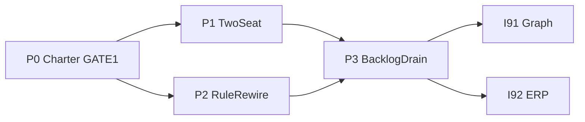

# I90 — Routing & Wiring (Ordnance)

> **Plan SSOT:** [`routing_and_wiring_788b66e3.plan.md`](file:///c:/Users/Shadow/.cursor/plans/routing_and_wiring_788b66e3.plan.md). **Cluster siblings:** [I91](../91-enterprise-graph-store-coverage/master-roadmap.md) (graph + store-coverage), [I92](../92-hlk-erp-reassess-dashboard/master-roadmap.md) (ERP reassess). **Coordinator:** [I86](../86-initiative-cluster-execution-coordinator/master-roadmap.md).

## 0 — Why this initiative

Holistika's Cursor workspace carried **25 always-on rules** (P2 reduces to **3** always-on `.mdc` + router — see §5) (~4k+ lines) while agents also load skills, validators, and plan context — producing routing noise, duplicate doctrine, and exhausted context before execution. This initiative **rewires rule tiers**, **institutionalises two-seat routing** (thinking vs execution), **reconciles stale OPS rows**, and **sequences the cluster backlog** without re-opening completed tranches (brand-domain `D-IH-86-FK`).

## 1 — Phase at a glance

| Phase | Purpose | Gate |
|:---|:---|:---|
| **P0** | Charter + 33-rule inventory + OPS reconciliation + INIT 90/91/92 mint | **GATE #1** (canonical CSV) |
| **P1** | `.cursor/agents/` planner + executor + two-seat guide | — |
| **P2** | Rule demotion (3 always-on + router), hooks, tier validators | **GATE #2** (pending) |
| **P3** | Backlog drain (OPS 16/17/3, 23 notes, handoff I91) | Per-item inline-ratify |

## 2 — Phase dependency



## 3 — P0 — Charter + reconciliation (current)

**Deliverables:**

- This folder's governance companions (`decision-log.md`, `risk-register.md`, `files-modified.csv`).
- [`reports/ops-row-reconciliation-2026-05-30.md`](reports/ops-row-reconciliation-2026-05-30.md) — 33-rule table + OPS evidence.
- [`backlog-two-seat-routing-2026-05-30.md`](backlog-two-seat-routing-2026-05-30.md).
- [`reports/gate1-registry-mint-proposal-2026-06-01.md`](reports/gate1-registry-mint-proposal-2026-06-01.md).

**Verification (pre-GATE):**

```powershell
git status
py scripts/validate_hlk.py
# Supabase MCP: list_tables compliance — artifact_class + component_primitive mirrors present
```

**Pre-flight 2026-06-01:** git clean; `validate_hlk` OVERALL PASS; Supabase MCP OK; Neo4j driver not configured in agent env (deferred for I91).

## 4 — P1 — Two-seat machinery

- `.cursor/agents/planner.md` — `model: inherit`, `readonly: true`, Opus-oriented prompts.
- `.cursor/agents/executor.md` — `model: composer-2.5`, execution prompts, no architecture forks.
- `reports/two-seat-setup-guide-2026-05-30.md` — encodes D-IH-90-E, G, I, L.

## 5 — P2 — Rule tier rewire (shipped 2026-06-01)

**Three always-on `.mdc` rules + `AGENTS.md` index (D-IH-90-R):**

1. [`akos-operator-communication.mdc`](../../../.cursor/rules/akos-operator-communication.mdc)
2. [`akos-baseline-governance.mdc`](../../../.cursor/rules/akos-baseline-governance.mdc) — renamed from `akos-governance-remediation.mdc`
3. [`akos-rule-router.mdc`](../../../.cursor/rules/akos-rule-router.mdc) — pointer-only task-class router

**Glob-scoped (not always-on):** inline-ratification, planning-traceability, uat-discipline, inter-wave-regression, research-area, and the remainder of the 33-rule inventory (see [`reports/ops-row-reconciliation-2026-05-30.md`](reports/ops-row-reconciliation-2026-05-30.md)).

**Mechanical:**

- [`scripts/validate_cursor_rule_tiers.py`](../../../scripts/validate_cursor_rule_tiers.py) — `pre_commit` self-test; full scan: `py scripts/validate_cursor_rule_tiers.py` → **3 always-on / 34 rules PASS** (2026-06-01).
- [`.cursor/hooks.json`](../../../.cursor/hooks.json) — canonical CSV commit gate, schema-drift reminder, secret scan, seat handoff on stop.
- Root [`AGENTS.md`](../../../AGENTS.md) — ≤100-line agent entry index.

**GATE #2:** [`reports/p2-gate2-rule-tier-review-2026-06-01.md`](reports/p2-gate2-rule-tier-review-2026-06-01.md) — operator sign-off on tier model before P3 backlog drain.

## 6 — P3 — Backlog drain

See [`backlog-two-seat-routing-2026-05-30.md`](backlog-two-seat-routing-2026-05-30.md). **Do not** start I91 graph execution until P2 validators PASS at INFO and operator confirms §14.7 Chat B stub if context limits hit.

## 7 — Closure criteria (forward)

- P2 validators self-test PASS; rule always-on count ≤ 4 + documented globs.
- OPS-86-3/16/17 dispositioned; OPS-86-23 notes refreshed.
- Two-seat guide operator-visible; I91/I92 chartered in registry.
- Cluster UAT at I86 wave-close cites this initiative's mechanical evidence.

## 8 — Cross-references

- [`PLANNING_COMPENDIUM.md`](../_templates/PLANNING_COMPENDIUM.md)
- [`research-rollout-backlog-2026-05-29.md`](../86-initiative-cluster-execution-coordinator/research-rollout-backlog-2026-05-29.md)
- Brand-domain (cite only): [`brand-domain-options-and-governance-gap.md`](../../intelligence/brand-domain-naming-2026-05-31/brand-domain-options-and-governance-gap.md)
