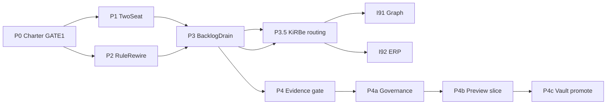

# I90 — Routing & Wiring (Ordnance)

> **Plan SSOT:** [`routing_and_wiring_788b66e3.plan.md`](file:///c:/Users/Shadow/.cursor/plans/routing_and_wiring_788b66e3.plan.md). **Cluster siblings:** [I91](../91-enterprise-graph-store-coverage/master-roadmap.md) (graph + store-coverage), [I92](../92-hlk-erp-reassess-dashboard/master-roadmap.md) (ERP reassess). **Coordinator:** [I86](../86-initiative-cluster-execution-coordinator/master-roadmap.md).

## 0 — Why this initiative

Holistika's Cursor workspace carried **25 always-on rules** (P2 reduces to **3** always-on `.mdc` + router — see §5) (~4k+ lines) while agents also load skills, validators, and plan context — producing routing noise, duplicate doctrine, and exhausted context before execution. This initiative **rewires rule tiers**, **institutionalises two-seat routing** (thinking vs execution), **reconciles stale OPS rows**, and **sequences the cluster backlog** without re-opening completed tranches (brand-domain `D-IH-86-FK`).

## 1 — Phase at a glance

| Phase | Purpose | Gate |
|:---|:---|:---|
| **P0** | Charter + 33-rule inventory + OPS reconciliation + INIT 90/91/92 mint | **GATE #1** (canonical CSV) |
| **P1** | `.cursor/agents/` planner + executor + two-seat guide | — |
| **P2** | Rule demotion (3 always-on + router), hooks, tier validators | **GATE #2** (**PASS** 2026-06-01, `D-IH-90-W`) |
| **P3** | Backlog drain (OPS 16/17/3, 23 notes, handoff I91) | Per-item inline-ratify |
| **P3.5** | KiRBe production routing (D-IH-90-X + OPS-90-1..6; sibling doc PRs) | **GATE #3b** (**closed** 2026-06-01) |
| **P4** | Evidence-class gate mechanics (validators + ledger strip) | **closed** 2026-06-14 (`e849c799`) |
| **P4a** | Governance doctrine + federated singularity tranche (Option B + DATA contracts + I100 charter) | **landed** 2026-06-14 (pending phase commit; `D-IH-90-AF`, `D-IH-100-I`) |
| **P4b** | Preview vertical slice (hlk-erp deploy + browser manifest) | **scheduled** — after P4a+ commit |
| **P4c** | Vault promotion (doctrine + process_list; registries → Data SSOT) | **closed** 2026-06-14 (`D-IH-90-AF`) |

## 2 — Phase dependency



## 2b — P4 Evidence-class gate (2026-06-14)

**Problem:** Shape-PASS (CSV exists, validators green) substituted for intent proof — I100
780-row ledger, I96 Track D experiential deferral.

**P4 delivered:** `akos/evidence_class_gate.py`, validator extensions, I100 ledger strip
317 rows, charter [`reports/evidence-class-gate-charter-2026-06-14.md`](reports/evidence-class-gate-charter-2026-06-14.md).

**P4a (landed — pending commit):** Singularity ratification [`reports/evidence-class-gate-singularity-ratification-2026-06-14.md`](reports/evidence-class-gate-singularity-ratification-2026-06-14.md); governance design **ratified**; Option B registry move to Data; full DATA contract tranche; Quality Fabric `compose_EVIDENCE`; I100 `LAB_PLATFORM_DIMENSION_REGISTRY` charter (`D-IH-100-I`). Design doc: [`reports/evidence-class-gate-governance-design-2026-06-14.md`](reports/evidence-class-gate-governance-design-2026-06-14.md).

**P4b (scheduled, not dropped):** [`reports/evidence-class-gate-phase-b-preview-slice-2026-06-14.md`](reports/evidence-class-gate-phase-b-preview-slice-2026-06-14.md). Carryover: `CO-90-001` in [`carryover-posture-index.md`](../_trackers/carryover-posture-index.md).

**Verification:**

```powershell
py scripts/validate_evidence_class_gate.py --self-test
py scripts/validate_hlk.py
```

## 3 — P0 — Charter + reconciliation (current)

**Deliverables:**

- This folder's governance companions (`decision-log.md`, `risk-register.md`, `files-modified.csv`).
- [`reports/ops-row-reconciliation-2026-05-30.md`](reports/ops-row-reconciliation-2026-05-30.md) — 33-rule table + OPS evidence.
- [`backlog-two-seat-routing-2026-05-30.md`](backlog-two-seat-routing-2026-05-30.md).
- [`reports/gate1-registry-mint-proposal-2026-06-01.md`](reports/gate1-registry-mint-proposal-2026-06-01.md).

**Verification (pre-GATE):**

```powershell
git status
py scripts/validate_hlk.py
# Supabase MCP: list_tables compliance — artifact_class + component_primitive mirrors present
```

**Pre-flight 2026-06-01:** git clean; `validate_hlk` OVERALL PASS; Supabase MCP OK; Neo4j driver not configured in agent env (deferred for I91).

## 4 — P1 — Two-seat machinery

- `.cursor/agents/planner.md` — `model: inherit`, `readonly: true`, Opus-oriented prompts.
- `.cursor/agents/executor.md` — `model: composer-2.5`, execution prompts, no architecture forks.
- `reports/two-seat-setup-guide-2026-05-30.md` — encodes D-IH-90-E, G, I, L.

## 5 — P2 — Rule tier rewire (shipped 2026-06-01)

**Three always-on `.mdc` rules + `AGENTS.md` index (D-IH-90-R):**

1. [`akos-operator-communication.mdc`](../../../.cursor/rules/akos-operator-communication.mdc)
2. [`akos-baseline-governance.mdc`](../../../.cursor/rules/akos-baseline-governance.mdc) — renamed from `akos-governance-remediation.mdc`
3. [`akos-rule-router.mdc`](../../../.cursor/rules/akos-rule-router.mdc) — pointer-only task-class router

**Glob-scoped (not always-on):** inline-ratification, planning-traceability, uat-discipline, inter-wave-regression, research-area, and the remainder of the 33-rule inventory (see [`reports/ops-row-reconciliation-2026-05-30.md`](reports/ops-row-reconciliation-2026-05-30.md)).

**Mechanical:**

- [`config/cursor-rule-tiers.json`](../../../config/cursor-rule-tiers.json) — repo-wide tier policy SSOT (not initiative-scoped).
- [`scripts/validate_cursor_rule_tiers.py`](../../../scripts/validate_cursor_rule_tiers.py) — `pre_commit` self-test; full scan: `py scripts/validate_cursor_rule_tiers.py` → **3 always-on / 34 rules PASS** (2026-06-01).
- [`scripts/validate_rule_skill_pairing.py`](../../../scripts/validate_rule_skill_pairing.py) — P2f self-test in `pre_commit`; full scan: **21/21 craft pairing** (INFO ramp).
- [`.cursor/hooks.json`](../../../.cursor/hooks.json) — canonical CSV commit gate, schema-drift reminder, secret scan, seat handoff on stop.
- Root [`AGENTS.md`](../../../AGENTS.md) + [`docs/guides/cursor-two-seat-routing.md`](../../../docs/guides/cursor-two-seat-routing.md) — durable workspace index (initiatives via planning README).

**GATE #2:** [`reports/p2-gate2-rule-tier-review-2026-06-01.md`](reports/p2-gate2-rule-tier-review-2026-06-01.md) — **PASS** (operator ratified 2026-06-01, `D-IH-90-W`).

## 6 — P3 — Backlog drain (2026-06-01)

See [`backlog-two-seat-routing-2026-05-30.md`](backlog-two-seat-routing-2026-05-30.md) + [`reports/p3-ops-backlog-drain-2026-06-01.md`](reports/p3-ops-backlog-drain-2026-06-01.md).

**Done:** OPS-86-3/16/17 closed at GATE #1; OPS-86-23 notes refreshed (DIM-04 8→6 CSVs; artifact/component mirrors no longer in open backlog).

**P3a (2026-06-01):** Decision briefs + Composer packets for OPS-86-1/9/13/19/20; park 24/25. Gate: [`reports/p3a-gate-clearance-2026-06-01.md`](reports/p3a-gate-clearance-2026-06-01.md) — **PASS** (operator ratified P3b scope).

**P3b (2026-06-01):** [`reports/p3b-completion-2026-06-01.md`](reports/p3b-completion-2026-06-01.md) — OPS-90-8 closed (hlk-erp PR #27 @ `5db0385`); TechOps runbook chassis (`scripts/techops_reliability_check.py`); OPS-86-20 closed (5 UAT historical stubs). OPS-86-9 remains **open** for DataOps/MKTOPS/UX threads.

**P3c (2026-06-04):** DataOps QF specialty → **active** (`D-IH-90-AA`). Report: [`reports/p3c-dataops-activation-2026-06-04.md`](reports/p3c-dataops-activation-2026-06-04.md).

**P3d (2026-06-04):** OPS cluster Option B — OPS-86-1/9/19/25 closed; I86 stays `active` until cluster UAT. Report: [`reports/p3d-ops-cluster-closure-2026-06-04.md`](reports/p3d-ops-cluster-closure-2026-06-04.md).

**P3e (2026-06-04):** DATA clean-slate regression close — TECHOPS+UX promoted (`D-IH-90-AC/AD`); P1 CAP+CONF backfill (`D-IH-90-AE`); 100% cadence-process CAP coverage + 100% CAP↔CONF pairing; full canonical audit: [`reports/data-canonical-audit-2026-06-04.md`](reports/data-canonical-audit-2026-06-04.md). Regression UAT: [`reports/regression-sweep-i90-p3c-p3d-2026-06-04.md`](reports/regression-sweep-i90-p3c-p3d-2026-06-04.md). Eval harness deferred → **OPS-90-9** (ETA 2026-06-11). **Plan SSOT:** Round 11–12 in [`routing_and_wiring_788b66e3.plan.md`](file:///c:/Users/Shadow/.cursor/plans/routing_and_wiring_788b66e3.plan.md).

**DATA wiring phases (plan SSOT amendment Round 11):**

| Phase | Scope | Gate |
|:---|:---|:---|
| **P1** | Cadence-process CAP+CONF backfill (9+10 CONF rows) | `D-IH-90-AE` — **closed** |
| **P2** | I91 DATA-FAM registry + remaining process→CAP coverage | I91 GATE #1 |
| **P3** | Dedicated `ux_quality_check.py` + quarterly CONF rating cadence | I91 P2 / I82 P3 |
| **P4** | Vault v3.2 DATA-area folder bump (when I91 P1 lands) | Operator CSV gate |

**In flight:** I91 P0 store inventory + P1 preflight record ([`../91-enterprise-graph-store-coverage/reports/`](../91-enterprise-graph-store-coverage/reports/)).

**Regression:** `8d015bf` — I90 validators green; full-suite deck + sibling-mirror debt documented in [`reports/regression-pre-continue-2026-06-01.md`](reports/regression-pre-continue-2026-06-01.md).

**hlk-erp CI:** Branch `fix/typecheck-pre-push-green` (`8f96595`) — `pnpm typecheck` + `pnpm test:ci` + pre-push hook PASS; merge PR to close **OPS-90-8**.

**Still gated:** OPS-86-26 research legacy; live Neo4j sync until `NEO4J_*` configured. **Post-gate:** sibling `akos-mirror.mdc` realigned in `hlk-erp` + `kirbe-platform` local clones via `bless_external_repo.py` (commit in those repos separately).

## 6.1 — P3.5 — KiRBe production routing (**GATE #3b closed** 2026-06-01)

> **Plan SSOT:** mega plan Round 9 + Round 10. **Routing canonical:** [`KIRBE_ROUTING_AND_HOSTING.md`](../../../references/hlk/v3.0/Admin/O5-1/Envoy%20Tech%20Lab/Repositories/KIRBE_ROUTING_AND_HOSTING.md).

| Item | Value |
|:---|:---|
| **Production API** | `https://kirbe.holistikaresearch.com` (Render; `/health` → 200) |
| **hlk-erp** | `KIRBE_API_URL` server env → BFF `/api/kirbe/*` (prod set since Oct 2025) |
| **Vercel kirbe** | Health-only — **not** for GDrive or full API clients |
| **Decision** | **D-IH-90-X** in `DECISION_REGISTER.csv` |
| **OPS rows** | **OPS-90-1..5 closed**; **OPS-90-6 open** (forward done) → I81 P6 SOP retrofit — [`kirbe-production-routing-ops-2026-06-01.md`](reports/kirbe-production-routing-ops-2026-06-01.md) |
| **P3.5 status** | **CLOSED** 2026-06-01 (routing ordnance; OPS-90-6 → I81 P6; OPS-90-7 closed hlk-erp PR26) |
| **AKOS commits** | `3dfa16e` + `4d2a938` (+ closure follow-up) pushed to `origin/main` |
| **Sibling merges** | [kirbe #26](https://github.com/FraysaXII/kirbe/pull/26), [hlk-erp #25](https://github.com/FraysaXII/hlk-erp/pull/25) merged to `main` |

**Verification:**

```powershell
curl.exe -sS -w "\nHTTP:%{http_code}\n" https://kirbe.holistikaresearch.com/health
py scripts/validate_ops_register.py
py scripts/validate_hlk.py
```

## 7 — Closure criteria (forward)

- P2 validators self-test PASS; rule always-on count ≤ 4 + documented globs.
- OPS-86-3/16/17 dispositioned; OPS-86-23 notes refreshed.
- **OPS-90-1..6** closed or PWF; **D-IH-90-X** in `DECISION_REGISTER.csv`; sibling kirbe + hlk-erp runbooks cite `KIRBE_ROUTING_AND_HOSTING.md`.
- Two-seat guide operator-visible; I91/I92 chartered in registry.
- Cluster UAT at I86 wave-close cites this initiative's mechanical evidence.

## 8 — Cross-references

- [`PLANNING_COMPENDIUM.md`](../_templates/PLANNING_COMPENDIUM.md)
- [`research-rollout-backlog-2026-05-29.md`](../86-initiative-cluster-execution-coordinator/research-rollout-backlog-2026-05-29.md)
- Brand-domain (cite only): [`brand-domain-options-and-governance-gap.md`](../../intelligence/brand-domain-naming-2026-05-31/brand-domain-options-and-governance-gap.md)
