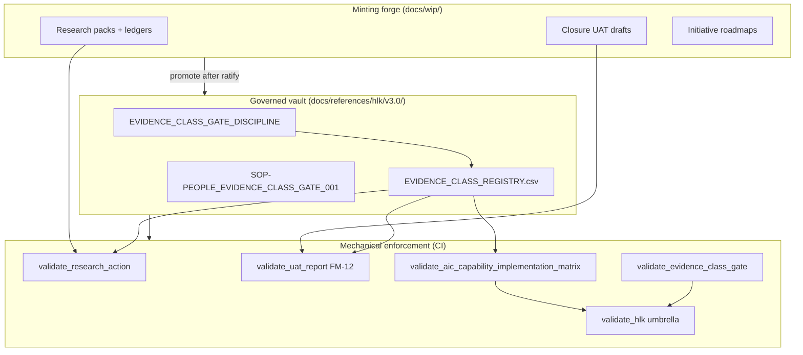

# Evidence-class gate — how we govern it

Phase A landed **mechanical enforcement** (commit `e849c799`). This document is the
**governance shell** so the gate survives initiative churn, model swaps, and vault growth —
the same problem I100 exposed when agents treated validator green as closure quality.

## 1. Outcome we need

Every **claim** that work is done must declare **what kind of proof** backs it, and CI must
fail when proof is missing or dishonest (padding, duplicate URLs, shape-only UAT PASS).

| Layer | What it is | Owner |
|:---|:---|:---|
| **Doctrine** | `EVIDENCE_CLASS_GATE_DISCIPLINE.md` — vocabulary + binding rules | PMO + System Owner |
| **Registry** | `EVIDENCE_CLASS_REGISTRY.csv` — claim surface × class × validator × proof pattern | Compliance |
| **SOP + runbook** | Human steps + `scripts/validate_evidence_class_gate.py` umbrella | People Ops |
| **Cursor rule + skill** | Agent routing when touching ledgers, UAT, ACIM, initiative close | I90 ordnance |
| **MADEIRA watch** | Experiential UAT + intent-ranked regression after validator edits | MADEIRA lifecycle |

## 2. Three-plane model



**Forge → vault:** WIP intelligence and planning artifacts stay in `docs/wip/` until
research govern + operator ratify. Validators run on WIP paths today (I100 ledger) so
dishonest minting fails before promotion.

**Vault → company-as-folder:** `AIC_REGISTRY.csv` + `AIC_CAPABILITY_IMPLEMENTATION_MATRIX.csv`
remain the consumption surface for MADEIRA; evidence-class bindings are rows in
`EVIDENCE_CLASS_REGISTRY.csv`, not ad-hoc validator comments.

## 3. Evidence classes (stable enum)

SSOT code: `akos/evidence_class_gate.py` (must match registry CSV).

| Class | Proves | Typical proof ref |
|:---|:---|:---|
| `git_shape` | Schema/header/FK/shape validators | HLK run row or `--self-test` log |
| `url_verify` | External URL reachable | `--url-probe` output (opt-in CI) |
| `live_probe` | Runtime/deploy probe | `dataops_quality_check` / deploy-health JSON |
| `browser_experiential` | Operator-visible UI | `artifacts/uat-screenshots/.../MANIFEST.json` |
| `operator_ratify` | Explicit human decision | `DECISION_REGISTER` row + AskQuestion record |
| `meta_regression` | Intent still holds after validator change | `intent_ranked_regression.py` report |

## 4. Claim surfaces (what must bind)

| Surface | Trigger | Validator | Watershed |
|:---|:---|:---|:---|
| Research source ledger | Any `source-ledger.csv` in research pack | `validate_research_action.py` | Always (padding) |
| Closure UAT **PASS** | `verdict: PASS` + `last_review` ≥ 2026-06-14 | `validate_uat_report.py` **UAT-FM-12** | 2026-06-14 |
| ACIM cell | `implemented` + `confirmed` + review ≥ 2026-06-14 | `validate_aic_capability_implementation_matrix.py` | 2026-06-14 |
| Initiative close | `INITIATIVE_REGISTRY.status=closed` + `closed_at` ≥ 2026-06-14 | `validate_evidence_class_gate.py` | 2026-06-14 |
| Sibling-repo UI UAT | `sibling_repo_ui: true` or §3.4 browser rows | **Planned FM-13** (not FM-12) | After I96 worked example |

**Finding-code hygiene:** `UAT-FM-12` is reserved for **evidence_class on PASS** (landed P4).
The MADEIRA sibling-UI manifest gate (`validator-hardening-spec-2026-06-12.md`) should mint
as **`UAT-FM-13-SIBLING-UI-BROWSER-MANIFEST-MISSING`** to avoid collision.

## 5. Promotion path (charter → active)

| Step | Deliverable | Gate |
|:---|:---|:---|
| **P4** (done) | SSOT module + 4 validator extensions + charter | Mechanical green |
| **P4a** (this doc + drafts) | Doctrine draft + registry draft + SOP draft + rule + skill | Operator read + inline-ratify |
| **P4b** | Preview vertical slice (hlk-erp): deploy-health + browser manifest + live probe | Experiential PASS with `browser_experiential` |
| **P4c** | Vault promotion: canonical + CSV + `process_list` row + PRECEDENCE | **Canonical CSV gate** |
| **P4d** | `validate_evidence_class_registry.py` reads CSV; validators delegate bindings | HLK umbrella |
| **P4e** | MADEIRA field-test window (3 observation waves) | Same pattern as UAT_DISCIPLINE FTW |

## 6. Operator gates (explicit AskQuestion)

Do **not** mint without operator approval:

1. `EVIDENCE_CLASS_REGISTRY.csv` → vault (`dimensions/`)
2. `process_list.csv` row `hol_peopl_dtp_evidence_class_gate_001` (proposed)
3. `DECISION_REGISTER` row `D-IH-90-EVIDENCE-GATE` promotion from draft → binding
4. FM-13 FAIL ramp for sibling UI (after one clean manifest example)

AIC may proceed without asking: WIP drafts, rule/skill in `.cursor/`, Phase B probe artifacts.

## 7. MADEIRA integration

MADEIRA must **watch operator intent**, not only founder sessions:

- **Before close:** Agent selects `evidence_class` + `evidence_proof_ref` in UAT frontmatter;
  proof must exist on disk before verdict PASS.
- **After validator change:** Run intent-ranked regression on ICS-critical surfaces (Research
  Center, Preview deploy, ledger govern) — class `meta_regression`.
- **Experiential pack:** Extend `docs/wip/intelligence/aic-madeira-experiential-uat-2026-06-11/`
  with evidence-class worked examples (not a new initiative unless I90 scope overflows).

## 8. Anti-patterns (explicit FAIL)

1. Row-count inflation on source ledgers (hash fragments, duplicate bases).
2. PASS closure UAT with only `validate_uat_report.py` self-test as proof (`git_shape` without
   artifact path).
3. ACIM `implemented`/`confirmed` with approach prose only — no tool path or realisation ref.
4. Closing initiative on FAIL UAT or missing closure report.
5. Treating `pre_commit_fast` green as experiential PASS for sibling UI.

## 9. Verification matrix (P4a)

```powershell
py scripts/validate_evidence_class_gate.py --self-test
py scripts/validate_research_action.py --source-ledger docs/wip/intelligence/lab-component-ecosystem-governance-2026-06-14/source-ledger.csv
py scripts/validate_hlk.py
py -m pytest tests/test_evidence_class_gate.py -q
```

## 10. Cross-references

- Phase A charter: [`evidence-class-gate-charter-2026-06-14.md`](evidence-class-gate-charter-2026-06-14.md)
- Phase B slice: [`evidence-class-gate-phase-b-preview-slice-2026-06-14.md`](evidence-class-gate-phase-b-preview-slice-2026-06-14.md)
- I100 integrity audit: `docs/wip/intelligence/lab-component-ecosystem-governance-2026-06-14/source-ledger-integrity-audit-2026-06-14.md`
- UAT discipline: `docs/references/hlk/v3.0/Admin/O5-1/People/canonicals/UAT_DISCIPLINE.md`
- Research action: `docs/references/hlk/v3.0/Research/Methodology/canonicals/RESEARCH_ACTION_DISCIPLINE.md`
