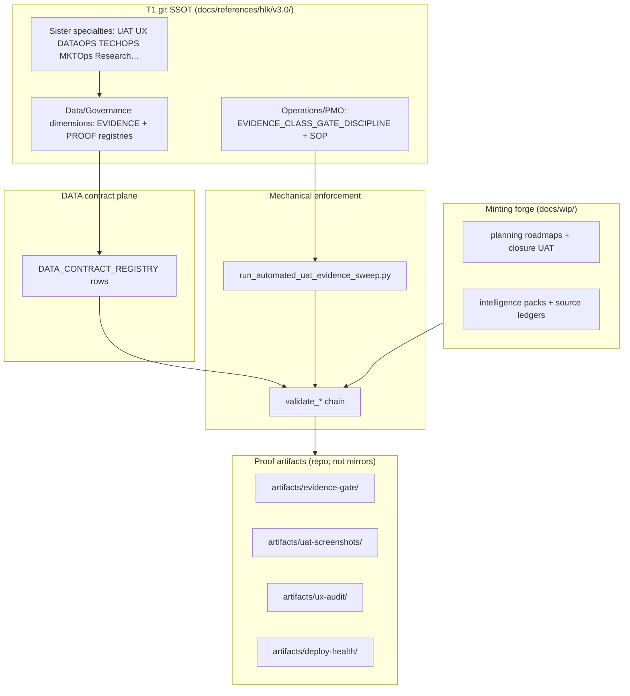

# Singularity ratification — evidence-class gate + Data e2e + I100 harmonization

> **Binding record** of operator–AIC brainstorm (2026-06-14). Captures bifurcations,
> rejected paths, and the federated agreement so initiative churn cannot erase intent.
> Implements **Option B hybrid** + **full DATA contract tranche** + **Quality Fabric §6 row**
> + **I100 harmonization charter** in one phase; **P4b Preview proof slice is scheduled last**
> (not dropped).

## 1. Problem statement (singularity / level-0)

Validators that check CSV shape or markdown sections are **necessary but not sufficient**.
I100 showed 780 ledger rows PASS while 463 were synthetic padding. I96 showed structural
UAT PASS while browser evidence was deferred. The operator's **primordial intent** (singularity):
one governed chain from WIP mint → specialty quality bar → proof artifact → closure claim,
without shape-PASS masquerading as done.

## 2. Bifurcations explored and outcomes

| Fork | Options considered | **Ratified** | Rationale |
|:---|:---|:---|:---|
| Primary owner | Operations PMO vs Marketing Ops (MKTOps) vs Data-only | **Operations orchestration + Data registry SSOT (Option B hybrid)** | MKTOps owns campaign/LP bar; not initiative closure. Data holds contracts/lineage so KB fits e2e. Operations keeps SOP/process/sweep so operational gaps stay visible. |
| Registry path | Stay under `Operations/PMO/` vs move CSVs to `Data/Governance/` | **Move `EVIDENCE_CLASS_REGISTRY.csv` + `PROOF_ADAPTER_REGISTRY.csv` to Data** | Federated DAMA model: Data governs bar + register path; Tech/PMO execute. Matches RevOps-on-Marketing-data precedent. |
| Doctrine path | Move all vs keep orchestration narrative in Operations | **Doctrine + SOP stay `Operations/PMO/`** | WIP forge handoff + closure sweep are delivery-capacity work (COO/PMO). |
| DATA depth | Cross-ref only vs full contract tranche | **Full contract tranche** | Operator chose full; avoids regret when Data asks "is this wired end-to-end?" |
| Fold into DATAOPS only (Option C) | Single discipline merge | **Rejected** | Hides Operations ownership; blurs governance vs delivery. |
| Quality Fabric | Defer vs new §6 row + stale cleanup | **Add `compose_EVIDENCE` row + fix stale §6 refs** | Discoverability across all specialties; not UX-only. |
| UX ownership | Operations vs Data vs three-layer | **Three-layer model** | UX bar = Marketing/Brand `UX_DISCIPLINE`; proof at close = Operations + People UAT; probes = Tech/DATAOPS. |
| MKTOps co-owner on PAD rows | CSV dual owner vs handoff | **Handoff register + sister_discipline_ref** | KB pattern: one `owner_role` per registry row; co-owner lives in doctrine YAML or handoffs. |
| Execution order | P4b first vs DATA+I100 first | **Commit P4c → DATA + I100 harmonization → P4b last** | Contracts and lexicon declared before worked example cites real manifests. |
| Contract business owner | PMO vs Data Steward vs split | **PMO `owner_role`; Data Steward consulted on schema** | PMO accountable for binding semantics; Data Steward for column/FK hygiene per `DATA_GOVERNANCE_POLICY` §3. |

## 3. Ratified federated stack



| Layer | Owner | Artifacts |
|:---|:---|:---|
| Registry SSOT (T1 CSV) | Data Governance Office / Data Steward path | `Data/Governance/canonicals/dimensions/EVIDENCE_CLASS_REGISTRY.csv`, `PROOF_ADAPTER_REGISTRY.csv` |
| Orchestration | Operations PMO | `EVIDENCE_CLASS_GATE_DISCIPLINE.md`, `SOP-PMO_EVIDENCE_CLASS_GATE_001.md`, `ops_pmo_dtp_evidence_class_gate_001` |
| Contract business owner | PMO | `owner_role` on new `DC-HOL-EVIDENCE-*` rows |
| Specialty bars | Sister areas | See §5 topography matrix |
| Proof bundles | Declared via contracts | `artifacts/**` paths in contract semantics |

## 4. HLK v3.0 topography — five physical roots (not UX-only)

Per [`docs/references/hlk/v3.0/index.md`](../../../../references/hlk/v3.0/index.md) §Entity placement, Holistika knowledge has **five top-level vault entities**. Evidence-class gate must compose across **all** of them — not only browser UAT or Data policy prose.

| Top-level root | Entity / role | What gets proof-bound | Typical evidence class / adapter | Quality Fabric compose |
|:---|:---|:---|:---|:---|
| **`Admin/O5-1/`** | Role-owned canonicals under CBO areas | SOPs, dimension CSVs, closure claims, FINOPS mirrors | `validator_change`, `compliance_csv_mint`, `uat_closure_pass` | Per-area specialty + `compose_EVIDENCE` |
| **`Envoy Tech Lab/`** | Platform docs + **Repositories** registry (code SSOT on GitHub) | Deploy smoke, CI posture, repo bless/drift | `deploy_consumer_repo`, lab reconcile probes | `compose_TECHOPS` + deploy-health |
| **`Research/`** | Top-level area (post-I70): Methodology, Intelligence, Diagnosis, Validation | Source ledgers, prong syntheses, radar freshness | `research_ledger` | `compose_RESEARCH_ACTION` |
| **`Think Big/`** | Non-repo engagements (`Clients/` outbound, `Advisers/` inbound) | ENISA packs, adviser handoffs, deal close, `_exports/` PDFs | Engagement close, external-render send-evidence | `compose_render`, `compose_SHARE` |
| **`_assets/`** | KM Output-1 binaries + manifests (`advops/`, `techops/`, `pmo/`, `touchpoint-kit/`) | Graph manifests, deck rasters, SOP sidecars | KM graph coverage, visual manifest completeness | Research + DATA-06 lineage |

**Forge + proof adjacency (outside v3.0 tree but in closure chain):**

| Root | Role | Evidence / proof examples | DATA contract family |
|:---|:---|:---|:---|
| **`docs/wip/`** | Minting forge (planning + intelligence) | Ledgers, closure UAT drafts, harmonization proposals | Promotes via PMO gate → vault |
| **`artifacts/`** (repo root) | Machine proof bundles (T1-adjacent git products) | Sweep JSON, uat-screenshots, ux-audit, deploy-health | `DC-HOL-EVIDENCE-ARTIFACT-BUNDLE-001` |

**Three-tier binding** (per `DATA_ARCHITECTURE.md`): T1 git canonical wins; T2 mirrors project; T3 graph indexes. Proof artifacts are **T1-adjacent git products** declared by contract semantics (not Supabase mirrors).

### 4.1 Admin/O5-1 — area × sub-area locus (vault wayfinding)

This is the operator's **full internal topography** — the evidence gate federates here, not only on UX/UAT.

| O5-1 area | Sub-areas / roles (vault locus) | Claim types bound here | Sister discipline / specialty | Proof kind |
|:---|:---|:---|:---|:---|
| **People** | Compliance (PRECEDENCE, registries), Ethics, Legal, Learning, People Ops, Talent | UAT closure, ACIM, SSOT audit, GOI/POI, transcript redaction | UAT_DISCIPLINE, HOLISTIKA_AGENTIC_DOCTRINE, SSOT audit | validate_hlk stdout, closure UAT path |
| **Operations** | PMO (initiative/ops/decision registries), RevOps (billing/GTM adapters), SMO (contracts), IntelligenceOps (CORPINT), Engagement | Sweep orchestration, initiative close, ADVOPS plane, WIP promotion | PMO traceability, collaborator share handoffs | uat-sweep JSON, process SOP execution |
| **Data** | Governance (policy + **evidence registries**), Architecture (HCAM, contracts, metrics), Science | Registry SSOT, semantic layer, lineage | DATAOPS, DATA_GOVERNANCE_POLICY | DATA_CONTRACT rows, mirror parity |
| **Tech** | System Owner (MADEIRA SOPs, lab dimensions), DevOPS, AI Engineer | Lab reconcile, deploy-health, live probes, CI posture | TECHOPS, deploy-health, MADEIRA cadence | probe_command, deploy-health JSON |
| **Marketing** | Brand (UX/Copy/Design/AV), Reach, Experimentation, Resonance, Social, Storytelling | Lighthouse, funnel LP, attribution, brand surfaces | UX_DISCIPLINE, MKTOps MKT-03 | lighthouse_json, heatmap (charter) |
| **Finance** | Business Controller (FINOPS), Financial Controller | Registered facts, Stripe FDW, recon | FINOPS craft | monetary fact mirrors, recon evidence |
| **Legal** | Counsel + programs | Filed instruments, counsel packages | ADVOPS handoffs | send-evidence manifest |
| **Envoy Tech Lab** (area-role under Admin) | Cross Repo, External Repos, MADEIRA-AKOS, Repositories | Agentic infra bless, migration manifests | External-repo SOPs | bless/drift validator |
| **Research** (legacy Admin slot) | Tools-shed charters only; executable SSOT at top-level `Research/` | — | — | — |

### 4.2 `_assets/` plane × program (KM Output-1)

| Plane | Example program path | Evidence use | Compose |
|:---|:---|:---|:---|
| `advops/` | `PRJ-HOL-FOUNDING-2026/enisa_evidence/` | ENISA dossier completeness | `compose_render`, compliance |
| `advops/shared/decks/` | Investor / partner / recruiter decks | External-render PDF trails | Brand + external-render |
| `techops/` | `PRJ-HOL-KIR-2026/` billing routing | Deploy + billing plane routing manifest | TECHOPS |
| `pmo/` | Initiative governance SOP manifests | Process catalog pairing proof | PMO + synthesis |
| `touchpoint-kit/` | Persona × channel templates | Reach adapter + persona registry FK | MKTOps / Reach |
| `operations/shared/engagement/` | Estimation templates | Engagement template registry | Engagement |

### 4.3 Envoy Tech Lab (top-level) — repo class × proof

| Registry class | Vault locus | Proof binding | Contract |
|:---|:---|:---|:---|
| `platform/` | REPOSITORIES_REGISTRY + consumer deploy | deploy-health + live_probe | `DC-HOL-LAB-PLATFORM-ENV-001` |
| `internal/` | AKOS, hlk-erp, tooling | CI posture + inventory verify | Lab dimension + TECHOPS |
| `client-delivery/` | Engagement-linked repos | Multi-viewport smoke + CICD | Engagement facts + deploy-health |

### 4.4 Think Big — engagement root × pack layer

| Root | Pack folders | Evidence at close | Compose |
|:---|:---|:---|:---|
| `Clients/<slug>/` | `00-internal/`, `01-operator-pack/`, `02-customer-pack/`, `_exports/` | Deal close, customer PDF render | SHARE + render |
| `Advisers/<slug>/` | `00-internal/`, `01-our-pack/`, `02-adviser-pack/` | Counsel handoff, incorporation close | ADVOPS + Legal |
| Either | `_external_marks/` (guest brand) | Co-brand asset completeness | Brand cobranding |

## 5. Topography matrix — claim surfaces × vault locus × specialty × evidence

| Claim surface (ECB) | Primary vault locus | Quality Fabric compose | Sister discipline | Proof artifact kind | DATA contract |
|:---|:---|:---|:---|:---|:---|
| `research_ledger` | `docs/wip/intelligence/**` | `compose_RESEARCH_ACTION` | RESEARCH_ACTION_DISCIPLINE | validator_stdout / probe_log | `DC-HOL-SOURCE-LEDGER-001` |
| `uat_closure_pass` | `docs/wip/planning/**/reports/uat-*.md` | `compose_UAT` + `compose_EVIDENCE` | UAT_DISCIPLINE, PWF | uat-sweep JSON, screenshot manifest | Artifact bundle + registry |
| `acim_confirmed_implemented` | People/Compliance dimensions | Agentic + `compose_EVIDENCE` | HOLISTIKA_AGENTIC_DOCTRINE | tool_catalog_ref | `DC-HOL-AIC-RUNTIME-001` |
| `initiative_close` | INITIATIVE_REGISTRY + closure UAT | `compose_closure` + `compose_EVIDENCE` | Planning traceability | uat_report path | Initiative governance SOPs |
| `deploy_consumer_repo` | Tech lab registries + consumer repos | `compose_TECHOPS` + `compose_EVIDENCE` | deploy-health, TECHOPS | deploy-health JSON, live_probe | `DC-HOL-LAB-PLATFORM-ENV-001` |
| `validator_change` | `scripts/validate_*` | `compose_INTENT_REGRESSION` | INTER_WAVE + intent-ranked | ics_report | Telemetry umbrella |
| UX lighthouse / heatmap (charter) | Marketing UX + `artifacts/ux-audit/` | `compose_UX` + `compose_MKTOPS` | UX_DISCIPLINE, MKTOps MKT-03 | lighthouse_json, heatmap_export | Privacy policy cross-ref |
| Engagement / deal close | Think Big + People engagement | `compose_SHARE`, `compose_render` | Collaborator share, external-render | send-evidence manifest | FINOPS / engagement facts |
| Adviser / ENISA | Think Big/Advisers + Compliance packs | `compose_render`, brand | ADVOPS SOP, brand | PDF/web evidence trails | Legal + compliance mirrors |
| BI / metrics consumption | Data Architecture METRICS | `compose_DATAOPS` | SEMANTIC_LAYER | SQL ref / dashboard | Per-metric `source_contract_id` |
| Lab platform reconcile | Tech System Owner dimensions | `compose_TECHOPS` | LAB_COMPONENT_ECOSYSTEM | probe_command output | `DC-HOL-LAB-PLATFORM-DIMENSION-001` |
| Compliance CSV mint | People/Compliance canonicals | `compose_SSOT_AUDIT` + synthesis | SSOT registry audit | validate_hlk stdout | `DC-HOL-CANONICAL-CSV-SSOT-001` |
| KM / graph coverage | Research + `_assets` manifests | Research + DATA-06 lineage | HCAM, KM topic source | graph sync evidence | `DC-HOL-KM-TOPIC-001` |
| RevOps billing / GTM adapter | Operations/RevOps dimensions | `compose_DATAOPS` + RevOps | REVOPS_PROCESS_CATALOG | adapter registry diff | GTM/CRM contracts |
| SMO contract adapter | Operations/SMO | Engagement delivery | CONTRACT_ADAPTER_REGISTRY | contract row + SOP pairing | Engagement templates |
| IntelligenceOps CORPINT | Operations/IntelligenceOps | Operator-private intel packs | CORPINT SOPs | access_level gate + redaction | Intelligence discipline |
| MADEIRA verdict / scenario | Tech System Owner + Envoy MADEIRA | Agentic control plane | MADEIRA SOP cluster | scenario telemetry + UX review | AIC runtime contract |
| External repo bless | Admin/Envoy Tech Lab External Repos | Consumer repo hygiene | SOP-TECH_EXTERNAL_REPOS | bless/drift validator | REPOSITORIES_REGISTRY FK |
| Touchpoint-kit persona channel | `_assets/touchpoint-kit/` | Outbound/inbound copy | Reach + PERSONA_REGISTRY | template completeness | GTM adapter |
| KiRBe / Neo4j graph sync | Envoy KiRBe + optional Neo4j mirror | KM ingestion | HLK_KM_TOPIC_FACT_SOURCE | sync_hlk_neo4j evidence | KM + component matrix |
| People Ethics red-lines | People/Ethics | Agentic boundary claims | ETHICAL_AGENTIC_BOUNDARIES | ACIM + ethics review | Agentic doctrine |
| Learning curriculum mint | People/Learning | Curriculum SOP delivery | Learning charter | curriculum validator | People design patterns |

## 6. Three-layer UX model (ratified)

| Layer | Question | Owner |
|:---|:---|:---|
| **1 — Bar** | What quality must this surface meet? | `UX_DISCIPLINE` (Brand & Narrative Manager + Front-End Developer); MKTOps for funnel LPs |
| **2 — Proof at close** | What proof type backs PASS? | Operations PMO orchestrates; People `UAT_DISCIPLINE` shapes closure report |
| **3 — Execution** | Who runs probes? | System Owner / DevOPS (Playwright, deploy-health); Data Steward (contracts, mirror parity) |

UX applies to **BI panels, ERP routes, API docs, process UAT, capability tests, deals, adviser packs**
via `compose_UX(audience, channel, scenario, brand, governance)` — not only Research Center browser UAT.

## 7. DATA_GOVERNANCE_POLICY e2e improvements (this tranche)

1. **§1 Scope** — Add proof artifact bundles + research source ledgers as governed products.
2. **§3 Decision-rights** — Evidence class binding / adapter promotion: PMO accountable, Data Steward + sister owner consulted.
3. **§6 Enforcement** — Item 6: evidence registries + automated sweep as federated computational governance.
4. **§7 Cross-references** — Operations doctrine, SSOT audit, Research action, DATA_PRIVACY (Hotjar).
5. **§8 Federated platform lexicon** — Pointer to I100 module/setting/surface/posture lexicon (`D-IH-100-I`).

New **DATA_CONTRACT** rows (full tranche):

| contract_id | schema_ref | producer | owner_role |
|:---|:---|:---|:---|
| `DC-HOL-EVIDENCE-CLASS-REGISTRY-001` | Data/Governance/.../EVIDENCE_CLASS_REGISTRY.csv | `ops_pmo_dtp_evidence_class_gate_001` | PMO |
| `DC-HOL-PROOF-ADAPTER-REGISTRY-001` | Data/Governance/.../PROOF_ADAPTER_REGISTRY.csv | `ops_pmo_dtp_evidence_class_gate_001` | PMO |
| `DC-HOL-SOURCE-LEDGER-001` | RESEARCH_ACTION_DISCIPLINE + ledger schema | `hol_resea_dtp_research_action_001` | Lead Researcher |
| `DC-HOL-EVIDENCE-ARTIFACT-BUNDLE-001` | SOP-PMO_EVIDENCE_CLASS_GATE_001 | `ops_pmo_dtp_evidence_class_gate_001` | PMO |
| `DC-HOL-LAB-PLATFORM-DIMENSION-001` | LAB_PLATFORM_DIMENSION_REGISTRY.csv (charter) | `env_tech_dtp_techops_reliability_001` | System Owner |

## 8. I100 harmonization (same tranche — charter phase)

Per harmonization proposal + operator order:

- **`D-IH-100-I`** ratified in `DECISION_REGISTER.csv`
- **`LAB_PLATFORM_DIMENSION_REGISTRY.csv`** minted at charter with seed rows (Vercel + Cloudflare exemplars)
- Wave-1/2 CSVs **remain** as read aliases one release cycle (WARN → FAIL in validator)
- Full consolidation of nine CSVs → **scheduled** post-charter probe CI (not dropped)

## 9. Quality Fabric updates (this tranche)

- Add **Evidence-class gate** specialty row: `compose_EVIDENCE(...)`
- Fix **Closure gate** pointer: `akos-baseline-governance.mdc` (not deprecated governance-remediation slug)
- Fix **UX** materialisation path: Marketing/Brand/UX Designer (post D-IH-94-F relocation)
- Add `EVIDENCE_CLASS_GATE_DISCIPLINE.md` to fabric `linked_canonicals`
- **`derive_quality_bar.py` forward charter**: must resolve `compose_EVIDENCE` when landed

## 10. Extensibility (Lighthouse, Hotjar — will not explode)

1. Add `PROOF_ADAPTER_REGISTRY` row (`charter`)
2. Add `EVIDENCE_CLASS_REGISTRY` binding (`INFO` → WARN → FAIL ramp)
3. Implement adapter script
4. Cross-ref `DATA_PRIVACY_RETENTION_POLICY` before Hotjar production URLs

No enum fork — `load_valid_evidence_classes()` reads registry.

## 11. Verification matrix (this tranche)

```powershell
py scripts/validate_evidence_class_registry.py --self-test
py scripts/validate_data_contract_registry.py
py scripts/validate_hlk.py
py scripts/validate_canonical_articulation.py
py scripts/validate_lab_platform_registries.py --self-test
py scripts/verify.py pre_commit_fast
py -m pytest tests/test_evidence_class_gate.py -q
```

## 12. Scheduled next (not dropped)

| Item | Trigger | Tracker |
|:---|:---|:---|
| **P4b** Preview vertical slice | After this tranche commit | I90 master-roadmap §P4b |
| FM-13 sibling UI manifest | After one clean browser manifest | MADEIRA hardening spec |
| LAB CSV full merge | After probe CI charter | I100 P9 harmonization |
| METRICS row for sweep pass rate | When dashboard consumer exists | SEMANTIC_LAYER |

## 13. Cross-references

- Phase A charter: `evidence-class-gate-charter-2026-06-14.md`
- Governance design: `evidence-class-gate-governance-design-2026-06-14.md`
- I100 harmonization proposal: `docs/wip/intelligence/lab-component-ecosystem-governance-2026-06-14/harmonization-proposal-2026-06-14.md`
- DATA policy: `Data/Governance/canonicals/DATA_GOVERNANCE_POLICY.md`
- Quality Fabric: `People/canonicals/HOLISTIKA_QUALITY_FABRIC.md`
- Vault wayfinding (updated 2026-06-14): `docs/references/hlk/v3.0/index.md`
- Methodology breakthrough: `People/canonicals/LOGIC_CHANGE_LOG.md` BT-11
- Repo changelog: `CHANGELOG.md` [Unreleased] I90 P4c+ entry

## 14. WIP radar — act now vs scheduled (anti-drift)

| Item | Posture | Owner | Path / trigger |
|:---|:---|:---|:---|
| **Phase commit** | **Act now** when operator ready | PMO | `CO-90-002`; land disk → git or risk repeat of I95 back-coverage gap |
| **`files-modified.csv` backfill** | **Act at commit** | PMO | `docs/wip/planning/90-routing-and-wiring/files-modified.csv` — not yet updated for this tranche |
| **P4b Preview slice** | scheduled | System Owner | `CO-90-001`; blocked on Preview env |
| **I100 Wave-1/2 CSV merge** | scheduled | System Owner | `CO-100-001`; one alias cycle then FAIL ramp |
| **`derive_quality_bar` compose_EVIDENCE** | scheduled | People Ops | `CO-90-003` |
| **FM-13 sibling UI manifest** | scheduled | MADEIRA / UAT | After one clean browser manifest |
| **Stale drafts** | superseded | — | `drafts/SOP-PEOPLE_*` rejected; `EVIDENCE_CLASS_GATE_DISCIPLINE.draft.md` → vault pointers |
| **PRECEDENCE rows for evidence registries** | scheduled | Compliance | Index integrity sweep when vault folder bump (v3.2 bar) |
| **Historical UAT `--all` backfill** | scheduled | PMO | Sweep ramp INFO→WARN→FAIL |
