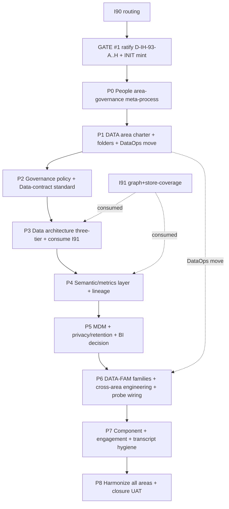

# I93 — DATA Area Foundation & Cross-Area Data Governance

**Document owner**: CDO (area) + CPO (People meta-process) + PMO (orchestration)
**Version**: 0.1 (charter — heavy-lifting design for Composer execution)
**Date**: 2026-06-04
**Status**: Charter — awaiting GATE #1 (operator ratification of D-IH-93-A..H + INITIATIVE_REGISTRY mint)
**Program mapping**: Cluster sibling of I90 (routing) / I91 (graph+store-coverage) / I92 (ERP dashboard)
**Canonical plan**: this file is the I93 SSOT
**Evidence base**: [`reports/research-synthesis-2026-06-04.md`](reports/research-synthesis-2026-06-04.md)

> **Two-seat note (per `aic-delegation-craft`).** This roadmap is the **thinking-seat
> (Opus) heavy lift**: charter + decisions + canonical specs + per-phase **Composer
> packets**. Every canonical-CSV / DDL / canonical-relocation is an **operator gate**,
> front-loaded as the phase's first todo (Pattern 6). Composer executes packets; it does
> **not** make scope/doctrine calls — on any ambiguity or validator FAIL it stops and
> reports.

---

## 0. Executive summary

DATA is the only top-level area with **no canonical doctrine** — the Chief Data Officer
chain exists in the org chart but owns nothing written, the data-quality rulebook lives
in the wrong areas (People + Tech), and the area is invisible in the canonical registry.
I93 builds the DATA area as a real, **DAMA-aligned, federated (data-mesh) governed area**
and — because "creating an area" is People's job as discipline-of-disciplines — first
mints a **People-governed area-build-out meta-process** so this build-out, and every
future area, is **governable and countable**. DATA is the meta-process's first worked
example; all other areas are then harmonized to the same completeness bar.

## 1. Mission

- **Operator outcome:** *data supports everything Holistika does, governance is the key,
  DAMA is the driver.* Every area's data needs are served by a DATA area that declares
  contracts, quality, lineage, metrics, and master-data — and every component, engagement,
  and process is wired to a DATA service.
- **Governance outcome:** "create + harmonize an area" stops being tribal knowledge and
  becomes a People design pattern + SOP + Quality-Fabric specialty + a validator that
  **scores each area's completeness** (countable governance).
- **Agent outcome:** Composer can execute the whole build-out from this roadmap's packets
  without re-deriving scope.

## 2. Accepted decisions (operator AskQuestion ratification 2026-06-04)

| # | Question | Decision |
|:---|:---|:---|
| Scope | How ambitious | **Full (C)** — foundation + cross-area process engineering + component data-contract population |
| Meta-process | Governable wrapper | **Mint a People-governed area-creation meta-process**; harmonize all areas to it |
| Sequence | vs the 4 P4 items | **Design-first (C)** — heavy lifting now; P4 items execute after (Composer) |
| Home | DATA canonicals + DataOps | **Create folders + charter AND move DataOps doctrine + SOP into Data** |
| DAMA | Which doctrines | **All 8** (governance policy, data-contract std, semantic/metrics, data architecture, lineage, MDM, BI/warehouse, privacy/retention) |
| Hygiene | Which fixes | **All 4** (component contracts, engagement ID schism + GOI rows, use-case backfill, transcript tracker) |

## 3. Constraints + non-goals

- **Non-goal:** re-doing I91 (graph projection + store-coverage matrix + OPS-86-15 mirror
  migrations). I93 **consumes** I91 outputs (graph = lineage/metadata surface; store-coverage
  matrix = evidence for the data-architecture canonical). Coordinate; do not duplicate.
- **Non-goal:** building a warehouse / BI stack. P5 either charters BI governance lightly
  or records an explicit "not now" decision in `DECISION_REGISTER.csv`.
- **Constraint (People RULE 1):** People mints the **pattern**; the **DATA area authors its
  own canonicals/SOPs** under `Data/`. People does not author DATA's processes.
- **Constraint (two-plane):** CSV = SSOT; Supabase mirror = projection; never author
  canonical data in the DB. All DDL via `supabase/migrations/` + operator SQL gate.
- **Constraint (SOP-META order):** `process_list.csv` rows exist **before** the v3.0 SOP is
  finalized for any net-new `item_id`.

## 4. Current-state reality (condensed; full evidence in synthesis report)

15 findings E1–E15. Headlines: no `Data/canonicals/` (E1); no area charter (E2); DataOps
orphaned in People+Tech (E3); Data invisible in `CANONICAL_REGISTRY` (E4); 8-role CDO chain
exists (E5); 6 formal `area=Data` processes vs ~442 (E6); component matrix contracts blank
(E7); 5 DAMA areas absent (E8); DataOps probes stubbed (E9); engagement hygiene gaps (E10–E11);
transcripts un-backfilled (E12); 5-CSV mirror gap (E13); no area-creation SOP (E14); v2.7
DATA lineage sparse (E15).

## 5. Decision log (to ratify at GATE #1)

| ID | Decision | Class |
|:---|:---|:---|
| **D-IH-93-A** | Inception: I93 DATA Area Foundation & Cross-Area Data Governance; Full scope; CDO+CPO+PMO co-owned; cluster sibling of I90/I91/I92 | inception |
| **D-IH-93-B** | People area-governance meta-process: mint `pattern_area_buildout` (PEOPLE_DESIGN_PATTERN_REGISTRY + library) + `SOP-PEOPLE_AREA_GOVERNANCE_001` + `compose_AREA` Quality-Fabric specialty (`AREA_GOVERNANCE_DISCIPLINE.md`) + `scripts/validate_area_completeness.py` (14-component bar). DATA = first worked example | canonical-CSV + canonical mint |
| **D-IH-93-C** | DATA area home: create `Data/Governance/canonicals/` + `Data/Architecture/canonicals/` + `Data/Science/canonicals/`; mint `DATA_AREA_CHARTER.md`; **move** `DATAOPS_DISCIPLINE.md` (People→Data/Governance) + `SOP-TECH_DATAOPS_QUALITY_001.md` (Tech→Data/Governance) with deprecation aliases + ripple | canonical relocation |
| **D-IH-93-D** | Mint all 8 DAMA canonicals (see §10) | canonical mint (phased) |
| **D-IH-93-E** | Harmonization + hygiene (all 4): component data-contract population; engagement ID reconciliation + Websitz/Rushly GOI rows; USE_CASE_ARCHIVE backfill (5 POCs); transcript-backfill tracker + high-value promotion | canonical-CSV + tracker |
| **D-IH-93-F** | DATA-FAM capability families (7) + cross-area process engineering; mint 7 umbrella CAP+CONF (+process rows) inheriting `pattern_area_buildout`/`pattern_dataops_discipline`; map 115 classified + 35 unmapped in area batches; coordinate with I91 | canonical-CSV |
| **D-IH-93-G** | Sequencing: design-first; Tier-0 commit P3e then OPS-90-9 + I86 UAT (Composer) run in parallel with I93 P0–P1 | sequencing |
| **D-IH-93-H** | DataOps-move ripple contract: update Quality-Fabric §6 path, all `linked_canonicals`/`linked_sops`, `akos-dataops-discipline.mdc` globs, `CANONICAL_REGISTRY` + `PRECEDENCE` + `KNOWLEDGE_PAIRING_REGISTRY` rows; one-cycle deprecation alias at old paths | governance ripple |

## 6. Asset classification (per PRECEDENCE.md)

**Canonical (edit first):** `DATA_AREA_CHARTER.md`, the 8 DAMA canonicals, `AREA_GOVERNANCE_DISCIPLINE.md`,
`SOP-PEOPLE_AREA_GOVERNANCE_001.md`, moved `DATAOPS_DISCIPLINE.md` + `SOP-...DATAOPS_QUALITY_001`,
`PEOPLE_DESIGN_PATTERN_REGISTRY.csv` (+library), `process_list.csv`, `CAPABILITY_REGISTRY.csv`,
`CAPABILITY_CONFIDENCE_REGISTRY.csv`, `COMPONENT_SERVICE_MATRIX.csv`, `DATA_CONTRACT_REGISTRY.csv` (new),
`METRICS_REGISTRY.csv` (new), `GOI_POI_REGISTER.csv`, `USE_CASE_ARCHIVE.csv`, `CANONICAL_REGISTRY.csv`,
`PRECEDENCE.md`, `INITIATIVE_REGISTRY.csv`, `DECISION_REGISTER.csv`.
**Mirrored/derived:** `compliance.*_mirror` tables; Neo4j projection (I91); ERP panels.
**Reference-only:** v2.7 `Research & Logic/`; transcripts under engagement folders (sources, not SSOT).
**Drift rule:** canonical wins; resync mirror + graph from CSV; document incident.

## 7. The People area-governance meta-process (the governable wrapper)

> *"create a People governed process out of this area creation because it's their job…
> harmonize the quality of our areas from this perspective… this way our process will be
> governable."* — operator, 2026-06-04.

People is the **discipline of disciplines** (per `akos-people-discipline-of-disciplines.mdc`
RULE 1): People mints **patterns**; areas author their own processes inheriting them. The
meta-process has four artifacts:

1. **`pattern_area_buildout`** — new row in `PEOPLE_DESIGN_PATTERN_REGISTRY.csv` + narrative
   section in `PEOPLE_DESIGN_PATTERN_LIBRARY.md` (`#pattern-area-buildout`). Defines the
   **area-completeness shape** (the 14 components) any area inherits when it is created or
   matured.
2. **`SOP-PEOPLE_AREA_GOVERNANCE_001.md`** (+ `.addendum.md`) — the meta-process: how to
   charter → CSV-tranche → SOPs → register → harmonize an area. Owner **CPO**; co-owners
   **PMO** (chartering) + **Compliance** (CSV SSOT). Paired runbook =
   `scripts/validate_area_completeness.py`. Process row `hol_peopl_dtp_area_governance_001`.
3. **`AREA_GOVERNANCE_DISCIPLINE.md`** — new **Quality-Fabric specialty** (`compose_AREA`),
   the 17th materialisation in `HOLISTIKA_QUALITY_FABRIC.md` §6. Composes the area-quality
   bar from the 5 axes; this is the *harmonization* engine.
4. **`scripts/validate_area_completeness.py`** (+ Pydantic `akos/hlk_area_completeness.py`)
   — scores every area against the 14-component bar → emits a coverage matrix. **Countable
   governance**: `SELECT areas WHERE completeness < bar`.

**The 14-component area-completeness bar** (from the area-governance sweep): (1) parent
redesign, (2) area charter, (3) sub-area/discipline charters, (4) process_list rows, (5)
baseline_organisation roles, (6) CAPABILITY+CONFIDENCE rows, (7) CANONICAL_REGISTRY+PRECEDENCE
entries, (8) dimension/adapter registries, (9) paired SOP+runbook, (10) Supabase mirrors,
(11) cursor rule + skill, (12) Quality-Fabric harmonization, (13) area README/index, (14)
`inherited_pattern_id` on processes.

DATA is the **first worked example** (P1–P6). Harmonization of all other areas is **P8**
(cross-area breakthrough propagation via `SOP-PEOPLE_CROSS_AREA_BREAKTHROUGH_001`).

## 8. Phase structure + dependency



| Phase | Purpose | Gate |
|:---|:---|:---|
| **P0** | People meta-process (pattern + SOP + compose_AREA + validator) | canonical-CSV + canonical mint |
| **P1** | DATA area charter + folders + DataOps move + ripple | canonical relocation |
| **P2** | Data-governance policy + data-contract standard + `DATA_CONTRACT_REGISTRY` | canonical-CSV |
| **P3** | Data-architecture three-tier canonical (consumes I91 store-coverage + graph) | canonical mint |
| **P4** | Semantic/metrics layer (`METRICS_REGISTRY` + SOP) + formal lineage SOP | canonical-CSV |
| **P5** | MDM/golden-record SOP + privacy/retention policy + BI-or-not decision | canonical mint |
| **P6** | 7 DATA-FAM CAP+CONF families + cross-area process map + DataOps probe wiring | canonical-CSV |
| **P7** | Component contracts + engagement ID + USE_CASE backfill + transcript tracker | canonical-CSV |
| **P8** | Area-completeness sweep over all areas + closure UAT + INIT flip | sign-off |

## 9. Per-phase deep sections (Composer packets)

> Each packet: **files**, **precise spec**, **validators**, **acceptance**, **rollback**,
> **commit**. Composer runs one packet at a time; stops on FAIL/ambiguity.

### 9.0 — Per-phase research & quality bar (invariant for P2–P8)

> **Why this exists.** The charter-level research synthesis (`reports/research-synthesis-2026-06-04.md`)
> grounded the *initiative*. It does **not** ground each *phase*. Operator instruction
> 2026-06-04: *"how do we ensure these have such quality-bar (research for each)."* This
> section makes per-phase research a **gate**, not a nicety — Composer never authors a
> canonical cold. It operationalises three already-ratified disciplines (no new always-on
> rule, no new minted decision ID):
>
> - **Applied-research discipline** (the rulebook that says any new canonical/rule/skill
>   must carry internal precedent + external grounding — `akos-applied-research-discipline.mdc`
>   RULE 1–2; canonical `RESEARCH_HEAD_DISCIPLINE.md`).
> - **Synthesis-before-tranche** (the pre-commit review that checks a tranche's scope,
>   atomicity, and reversibility before it lands — `akos-synthesis-before-tranche.mdc`).
> - **Design-first sequencing** (`D-IH-93-G` — do the thinking-seat heavy lift before
>   Composer executes).

**The invariant bar — every phase P2–P8 clears all five before its commit:**

1. **Research packet exists.** A dated thinking-seat report at
   `reports/research-p<N>-<YYYY-MM-DD>.md` carrying **both** sweeps per the applied-research
   discipline: an **internal evidence sweep** (Grep/Read over vault + canonical CSVs + prior
   I90/I91 reports + engagements) **and** an **external research sweep** (WebSearch with named
   citations — mandatory where the phase introduces a novel framing, optional + flagged
   "refinement-only" where it clones an existing pattern).
2. **Evidence base in the canonical(s).** Each minted canonical carries a
   `## Evidence base` section with **≥3 internal precedent paths + ≥2 external citations**
   (or an explicit refinement-only rationale). Citations live **in the canonical body**, not
   a separate dossier (citation-to-claim adjacency).
3. **Tranche charter + synthesis check.** A one-page `reports/p<N>.tranche-charter.md`
   (`tranche_class: canonical_csv_mint` or `internal_governance`) passes
   `py scripts/synthesis_before_tranche_check.py --check-charter <path>` **before** Composer
   dispatch.
4. **Human-readable prose.** No bare decision IDs in human-facing body text — every `D-IH-*`
   travels with its functional name (per `akos-operator-communication.mdc` RULE 1). IDs may
   sit alone only in frontmatter / registry cells.
5. **Area matrix attached.** `py scripts/validate_area_completeness.py --matrix` re-run after
   the phase; the Data-area row is recorded in the phase commit/report and must not regress.

**Per-phase research focus (what each packet's sweeps must cover):**

| Phase | Internal sweep anchors | External grounding (novel → cite) |
|:---|:---|:---|
| **P2** governance policy + data contracts | `baseline_organisation` decision-rights; existing mirror/CSV pairs; contract seeds from `reports/cross-area-data-map-2026-06-04.md` (SUEZ, compliance-mirror, GTM-CRM); two-plane model in `akos-holistika-operations.mdc` | DAMA-DMBOK data-governance function; **ODCS v3.1** (Bitol/Linux Foundation); federated / data-mesh domain ownership |
| **P3** three-tier architecture | I91 store-coverage matrix + `akos/hlk_graph_model.py`; Supabase migrations; PRECEDENCE mirror posture; consume-not-double-mint with I91 | DAMA Data Architecture; relational+graph federation; medallion/lakehouse layering (only if we adopt the language) |
| **P4** semantic/metrics layer + lineage | `thi_data_dtp_31` (KPI/reporting) + `thi_data_dtp_275` (lineage) rows; KiRBe manifests; MADEIRA/MCP consumption paths | semantic-layer "define-once" governance (dbt/AtScale-class); OpenLineage/W3C PROV posture; AI-ready metric catalogs |
| **P5** MDM + privacy/retention + BI | `thi_data_dtp_32` (MasterData); Legal retention posture; empty component-sensitivity columns; GDPR/ENISA refs already in vault | DAMA Reference&MDM + Data Security; golden-record match/merge; retention + legal-hold schedules |
| **P6** DATA-FAM families | `reports/cross-area-data-map-2026-06-04.md` (115 mapped / 35 unmapped); I91 candidate charter; CAP/CONF schemas; OPS-86-15 mirror gap | DAMA integration↔quality linkage; capability-maturity precedent (I82 confidence registry) |
| **P7** component/engagement/transcript hygiene | real engagements (Websitz / Rushly / hostelería); transcript backlog; `eng_2026_*` ↔ `ENG-*` schism; `USE_CASE_ARCHIVE` gaps | mostly **internal forensics**; cite the P5 privacy policy for classification enums |
| **P8** harmonization + closure | all-area matrix; `pattern_area_buildout` adoption; gap trackers | refinement-only (closure UAT discipline already governs) |

P2–P4 carry novel DAMA/ODCS framing → external citation mandatory. P7 is mostly internal
forensics; P8 is refinement-only. Heavy external sweeps (P2 ODCS, P4 semantic layer) should
run as a **research action** (the 8-stage ingest→rate→rank→govern loop with a source ledger)
per `akos-research-action.mdc`.

**Seat routing per phase:** thinking-seat authors the research packet + tranche charter →
Composer executes the scoped mint reading the packet as its only spec input → thinking/review
seat runs the regression + human-readability pass before commit.

### P0 — People area-governance meta-process

- **Gate (todo #1):** ⛔ OPERATOR — canonical-CSV gate (PEOPLE_DESIGN_PATTERN_REGISTRY) + canonical mint.
- **Files:** `docs/.../People/canonicals/PEOPLE_DESIGN_PATTERN_LIBRARY.md` (+ `#pattern-area-buildout`),
  `docs/.../People/Compliance/canonicals/dimensions/PEOPLE_DESIGN_PATTERN_REGISTRY.csv` (+1 row),
  `docs/.../People/canonicals/AREA_GOVERNANCE_DISCIPLINE.md` (new; Quality-Fabric specialty),
  `docs/.../People/canonicals/SOP-PEOPLE_AREA_GOVERNANCE_001.md` (+`.addendum.md`),
  `docs/.../People/canonicals/HOLISTIKA_QUALITY_FABRIC.md` (§6 add `compose_AREA` row),
  `scripts/validate_area_completeness.py` + `akos/hlk_area_completeness.py` + `tests/test_validate_area_completeness.py`,
  `process_list.csv` (+`hol_peopl_dtp_area_governance_001`), `KNOWLEDGE_PAIRING_REGISTRY.csv` (+pair row),
  `CANONICAL_REGISTRY.csv` (+3 rows), `PRECEDENCE.md`, `.cursor/rules/akos-area-governance.mdc` + `.cursor/skills/area-governance-craft/SKILL.md`.
- **Spec:** encode the 14-component bar as the pattern + the validator's checklist; `validate_area_completeness.py`
  reads `baseline_organisation` + `process_list` + `CANONICAL_REGISTRY` + folder tree and scores each `area`.
- **Validators:** `py scripts/validate_design_pattern_registry.py`, `validate_area_completeness.py --self-test`,
  `validate_knowledge_pairing_registry.py`, `validate_hlk.py`.
- **Acceptance:** pattern row + narrative resolve; validator self-test PASS + emits a baseline area matrix.
- **Rollback:** `git revert`; restore pattern registry row.
- **Commit:** `feat(i93-p0): People area-governance meta-process + compose_AREA + area-completeness validator`.

### P1 — DATA area charter + folders + DataOps move

- **Gate (todo #1):** ⛔ OPERATOR — canonical relocation (DataOps move ripple, D-IH-93-H).
- **Files (new folders):** `Data/Governance/canonicals/`, `Data/Architecture/canonicals/`, `Data/Science/canonicals/`,
  `Data/canonicals/DATA_AREA_CHARTER.md` (7-section template; role_owner CDO + Data Governance Lead),
  `Data/README.md`; **move** `DATAOPS_DISCIPLINE.md` → `Data/Governance/canonicals/` and
  `SOP-TECH_DATAOPS_QUALITY_001.md` → `Data/Governance/canonicals/` (`git mv`; deprecation-alias stubs at old paths for one cycle).
- **Ripple (D-IH-93-H):** update `HOLISTIKA_QUALITY_FABRIC.md` §6 DATAOPS path; every `linked_canonicals`/`linked_sops`
  referencing the moved files; `.cursor/rules/akos-dataops-discipline.mdc` globs; `CANONICAL_REGISTRY.csv`
  owning_area People→Data; `PRECEDENCE.md` + `KNOWLEDGE_PAIRING_REGISTRY.csv` rows; `DATA_AREA_CHARTER` declares
  DataOps as Data-area discipline (System Owner + DevOPS co-owners — execution stays Tech).
- **Charter content:** §1 Mission, §2 Roles (CDO chain) + sub-domains (Governance/Architecture/Science),
  §3 Boundary (authoring vs consuming; DATA sets global standards, areas own domain products — federated/mesh),
  §4 DAMA cross-area integration table, §5 Process catalog (initial), §6 Activation cadence, §7 Cross-refs.
  `inherited_pattern_id = pattern_area_buildout`.
- **Validators:** `validate_hlk.py`, `validate_area_completeness.py` (DATA score rises), drift gates green.
- **Acceptance:** Data area has canonicals + charter; moved files resolve; aliases warn; no broken links.
- **Rollback:** `git revert`; `git mv` back; restore §6 path.
- **Commit:** `feat(i93-p1): DATA area charter + canonical home + DataOps re-home (D-IH-93-C/H)`.

### P2 — Data-governance policy + data-contract standard ✅ (2026-06-04)

- **Status:** complete — operator-approved canonical-CSV tranche; craft regression
  remediated (split csv/mirror seeds, producer attribution, DATA-07 label, validator
  quality_rules gate, KNOWLEDGE_PAIRING + charter cross-refs).
- **Research packet (§9.0 criterion 1 — DONE):** [`reports/research-p2-2026-06-04.md`](reports/research-p2-2026-06-04.md)
  — internal sweep (two-plane + DataOps + register pattern) + external grounding (ODCS v3.1, DAMA Ch.3,
  data-mesh federated governance); carries the column→ODCS map + 3 seed contracts + paste-ready evidence base.
- **Tranche charter (§9.0 criterion 3 — DONE):** [`reports/p2.tranche-charter.md`](reports/p2.tranche-charter.md)
  — synthesis PASS 9/9 dimensions.
- **Gate (todo #1):** ✅ OPERATOR — canonical-CSV (`DATA_CONTRACT_REGISTRY.csv` mint).
- **Files:** `Data/Governance/canonicals/DATA_GOVERNANCE_POLICY.md` (DAMA "data governance function";
  roles, decision rights, federated operating model, Data Owner = business-accountable),
  `Data/Governance/canonicals/DATA_CONTRACT_STANDARD.md` (ODCS-v3.1-aligned: schema + semantics + SLAs +
  quality rules + ownership + versioning + change-mgmt; contracts-as-code; warn-first-fail-later),
  `Data/Governance/canonicals/dimensions/DATA_CONTRACT_REGISTRY.csv` + `akos/hlk_data_contract_csv.py` +
  `scripts/validate_data_contract_registry.py` + `tests/...` (per `pattern-register-csv-pydantic-validator-mirror`),
  `PRECEDENCE.md` + `CANONICAL_REGISTRY.csv` rows; wire validator into `validate_hlk.py`.
- **Spec:** `DATA_CONTRACT_REGISTRY` columns (proposed): `contract_id, producer_process_id, producer_area,
  consumer_area_ids, data_surface (canonical_csv|mirror_table|fdw_projection|graph), schema_ref, semantics_ref,
  sla_freshness, sla_availability, quality_rules, classification, retention_policy_ref, version, status, owner_role,
  last_review_*`. Start lean: critical fields + freshness + ownership.
- **Validators:** `validate_data_contract_registry.py --self-test`, `validate_hlk.py`.
- **Acceptance:** §9.0 bar cleared; standard doc + registry + validator green; 4 seed rows across 3 DATA-FAM families (compliance-mirror csv+forward mirror, SUEZ engagement-fact, GTM-CRM); Data area matrix 81% (no regression).
- **Commit:** `feat(i93-p2): data-governance policy + ODCS data-contract standard + registry`.

### P3 — Data-architecture three-tier canonical (consumes I91)

- **Gate (todo #1):** ⛔ OPERATOR — canonical mint.
- **Files:** `Data/Architecture/canonicals/DATA_ARCHITECTURE.md` (CSV SSOT ↔ Supabase relational ↔ Neo4j graph;
  store-coverage declaration rule; references I91 store-coverage matrix + `akos/hlk_graph_model.py`),
  `CANONICAL_REGISTRY.csv` schema extension spec (neo4j_node_label + pydantic_ssot_module + intended_coverage)
  — coordinate with I91 Phase E (do not double-mint; I93 consumes).
- **Spec:** name the three tiers, the per-canonical coverage declaration, the graph-health metric set (reuse I91).
- **Validators:** `validate_hlk.py`; cross-check against I91 store-coverage report.
- **Acceptance:** §9.0 bar cleared; architecture canonical resolves; coverage declaration rule cross-referenced from DATA_GOVERNANCE_POLICY.
- **Commit:** `feat(i93-p3): data-architecture three-tier canonical (consumes I91 store-coverage)`.

### P4 — Semantic/metrics layer + formal lineage

- **Gate (todo #1):** ⛔ OPERATOR — canonical-CSV (`METRICS_REGISTRY.csv`).
- **Files:** `Data/Architecture/canonicals/SEMANTIC_LAYER.md` (define-once-use-everywhere; business vs technical
  ownership; access control on metric defs; MCP/AI-readiness), `Data/.../dimensions/METRICS_REGISTRY.csv` +
  Pydantic + validator + tests (pairs `thi_data_dtp_31` Query/KPI/Reporting Catalog → executable), 
  `Data/Governance/canonicals/SOP-DATA_LINEAGE_001.md` (+`.addendum.md`; vault→Supabase→graph; pairs
  `thi_data_dtp_275`) + paired runbook (extend `sync_hlk_neo4j.py` lineage capture).
- **Spec:** `METRICS_REGISTRY` columns: `metric_id, metric_name, definition_sql_ref, grain, dimensions,
  owner_business_role, owner_technical_role, source_contract_id, access_level, status, last_review_*`.
- **Validators:** `validate_metrics_registry.py --self-test`, `validate_hlk.py`, `validate_hlk_km_manifests.py`.
- **Acceptance:** §9.0 bar cleared; metrics registry + semantic-layer doc + lineage SOP green; `thi_data_dtp_31`/`_275` paired.
- **Commit:** `feat(i93-p4): semantic/metrics layer + formal data-lineage SOP`.

### P5 — MDM + privacy/retention + BI decision

- **Gate (todo #1):** ⛔ OPERATOR — canonical mint + explicit BI decision row.
- **Files:** `Data/Governance/canonicals/SOP-DATA_MASTERDATA_GOLDEN_RECORD_001.md` (pairs `thi_data_dtp_32`;
  match/merge/golden-record), `Data/Governance/canonicals/DATA_PRIVACY_RETENTION_POLICY.md` (classification
  enum, retention schedules, legal-hold triggers, GDPR/ENISA posture; feeds component-matrix population in P7),
  `DECISION_REGISTER.csv` (+ a P5 BI/warehouse-governance decision — charter BI lightly OR record "not now"; ID allocated at ratification, not pre-minted).
- **Validators:** `validate_hlk.py`.
- **Acceptance:** §9.0 bar cleared; MDM SOP + privacy/retention policy resolve; BI decision recorded.
- **Commit:** `feat(i93-p5): MDM golden-record SOP + privacy/retention policy + BI governance decision`.

### P6 — DATA-FAM families + cross-area engineering + probe wiring

- **Gate (todo #1):** ⛔ OPERATOR — canonical-CSV (process_list + CAPABILITY + CONFIDENCE tranche).
- **Files:** `CAPABILITY_REGISTRY.csv` (+7 `CAP-HOL-DATA-FAM-*-001` umbrella rows), `CAPABILITY_CONFIDENCE_REGISTRY.csv`
  (+7 `CONF-...` seeds), `process_list.csv` (+7 `hol_data_dtp_datafam_*` umbrella rows under `thi_data_prj_1`,
  `inherited_pattern_id=pattern_dataops_discipline`), `akos/hlk_dataops_quality.py` + `scripts/dataops_quality_check.py`
  (add `DATA_FAM_PROBE_PROFILES` + `--data-fam` flag + first live probe = mirror parity), cross-area map appendix
  in this initiative's `reports/cross-area-data-map-2026-06-04.md`.
- **Spec:** 7 families (COMPLIANCE-MIRROR, CANONICAL-CSV, ENGAGEMENT-FACT, TELEMETRY-OBS, GTM-CRM, KM-TOPIC,
  AIC-RUNTIME) each → 1 CAP + 1 CONF seed + 1 process row + probe profile. Map the 115 classified processes;
  35 unmapped go to area batches (P6 sub-tranches Tech→Ops→Research→People→MKT→Finance→Legal). Coordinate the
  capability-coverage scope with I91 (`_candidates/i91-data-area-capability-coverage.md`) to avoid double-mint.
- **Validators:** `validate_capability_registry.py`, `validate_capability_confidence_registry.py`,
  `dataops_quality_check.py --self-test`, `validate_hlk.py`.
- **Acceptance:** §9.0 bar cleared; 7 families minted + paired; CAP↔CONF pairing holds; ≥1 live probe (mirror parity).
- **Commit:** `feat(i93-p6): 7 DATA-FAM capability families + cross-area map + DataOps probe profiles`.

### P7 — Component + engagement + transcript hygiene

- **Gate (todo #1):** ⛔ OPERATOR — canonical-CSV (COMPONENT_SERVICE_MATRIX + GOI + USE_CASE).
- **Files:** `COMPONENT_SERVICE_MATRIX.csv` (populate `data_classification` per real sensitivity +
  `retention_policy_ref` from P5 policy + `legal_hold` where regulated + link `primary_process_item_id` /
  `topic_ids` where known), `GOI_POI_REGISTER.csv` (+`GOI-PARTNER-WEBSITZ-2026`, `GOI-PARTNER-RUSHLY-2026`),
  `ENGAGEMENT_REGISTRY.csv` + commercial/share artifacts (reconcile `eng_2026_*` ↔ `ENG-*` via an alias/FK column;
  add Websitz Shopify `eng_*` row), `USE_CASE_ARCHIVE.csv` (+5 POC rows w/ engagement_id FKs),
  `docs/wip/planning/_trackers/transcript-backfill-tracker-2026-06-XX.md` (~27 rows; status YES/PARTIAL/NO;
  promote hostelería set + Rushly WhatsApps into Topic-Fact-Source).
- **Validators:** `validate_component_service_matrix.py`, `validate_use_case_archive.py`, `validate_hlk.py`.
- **Acceptance:** §9.0 bar cleared; matrix contracts populated; ID schism resolved; use-case archive reflects real POCs; tracker minted.
- **Commit:** `feat(i93-p7): component data contracts + engagement reconciliation + use-case + transcript tracker`.

### P8 — Harmonize all areas + closure UAT

- **Gate (todo #1):** ⛔ OPERATOR — closure sign-off + INITIATIVE_REGISTRY flip.
- **Files:** run `validate_area_completeness.py` across all areas → `reports/area-completeness-matrix-2026-06-XX.md`;
  fire `SOP-PEOPLE_CROSS_AREA_BREAKTHROUGH_001` for `pattern_area_buildout` adoption; per-area gap trackers under
  `_trackers/`; 11-section closure UAT `reports/uat-i93-closure-<date>.md`; flip `INITIATIVE_REGISTRY.csv` I93 status.
- **Validators:** full matrix (`validate_hlk.py`, `release-gate.py`, `validate_area_completeness.py`, `validate_uat_report.py`).
- **Acceptance:** §9.0 bar cleared (refinement-only research enrichment acceptable at P8); every area scored; DATA at/above bar; closure UAT PASS (or PASS-WITH-FOLLOWUP per PWF discipline).
- **Commit:** `feat(i93-p8): area-completeness harmonization sweep + I93 closure UAT`.

## 10. The 8 DAMA canonical specs (D-IH-93-D)

| # | Canonical | Home | DAMA area | Pairs / consumes |
|:---|:---|:---|:---|:---|
| 1 | `DATA_GOVERNANCE_POLICY.md` | Data/Governance | 1 Governance | federated operating model; Data Owner = business-accountable |
| 2 | `DATA_CONTRACT_STANDARD.md` + `DATA_CONTRACT_REGISTRY.csv` | Data/Governance | 6 Integration | ODCS v3.1; two-plane; drift gate |
| 3 | `SEMANTIC_LAYER.md` + `METRICS_REGISTRY.csv` | Data/Architecture | 9/BI-adjacent | pairs `thi_data_dtp_31`; MCP-ready |
| 4 | `DATA_ARCHITECTURE.md` (three-tier) | Data/Architecture | 2 Architecture | consumes I91 store-coverage + graph |
| 5 | `SOP-DATA_LINEAGE_001.md` | Data/Governance | 10 Metadata/lineage | pairs `thi_data_dtp_275`; `sync_hlk_neo4j` |
| 6 | `SOP-DATA_MASTERDATA_GOLDEN_RECORD_001.md` | Data/Governance | 8 Reference/Master | pairs `thi_data_dtp_32` |
| 7 | `DATA_PRIVACY_RETENTION_POLICY.md` | Data/Governance | 5 Security | feeds component-matrix population |
| 8 | BI/warehouse: `DATA_BI_GOVERNANCE.md` **or** explicit "not now" decision | Data/Architecture | 9 Warehouse/BI | scope-controlled |

All 8 inherit the classification lattice + `inherited_pattern_id`, register in
`CANONICAL_REGISTRY` + `PRECEDENCE`, and (where they carry cross-area jargon) use the
SOP body+addendum split.

## 11. Cross-area data process engineering (federated model)

DATA sets **global standards** (contracts, quality, lineage, metrics, master-data); each
area **owns its domain data products** and wires its producing/consuming processes to a
DATA service via `DATA_CONTRACT_REGISTRY` + `inherited_pattern_id`. The 7 DATA-FAM families
are the data products; the 115 classified + 35 unmapped processes (synthesis §4) are the
producers/consumers. P6 maps them in area batches; each batch is one operator-approved
tranche (serialize canonical-CSV writes).

## 12. Verification matrix

```
py scripts/synthesis_before_tranche_check.py --check-charter reports/p<N>.tranche-charter.md  # §9.0 per-phase gate (P2-P8)
py scripts/validate_area_completeness.py --matrix          # §9.0 per-phase: Data row must not regress
py scripts/validate_hlk.py
py scripts/validate_design_pattern_registry.py
py scripts/validate_area_completeness.py --self-test      # new P0
py scripts/validate_data_contract_registry.py --self-test # new P2
py scripts/validate_metrics_registry.py --self-test        # new P4
py scripts/validate_capability_registry.py
py scripts/validate_capability_confidence_registry.py
py scripts/dataops_quality_check.py --self-test
py scripts/validate_component_service_matrix.py
py scripts/validate_use_case_archive.py
py scripts/validate_knowledge_pairing_registry.py
py scripts/verify.py pre_commit
py scripts/release-gate.py
py scripts/validate_uat_report.py docs/wip/planning/93-.../reports/uat-i93-closure-<date>.md   # P8
```

## 13. Risks + rollback

| ID | Risk | L | I | Mitigation / rollback |
|:---|:---|:---|:---|:---|
| R-93-1 | DataOps move breaks many `linked_canonicals` refs | med | high | deprecation aliases one cycle; ripple checklist D-IH-93-H; `validate_hlk` link check; `git mv` revert |
| R-93-2 | DATA-FAM double-mint vs I91 capability coverage | med | med | coordinate scope at P6; I91 owns store-coverage, I93 owns family CAP rows |
| R-93-3 | Component-matrix reclassification mislabels sensitivity | low | high | privacy policy (P5) defines enum first; operator spot-check at P7 gate |
| R-93-4 | Scope sprawl (8 canonicals + meta-process + hygiene) overruns | high | med | phase gates; one commit per phase; defer BI to decision row |
| R-93-5 | Engagement ID reconciliation breaks share/vendor joins | med | high | add alias/FK column, do not rename in place; validate joins before commit |
| R-93-6 | Area-completeness validator false-negatives areas | med | low | self-test fixtures; INFO ramp first, FAIL after one cycle |

## 14. Sequencing vs the four P4 items (D-IH-93-G)

Design-first. The four P4 items run as **Composer packets in parallel** with I93 P0–P1:

| Item | When | Owner |
|:---|:---|:---|
| **Tier 0 — commit P3e bundle** (~26 files, canonical-CSV gate) | First, clears the tree | operator gate → Composer |
| **OPS-90-9 — fix 11 MADEIRA eval route_mismatch** (ETA 2026-06-11) | Parallel | Composer (System Owner) |
| **I86 cluster UAT** (blocks I90 INIT flip) | Parallel | Composer (PMO) |
| **I91 P1 DATA-FAM** | **Folds into I93 P6** (coordinated) | Composer (CDO) |

I93 P0–P1 (meta-process + DATA charter + DataOps move) are the thinking-seat heavy lift
done here; Composer executes them after GATE #1.

## 15. Exit criteria

- DATA area scores **at/above the 14-component bar** on `validate_area_completeness.py`.
- All 8 DAMA canonicals live + registered; DataOps re-homed; component contracts populated.
- 7 DATA-FAM families minted + ≥1 live DataOps probe; cross-area map published.
- People area-governance meta-process live (pattern + SOP + compose_AREA + validator).
- All other areas scored; gap trackers filed; closure UAT PASS/PWF; I93 INIT flipped.

## 16. Deferred follow-ups

- Full warehouse/BI build (if P5 records "not now").
- 35 unmapped cross-area processes → I93 P6 area sub-tranches (quarterly).
- v2.7 `Research & Logic/` on-disk materialization (separate sparse-mirror/Drive action).
- Enterprise conceptual/logical data model (DAMA area 3 depth) — forward.

## 17. Cross-references

- Evidence: [`reports/research-synthesis-2026-06-04.md`](reports/research-synthesis-2026-06-04.md).
- Decisions: [`decision-log.md`](decision-log.md).
- Cluster: [I90 routing](../90-routing-and-wiring/master-roadmap.md), [I91 graph+store-coverage](../91-enterprise-graph-store-coverage/master-roadmap.md), [I92 ERP](../92-hlk-erp-reassess-dashboard/master-roadmap.md).
- Governance: `akos-people-discipline-of-disciplines.mdc`, `akos-holistika-operations.mdc`, `akos-quality-fabric.mdc`, `akos-planning-traceability.mdc`, `HOLISTIKA_QUALITY_FABRIC.md`, `PEOPLE_DESIGN_PATTERN_LIBRARY.md`, `SOP-META_PROCESS_MGMT_001.md`.
- Capability coverage (shared w/ I91): `_candidates/i91-data-area-capability-coverage.md`.
