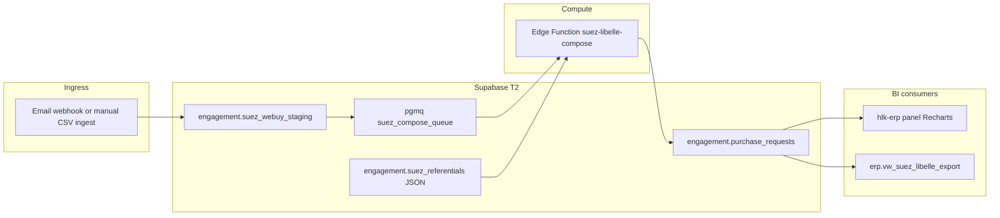

# Platform + component landscape — deep research (v3)

> Operator ratification (2026-06-04): **Full pack (Option A)** with live Supabase/Postgres
> research, broad component analysis (not only matrix CSV), readiness for Metabase / Power BI /
> Make / n8n / Power Automate / Recharts / Langfuse / Neo4j, and **SUEZ Stream B alternative**
> (Supabase Edge + ERP when client Power Automate is blocked).

Companion: [`research-bi-warehouse-posture-2026-06-04.md`](research-bi-warehouse-posture-2026-06-04.md) (BI tier model).

---

## Part 1 — Supabase platform capability map

Holistika's **MasterData** project is **full Postgres 15** with Supabase modules — not a subset DB.
Below: what Supabase **can** do (live docs, 2026), what AKOS **already uses**, and fit for I93 + engagements.

| Module | What it does (plain language) | AKOS today | Fit / recommendation |
|:---|:---|:---|:---|
| **Postgres core** | Full SQL DB; schemas, views, functions, triggers | `compliance`, `erp`, `governance`, `holistika_ops`, `finops` | **Warehouse SSOT (T2)** — already decided in P3 architecture |
| **Auth + RLS** | JWT users; row-level security on exposed tables | I62 RBAC + `holistika_ops.user_role_mapping` | **ERP + future customer dashboards** — mandatory on any API-exposed queue/table |
| **PostgREST API** | Auto REST over exposed schemas | hlk-erp, Edge Functions | BI consumers read **views**, not raw mirrors |
| **Realtime** | Broadcast, Presence, **Postgres Changes** (live row events) | Enabled in `config.toml`; **not wired to ERP** | **High value:** mirror freshness ribbon, operator inbox, engagement status tiles |
| **Storage** | S3-compatible buckets | Enabled; engagement PDFs mostly git-tracked | Export snapshots, chart PNGs, client artifact drops |
| **Edge Functions** | Deno HTTP workers at `/functions/v1/*` | `stripe-webhook-handler`, `finops-writer-worker`, `fx-rate-cache-refresh` | **Holistika Stream B integration template** (see Part 5) |
| **Queues (`pgmq`)** | Durable JSON message queues in Postgres | `finops_writer_queue` + DLQ + RPC wrappers (I81) | **Replace ad-hoc RPA** for Holistika-owned async (email ingest, batch transforms) |
| **Cron (`pg_cron`)** | Schedule SQL or HTTP from DB | Mentioned forward (I65 eviction); not production-scheduled | Nightly mirror trim, metrics materialized view refresh, FX cache |
| **Database Webhooks** | `INSERT/UPDATE/DELETE` → HTTP via **pg_net** | Not used | Trigger Edge Functions / Make / n8n **without Power Automate** |
| **pg_net** | Async HTTP from SQL (non-blocking) | Underpins Database Webhooks | Trigger external systems from mirror sync; invoke Edge Functions from triggers |
| **`http` extension** | Sync HTTP from SQL | Not used | Avoid — blocks transactions; prefer pg_net |
| **Wrappers (FDW)** | Query external DBs/APIs as foreign tables | **Stripe** (`stripe_gtm`) per I18 runbook | Pipedrive, Shopify, BigQuery, Snowflake **on-demand QETL** without copying data |
| **Vault** | Encrypted secrets in DB | Stripe Wrapper keys | Holistika API keys only — **never client tenant PA secrets** |
| **pgvector** | Vector embeddings in Postgres | KiRBe sibling / forward I83 | Semantic search BI; not primary warehouse path |
| **Analytics Buckets (Iceberg)** | OLAP offload to S3 tables | Not used (public alpha) | Forward when mirror+view queries hurt OLTP |
| **Supavisor pooler** | Transaction/session pooling | Disabled locally | Production connection scaling for Metabase/Power BI readers |
| **Studio / SQL Editor** | Ad-hoc queries + dashboards lite | Operator use | Steward BI before Metabase mint |
| **GraphQL (`pg_graphql`)** | GraphQL over Postgres | Not exposed in `config.toml` schemas | Low priority vs REST + ERP |

### PostgreSQL extensions — relevance matrix

| Extension | Role | AKOS | When to enable |
|:---|:---|:---|:---|
| **pgmq** | Message queue | ✅ I81 | Any async integration tranche |
| **pg_cron** | Job scheduler | Forward | Scheduled metrics / retention / webhook retries |
| **pg_net** | Async HTTP | Via webhooks | DB-change → external notify |
| **wrappers** | FDW to SaaS | ✅ Stripe | GTM, CRM, warehouse read planes |
| **vault** | Secret storage | ✅ Stripe | Server-side credentials |
| **pgvector** | Embeddings | KiRBe/I83 | RAG metrics, document BI |
| **postgres_fdw** | Remote Postgres | Not used | Cross-region read replica joins |
| **http** | Sync HTTP | Skip | Legacy; pg_net preferred |

**Design invariant (from Supabase security docs):** Foreign tables and Wrappers **do not honor RLS** — keep in private schemas (`stripe_gtm`, `finops`); expose only via **security definer functions** or server-side ERP/Edge Functions. AKOS Stripe runbook already follows this.

---

## Part 2 — Holistika warehouse pattern (confirmed)

```
T1 git CSV/markdown  ──mirror emit──►  compliance.*_mirror
                                      ──views──►  erp.* / governance.*
                                      ──Edge/pgmq──►  holistika_ops / finops
T3 Neo4j  ◄── sync_hlk_neo4j (graph BI)
```

**Not a separate Snowflake.** Optional **read replicas** + **Wrappers to BigQuery/Snowflake** if a client already has enterprise warehouse — federated QETL per Supabase docs, not migration.

---

## Part 3 — BI + visualization consumer landscape

| Tool | Layer | AKOS evidence | vs Power BI | Recommendation |
|:---|:---|:---|:---|:---|
| **HLK-ERP + Recharts/shadcn** | Embedded ops BI | I62 views; Next.js stack in REPOSITORY_REGISTRY | Holistika-owned default | **Primary internal BI** — wire `erp.*` |
| **METRICS_REGISTRY → SQL views** | Semantic | P4 mint | Define-once KPIs | Materialize views in P6/P7 |
| **Langfuse** | AIC observability BI | Production + saved views guide | Different question (quality/cost) | Matrix row + BI_CONSUMER_REGISTRY |
| **Metabase** | SQL steward BI | Supabase official integration | Simpler than Power BI for stewards | **Option B path** — read-only role on views |
| **Power BI** | Client/counterparty BI | SUEZ demos + CAP row | Enterprise buyer language | **Stream A only** — PG connector to export views |
| **Streamlit** | Prototype | Graph explorer secondary | Internal ad-hoc | Keep secondary |
| **Neo4j Browser / vis explorer** | Graph BI | I07/I91 | Relationship questions | Matrix row |
| **Google Looker Studio** | Lightweight external | GCP in matrix | Free tier dashboards | Forward for marketing/GTM |
| **OT-CHART-DATA** (registry) | Chart doctrine | D3/Chart.js/Recharts | Standard for embedded charts | Bind ERP components to OUTPUT_TYPE |
| **Supabase Studio** | Ad-hoc | Available | Not client-facing | Steward only |

**Key insight:** Power BI is **one consumer** for **Stream A (client tenant)**. Holistika-owned surfaces should **not** default to Power BI — they default to **ERP + semantic views + Recharts**.

---

## Part 4 — Integration / RPA / automation landscape

| Tool | Pattern | AKOS today | Adapter registry? | Fit |
|:---|:---|:---|:---|:---|
| **Supabase Edge Functions** | Webhook → idempotent store → pgmq → worker | **Stripe FINOPS (proven)** | Implicit (finops) | **Stream B default** for Holistika |
| **pgmq + RPC wrappers** | Async job queue | I81 live | finops queues | Generalize for engagement jobs |
| **Database Webhooks + pg_net** | Row change → HTTP | Not used | Forward | Mirror insert → notify Make/n8n/Edge |
| **Supabase Cron** | Scheduled SQL/HTTP | Forward | Forward | Metrics refresh, retention |
| **Microsoft Power Automate** | Low-code flows in **client tenant** | SUEZ demos only | **Missing** | **Stream A** — RPA_ADAPTER row required |
| **Power Apps + SharePoint Excel** | Client UI + referential | SUEZ demos | Missing | Stream A companion |
| **Make** | SaaS automation | Matrix row 5 | No adapter | Holistika internal glue / marketing |
| **n8n** | Self-hostable automation | Matrix row 11 | No adapter | DevOps + integration lab |
| **FastAPI AKOS** | Control plane HTTP | `/metrics`, graph, health | Partial (matrix mis-tags) | Operator + agent integration |
| **Composio** | Unified tool API | FINOPS vendor row; **rejected for KiRBe** | Vendor in counterparty register | Breadth vs MCP-per-vendor trade-off |
| **MCP servers** | Cursor/agent integrations | Supabase, Sentry, Slack, Stripe, etc. | AGENTIC_FRAMEWORK_LANDSCAPE | Agent BI — not human dashboards |
| **FlowMaker SOPs** | Internal automation doctrine | process_list rows; **unpaired** | Partial capabilities | Wire to Data integration plane |

### Three-stream engagement model (binding for full pack)

| Stream | Runtime | Examples | Governance |
|:---|:---|:---|:---|
| **A — Client tenant** | Customer Azure / M365 | SUEZ PA + Power Apps + Power BI | RPA_ADAPTER + engagement contract; demos → scaffold SOP |
| **B — Holistika** | Supabase Edge + pgmq + ERP | Stripe FINOPS, **SUEZ alt path** | DATA_CONTRACT + Edge Function runbook |
| **C — Hybrid bridge** | FDW + export views + webhooks | Power BI reads `erp.*`; PA writes staging table | Explicit contract per direction |

---

## Part 5 — SUEZ Stream B alternative (operator-selected)

When **Power Automate in client tenant is blocked or slow**, Holistika can still demonstrate F-05 / F-25–29 logic on **Stream B**:

### Architecture (maps to existing FINOPS pattern)



### Parity with customer-pack demos

| Demo piece | Stream A (MS) | Stream B (Holistika) |
|:---|:---|:---|
| Referential engins/fournisseurs/règles | Excel on SharePoint | JSON/CSV tables in `engagement.*` or git-seeded mirror |
| Email trigger | Power Automate | Edge Function webhook or pg_net trigger |
| Composition logic | PA expressions | TypeScript in Edge Function (testable unit tests) |
| Operator validation | Power Apps form | hlk-erp `/customer/2026-suez-webuy/` panel |
| Reporting | Power BI | ERP Recharts + optional `erp.vw_*` export for client BI |

**Governance mint (full pack):**

- Data contract `DC-ENG-SUEZ-LIBELLE-STAGING-001` (mirror_table surface)
- RPA adapter `power_platform` status=`planned` Stream A; `holistika_edge` status=`active` Stream B
- SOP engagement integration scaffold with **dual-path checklist**
- **Not** duplicating client tenant builds — providing **Holistika-controlled proof** + export for their DSI

---

## Part 6 — COMPONENT_SERVICE_MATRIX regression + expansion

### Critical gaps (must fix in tranche)

| Missing component | Role | Suggested `component_kind` |
|:---|:---|:---|
| Langfuse | AIC observability BI | `saas` / bi_tier=T3 |
| Neo4j Aura / self-hosted | Graph warehouse index | `saas` |
| hlk-erp | Primary BI shell | `platform` |
| AKOS serve-api (FastAPI) | Control plane + metrics | `platform` |
| Sentry | Reliability BI | `saas` |
| Metabase | Steward SQL BI | `saas` / `planned` |
| Power BI (distinct from Power Platform) | Client BI | `saas` |
| Composio | Optional integration hub | `saas` / `experimental` |

### Duplicates to consolidate

- **Supabase** rows 8,9,48,52–54 → role tags: `oltp_mirror`, `auth`, `storage`, `realtime`
- **Power Platform** rows 13,42,75,81 → one Platform + one Power BI row
- **Azure** rows → hosting vs VM vs security role tags

### Matrix column extensions (proposed for full pack)

Add or populate:

- `warehouse_layer` — `T1` / `T2` / `T3` / `external`
- `bi_consumer_tier` — T1–T10 from posture doc
- `integration_pattern` — `edge_webhook`, `pgmq_worker`, `fdw_read`, `low_code_rpa`, `embedded_chart`, `none`
- `engagement_stream` — `A` / `B` / `C` / `internal`
- `data_classification` + `retention_policy_ref` — from P5 privacy policy

---

## Part 7 — Linkage to I93 phases (past + future)

| Phase | How platform research feeds it |
|:---|:---|
| **P2–P3** contracts + architecture | FDW + mirror surfaces already declared; extend with `engagement.*` staging contracts |
| **P4** semantic layer | METRICS_REGISTRY seeds → SQL views over `erp.*` / mirrors |
| **P5** privacy | Classification on matrix + integration payloads |
| **P6** DATA-FAM | `--data-fam` probes = **warehouse health BI**; mirror parity first probe |
| **P7** component matrix | This research = **spec for population tranche** |
| **P8** harmonization | BI_CONSUMER_REGISTRY + adapter registries = area completeness |

---

## Part 8 — Full pack mint specification (operator ratified scope)

### Amend `D-IH-93-I`

**Postgres-native warehouse + tiered BI/integration consumers + three-stream engagement model.**

### Canonical mint list

| # | Artifact | Est. depth |
|:---|:---|:---|
| 1 | `DATA_BI_GOVERNANCE.md` | Full — §warehouse, §10 BI tiers, §chart standards, §semantic binding, §client vs internal, §readiness matrix, §engagement streams |
| 2 | `DATA_INTEGRATION_PLANE.md` | Full — Edge/pgmq/webhook/cron/FDW/Realtime; adapter composition; RPA tier; security invariants |
| 3 | `dimensions/BI_CONSUMER_REGISTRY.csv` | ~12 seed rows (ERP, Langfuse, Neo4j, Metabase, Power BI, Streamlit, Metabase, Make, n8n, PA, Edge, MCP) |
| 4 | `dimensions/RPA_ADAPTER_REGISTRY.csv` | Power Platform, Make, n8n, holistika_edge, pg_net_webhook |
| 5 | `SOP-DATA_ENGAGEMENT_INTEGRATION_SCAFFOLD_001.md` | Demo spec → adapter + contract + Stream A/B checklist |
| 6 | `SOP-DATA_SUEZ_STREAM_B_LIBELLE_001.md` (or appendix) | Stream B worked example F-05 |
| 7 | `scripts/bi_integration_readiness_check.py` | Matrix + erp views + registry FK self-test |
| 8 | `COMPONENT_SERVICE_MATRIX.csv` tranche | ~25 row adds/edits/dedupes |
| 9 | `DATA_ARCHITECTURE.md` amend | Supabase module table (Part 1 condensed) |

### Explicit non-goals

- Snowflake/BigQuery as Holistika primary warehouse
- Analytics Buckets until GA
- Composio adoption (KiRBe native path ratified D-IH-83-D)
- Building client Power Automate flows inside AKOS repo (Stream A stays client tenant)

---

## Part 9 — External sources (live docs)

| Source | URL | Use |
|:---|:---|:---|
| Supabase Database overview | https://supabase.com/docs/guides/database/overview | Warehouse foundation |
| Supabase Realtime | https://supabase.com/docs/guides/realtime | ERP live tiles |
| Supabase Queues / pgmq | https://supabase.com/docs/guides/queues | Async integration |
| Supabase Cron | https://supabase.com/docs/guides/cron | Scheduled BI refresh |
| Database Webhooks | https://supabase.com/docs/guides/database/webhooks | pg_net triggers |
| pg_net | https://supabase.com/docs/guides/database/extensions/pg_net | Async HTTP |
| Wrappers overview | https://supabase.com/docs/guides/database/extensions/wrappers/overview | QETL + FDW |
| Vault | https://supabase.com/docs/guides/database/vault | Secret posture |
| Metabase + Supabase | https://supabase.com/docs/guides/database/metabase | Tier T4 |
| Analytics Buckets | https://supabase.com/docs/guides/storage/analytics/introduction | Forward OLAP |

---

## Part 10 — Recommended next step

1. **Thinking seat:** Review this v3 research + confirm full pack file list (§8).
2. **Execution tranche:** Mint canonicals + registries + matrix + SUEZ Stream B appendix — **before P6** so DATA-FAM probes inherit integration plane doctrine.
3. **Operator immediate:** Use Part 5 Stream B design to unblock SUEZ libellé work in Holistika tenant while client PA proceeds separately.
