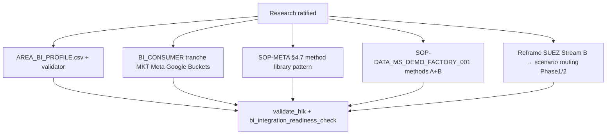

# Master synthesis — RevOps, multi-area BI, SOP methods (I93 P5c gate)

## Executive summary (plain language)

Three threads from your amendment converge:

1. **RevOps vs MKTOPS** — They are **not** the same thing in the vault. MKTOPS is the **campaign quality bar**; RevOps is the **revenue integration spine** under Operations. Industry often nests MOps inside RevOps at growth stage — Holistika can clarify names without moving charters yet.

2. **Every area consumes BI** — DATA must govern the **whole data plane** (warehouse, contracts, tiers, validators) while **each O5-1 area declares how it consumes BI**. Proposed: new **`AREA_BI_PROFILE.csv`** plus existing **`BI_CONSUMER_REGISTRY`** for tool instances.

3. **SOP methods** — Do **not** mint `_002` for CLI vs Browser. Use **method library inside `_001`** (estimation SOP precedent) + addendum for depth + `_002` only for generational forks. Amend **SOP-META §4.7** so future SOPs scale.

**Customer revenue → production:** When an engagement customer exists, treat Analytics Buckets / Azure demo build / licensing as **production paths funded by the engagement**, not blocked on vendor "alpha" labels.

## Cross-prong decisions (recommended bundle)

| ID | Decision | Recommendation |
|:---|:---|:---|
| **D-IH-93-RSM-1** | RevOps org placement | **Keep RevOps under Operations (A1)**; clarify MKTOPS = MOps-quality discipline; optional rename A2 later |
| **D-IH-93-RSM-2** | Multi-area BI | **Mint AREA_BI_PROFILE.csv (B1)** + consumer tranche for MKT/Meta/Google/Buckets |
| **D-IH-93-RSM-3** | SOP method pattern | **Hybrid method library (C)** + SOP-META §4.7 amend |
| **D-IH-93-RSM-4** | Microsoft SUEZ path | **Phase 1 Holistika Azure** via `SOP-DATA_MS_DEMO_FACTORY_001` methods A+B; demote Edge-as-primary in Stream B SOP |
| **D-IH-93-RSM-5** | Production readiness | Forward **`SOP-DATA_PRODUCTION_READINESS_001`** — engagement-funded hardening checklist |

## P5c execution sketch (after ratification)

## Nomenclature card (operator-facing)

| You said | Holistika construct | What it does |
|:---|:---|:---|
| RevOps | Operations/RevOps **area** | Connects marketing/sales/finance data; owns adapter registries |
| MKTOPS / MOps | **MKTOPS discipline** (Quality Fabric) | Campaign quality MKT-01..07 before launch |
| MarTech | Adapter CSVs under RevOps + matrix | Tools — CRM, email, attribution, Power Platform |
| DATA entirely | Data area doctrine + validators | Plane owner; areas consume, don't fork BI doctrine |
| Methods on SOP | §4 Method library in `_001` | CLI vs Browser vs Edge — same outcome, different path |
| 002 / 003 | New SOP generation or fork | KiRBe-style — **not** for method variants |

## Source ledger stats

- **15 sources** — 10 internal canonical (Safe), 5 external (Safe/Euclid)
- Prong A: 5 | Prong B: 6 | Prong C: 4
- No Keter sources; vendor alpha label flagged Euclid only

## Verification (research pack)

- [x] Source ledger with reliability scores
- [x] Three prong syntheses
- [x] Master synthesis with forward mint list
- [ ] Operator ratification (AskQuestion below)
- [ ] `validate_research_action.py` when pack promoted to intelligence area (optional P5c)

## Ratification required before P5c mint

~~See inline AskQuestion in session for:~~

**Operator ratified 2026-06-04:**

| Question | Choice |
|:---|:---|
| RevOps placement | **A4** — Unified RevOps umbrella; MKTOPS = quality bar |
| Multi-area BI | **B1 + production SOP** — AREA_BI_PROFILE + production readiness |
| SOP method pattern | **C-full** — SOP-META §4.7 + MS demo factory + SUEZ reframe |

P5c mint executed in same session post-ratification.

---

*Research action complete — P5c doctrine minted under D-IH-93-J.*
