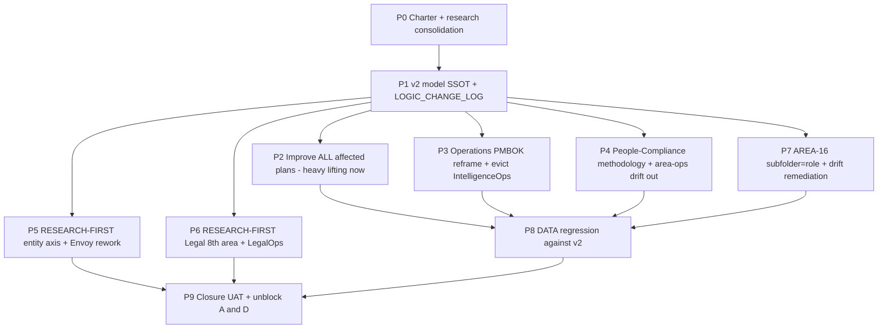

# I94 — Area Architecture & Completeness v2

> **Provenance.** Spawned from the operator's 2026-06-05 instruction to re-examine "what is an
> area" and "what completeness means for us" before driving the five remaining O5-1 areas to
> closure. Grounded in a **131-source research action**
> ([`docs/wip/intelligence/area-completeness-doctrine-2026-06-05/`](../../intelligence/area-completeness-doctrine-2026-06-05/)
> — 55 internal + 76 external, all categorized) walked across **3 operator ratification rounds**.
> Extends (does not supersede) the I93 area-governance meta-process (`D-IH-93-B`).

> **Operator intent (verbatim anchors).** *"full [2-D maturity model] … we still have drifted
> folders in the wrong/not-optimal area … challenge my previous decisions all the way …
> mint this in our logic change log, because this is big … an ever-value-growing learning
> loop of governed cross-area know-how … do it now to maintain momentum … improve all of
> their plans before starting … so better do the heavy lifting now."*

## 1. What this initiative changes (the ratified model)

| # | Decision | Ratified | Round |
|:--|:---|:---|:---:|
| Scoring | **Full 2-D maturity model** — component × level L0–L5 (CMMI/DCAM-grounded); keep deterministic heuristic | 1C | 1 |
| Boundary | **Bounded-context area definition** (consistent model + value stream + cognitive-load owner + contract + **kind**) | 2A | 1 |
| Outcome | **AREA-15 placement-integrity** (every canonical belongs to its area + ships ≥1 consumed contract) — the "what-belongs-where" check | 3A | 1 |
| Threshold | **Per-area tier** + critical-components-must-pass overrides the % | 4B | 1 |
| Operations | **Delivery/execution-capacity area scored on PMBOK 7 domains**; project/service as a tag; **IntelligenceOps evicted** | Q-OPS | 3 |
| People | Cross-area disciplines home = **People/Compliance** (methodology-enforcement); area-ops disciplines drift OUT | Q-PEOPLE | 3 |
| Entity | **Entity axis** (Holistika/Think Big/HLK Tech Lab); **Envoy folded under Tech** + matrix-visible (careful rework) | Q-ENTITY | 3 |
| Legal | **Legal = 8th scored area** + LegalOps design | Q-LEGAL | 3 |
| File-plan | **AREA-16 sub-folder = role/sub-area FK** (validator-enforced; RACI doctrine) | Q-SUBFOLDER | 3 |
| Bugs fixed | BUG-1 Legal unscored; BUG-2 entity axis unmodeled | — | 3 |

## 2. Phase dependency diagram

## 3. The continuous learning loop (the operator's "ever-value-growing governed know-how")

This initiative does not just edit a rulebook; it stands up a **standing discipline** that
improves every wave (detailed in
[`area-architecture-redesign-2026-06-05.md`](../../intelligence/area-completeness-doctrine-2026-06-05/area-architecture-redesign-2026-06-05.md) §6):
the area-architecture sweep (maturity grid + placement-integrity + sub-folder=role) runs at
wave-close, findings disposition via the inter-wave 5-option enum, and **learnings fold back**
into the model (new components, weights, kinds) so the definition of "complete" itself matures.
Cadence governed by research-radar; value order by intent-ranked ICS; mechanical safety-net by
inter-wave regression. Accumulated placement decisions become the reusable "a good Holistika
person knows what goes where" know-how.

## 4. Per-phase deep sections (preview)

> Full per-phase Scope/Files/Verification/Pause-point/Self-checkpoint sections materialise as
> phases are entered, per `akos-planning-traceability.mdc`. P0 lives in this charter; P1..P9
> forward-charter. **P5 (Envoy) and P6 (Legal) are research-first** per operator — each opens
> with a research action (source ledger + synthesis) before any mint.

- **P1 model SSOT** — the load-bearing build. Files: `AREA_GOVERNANCE_DISCIPLINE.md` v2,
  `akos/hlk_area_completeness.py` v2, `scripts/validate_area_completeness.py` v2,
  `LOGIC_CHANGE_LOG.md` entry, tests. Verification: `--matrix` deterministic; Data/Finance
  still pass on critical-at-L3 (closures must not break). **Operator doctrine-review gate.**
- **P2 improve-plans** — touch I93 gap tracker + the 5 area forward plans + Finance F4 + new
  Legal plan; bake in v2 acceptance criteria. No canonical CSV; safe heavy-lifting.
- **P3 Operations / P4 People / P7 sub-folder** — canonical-CSV + file-move gates (operator
  approval per `akos-baseline-governance.mdc`).
- **P5 Envoy / P6 Legal** — research-first; operator explicitly wants careful crafting.

## 5. Decision log (preview — full at [`decision-log.md`](decision-log.md))

| ID | Question | Status |
|:---|:---|:---|
| **D-IH-94-A** | Initiative inception + the full ratified v2 model (rounds 1–3) | active (this commit) |
| D-IH-94-B (reserved) | P1 doctrine + code v2 ratification | pending P1 |
| D-IH-94-C (reserved) | Operations PMBOK-domain reframe + IntelligenceOps relocation | pending P3 |
| D-IH-94-D (reserved) | Legal 8th-area + LegalOps design ratification | pending P6 |
| D-IH-94-E (reserved) | Envoy/entity-axis rework ratification | pending P5 |

## 6. Risk register (preview — full at [`risk-register.md`](risk-register.md))

| ID | Risk | Mitigation |
|:---|:---|:---|
| R-94-1 | v2 model invalidates Data/Finance closures | Critical-at-L3 mapping preserves both; P8 regression confirms before any re-grade |
| R-94-2 | Drift moves (P4/P7) break FK/links across the vault | Each move is a single audited commit + `validate_hlk` after; per-area operator gate |
| R-94-3 | Legal/Envoy research-first phases stall the initiative | They are parallel to P2/P3/P4/P7; closure (P9) only needs them, not the whole sweep |
| R-94-4 | Scope sprawl (8 areas × 16 components × levels) over-commits attention | Staged: model first (P1), then per-area; intent-ranked ICS orders the work |
| R-94-5 | Operations reframe over-engineers (operator's explicit fear) | PMBOK as orientation not full implementation; "project/service as a tag" keeps it light |

## 7. Cross-references

- Research action (evidence base): [`docs/wip/intelligence/area-completeness-doctrine-2026-06-05/`](../../intelligence/area-completeness-doctrine-2026-06-05/)
  — [`README`](../../intelligence/area-completeness-doctrine-2026-06-05/README.md) · [`master-synthesis`](../../intelligence/area-completeness-doctrine-2026-06-05/master-synthesis.md) · [`area-architecture-redesign`](../../intelligence/area-completeness-doctrine-2026-06-05/area-architecture-redesign-2026-06-05.md) · [`round3-assessment`](../../intelligence/area-completeness-doctrine-2026-06-05/round3-assessment-operations-people-tech-2026-06-05.md)
- Subject doctrine: [`AREA_GOVERNANCE_DISCIPLINE.md`](../../../references/hlk/v3.0/Admin/O5-1/People/canonicals/AREA_GOVERNANCE_DISCIPLINE.md) (v1; D-IH-93-B) + `akos/hlk_area_completeness.py`
- Parent initiatives: I93 (Data area + area-governance meta-process), I88 (cross-area wiring + Finance)
- Org SSOT: [`baseline_organisation.csv`](../../../references/hlk/v3.0/Admin/O5-1/People/Compliance/canonicals/baseline_organisation.csv) (area × entity × role)
