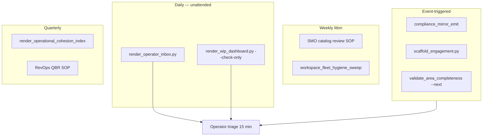

# Operations cross-area execution map (2026-06-10)

Mirror of I93's DATA-FAM producer/consumer map — **Operations as DO trigger**, not SSOT owner.
Heuristic classification of Operations `process_list` rows (83) by **cross-area handoff class**.

## Design rule (binding)

Operations **fires triggers**; sister areas **own doctrine + registers**.

| Handoff class | Operations owns | Sister area owns |
|:---|:---|:---|
| **OPS-TRIG-MIRROR** | Emit + operator notify | Data — mirror apply, DataOps probes |
| **OPS-TRIG-FINOPS** | Engagement/QBR events | Finance — counterparty, rev-rec, billing facts |
| **OPS-TRIG-COMPLIANCE** | Tranche proposal + validate_hlk | People/Compliance — CSV SSOT, PRECEDENCE |
| **OPS-TRIG-TECH** | Fleet hygiene gate before deploy | Tech — CICD, repo registry, runtime |
| **OPS-TRIG-RESEARCH** | Engagement elicitation hooks | Research — IO SOPs, register freshness |
| **OPS-LOCAL-DO** | Full SOP+runbook pair | — (Operations vault only) |

## Summary by handoff class

| Class | Est. rows | Paired (P3) | Primary scripts |
|:---|---:|---:|:---|
| OPS-LOCAL-DO | ~35 | 12 | catalog runbooks (12) |
| OPS-TRIG-MIRROR | ~8 | 1 | `verify.py compliance_mirror_emit` |
| OPS-TRIG-COMPLIANCE | ~15 | 2 | `validate_hlk.py`, initiative validators |
| OPS-TRIG-FINOPS | ~6 | 1 | FINOPS bridge SOP |
| OPS-TRIG-TECH | ~4 | 0 | `workspace_fleet_hygiene_sweep.py` |
| OPS-TRIG-RESEARCH | ~5 | 0 | (evicted — cite Research paths) |
| UNCLASSIFIED / legacy GTM | ~10 | 0 | forward-charter or retire |

## Load-bearing triggers (mint anchors for P4 handoffs doc)

| Trigger | When Operations fires | Sister owner | Evidence path |
|:---|:---|:---|:---|
| Mirror emit | After canonical CSV tranche commit | Data / System Owner | `SOP-OPS_MIRROR_EMIT_TRIGGER_001` |
| FINOPS bridge | Engagement contract signed | Finance RevOps | `SOP-FINOPS_BRIDGE_001` |
| Compliance CSV gate | New process_list / baseline row | People/Compliance | `SOP-META` + hooks |
| Fleet hygiene | Before consumer-repo work | Tech | `akos-deploy-health.mdc` Step 0 |
| Research IO | Pre-engagement counterparty work | Research | `Research/Intelligence/canonicals/SOP-IO_*` |
| Area completeness | Ops tranche / wave close | People (AREA governance) | `validate_area_completeness.py --area Operations` |

## Solo operator + AIC daily spine (designed)

## P4 mint target

Consolidate this map into
[`OPERATIONS_CROSS_AREA_HANDOFFS.md`](../../../../references/hlk/v3.0/Admin/O5-1/Operations/canonicals/OPERATIONS_CROSS_AREA_HANDOFFS.md)
as a **trigger → owner → script → evidence** table (four sister sections + Research pointer).

## Cross-initiative dependencies

| Initiative | Dependency |
|:---|:---|
| I93 Data | Mirror two-plane; DataOps owns apply |
| I88 | 10-pillar wiring review (P5) |
| I95 L6 | business-strategy placement from PMO |
| I75 | Research IO paths post OPS-86-26 |
| I94 main roadmap P4 | People methodology consolidation (parallel track — do not block ops P4) |
