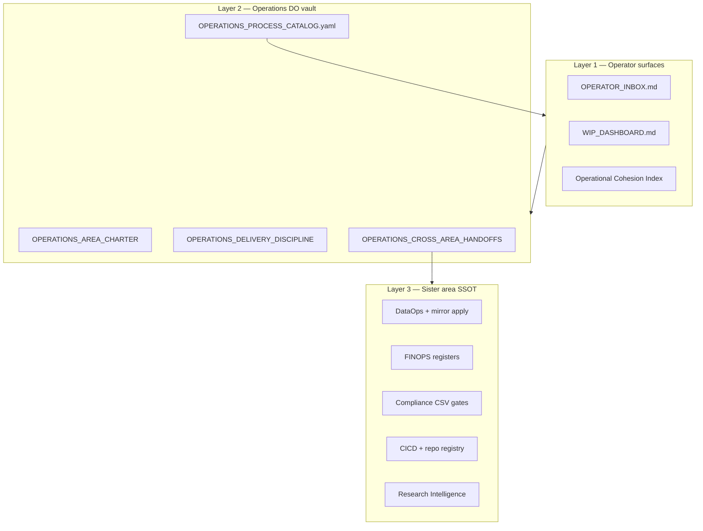

# I94 Operations master sweep design — the governed DO area (2026-06-10)

> **Purpose:** The operational area you can run alone with an AIC — and that stays seamless
> when people join — because **execution is scripted, handoffs are named, and sister areas
> govern their own doctrine. This is the I93 Data-bar equivalent for Operations **DO**.

Operator context (binding from prior ratification): full sweep, automation-first, 6–8h/day
until GTM. Research OPS-86-26 **done**; Operations crit tier **COMPLETE**; pairing cliff **open**.

---

## 1. North-star outcome

| When | Operator experience |
|:---|:---|
| **Solo + AIC today** | Daily inbox + WIP check in <15 min; tranche work triggered by named scripts; no re-deriving cross-area paths |
| **Team joins later** | Same spine; human roles slot into RACI rows already in handoffs doc + catalog |
| **Any engagement** | Scaffold → discovery → FINOPS bridge fires without improvising Finance/Data paths |
| **Any CSV tranche** | Mirror emit + validate_hlk path is one row in handoffs table |

**Not in scope:** Re-governing Data/FINOPS/Research doctrine (sister areas). Operations
**triggers only**.

---

## 2. Current baseline (live validators 2026-06-10)

| Signal | Value | Interpretation |
|:---|:---|:---|
| `validate_area_completeness --area Operations --matrix` | 93%, crit 10/10 **COMPLETE** | Tier gate met |
| AREA-09 | 12/53 paired | **Primary automation debt** |
| AREA-12 | partial | QF §6 cross-check — fix at P5 or P6 |
| Catalog T1 | 12/12 active | Automation spine exists |
| `--next` | empty | No critical blockers in scorer |

---

## 3. Architecture (three layers)



---

## 4. Phased execution plan (P4 → P8)

### Phase P4 — Cross-area handoffs + research closure (next commit)

**Scope:** Mint handoffs canonical; extend research ledger; session doctrine.

| # | Action | Path / command | Gate |
|:---:|:---|:---|:---|
| P4.1 | Mint handoffs canonical | `Operations/canonicals/OPERATIONS_CROSS_AREA_HANDOFFS.md` | doctrine review |
| P4.2 | Wire README + PRECEDENCE row | `Operations/README.md`, `PRECEDENCE.md` | validate_hlk |
| P4.3 | Link from delivery doctrine §handoffs | `OPERATIONS_DELIVERY_DISCIPLINE.md` | — |
| P4.4 | Mint session doctrine | `reports/i94-p4-session-doctrine-2026-06-10.md` | — |
| P4.5 | Append files-modified.csv | I94 + vault rows | — |
| P4.6 | Research ledger (this wave) | `i94-operations-area-source-ledger-p4-wave-2026-06-10.csv` | validate_research_action PASS |

**Verification:**

```powershell
py scripts/validate_research_action.py --source-ledger docs/wip/planning/94-area-architecture-and-completeness-v2/reports/i94-operations-area-source-ledger-p4-wave-2026-06-10.csv
py scripts/validate_hlk.py
py scripts/verify.py compliance_mirror_emit  # read-only emit check if CSV untouched
```

**Commit:** `docs(i94): P4 Operations cross-area handoffs + P4 wave-2 research`

---

### Phase P5 — I88 Operations 10-pillar wiring review

| # | Action | Path |
|:---:|:---|:---|
| P5.1 | Mint wiring report | `88-cross-area-ops-wiring-review-discipline/reports/i94-operations-10-pillar-wiring-review-2026-06-10.md` |
| P5.2 | Amend I88 §1.4 Operations paragraph | drop IntelligenceOps; add Research link |
| P5.3 | Per pillar: Tier 1/2/3 cadence table | PMO↔all, RevOps↔FINOPS, SMO↔catalog, Engagement↔People |
| P5.4 | Register gaps | `_trackers/` or OPS_REGISTER rows — no canonical CSV |
| P5.5 | Cross-link catalog → pillar rows | `OPERATIONS_PROCESS_CATALOG.yaml` comments |

**Verification:** `validate_area_completeness.py --area Operations --matrix`

**Commit:** `docs(i88/i94): P5 Operations 10-pillar wiring review`

---

### Phase P6 — Regression + closure UAT

| # | Action | Command / path |
|:---:|:---|:---|
| P6.1 | Synthesis-before-tranche | `synthesis_before_tranche_check.py --tranche-id i94-ops-P6 --tranche-class internal_governance` |
| P6.2 | Full validator matrix | pre_commit_fast + area matrix |
| P6.3 | Mint closure UAT | `reports/uat-i94-operations-sweep-p6-2026-06-10.md` |
| P6.4 | Verdict | **PASS-WITH-FOLLOWUP** if AREA-09 < 40/53 (recommended) |
| P6.5 | Update master-roadmap ops sweep todos | P4–P6 status |

**PWF followup class:** `monitoring-obligation` — tracker = AREA-09 pairing cliff (41 rows).

**Commit:** `docs(i94): P6 Operations sweep closure UAT`

---

### Phase P7 — AREA-09 T2 pairing tranche (operator CSV gate)

**Scope:** Next **20** high-value Operations processes → `sop_path`/`runbook_path` in `process_list.csv`.

Priority order (automation-first, from cross-area map):

1. Remaining PMO dtp rows tied to existing SOPs (5–7 rows)
2. RevOps engagement lifecycle TBI rows (5–6 rows)
3. Engagement client delivery rows (4–5 rows)
4. Mirror/compliance trigger duplicates (2–3 rows)

| Gate | Requirement |
|:---|:---|
| Canonical CSV | **Operator approval** before commit |
| Script | Extend `scripts/i94_area09_process_list_tranche.py` |
| Verify | `validate_hlk.py` + `validate_process_list_pairing.py` |

**Target after P7:** AREA-09 **~32/53** paired.

**Commit:** `feat(i94): P7 AREA-09 T2 process_list pairing tranche (20 rows)`

---

### Phase P8 — AREA-09 T3 + team-ready overlay

| Track | Scope |
|:---|:---|
| **P8a pairing** | Remaining ~21 rows OR explicit retire/merge of legacy GTM duplicates |
| **P8b RACI overlay** | Handoffs doc §5 — human role vs AIC seat column (no new process_list unless net-new triggers) |
| **P8c SMO depth** | Second catalog process: SLA breach escalation (if SMO row justifies) |
| **P8d I95 L6** | business-strategy placement ratification — parallel initiative |

**Closure target:** AREA-09 ≥ **45/53** or documented retire list for orphans.

---

## 5. AREA-09 pairing strategy (recommended)

| Tranche | Rows | Calendar | Operator gate |
|:---|---:|:---|:---:|
| P3 (done) | 12 | 2026-06-10 | ✓ ratified |
| P7 T2 | 20 | +1 session | CSV approval |
| P8 T3 | 21 | +1–2 sessions | CSV approval |
| Retire/merge | ~5 legacy GTM | P8 decision | inline-ratify |

Do **not** attempt 41 rows in one commit — violates synthesis discipline + review fatigue.

---

## 6. Automation spine (bind to operator calendar)

| Cadence | Script / SOP | Operator time |
|:---|:---|---:|
| Daily 07:00 | `render_operator_inbox.py` | 10–15 min triage |
| Mon 07:00 | `render_wip_dashboard.py` | 5 min review |
| Mon 06:00 | SMO catalog SOP | 15 min (when service clients active) |
| Post-CSV commit | `verify.py compliance_mirror_emit` | trigger only; Data applies |
| Pre-deploy | `workspace_fleet_hygiene_sweep.py --sweep` | 5 min |
| Quarterly | cohesion render + RevOps QBR | 2–4 hr block |
| Tranche / wave | `validate_area_completeness --area Operations --next` | 10 min |

---

## 7. Cross-initiative map

| Initiative | Relationship to Operations sweep |
|:---|:---|
| **I93 Data** | Mirror consumer; handoffs cite DataOps — no duplication |
| **I88** | P5 deep wiring; FINOPS exemplar already done |
| **I95 L6** | business-strategy placement — blocks PMO folder cleanup only |
| **I75** | Research IO paths — handoffs cite post OPS-86-26 |
| **I94 main P4** | People methodology — **parallel**; ops handoffs doc references People CSV gate |
| **I86** | Burndown rank 3 queued after P6 |

---

## 8. Verification golden path (Operations-specific)

```powershell
py scripts/validate_area_completeness.py --area Operations --matrix
py scripts/validate_area_completeness.py --area Operations --next
py scripts/validate_hlk.py
py scripts/verify.py pre_commit_fast
py scripts/render_operator_inbox.py --check-only
py scripts/render_wip_dashboard.py --check-only
py scripts/render_operational_cohesion_index.py validate
```

At P6 add: `validate_uat_report.py`, optional `inter_wave_regression_sweep.py --wave-closing`.

---

## 9. Deliverables index (this design wave)

| Artifact | Path | Status |
|:---|:---|:---:|
| Vault lay of land | `i94-operations-vault-lay-of-land-2026-06-10.md` | minted |
| Cross-area execution map | `i94-operations-cross-area-execution-map-2026-06-10.md` | minted |
| P4 wave synthesis | `i94-operations-p4-wave2-research-synthesis-2026-06-10.md` | minted |
| Source ledger P4 | `i94-operations-area-source-ledger-p4-wave-2026-06-10.csv` | minted PASS |
| Ledger bootstrap script | `scripts/i94_p4_ops_research_ledger_bootstrap.py` | minted |
| Master sweep design | this file | minted |
| Handoffs canonical | `OPERATIONS_CROSS_AREA_HANDOFFS.md` | **P4 execute** |
| Closure UAT | `uat-i94-operations-sweep-p6-*.md` | **P6 execute** |

---

## 10. Decision points for operator (AskQuestion)

See inline ratification form in chat — three gates:

1. **AREA-09 strategy** — 3 tranches vs big-bang CSV
2. **P6 verdict posture** — PWF at 12/53 vs delay closure
3. **P7 start** — handoffs-only P4 this session vs P4+P7 combined

---

## 11. Success criteria (definition of "Operations area done")

| Criterion | Target | Phase |
|:---|:---|:---:|
| crit@L3 tier COMPLETE | 10/10 | ✓ now |
| Cross-area handoffs canonical | minted + PRECEDENCE | P4 |
| I88 Operations wiring report | minted | P5 |
| Closure UAT signed | PASS or PWF | P6 |
| AREA-09 pairing | ≥ 45/53 or retire list | P7–P8 |
| Solo operator daily spine | documented + scripted | P4–P6 |
| Team-ready RACI | handoffs §5 | P8 |

**The area-completeness script is necessary but not sufficient** — pairing depth + handoffs
canonical are what prevent architecture staleness when you're alone with an AIC.
