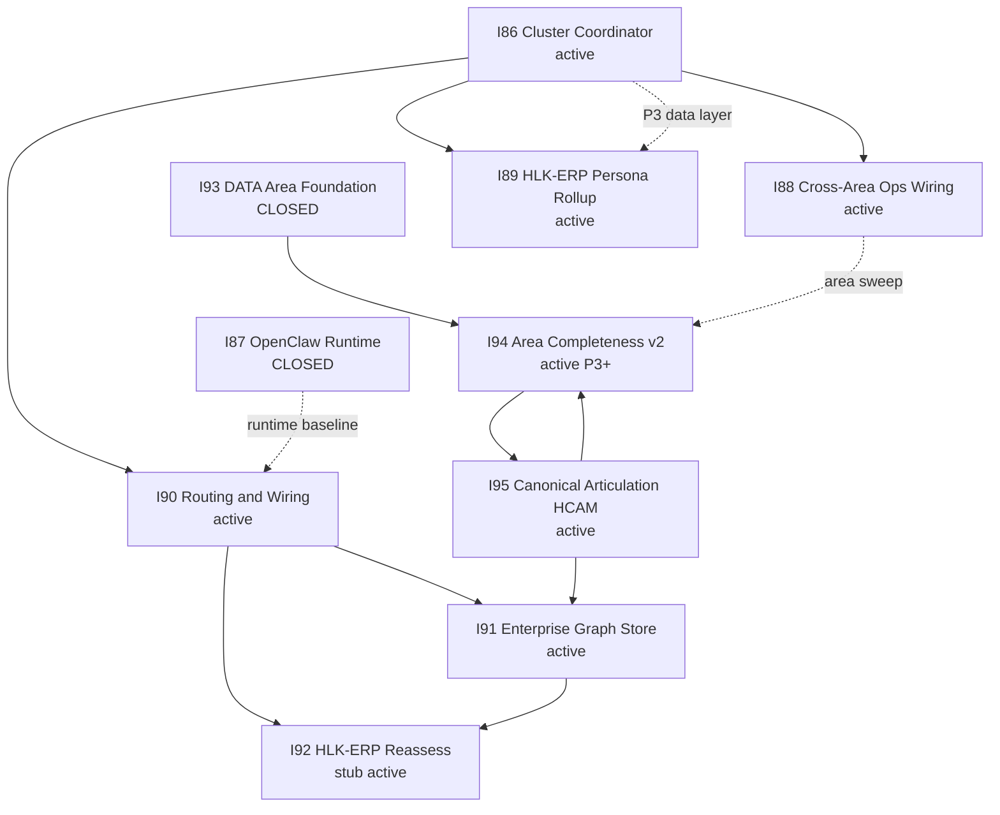

# I95 initiative cluster map

## Purpose

**INIT-OPENCLAW_AKOS-95** (the **Canonical Articulation Model** — HCAM enterprise ontology + governed Neo4j graph over CSV SSOT) is the **articulation spine** of a two-layer cluster: **I86** (portfolio coordinator + INDEX_INTEGRITY Wave N path) and **I90–I95** (routing, graph store, area model, HCAM). Official dependency narrative: [`INITIATIVE_DEPENDENCIES.md`](../../../references/hlk/v3.0/Admin/O5-1/People/Compliance/canonicals/INITIATIVE_DEPENDENCIES.md) (refreshed 2026-06-10, I95 Tranche 2). Local detail: linked roadmaps below.

## Cluster diagram

## Initiative table

| ID | Functional name | Registry status | I95 consumes | I95 produces | Blocker / tracker links |
|:---|:---|:---:|:---|:---|:---|
| **I86** | Initiative cluster execution coordinator | active | Wave cadence, D-IH-86-D closure cross-check, INDEX_INTEGRITY (Wave N) | Cluster burndown ordering | [`cluster-burndown-plan.md`](../86-initiative-cluster-execution-coordinator/cluster-burndown-plan.md) |
| **I87** | OpenClaw operator-runtime hardening | **closed** | Runtime baseline (done) | — | [`uat-i87-closure-2026-05-19.md`](../87-openclaw-operator-runtime-hardening/reports/uat-i87-closure-2026-05-19.md) |
| **I88** | Cross-area Ops wiring review discipline | active | Area wiring lens for L4 orphan burn-down | FINOPS + Research deep examples → discipline canonical P3 | [`master-roadmap.md`](../88-cross-area-ops-wiring-review-discipline/master-roadmap.md) |
| **I89** | HLK-ERP persona-rollup panels (6 routes) | active | Audience/register semantics from I95 GOV | ERP operator surfaces (sibling `hlk-erp`) | Forward-chartered from I86 P3; OPS-86-5 BBR leaks |
| **I90** | Routing & Wiring ordnance (two-seat + rule tiers) | active | Agent routing for I95 execution | Hands off to I91/I92; OPS reconciliation | [`master-roadmap.md`](../90-routing-and-wiring/master-roadmap.md); P2 **PASS** |
| **I91** | Enterprise graph & store-coverage mapping | active | **Neo4j harness** (I95 F6), HCAM verbs (I95 P2+) | Store-coverage matrix → I92 | Was blocked on `NEO4J_*`; **unblocked** 2026-06-09 |
| **I92** | HLK-ERP reassess & dashboard | active (stub) | I91 P2 matrix, I62/I64/I65/I68 lineage | ERP dashboard integration | Stub until I92 P0 expands |
| **I93** | DATA area foundation & cross-area data governance | **closed** | DAMA DATA area, `pattern_area_buildout` | Area-governance meta-process (parent of I94) | [`uat-i93-closure-2026-06-05.md`](../93-data-area-foundation-and-governance/reports/uat-i93-closure-2026-06-05.md) |
| **I94** | Area architecture & completeness v2 | active (P3 **DONE** 2026-06-10) | Sub-folder=role, placement-integrity (I94 P7) | Area-completeness **v3** target (I95 P4) | AREA-09 12/53 paired; IntelligenceOps evicted; P4 handoffs next |
| **I95** | Canonical articulation model (HCAM / Singularity) | active | I94 placement model, I93 DATA canon, Neo4j projection | Relationship registry, verb triples, GOV registry, graph CQ harness | [`i95-pmo-status-sweep-2026-06-10.md`](reports/i95-pmo-status-sweep-2026-06-10.md) |

## I95 internal lanes

| Lane / wave | Functional scope | Status | Notes |
|:---|:---|:---:|:---|
| **P0** | Research + inception | **DONE** | D-IH-95-A |
| **P1** | Relationship-registry SSOT | **DONE** (core) | `CANONICAL_RELATIONSHIP_REGISTRY.csv` + validators |
| **P2** | Neo4j unify + CQ harness | **DONE** (F6) | Instance `6c0d76bf`; CQ UAT PASS |
| **P3** | HCAM doctrine home + Semantic Council | **OPEN** | Couple with I91; P3 canonical |
| **P4** | Area-completeness v3 (HCAM triples) | **OPEN** | Depends I94 model stable |
| **P5** | Repo-wide FK→verb mapping | **OPEN** (L3 partial) | Tranche-4 done; **tranche-5** = 10 unbound triples (F-11) |
| **P6** | Lead simplification + Marketing ghost folders | **OPEN** | Canonical-CSV gate Q2 |
| **P7** | Closure UAT | **OPEN** | 5 competency questions |
| **P95-GOV** | Universal canonical governance (8 packets) | **CLOSED** | PASS-WITH-FOLLOWUP UAT |
| **L1** | Supabase EG-2..5 registries | **PARTIAL** | EG-2 + **EG-3 done**; EG-4..5 open |
| **L2** | Capability de-densify | **DONE** | D-IH-95-I: 1,119→93 @ 2026-06-08; audit [`i95-l2-state-audit-2026-06-09.md`](reports/i95-l2-state-audit-2026-06-09.md) |
| **L3** | FK→verb tranches | **DONE** (bindings) | Bundles A+B+C done (C charter 2026-06-10); tranche-5 = 44 bindings; TRP-030/036 stay **planned** until FK mint |
| **L4** | Orphan burn-down (`--matrix`) | **OPEN** | Semantic Council disposition |
| **L5** | Topics + IntelligenceOps | **OPEN** | T1 schema tranche next |
| **L6** | biz-strategy re-home | **OPEN** | Overlaps I94 P7 placement |

## Open-item ownership

| Open item | Owner initiative | Rationale |
|:---|:---|:---|
| L3 tranche-5 (10 unbound active triples) | **I95** | Regression F-11; articulation SSOT |
| ~~L3 Bundle C (TRP-030/036)~~ | **I95** | **DONE** 2026-06-10 — charter disposition; FK promotion deferred |
| L1 EG-3..5 Supabase registries | **I95** (L1) | Data Architecture canon family — **EG-3 done** 2026-06-10 |
| ~~L2 capability de-densify~~ | **I95** | **DONE** (D-IH-95-I); mirror re-emit PENDING-OPERATOR |
| L4 orphan `--matrix` burn-down | **I95** + **I88** / **I94** | Wiring discipline + area completeness |
| L5 Topics / IntelligenceOps | **I95** + **I75** Research | Steward + physical moves |
| L6 biz-strategy re-home | **I95** + **I94** P7 | Placement-integrity |
| ~~OPS-95-2 engagement_model_id backfill~~ | **I95** | **DONE** 2026-06-10 — Tranche 6; 6/7 backfilled; Rushly archived NULL intentional |
| OPS-95-3 `files-modified.csv` history | **I95** meta | Planning traceability |
| Self-hosted Neo4j spike / EIC / Startup pack | **I95** funding track | D-IH-95-M; not blocking engineering |
| ~~I91 P1–P2 Neo4j smoke + coverage matrix~~ | **I91** | **DONE** 2026-06-10 — Tranche 3; matrix [`store-coverage-matrix-2026-06-10.md`](../91-enterprise-graph-store-coverage/reports/store-coverage-matrix-2026-06-10.md) |
| I92 ERP reassess P0 charter | **I92** | Stub expansion |
| I89 P1–P5 TSX panels | **I89** | Sibling `hlk-erp`; uses I86 P3 view |
| I94 P3–P9 area reframes | **I94** | Operations/People/Legal/Envoy |
| I88 P1–P3 discipline canonical | **I88** | Cross-area wiring specialty |
| I90 Wave N INDEX_INTEGRITY + deps refresh | **I86 / I90** | **DONE** (I95 Tranche 2 2026-06-10) — deps + README backfill |
| Planning README I78/I85/I87 stale rows | **I86** INDEX_INTEGRITY N.4 | **DONE** (I95 Tranche 2) — I78 closed; §Closing list corrected |

## Burndown queue

Ordered for **maximum unlock across I86–I95**, not I95-only. Authoritative operator sweep: [`i95-pmo-status-sweep-2026-06-10.md`](reports/i95-pmo-status-sweep-2026-06-10.md) §4.

| Rank | Action | Primary INIT | Exit gate |
|:---:|:---|:---|:---|
| **1** | ~~**INDEX_INTEGRITY specialty + planning index backfill** (I86 Wave N)~~ | I86 / I90 | **DONE** 2026-06-10 — Tranche 2; sweep `index-sweep-2026-06-10-tranche2-wave-n.md` |
| **2** | ~~**I91 P1–P2** — Neo4j preflight + store-coverage matrix v1~~ | I91 | **DONE** 2026-06-10 — Tranche 3; probe exit 0; [`store-coverage-matrix-2026-06-10.md`](../91-enterprise-graph-store-coverage/reports/store-coverage-matrix-2026-06-10.md) |
| **3** | ~~**I95 L3 Bundle C ratify** (TRP-030/036)~~ | I95 | **DONE** 2026-06-10 — Tranche 4; keep planned; [`i95-l3-bundle-c-disposition-2026-06-10.md`](reports/i95-l3-bundle-c-disposition-2026-06-10.md) |
| **3b** | ~~**I95 L1 EG-3** registries (edge-fn / cron / extension)~~ | I95 | **DONE** 2026-06-10 — Tranche 5; edge + cron CSVs + extension manifest |
| **4** | ~~**OPS-95-2** engagement_model_id backfill (7 engagements)~~ | I95 | **DONE** 2026-06-10 — Tranche 6; operator ratified; mirror re-emit parity operator follow-up |
| **5** | **I94 P3** Operations PMBOK reframe (**in progress** 2026-06-10) | I94 | P0+P1 landed (ledger, charter, delivery doctrine); exit = P2 pairing + tier COMPLETE |
| **6** | **I95 L4** equal-slice orphan burn-down (one area) | I95 | `--matrix` wiring % up; Semantic Council disposition logged |
| **7** | **I92 P0** full charter (ERP reassess) | I92 | Replaces stub; links I91 matrix |
| **8** | **Self-hosted spike charter** + parallel **EIC screen** | I95 funding | Documents TCO; no engineering block |
| **9** | **`py scripts/verify.py pre_commit`** full bar | All | Release readiness |

## Cross-links

- **I95 master roadmap:** [`master-roadmap.md`](master-roadmap.md)
- **PMO status sweep:** [`reports/i95-pmo-status-sweep-2026-06-10.md`](reports/i95-pmo-status-sweep-2026-06-10.md) (latest); prior [`reports/i95-pmo-status-sweep-2026-06-09.md`](reports/i95-pmo-status-sweep-2026-06-09.md)
- **I86 portfolio coordinator:** [`../86-initiative-cluster-execution-coordinator/master-roadmap.md`](../86-initiative-cluster-execution-coordinator/master-roadmap.md)
- **I86 cluster burndown:** [`../86-initiative-cluster-execution-coordinator/cluster-burndown-plan.md`](../86-initiative-cluster-execution-coordinator/cluster-burndown-plan.md)
- **Official dependency narrative:** [`INITIATIVE_DEPENDENCIES.md`](../../../references/hlk/v3.0/Admin/O5-1/People/Compliance/canonicals/INITIATIVE_DEPENDENCIES.md) (I90–I95 edges refreshed 2026-06-10)
- **Planning index:** [`../README.md`](../README.md)
- **Funding closure:** [`reports/i95-fq2-ratification-2026-06-09.md`](reports/i95-fq2-ratification-2026-06-09.md) (D-IH-95-M)
