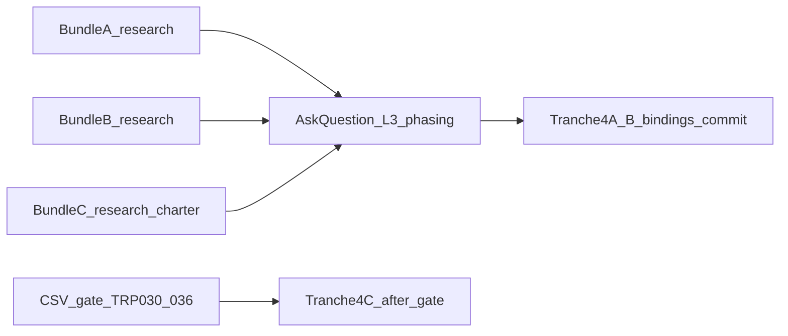

# I95 L3 — Parallel bundle mini-charters (2026-06-09)

**Current `L3_FK_BINDINGS`:** 22 tuples (tranches 1–3).  
**Operator intent:** All bundles — research first per bundle; parallel/multitask safe where noted.

Bundles are **git-only**. Merge conflicts possible only in `akos/hlk_canonical_articulation.py` + `CANONICAL_RELATIONSHIP_REGISTRY.csv` — **serialize bindings commit** or use one executor with three research packets.

---

## Bundle A — Data-plane (TRP-038, 045–047, 021)

| Field | Value |
|:---|:---|
| **Triples** | TRP-038 (AIC→capability), TRP-045/046/047 (data-contract cluster), TRP-021 (topic parent) |
| **New bindings** | ~8 tuples |
| **FK columns** | `aic_capability_implementation_matrix.{capability_id,aic_id}`; `data_contract_registry.{producer_process_id,consumer_area_ids,data_surface}`; `topic_registry.parent` |
| **Row counts** | Matrix: 2; Data contracts: 14; Topics: 59 |
| **Files to touch** | `akos/hlk_canonical_articulation.py` (`L3_TRANCHE4A_FK_BINDINGS`); optional `scripts/validate_fk_verb_coverage.py` floor bump; **no CSV schema change** |
| **CSV gates** | None (bindings only) |
| **Parallel safe?** | **Yes** vs B/C if tranche-4 commit is coordinated |
| **Conflicts** | None with B/C on column SSOT |

---

## Bundle B — Engagement cluster (TRP-012, 008, 029, 042, 015, 043–044)

| Field | Value |
|:---|:---|
| **Triples** | TRP-012 (engagement→entity flow), TRP-008 (process→engagement serve), TRP-029/042 (use-case realizes/serves), TRP-015 (program→initiative), TRP-043/044 (GOI/POI influence) |
| **New bindings** | ~7–9 tuples |
| **FK columns** | `engagement_registry.counterparty_org_id`; `process_list.engagement_template_id`; `use_case_archive.{capability_id,engagement_id}`; `initiative_registry.program_anchors`; `goi_poi_register.{process_item_id,program_id}` |
| **Row counts** | Engagements: 7; Use-cases: ~8; GOI/POI: populated |
| **Files to touch** | Same as A + verify `ENGAGEMENT_REGISTRY` path casing in registry |
| **CSV gates** | None for promotion (triples already **active**) |
| **Parallel safe?** | **Yes** |
| **Conflicts** | TRP-008 overlaps tranche-1 `process_list.engagement_template_id` — **dedupe before commit** |

---

## Bundle C — TRP-030/036 unblock

| Field | Value |
|:---|:---|
| **Status** | **Blocked** — ratified keep **planned** @ [`l3-trp-030-036-ratification-2026-06-09.md`](l3-trp-030-036-ratification-2026-06-09.md) |
| **TRP-030** | Needs new FK (`process_item_id` on matrix or dedicated AIC↔process register). TRP-038 already covers AIC→capability. |
| **TRP-036** | Needs `INITIATIVE_REGISTRY` workstream anchor column (or charter FK), not just narrative `process_list` layers. |
| **Parallel safe?** | **Research + charter only** — **no binding promotion** until operator CSV gate |
| **Conflicts** | **High** if attempted as "indirect path only" — validator rejects `new` on active triples |

---

## Master L3 sequence (operator "all bundles")

**Recommended phasing (AskQuestion Q2 option A):** Parallel research → single tranche-4 commit for A+B bindings (~15–17 tuples); C stays research+CSV-gate charter only.

---

## Verification matrix

| Gate | Command |
|:---|:---|
| FK coverage | `py scripts/validate_fk_verb_coverage.py` |
| Articulation | `py scripts/validate_canonical_articulation.py` |
| HLK umbrella | `py scripts/validate_hlk.py` |

**Operator gates:**

- TRP-030/036 promotion requires **new CSV columns** → canonical CSV gate
- HCAM registry changes are **git-only** (no compliance mirror emit for relationship registry)

---

## Cross-references

- Prior tranche report: [`l3-fk-verb-tranche3-2026-06-08.md`](l3-fk-verb-tranche3-2026-06-08.md)
- TRP-030/036 ratification: [`l3-trp-030-036-ratification-2026-06-09.md`](l3-trp-030-036-ratification-2026-06-09.md)
- Operator ratification: [`i95-round2-operator-ratification-2026-06-09.md`](i95-round2-operator-ratification-2026-06-09.md)
