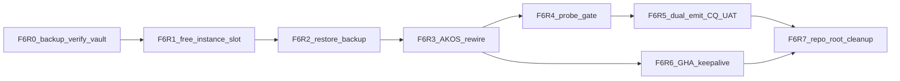

# I95 Neo4j Free backup restore charter — F6 (2026-06-09)

**Operator ratification (binding 2026-06-09):** Restore the operator-exported `.backup` on **AuraDB Free ($0)**. **Option C — AuraDB Professional (~$65/mo) is REJECTED for 2026** unless a future **funding gate** fires (see [`neo4j-funding-escalation-radar-2026-06-09.md`](../../../intelligence/neo4j-funding-escalation-radar-2026-06-09.md)).

**Symptom:** `py scripts/neo4j_connectivity_probe.py` fails (`wrong_password_or_user`); GitHub Actions keepalive returns **`42NFF`** because secrets hold a stale password.

**Backup artifact (operator vault — never commit):**

| Field | Value |
|:---|:---|
| Export filename | `b6d76b10-2026-06-09T14-30-52-b6d76b10.backup` |
| Size | ~315,550 bytes (~308 KB) |
| Source instance id | `b6d76b10` |
| Vault path (post F6-R0) | `%USERPROFILE%/.openclaw/vault/neo4j-backups/` |
| Git posture | `*.backup` in `.gitignore`; **never** `git add` |

**Research:** [`i95-neo4j-f6-restore-source-ledger.csv`](i95-neo4j-f6-restore-source-ledger.csv) + free-tier ledger SRC-N4J-01..08.

**Hard gate:** Any step proposing Professional / clone / upgrade → **STOP**; cite funding radar + operator funding gate. Paid charter is appendix-only: [`i95-neo4j-professional-restore-charter-2026-06-09.md`](i95-neo4j-professional-restore-charter-2026-06-09.md) (`status: deferred-funding`).

---

## Phased process (binding order)

| Phase | Name | Operator / execution | Gate |
|:---|:---|:---|:---|
| **F6-R0** | Backup verify + vault move | Confirm export exists; SHA256 manifest; move to operator vault | File in vault; untracked in git |
| **F6-R1** | Free instance slot | One Free per account — destroy/recreate if restore blocked | Instance **Running**; credentials saved |
| **F6-R2** | Restore | Inspect → **Restore from backup file** from vault (<4 GB) | Restore completes |
| **F6-R3** | AKOS rewire | `~/.openclaw/.env` + GHA secrets; Browser password test | Probe exit **0** |
| **F6-R4** | Probe gate | `py scripts/neo4j_connectivity_probe.py` | Exit **0** |
| **F6-R5** | Dual-emit + CQ UAT | `--dry-run --dual-emit` then live; `run_cq_uat.py` | CQ UAT PASS |
| **F6-R6** | Keepalive secrets | Sync GHA secrets; workflow_dispatch keepalive | "keep-alive write ok" |
| **F6-R7** | Repo-root cleanup | Remove stray `.backup` from repo root | `git status` clean |



---

## F6-R0 — Backup verify + vault move

1. Confirm `b6d76b10-2026-06-09T14-30-52-b6d76b10.backup` exists (~308 KB) — may be at repo root until moved.
2. Verify `git status` shows the file **untracked** (`*.backup` in `.gitignore`).
3. Create `%USERPROFILE%\.openclaw\vault\neo4j-backups\` if absent.
4. Move backup + write `{basename}.sha256.json` manifest (`captured_at`, `size_bytes`, `source_instance_id`).
5. **Never** `git add` the binary.

Doctrine: [`i95-neo4j-backup-retention-process-2026-06-09.md`](i95-neo4j-backup-retention-process-2026-06-09.md).

Source: SRC-N4J-09 (4 GB console import limit).

---

## F6-R1 — Free instance slot

**One Free instance per account** (SRC-N4J-05). If restore-in-place is blocked:

1. Export any live state if needed (per retention process).
2. **Destroy** current Free instance OR use account slot policy.
3. **Create** new Aura Free instance → **Download credentials file** before Continue.

---

## F6-R2 — Restore from backup

1. On the Free instance → **Inspect** → **Restore from backup file**.
2. Upload from vault path (not repo root).
3. Wait for restore completion.

**Large-backup fallback (not needed here):** `neo4j-admin database upload` per SRC-N4J-11.

---

## F6-R3 — AKOS rewire (auth nuance)

Restore preserves **backup-era DB password**. If F2/F3 failed pre-restore, post-restore password may differ from stale env — **Browser test + credentials file alignment required**.

| Surface | Variables | Notes |
|:---|:---|:---|
| Local operator env | `~/.openclaw/.env` | `NEO4J_URI`, `NEO4J_USERNAME=neo4j`, `NEO4J_PASSWORD` |
| Env loader | [`akos/io.py`](../../../../akos/io.py) | Neo4j keys in file override stale process env |
| Driver | [`akos/hlk_neo4j.py`](../../../../akos/hlk_neo4j.py) | Heals instance-id-as-username misconfiguration |
| GitHub Actions | Secrets `NEO4J_URI`, `NEO4J_USERNAME`, `NEO4J_PASSWORD` | [`neo4j-aura-keepalive.yml`](../../../../.github/workflows/neo4j-aura-keepalive.yml) |

| Setting | Correct value |
|:---|:---|
| URI scheme | `neo4j+s://` |
| Username | lowercase `neo4j` |
| Password | From credentials file or verified Browser login |

**SOC:** Never log secret values.

---

## F6-R4 — Probe gate

```powershell
py scripts/neo4j_connectivity_probe.py
```

Exit **0** required before F6-R5/F6-R6.

---

## F6-R5 — Dual-emit + CQ UAT

```powershell
py scripts/sync_hlk_neo4j.py --dry-run --dual-emit
py scripts/sync_hlk_neo4j.py --dual-emit
py artifacts/sql/run_cq_uat.py
```

Closure evidence: [`i95-neo4j-cq-uat-2026-06-09.md`](i95-neo4j-cq-uat-2026-06-09.md).

---

## F6-R6 — Keepalive secrets alignment

1. Update GitHub Actions secrets to match F6-R3.
2. Run workflow_dispatch on [`neo4j-aura-keepalive.yml`](../../../../.github/workflows/neo4j-aura-keepalive.yml).
3. Confirm **"keep-alive write ok"** — no `42NFF`.

Keepalive unchanged per **D-IH-95-G R2-09**; Professional arm deferred per **D-IH-95-L**.

---

## F6-R7 — Repo-root cleanup

1. Remove any `.backup` left at repo root.
2. Confirm `git status` clean (backup only in operator vault).

---

## Deferred appendix — paid Professional (funding-gated)

[`i95-neo4j-professional-restore-charter-2026-06-09.md`](i95-neo4j-professional-restore-charter-2026-06-09.md) — `status: deferred-funding`. Do not execute R0–R6 paid phases without funding ratification.

---

## Cross-references

- Credential recovery (primary incident = F6): [`i95-neo4j-credential-recovery-2026-06-09.md`](i95-neo4j-credential-recovery-2026-06-09.md)
- Backup retention: [`i95-neo4j-backup-retention-process-2026-06-09.md`](i95-neo4j-backup-retention-process-2026-06-09.md)
- Funding radar: [`neo4j-funding-escalation-radar-2026-06-09.md`](../../../intelligence/neo4j-funding-escalation-radar-2026-06-09.md)
- NEO4J_STRATEGY: [`NEO4J_STRATEGY.md`](../../../../../docs/references/hlk/v3.0/Envoy%20Tech%20Lab/Neo4j/NEO4J_STRATEGY.md)
