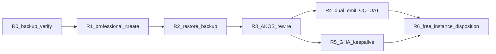

# I95 Neo4j Professional restore charter (2026-06-09) — `deferred-funding` appendix

> **Superseded for 2026 (binding):** Operator rejected Option **C** on 2026-06-09. **Primary incident path = F6** — [`i95-neo4j-free-backup-restore-charter-2026-06-09.md`](i95-neo4j-free-backup-restore-charter-2026-06-09.md). Execute this paid charter only after a **funding gate** fires ([`neo4j-funding-escalation-radar-2026-06-09.md`](../../../intelligence/neo4j-funding-escalation-radar-2026-06-09.md); **D-IH-95-L**).

**Historical ratification (pre-correction):** Option **C** — create **AuraDB Professional** (~**$65/mo** USD floor, 1 GB) with explicit billing opt-in; restore operator-exported `.backup`; rewire AKOS + GitHub Actions secrets.

**Symptom driving path C:** `py scripts/neo4j_connectivity_probe.py` fails (`wrong_password_or_user`); GitHub Actions keepalive workflow returns **`42NFF`** because secrets still hold a stale password. Free-tier paths F1–F5 documented in [`i95-neo4j-credential-recovery-2026-06-09.md`](i95-neo4j-credential-recovery-2026-06-09.md) do not meet the operator's **online-every-time** reliability goal (D-IH-95-G R2-09).

**Backup artifact (document only — never commit):**

| Field | Value |
|:---|:---|
| Path | `b6d76b10-2026-06-09T14-30-52-b6d76b10.backup` (repo root) |
| Size | ~315,550 bytes (~308 KB) |
| Source instance id | `b6d76b10` (prior misconfigured `NEO4J_USERNAME`) |
| Git posture | `*.backup` in `.gitignore`; file stays operator-local |

**Research:** [`i95-neo4j-professional-restore-research-2026-06-09.md`](i95-neo4j-professional-restore-research-2026-06-09.md) + source ledger SRC-N4J-09..16.

---

## F6 (Free restore from backup) vs C (Professional) — why backup still matters under C

| Dimension | **F6 — Free restore from `.backup`** | **C — Professional (operator choice)** |
|:---|:---|:---|
| **Console path** | Inspect → Restore from backup file on existing/new **Free** instance | Create **Professional** instance → restore `.backup` or create from exported snapshot |
| **Graph preservation** | Yes — restores pre-export graph (`_KeepAlive`, dual-emit state, ad-hoc Cypher) | Same — operator export is SSOT for non-CSV graph state |
| **Credential recovery** | Restore brings **DB password state at backup time**; still need matching password in `~/.openclaw/.env` + GHA — no Free console reset if wrong | New instance yields **fresh credentials file** at creation; restore may retain backup-era password — probe + Browser test required; Professional allows RBAC later |
| **Reliability (D-IH-95-G R2-09)** | Free auto-pause (72h no writes); keepalive still required | Professional: daily scheduled snapshots (7d retention per SRC-N4J-09); no Free-tier pause doctrine |
| **Cost** | $0 | ~**$65/mo** (1 GB Professional floor — SRC-N4J-06 / SRC-N4J-12) |
| **Why not F6 alone** | Auth still broken if env/GHA password ≠ backup-era password; keepalive keeps failing | Pays for reliability + backup retention; operator explicitly opted in |

**Backup value under C:** F5 (CSV rebuild) would **drop** non-CSV graph state. The exported `.backup` is the only governed path to preserve dual-emit / keepalive / CQ-relevant live graph without re-deriving from git CSVs alone (SRC-N4J-13).

---

## Phased process (binding order)

| Phase | Name | Operator / execution | Gate |
|:---|:---|:---|:---|
| **R0** | Backup verify | Confirm file exists, size, instance id; `*.backup` in `.gitignore`; **never** `git add` binary | File on disk; untracked |
| **R1** | Professional instance | Aura console: create **AuraDB Professional** (1 GB); **download credentials file**; billing ack (AskQuestion Q2) | Instance **Running**; credentials saved |
| **R2** | Restore | Inspect → **Restore from backup file** → upload `b6d76b10-…backup` (<4 GB per SRC-N4J-09) **OR** Create instance from exported snapshot if console offers | Restore completes without error |
| **R3** | AKOS rewire | Update `~/.openclaw/.env`: `NEO4J_URI` (new `neo4j+s://…`), `NEO4J_USERNAME=neo4j`, `NEO4J_PASSWORD` (credentials file); sync GitHub secrets — **never log values** | `py scripts/neo4j_connectivity_probe.py` exit **0** |
| **R4** | Dual-emit + CQ UAT | `py scripts/sync_hlk_neo4j.py --dry-run --dual-emit` then live `--dual-emit`; `py artifacts/sql/run_cq_uat.py` | CQ UAT per [`i95-neo4j-cq-uat-2026-06-09.md`](i95-neo4j-cq-uat-2026-06-09.md) |
| **R5** | Keepalive secrets | GitHub repo Settings → Actions secrets: `NEO4J_URI`, `NEO4J_USERNAME`, `NEO4J_PASSWORD` match R3; run `neo4j-aura-keepalive` workflow_dispatch | GHA run: "keep-alive write ok" (no `42NFF`) |
| **R6** | Free instance disposition | Delete or retain old Free `b6d76b10` per AskQuestion Q3; finops note on `finops_neo4j` | Operator choice recorded |



---

## R0 — Backup verify

1. Confirm `b6d76b10-2026-06-09T14-30-52-b6d76b10.backup` exists at repo root (~308 KB).
2. Verify `git status` shows the file **untracked** (covered by `*.backup` in `.gitignore`).
3. **Never** `git add` the binary.

Source: operator export; SRC-N4J-09 (4 GB console import limit).

---

## R1 — Professional instance create

1. Open [Neo4j Aura console](https://console.neo4j.io/).
2. Create **AuraDB Professional** (1 GB minimum).
3. **Download credentials file** before Continue (one-time password window — SRC-N4J-02 pattern).
4. Record instance name per AskQuestion (recommended: `holistika-hcam-pro`).
5. **Billing ack required** (~$65/mo) before proceeding.

Sources: [Neo4j pricing](https://neo4j.com/pricing/); SRC-N4J-12; D-IH-95-G R2-09.

---

## R2 — Restore from backup

**Preferred (operator export <4 GB):**

1. On the new Professional instance → **Inspect** → **Restore from backup file**.
2. Upload `b6d76b10-2026-06-09T14-30-52-b6d76b10.backup`.
3. Wait for restore completion.

**Fallback:** Create instance from exported snapshot if console offers that path (SRC-N4J-09).

**Large-backup fallback (not needed here):** `neo4j-admin database upload` per SRC-N4J-11.

After restore: test Browser login with username `neo4j` and credentials-file password. If restore retained backup-era password, use that password in R3; if mismatch, use fresh credentials from R1 creation.

---

## R3 — AKOS rewire (URI change impacts)

| Surface | Variables | Notes |
|:---|:---|:---|
| Local operator env | `~/.openclaw/.env` | `NEO4J_URI`, `NEO4J_USERNAME=neo4j`, `NEO4J_PASSWORD` |
| Env loader | [`akos/io.py`](../../../../akos/io.py) | Neo4j keys in file **override** stale process env when non-empty |
| Driver | [`akos/hlk_neo4j.py`](../../../../akos/hlk_neo4j.py) | Heals instance-id-as-username misconfiguration |
| GitHub Actions | Secrets `NEO4J_URI`, `NEO4J_USERNAME`, `NEO4J_PASSWORD` | [`neo4j-aura-keepalive.yml`](../../../../.github/workflows/neo4j-aura-keepalive.yml) |
| Probe gate | `py scripts/neo4j_connectivity_probe.py` | Exit **0** required before R4/R5 |

**Connection rules (all Aura tiers):**

| Setting | Correct value |
|:---|:---|
| URI scheme | `neo4j+s://` (not `bolt://`) |
| Username | lowercase `neo4j` (not instance id) |
| Password | From credentials file or verified Browser login |

Optional: `NEO4J_TRUST=all` rewrites `neo4j+s` → `neo4j+ssc` when corporate TLS inspection requires it.

**SOC:** Never log secret values; only log key paths/categories.

---

## R4 — Dual-emit + CQ UAT

```powershell
py scripts/sync_hlk_neo4j.py --dry-run --dual-emit
py scripts/sync_hlk_neo4j.py --dual-emit
py artifacts/sql/run_cq_uat.py
```

Doctrine: Neo4j is a **rebuildable projection**; git-canonical CSVs are SSOT ([`NEO4J_STRATEGY.md`](../../../../../docs/references/hlk/v3.0/Envoy%20Tech%20Lab/Neo4j/NEO4J_STRATEGY.md)). Restore + dual-emit reconciles live graph with governed CSV projection.

Closure evidence: [`i95-neo4j-cq-uat-2026-06-09.md`](i95-neo4j-cq-uat-2026-06-09.md).

---

## R5 — Keepalive secrets alignment

1. Update GitHub Actions secrets to match R3 (same URI/username/password).
2. Run workflow_dispatch on [`neo4j-aura-keepalive.yml`](../../../../.github/workflows/neo4j-aura-keepalive.yml).
3. Confirm log line **"keep-alive write ok"** — no `42NFF` / `Unauthorized`.

Keepalive prevents Free-tier 72h pause doctrine on Professional but still validates write path + secret alignment.

---

## R6 — Free instance disposition + finops

**Free instance (`b6d76b10`):** Delete or retain per AskQuestion Q3 (recommended: delete after R4 PASS).

**Finops counterparty:** `finops_neo4j` in [`FINOPS_COUNTERPARTY_REGISTER.csv`](../../../../../docs/references/hlk/v3.0/Admin/O5-1/People/Compliance/canonicals/finops/FINOPS_COUNTERPARTY_REGISTER.csv) — current notes say "Likely AuraDB free tier". After R1 live:

- **Operator note (non-canonical):** update mental model to AuraDB Professional ~$65/mo.
- **Canonical CSV edit** (notes column → "AuraDB Professional ~$65/mo") requires separate operator approval gate per baseline governance — do not fold into this charter commit.

---

## Verification commands

```powershell
py scripts/neo4j_connectivity_probe.py
py scripts/sync_hlk_neo4j.py --dry-run --dual-emit
py artifacts/sql/run_cq_uat.py
```

---

## Cross-references

- Free-tier recovery (F1–F5; superseded for this incident after R3): [`i95-neo4j-credential-recovery-2026-06-09.md`](i95-neo4j-credential-recovery-2026-06-09.md)
- Free recovery research: [`i95-neo4j-aura-free-recovery-research-2026-06-09.md`](i95-neo4j-aura-free-recovery-research-2026-06-09.md)
- Professional restore research: [`i95-neo4j-professional-restore-research-2026-06-09.md`](i95-neo4j-professional-restore-research-2026-06-09.md)
- E2e cutover charter: [`i95-neo4j-e2e-cutover-charter-2026-06-09.md`](i95-neo4j-e2e-cutover-charter-2026-06-09.md)
- CQ UAT: [`i95-neo4j-cq-uat-2026-06-09.md`](i95-neo4j-cq-uat-2026-06-09.md)
- NEO4J_STRATEGY: [`NEO4J_STRATEGY.md`](../../../../../docs/references/hlk/v3.0/Envoy%20Tech%20Lab/Neo4j/NEO4J_STRATEGY.md)
- I07 env contract: [`07-hlk-neo4j-graph-projection/master-roadmap.md`](../../07-hlk-neo4j-graph-projection/master-roadmap.md)
