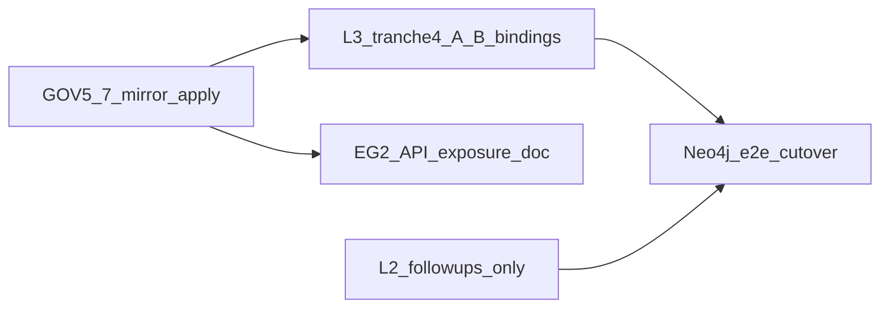

# I95 Round-2 lanes — research synthesis (2026-06-09)

**Initiative:** INIT-OPENCLAW_AKOS-95 (Canonical Articulation Model)  
**Decision batch:** D-IH-95-G (Round-2 lanes), D-IH-95-H (L2/L5 params), D-IH-95-J (GOV-6 plane-1)  
**Evidence base:** master-roadmap, GOV wave reports, L3 tranches 1–3, EG-2 live execution, UAT GOV-8 @ `1bc2d1d`

---

## OPERATOR_CLI_COMMANDS

### Step 0 — Read-only discover

```powershell
cd c:\Users\Shadow\cd_shadow\openclaw-akos

# Ledger parity — Local and Remote must match before push
npx supabase migration list --linked

# Confirm GOV-7 tables absent OR empty pre-push (MCP list_tables or):
npx supabase db query --linked --output table "
SELECT table_name
FROM information_schema.tables
WHERE table_schema = 'compliance'
  AND table_name IN (
    'pricing_tier_registry_mirror',
    'finops_performance_obligation_registry_mirror',
    'finops_tax_calendar_mirror',
    'data_contract_registry_mirror',
    'rpa_adapter_registry_mirror',
    'component_service_matrix_mirror'
  )
ORDER BY 1;"
```

### Step 1 — Phase B DDL push (GOV-7 four migrations)

```powershell
cd c:\Users\Shadow\cd_shadow\openclaw-akos
npx supabase db push --linked
```

### Step 2 — Emit mirror DML from git CSVs

```powershell
cd c:\Users\Shadow\cd_shadow\openclaw-akos
py scripts/verify.py compliance_mirror_emit
```

```powershell
py scripts/sync_compliance_mirrors_from_csv.py --pricing-tier-registry-only
```

### Step 3 — Apply DML to linked remote

```powershell
gh workflow run supabase-mirror-sync.yml -f apply=true
```

```powershell
# After emitting a scoped SQL file to artifacts/sql/
npx supabase db query --linked --file artifacts/sql/<scoped-upsert>.sql
```

### Step 4 — Row-count parity verification

```powershell
py scripts/validate_mirror_emit_contract.py
```

```powershell
npx supabase db query --linked --output table "
SELECT 'pricing_tier' t, count(*)::int n FROM compliance.pricing_tier_registry_mirror
UNION ALL SELECT 'finops_perf_obl', count(*)::int FROM compliance.finops_performance_obligation_registry_mirror
UNION ALL SELECT 'finops_tax', count(*)::int FROM compliance.finops_tax_calendar_mirror
UNION ALL SELECT 'data_contract', count(*)::int FROM compliance.data_contract_registry_mirror
UNION ALL SELECT 'rpa_adapter', count(*)::int FROM compliance.rpa_adapter_registry_mirror
UNION ALL SELECT 'component_svc', count(*)::int FROM compliance.component_service_matrix_mirror
UNION ALL SELECT 'engagement_tpl', count(*)::int FROM compliance.engagement_template_registry_mirror
UNION ALL SELECT 'engagement_reg', count(*)::int FROM compliance.engagement_registry_mirror
UNION ALL SELECT 'output_type', count(*)::int FROM compliance.output_type_registry_mirror
UNION ALL SELECT 'artifact_class', count(*)::int FROM compliance.artifact_class_registry_mirror
UNION ALL SELECT 'component_prim', count(*)::int FROM compliance.component_primitive_registry_mirror
UNION ALL SELECT 'crm_adapter', count(*)::int FROM compliance.crm_adapter_registry_mirror
UNION ALL SELECT 'rpa_adapter_gov5', count(*)::int FROM compliance.rpa_adapter_registry_mirror;"
```

```powershell
py scripts/probe_compliance_mirror_drift.py --emit-sql
# apply SELECT bundle via MCP or db query --linked
py scripts/probe_compliance_mirror_drift.py --verify
```

---

## Lane 1 — L1 Supabase EG-2..5

### Current state

- **EG-1 (done @ ratification):** `SUPABASE_MODULE_REGISTRY.csv` (27 modules: 9 governed / 7 partial / 11 ungoverned) + `SUPABASE_ECOSYSTEM_GOVERNANCE.md` + `validate_supabase_module_registry.py`.
- **EG-2 (partially live, 2026-06-07):** Three migrations applied to MasterData — drop 10 dead `public.*` test/dupe tables; RLS deny-by-default on 13 survivors; enable RLS on `kirbe.kirbe_organizations`. Critical `rls_disabled` 16→0. Evidence: `reports/supabase-eg2-execution-2026-06-07.md`.
- **EG-2 (still open):** `SUPABASE_API_EXPOSURE.md` (SUPA-MOD-24 — PostgREST config vs hosted drift: hosted exposes `holistika_ops`+`finops`; `config.toml` lists `public` only). Residual ~24 `public.*` survivors + ~32 `kirbe.*` app-owned tables (reference-only per module registry).
- **EG-3..5 (not minted):** Edge-function registry, cron registry, extension manifest (EG-3); RLS posture doc + validator (EG-4); FDW/`stripe_gtm` reconcile + Realtime/Storage/Vault posture (EG-5).

### Evidence

| Module | Status | Gap |
|:---|:---|:---|
| SUPA-MOD-09 public legacy | governed (post-drop) | ~24 survivors remain |
| SUPA-MOD-22 Auth | ungoverned | critical |
| SUPA-MOD-24 API exposure | ungoverned | critical — no SSOT doc |
| SUPA-MOD-11/14/15/19 Edge/cron/ext | partial/ungoverned | no registries |
| SUPA-MOD-18 RLS system | partial | adapter/collab mirror policy gaps |
| SUPA-MOD-08/16 FDW | partial | live-only DDL |

**Migration inventory (I95-tagged):** `20260607191541` (drop legacy), `20260607191554` (RLS public), `20260607191652` (kirbe org RLS), plus D-IH-95-H mirror pre-steps (`20260607220031`, `20260607220044`, etc.).

**Operator DDL gate:** Discover → SQL proposal → operator approval in decision-log → promote to `supabase/migrations/` → `migration list` parity → `db push`. Mirror DML is separate (walkthrough Steps 0–4 above).

### Options

| Option | Scope | Effort | Risk |
|:---|:---|:---|:---|
| **A (recommended)** | Finish EG-2 doc-only: mint `SUPABASE_API_EXPOSURE.md` + reconcile `config.toml` vs hosted (no DDL) | Low | Low |
| **B** | EG-3 mint: three CSV/manifest registries for Edge/cron/extensions | Medium | Low (git-only) |
| **C** | EG-4 validator: fail RLS-enabled-without-policy | Medium | Medium — may surface many findings |
| **D** | Defer EG-5 FDW until after GOV-5/7 mirror apply completes | None now | Drift continues on FDW |

### Recommended default

**A then B** — close the critical ungoverned API-exposure gap in git first; registries next. Do not drop more legacy tables without a fresh MCP inventory + operator sign-off (data-loss gate).

### Dependencies

- GOV-5/7 prod mirror apply (pending operator) before trusting T2 parity for new mirrors.
- `SUPABASE_DB_URL` secret for CI mirror auto-apply (`OPS-95-1`).

### Verification gates

- `py scripts/validate_supabase_module_registry.py`
- `py scripts/validate_hlk.py`
- Post-DDL: MCP `get_advisors` (security)
- `npx supabase migration list --linked` (ledger parity)

### Operator gates

- Any further **DROP TABLE** / **RLS policy** change = mandatory SQL proposal + explicit approval (SOC + data-loss).

---

## Lane 2 — L2 Capability de-densify (D-IH-95-H, D-IH-95-I)

> **STALE SECTION CORRECTED @ 2026-06-09.** This lane **completed** 2026-06-08 (D-IH-95-I). The 1,119-row figure below was accurate at first-pass synthesis mint; current SSOT is **93 capabilities**. Full audit: [`i95-l2-state-audit-2026-06-09.md`](i95-l2-state-audit-2026-06-09.md).

### Current state (post-execution @ 2026-06-08)

- **Registry:** `CAPABILITY_REGISTRY.csv` — **93 rows** (1,119 → 93 collapse COMPLETE).
- **Foundation schema DONE:** `bearer_class` removed; `l1_domain` + `definition` + `capability_tier` on CSV + mirror DDL [`20260608002412_i95_i_capability_registry_mirror_collapse_schema.sql`](../../../../supabase/migrations/20260608002412_i95_i_capability_registry_mirror_collapse_schema.sql).
- **D+F+L pilot DONE:** 11 Data/Finance/Legal capabilities (was 44 shadows).
- **All area slices DONE:** Marketing, Research, People, Operations, Tech collapsed in same wave.
- **`process_list` cleanup DONE:** 496 processes; `BUILDOUT_BACKLOG.csv` 583 rows.
- **Evictions DONE:** tools→substrate, code-symbols→component matrix (per decision log).

### Remaining follow-ups (not re-collapse)

| Item | Status |
|:---|:---|
| Hybrid weekly-cron capability rating (~8/wk, D-IH-95-H) | **PENDING** |
| TRP-014 (capability composition) promotion | **PENDING** |
| `bearer_class` on realization edge (Neo4j, not CSV) | **PENDING** — Neo4j lane |
| Prod mirror re-emit (`process_list` + `buildout_backlog`) | **PENDING-OPERATOR** |
| 8-area articulation orphan burn-down (`--matrix` AMBER→GREEN) | **PENDING** |

### Recommended default (Round-2 post-ratification)

**Skip collapse re-execution.** L2 slot = follow-ups only: mirror apply → rating cadence charter → TRP-014 → graph bearer edge (with Neo4j).

### Verification gates (audit — no CSV rewrite unless drift)

- `py scripts/validate_hlk.py`
- `py scripts/validate_area_completeness.py --matrix`
- `py scripts/validate_canonical_articulation.py`
- `py scripts/validate_mirror_emit_contract.py` (post mirror sync)

### Operator gates

- **No canonical-CSV approval** needed for collapse (already executed).
- Mirror re-emit + any new CSV edits still require operator walkthrough / gate per baseline governance.

---

## Lane 3 — L3 FK→verb tranche-4+ (R2-05)

### Current state

- **`L3_FK_BINDINGS`:** 22 tuples across tranches 1–3 (10 + 8 + 4).
- **Active triples in registry:** 38 of 60; remainder `planned` (non-CSV / forward-charter surfaces).
- **TRP-030 / TRP-036:** ratified **keep planned** @ 2026-06-09 (`l3-trp-030-036-ratification-2026-06-09.md`).

### TRP-030 / TRP-036 blockers

| Triple | Blocker | Unblock path |
|:---|:---|:---|
| **TRP-030** (AIC assignment→process) | `AIC_CAPABILITY_IMPLEMENTATION_MATRIX.csv` has only `capability_id` + `aic_id` (2 rows); **TRP-038** already covers AIC→capability | Mint `process_item_id` (or dedicated AIC↔process register) + operator CSV gate |
| **TRP-036** (initiative composition→workstream) | `INITIATIVE_REGISTRY` has `program_anchors` only; no workstream FK; link is narrative via `process_list` layers | Mint initiative→workstream anchor column OR charter FK column |

### Tranche-4 candidates (ranked by FK evidence readiness)

| Rank | Triple(s) | FK column evidence | Registry | Readiness |
|:---|:---|:---|:---|:---:|
| 1 | TRP-038 | `aic_capability_implementation_matrix.capability_id`, `.aic_id` | 2 populated rows | **Ready** — active triple, not yet in `L3_FK_BINDINGS` |
| 2 | TRP-045–047 | `data_contract_registry.producer_process_id`, `.consumer_area_ids`, `.data_surface` | 14 rows (GOV-7) | **Ready** — high articulation value |
| 3 | TRP-021 | `topic_registry.parent` | 58 topics post-L5 | **Ready** |
| 4 | TRP-015 | `initiative_registry.program_anchors` | populated | **Ready** |
| 5 | TRP-028 / TRP-037 | `skill_registry.owner_role` | skill registry | **Ready** (inverse views) |
| 6 | TRP-026 | `metrics_registry.source_contract_id` | metrics registry | **Ready** |
| 7 | TRP-043–044 | `goi_poi_register.process_item_id`, `.program_id` | GOI/POI | **Ready** |
| 8 | TRP-012 | `engagement_registry.counterparty_org_id` | engagement reg | **Ready** |
| 9 | TRP-029, TRP-042 | `use_case_archive.capability_id`, `.engagement_id` | use-case archive | **Ready** (lower row count) |
| 10 | TRP-048–050 | BI consumer / area_bi_profile columns | partial validator map | **Medium** — verify column SSOT |
| — | TRP-030 | `new` | — | **Blocked** |
| — | TRP-036 | paths documented, no initiative FK | — | **Blocked** |

### Options

| Option | Scope | Effort | Risk |
|:---|:---|:---|:---|
| **A (recommended)** | Tranche-4: TRP-038 + data-contract cluster (045–047) + topic parent (021) — ~8–12 new bindings | Low–medium | Low — additive |
| **B** | Tranche-4: engagement + initiative + GOI/POI cluster only | Medium | Low |
| **C** | Attempt TRP-030 promotion with indirect path only (no new FK) | Low | **High** — violates FK evidence bar; validator rejects `new` on active |
| **D** | Mint TRP-030 FK surface + TRP-036 initiative column in same tranche | High | Medium — two canonical CSV gates |

### Recommended default

**A** — highest articulation value with concrete columns; defer blocked triples to dedicated CSV-gate tranche.

### Verification gates

- `py scripts/validate_fk_verb_coverage.py`
- `py scripts/validate_canonical_articulation.py`
- `py scripts/validate_hlk.py`

### Operator gates

- TRP-030/036 promotion requires **new CSV columns** → canonical CSV gate.
- HCAM registry changes are **git-only** (no compliance mirror emit for relationship registry).

---

## Lane 4 — HCAM P2 Neo4j unify (D-IH-95-C)

### Current state

- **Delivered (additive, no live mutation):** `akos/hlk_graph_articulation.py` — 13 legacy edges → 6 unified verb-edges; `COMPETENCY_QUESTIONS` Cypher specs; `assert_edge_coverage()`.
- **Live projection untouched:** `akos/hlk_graph_model.py`, `sync_hlk_neo4j.py`, parity counts — per I91 preflight block.
- **Keep-alive:** `.github/workflows/neo4j-aura-keepalive.yml` (R2-09 executed); needs `NEO4J_*` secrets.

### Ready without Neo4j credentials

| Work | Command / artifact |
|:---|:---|
| Edge coverage proof | `py -c "from akos.hlk_graph_articulation import assert_edge_coverage; assert_edge_coverage()"` |
| HCAM validator | `py scripts/validate_canonical_articulation.py` |
| Unit tests | `py -m pytest tests/test_validate_canonical_articulation.py` |
| Competency query specs | `COMPETENCY_QUESTIONS` in `hlk_graph_articulation.py` (not executed) |
| Dual-emit code design | Gated — requires I91 unblock |

### Gated on Neo4j creds + Semantic Council

- Live edge rename / dual-emit cycle
- Running CQ1–CQ5 against live graph
- `sync_hlk_neo4j.py` unified mode
- Graph MCP / explorer consumer flip

### Options

| Option | Description | Effort | Risk |
|:---|:---|:---|:---|
| **A (recommended)** | Credential-free: wire CQ specs into validator self-test; document cutover checklist only | Low | None |
| **B** | Set `NEO4J_*` secrets + run dual-emit one cycle | Medium | Medium — production graph mutation |
| **C** | Defer all graph work until L3 tranche-4+ raises triple activation % | None | CQ answers stay spec-only |
| **D** | Full cutover now | High | **High** — violates D-IH-95-F / Council gate |

### Recommended default

**A** now; **B** only after operator sets secrets and ratifies cutover.

### Verification gates

- `assert_edge_coverage()` (13→6)
- `validate_canonical_articulation.py`
- Post-cutover: CQ1–CQ5 green on live Neo4j

---

## Lane 5 — Hygiene

### 5a Charter 74 vs registry 73 row count

**Root cause:** Universal governance charter (`universal-canonical-governance-charter-2026-06-09.md`) was authored with a **planning estimate of 74 vault CSVs**. GOV-1 filesystem inventory found **73** (41 People/Compliance + 32 sibling-area). Registry seeded 1:1 with filesystem (`synthesis-p95-gov-1-2026-06-09.md`).

**Not a validator failure** — mechanical SSOT is 73; charter prose is stale by +1.

| Remediation | Effort | Risk |
|:---|:---|:---|
| **A (recommended):** Amend charter §1/§2 to **73**; add footnote "inventory @ GOV-1 mint" | Trivial | None |
| **B:** Find missing CSV if a 74th file should exist (re-scan vault) | Low | May discover orphan file |
| **C:** Add placeholder registry row for forward-charter CSV | Low | **Bad** — invents phantom asset |

### 5b COLLABORATOR_SHARE `--strict` from GOV-6

**Root cause (gate posture):** Operator mandated INFO→FAIL ramp in P95-GOV-6 (`D-IH-95-J`). `validate_hlk.py` now invokes `validate_collaborator_share.py --strict`, so CS-04/CS-05/CS-06 WARN-class findings **fail the HLK umbrella** (previously INFO-only advisory).

**Root cause (underlying hygiene — separate):** Operator scratchpad (*"COLLABORATOR_SHARE doesn't reflect reality… accuracy mess"*, intent-ranked regression IT-3) — **commercial accuracy / engagement coverage debt**, not necessarily current validator failure.

**Current mechanical state @ GOV-8:** `validate_hlk.py` OVERALL PASS; GOV-6 synthesis records `--strict` PASS. The ramp is **armed** — future CSV drift on share registers will fail CI immediately.

| Remediation | Effort | Risk |
|:---|:---|:---|
| **A (recommended):** Keep strict; track commercial accuracy as **OPS/deferred-work** until settlement tranche refreshes all 5 CSVs | Low ongoing | Strict gate stays armed |
| **B:** Run `py scripts/validate_collaborator_share.py --strict` and fix any CS-04/06 findings row-by-row | Medium | Touches canonical CSVs |
| **C:** Revert `--strict` in umbrella to INFO | Trivial | **Rejected** — contradicts D-IH-95-J |
| **D:** Add engagement-by-engagement accuracy audit (manual) before next share row mint | High | Correctness, not mechanical |

---

## Cross-lane sequencing (recommended — updated post L2 audit)



1. **Operator:** mirror apply walkthrough Steps 0–4 (unblocks T2 parity).
2. **L3 tranche-4 A+B:** parallel research → single bindings commit (~15–17 tuples); TRP-030/036 stays CSV-gate charter only.
3. **L1 EG-2:** `SUPABASE_API_EXPOSURE.md` + `config.toml` reconcile.
4. **L2 follow-ups only** (collapse DONE @ 2026-06-08): rating cadence, TRP-014, mirror backlog — **not** re-collapse.
5. **Last:** Neo4j dual-emit e2e (credentials + Council + CQ1–5).

Deep charters: [`i95-round2-operator-ratification-2026-06-09.md`](i95-round2-operator-ratification-2026-06-09.md), [`i95-l3-parallel-bundles-charter-2026-06-09.md`](i95-l3-parallel-bundles-charter-2026-06-09.md), [`i95-neo4j-e2e-cutover-charter-2026-06-09.md`](i95-neo4j-e2e-cutover-charter-2026-06-09.md).
