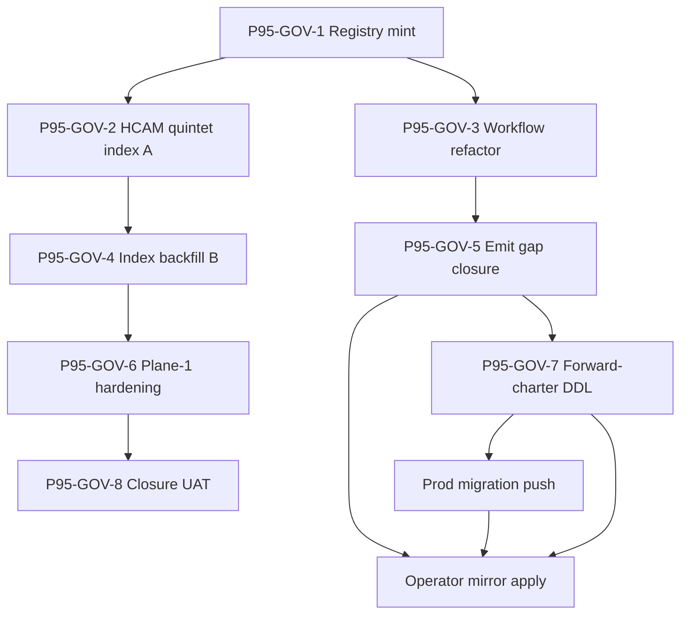
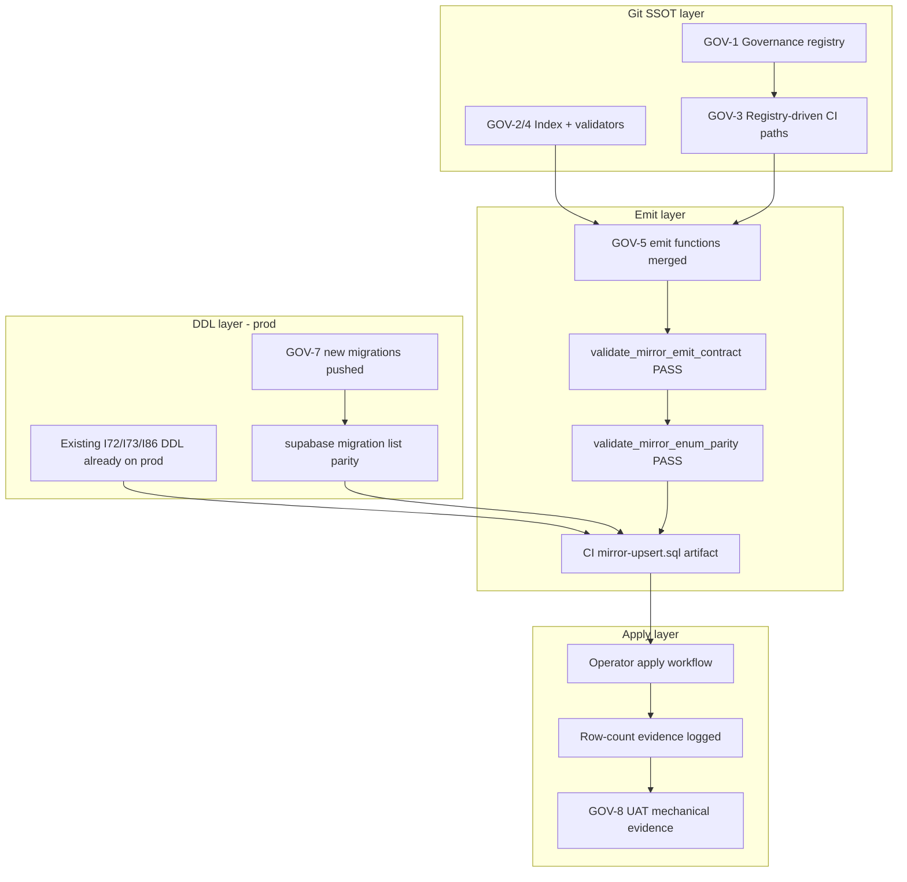

# P95-GOV packets 2–8 — unified execution wave (thinking seat)

**Prerequisite (blocking):** `CANONICAL_GOVERNANCE_REGISTRY.csv` and its validator do **not** exist in the repo yet — only in the charter. Packet **P95-GOV-1** must land before any packet below. This plan assumes GOV-1 completes first.

**Operator mandate applied:** no deferrals; HCAM = T1 git + Neo4j T3 only; collaborator-share validator → FAIL in GOV-6; Finance + RPA + adapters + engagement-template all in scope; CSV path moves OUT.

---

## 1. Per-area research (charter §2 + repo evidence)

### People/Compliance + People Ops

| Finding | Evidence |
|:---|:---|
| Plane-1 | Strong — umbrella validators on most Compliance CSVs |
| Plane-2 emit | Main bundle ends at IntelligenceOps; gap-splice for capability/AIC/audience; **collaborator-share** via `--collaborator-share-only` only |
| Emit-contract | Hardcoded **10** Compliance-relative tables in `validate_mirror_emit_contract.py` — sibling-area CSV changes do not trigger CI |
| ENGAGEMENT_REGISTRY | DDL `compliance.engagement_registry_mirror` exists; **no emit function** in `sync_compliance_mirrors_from_csv.py` (only `engagement_model` emits) |
| Output architecture (3 layers) | Emit exists via scoped flags (`--output-type-registry-only`, etc.) — **not** in main CI txn |
| COLLABORATOR_SHARE | 5 mirrors + emit kit wired; `validate_hlk.py` runs **without `--strict`** (INFO advisory); operator mandates **FAIL in GOV-6** |
| PRECEDENCE | Broad coverage; CS siblings partially indexed in CANONICAL_REGISTRY |
| Validator gaps | None critical beyond CS FAIL ramp |

### People/Learning

| Finding | Evidence |
|:---|:---|
| `LEARNING_OPS_BACKLOG.csv` | Plane-1 **none** — deferred at I73; no `validate_learning_ops_backlog.py` |
| PRECEDENCE | **N** — not in prose table |
| CANONICAL_REGISTRY | **N** — not indexed |
| Mirror | None (git-only by design) |

### Data/Architecture + Data/Governance

| Finding | Evidence |
|:---|:---|
| HCAM pair (`ENTITY_CATALOG`, `CANONICAL_RELATIONSHIP_REGISTRY`) | Validators PASS via `validate_canonical_articulation.py`; **PRECEDENCE N**, **CANONICAL_REGISTRY N** |
| `METRICS_REGISTRY`, `DATA_CONTRACT_REGISTRY` | PRECEDENCE **Y**; validators wired |
| `SUPABASE_MODULE_REGISTRY` | Validator wired; **PRECEDENCE N**, **CANONICAL_REGISTRY N** |
| `RPA_ADAPTER_REGISTRY` | Validator via `validate_adapter_registries.py`; PRECEDENCE **Y**; **no mirror DDL** (9th adapter class) |
| DATA_CONTRACT | Forward-charter in doctrine; **no DDL** |
| HCAM Plane-2 | **n/a** — graph projection only (operator: no compliance mirror) |

### Finance/Governance

| Finding | Evidence |
|:---|:---|
| Three CSVs (`PRICING_TIER`, `FINOPS_TAX_CALENDAR`, `FINOPS_PERFORMANCE_OBLIGATION`) | `validate_hlk.py` wired |
| PRECEDENCE | **N** for all three (charter correct) |
| CANONICAL_REGISTRY | **Y** for pricing + tax (added ~2026-06-05); performance obligation may need row |
| Plane-2 | **none** — forward-charter targets for GOV-7 |
| Counterparty SSOT | Stays Compliance `finops/` (cross-area split intentional) |

### Marketing/Reach + Experimentation

| Finding | Evidence |
|:---|:---|
| 8 adapter mirrors | DDL in `20260514260000_i72_adapter_registries_mirrors.sql` |
| Emit | **Zero** adapter emit functions in `sync_compliance_mirrors_from_csv.py` |
| Plane-1 | Umbrella `ADAPTER_REGISTRIES` / `validate_adapter_registries.py` |
| PRECEDENCE | **Y** for Reach 4 + Attribution |
| CI path filter | Workflow hardcoded to Compliance folder only — sibling adapter CSV edits **do not** trigger mirror-sync |

### Operations/RevOps + SMO

| Finding | Evidence |
|:---|:---|
| `ENGAGEMENT_TEMPLATE_REGISTRY` | DDL `engagement_template_registry_mirror`; **no emit** |
| RevOps/Billing adapters | DDL present; **no emit** |
| `SERVICE_CATALOG.csv` | Operational SSOT (5 services); **no validator**, **PREC N**, **CANONICAL_REGISTRY N** |
| `CONTRACT_ADAPTER` | DDL + validator; **no emit** |

### Research/Intelligence

| Finding | Evidence |
|:---|:---|
| `INTELLIGENCEOPS_REGISTER` | End-to-end: validator + mirror + main-bundle emit |
| Radar freshness cols | Prod migration parity noted in charter — verify at GOV-5 apply |
| PRECEDENCE / index | **Y** |

### Envoy Tech Lab

| Finding | Evidence |
|:---|:---|
| `MADEIRA_*` CSVs | Validators in **release-gate only** (`validate_madeira_tool_rbac.py --strict`, etc.) — **not** `validate_hlk.py` dispatch |
| `RENDERING_PIPELINE_REGISTRY` | In `validate_hlk.py`; in CANONICAL_REGISTRY; **PRECEDENCE partial** (charter: rendering indexed, MADEIRA partial) |
| Path split | Registry at `Envoy Tech Lab/canonicals/` — workflow paths must be explicit per row |

### Systemic finding (confirmed)

**DDL-without-emit surfaces for GOV-5:** 8 adapter mirrors + `engagement_template_registry_mirror`. Per “fix everything,” also wire **`engagement_registry_mirror`** (DDL + CANONICAL_REGISTRY row, no emit) and promote **output-architecture 3 mirrors** from scoped flags into registry-driven `active` profile.

---

## 2. Unified commit sequence (packets 2–8, no skipped packets)



| Commit | Packet | Scope (binding) | Synthesis pre-commit | Operator gate |
|:---:|:---|:---|:---:|:---:|
| **C1** | P95-GOV-2 | PRECEDENCE §3.1 rows; CANONICAL_REGISTRY §3.2 (5 rows); governance-registry FK + `precedence_registered=true` | Yes (`canonical_csv_mint`) | **Yes** — canonical CSV mint |
| **C2** | P95-GOV-3 | Registry-driven `validate_mirror_emit_contract.py` + `supabase-mirror-sync.yml` path union; drift check step; tests | No | No |
| **C3** | P95-GOV-4 | PRECEDENCE + CANONICAL_REGISTRY for Finance (3), Learning, SMO SERVICE_CATALOG, SUPABASE_MODULE, Envoy gaps; mint `validate_service_catalog.py` + `validate_learning_ops_backlog.py` + Pydantic modules + tests; optional `process_list` rows if SOP pairing required | Yes | **Yes** |
| **C4** | P95-GOV-5 | Generic adapter emit (8 tables) + engagement_template + **engagement_registry** + output-architecture 3 into main/gap profile; registry `plane2_sync_policy=active`; tests `tests/test_sync_compliance_mirrors_from_csv.py` | Yes | **Yes** — prod DDL confirm + mirror apply |
| **C5** | P95-GOV-6 | All 74 rows `plane1_in_validate_hlk=true`; MADEIRA validators into `validate_hlk.py`; **COLLABORATOR_SHARE `--strict` FAIL**; mint `D-IH-95-*` FAIL-ramp decision; `release-gate.py` / `verification-profiles.json` alignment | No | Inline-ratify at execution (evidence-only; operator already mandated FAIL) |
| **C6** | P95-GOV-7 | **Four DDL families:** Finance (3 finops mirrors), `DATA_CONTRACT`, `RPA_ADAPTER`, `COMPONENT_SERVICE_MATRIX`; migrations + emit + registry columns + `validate_compliance_schema_drift.py` registry + PRECEDENCE mirror rows; operator SQL gate report | Yes | **Mandatory** DDL + CSV |
| **C7** | P95-GOV-8 | Closure UAT `reports/uat-universal-canonical-governance-2026-06-09.md`; `validate_area_completeness.py --matrix`; inter-wave DIM-4; full `pre_commit`; Neo4j parity spot-check | No | Closure sign-off |

**Verification profile per commit:** every commit runs `py scripts/verify.py pre_commit_fast`; C5+C7 add full `pre_commit` + `release-gate.py` where charter specifies.

---

## 3. Bounded executor packets (file estimates)

### Packet P95-GOV-2 — HCAM quintet + index backfill A (~8–12 files)

| Touch | Paths |
|:---|:---|
| Index | `docs/.../PRECEDENCE.md`, `docs/.../CANONICAL_REGISTRY.csv`, `CANONICAL_GOVERNANCE_REGISTRY.csv` (5 FK updates) |
| Docs sync | `docs/ARCHITECTURE.md`, `docs/USER_GUIDE.md` (HCAM/graph-projection note) |
| Decision | `DECISION_REGISTER.csv` row `D-IH-95-I` (or next suffix) for Option B index tranche |
| Reports | `reports/synthesis-p95-gov-2-2026-06-09.md` |
| **Validators** | `validate_hlk.py`, `validate_canonical_articulation.py`, `validate_canonical_governance_registry.py` |

**Acceptance:** HCAM surfaces in PRECEDENCE + CANONICAL_REGISTRY; governance registry flags consistent; `pre_commit_fast` PASS.

---

### Packet P95-GOV-3 — Workflow + emit-contract refactor (~10–14 files)

| Touch | Paths |
|:---|:---|
| Workflow | `.github/workflows/supabase-mirror-sync.yml` |
| Scripts | `scripts/validate_mirror_emit_contract.py`, `akos/hlk_canonical_governance_registry_csv.py` (path-union helper) |
| Tests | `tests/test_validate_mirror_emit_contract.py` (new), `tests/test_canonical_governance_registry_paths.py` (new) |
| Config | `config/verification-profiles.json` (if new self-test step) |
| Docs | `docs/guides/holistika-mirror-dml-apply.md` (registry-driven paths note) |

**Acceptance:** Changing `Operations/RevOps/.../ENGAGEMENT_TEMPLATE_REGISTRY.csv` would match workflow `paths:` filter; emit-contract loads active rows from registry.

---

### Packet P95-GOV-4 — Index backfill B (~18–25 files)

| Touch | Paths |
|:---|:---|
| Index | `PRECEDENCE.md`, `CANONICAL_REGISTRY.csv`, `CANONICAL_GOVERNANCE_REGISTRY.csv` |
| New validators | `scripts/validate_service_catalog.py`, `scripts/validate_learning_ops_backlog.py` |
| New Pydantic | `akos/hlk_service_catalog_csv.py`, `akos/hlk_learning_ops_backlog_csv.py` |
| Tests | `tests/test_validate_service_catalog.py`, `tests/test_validate_learning_ops_backlog.py` |
| Umbrella | `scripts/validate_hlk.py` dispatch entries |
| Optional | `process_list.csv` rows for SOP pairing; `docs/USER_GUIDE.md`, `docs/ARCHITECTURE.md` |
| Reports | `synthesis-p95-gov-4-*.md`, inter-wave DIM-4 sweep report |

**Acceptance:** All §2.3 **N** rows closed except forward-charter mirrors (GOV-7); new validators PASS; DIM-4 dispositioned.

---

### Packet P95-GOV-5 — Mirror emit gap closure (~15–22 files)

| Touch | Paths |
|:---|:---|
| Core emit | `scripts/sync_compliance_mirrors_from_csv.py` — `_emit_adapter_registry_upserts()` using `akos/hlk_adapter_registry_csv.py` `REGISTRY_PATHS` + table map |
| Surfaces | 8 `compliance.*_adapter_registry_mirror` + `engagement_template_registry_mirror` + `engagement_registry_mirror` + output-architecture 3 |
| Registry | `CANONICAL_GOVERNANCE_REGISTRY.csv` — `plane2_emit_profile`, `plane2_sync_policy=active` |
| Contract | `validate_mirror_emit_contract.py` — contract rows from registry |
| Tests | `tests/test_sync_compliance_mirrors_from_csv.py` (extend) |
| Drift | `scripts/validate_compliance_schema_drift.py` (if new emit surfaces need registry tuples) |
| Reports | `synthesis-p95-gov-5-*.md`; mirror apply evidence stub |

**Acceptance:** `validate_mirror_emit_contract.py` PASS for all active registry rows; `compliance_mirror_emit` profile PASS; enum parity preflight PASS (when creds present).

---

### Packet P95-GOV-6 — Universal Plane-1 hardening (~12–18 files)

| Touch | Paths |
|:---|:---|
| HLK umbrella | `scripts/validate_hlk.py` — MADEIRA validators + CS `--strict` |
| Registry | `CANONICAL_GOVERNANCE_REGISTRY.csv` — `plane1_in_validate_hlk=true` on all 74 rows |
| Profiles | `config/verification-profiles.json`, `scripts/release-gate.py` (dedupe MADEIRA if now in HLK) |
| Decision | `DECISION_REGISTER.csv` — `D-IH-95-J` collaborator-share FAIL ramp (operator-mandated) |
| Docs | `docs/reference/DEV_VERIFICATION_REFERENCE.md` |
| Reports | `inter_wave_regression_sweep.py --wave-closing P95-GOV-6` |

**Acceptance:** Full `py scripts/verify.py pre_commit` PASS; CS validator FAIL on intentional fixture breach; inter-wave sweep dispositioned.

---

### Packet P95-GOV-7 — Forward-charter mirror DDL (~25–35 files)

| Family | Migration target | CSV SSOT |
|:---|:---|:---|
| Finance | `compliance.pricing_tier_registry_mirror`, `finops_tax_calendar_mirror`, `finops_performance_obligation_mirror` (names per existing finops naming) | `Finance/Governance/canonicals/dimensions/*.csv` |
| Data contract | `compliance.data_contract_registry_mirror` | `DATA_CONTRACT_REGISTRY.csv` |
| RPA | `compliance.rpa_adapter_registry_mirror` | `RPA_ADAPTER_REGISTRY.csv` |
| TechOps | `compliance.component_service_matrix_mirror` | `techops/COMPONENT_SERVICE_MATRIX.csv` |

| Touch | Paths |
|:---|:---|
| DDL | `supabase/migrations/20260609*_p95_gov7_*.sql` (4 migrations or 1 batched — prefer **one commit, multiple migration files** per Holistika ops) |
| Parity map | `supabase/migrations/README.md` |
| Emit | `sync_compliance_mirrors_from_csv.py` + new emit helpers |
| Registry | governance registry `mirror_ddl_migration`, `plane2_sync_policy=active` |
| Index | `PRECEDENCE.md` mirror rows |
| SQL gate | `docs/wip/planning/95-canonical-articulation-model/reports/sql-proposal-p95-gov-7-2026-06-09.md` |
| Validators | `validate_pydantic_mirror_enum_ssot.py`, `validate_mirror_enum_parity.py` |

**Acceptance:** `validate_pydantic_mirror_enum_ssot.py` PASS; emit + enum parity PASS; operator SQL gate report ratified before commit.

---

### Packet P95-GOV-8 — Closure UAT (~6–10 files)

| Touch | Paths |
|:---|:---|
| UAT | `reports/uat-universal-canonical-governance-2026-06-09.md` (11-section template) |
| Evidence | `reports/intent-ranked-regression-2026-06-06.md` refresh if ICS threshold met |
| Initiative | `files-modified.csv` backfill; `CHANGELOG.md`; `master-roadmap.md` GOV wave status |
| Registry | `INITIATIVE_REGISTRY.csv` / `OPS_REGISTER.csv` closure rows if applicable |

**Acceptance:** `validate_uat_report.py` PASS; `validate_area_completeness.py --matrix` no Data/Finance/People regression; full `pre_commit` + `release-gate.py` PASS.

---

## 4. AskQuestion

### **No AskQuestion needed** (max 0 of 2)

| Former charter deferral (§10) | Resolution from evidence + operator mandate |
|:---|:---|
| RPA mirror now vs later | **In GOV-7** — operator: “Finance + RPA + adapters … all in scope” |
| Finance plane-2 timing | **All three Finance CSVs in GOV-7** — not pricing-only |
| COMPONENT_SERVICE_MATRIX mirror | **GOV-7** — operator included in forward-charter DDL list |
| HCAM T2 exception | **Permanent graph-only** — operator: “HCAM stays T1+Neo4j” |
| COLLABORATOR_SHARE FAIL ramp | **GOV-6** — operator: “→ FAIL in P95-GOV-6”, not deferred |
| CSV path moves | **OUT OF SCOPE** — operator explicit |

**ENGAGEMENT_REGISTRY emit** and **output-architecture main-bundle promotion** are not ambiguous under “fix everything” — include in GOV-5 extended scope without ratification.

---

## 5. Risk-ordered dependency graph — mirror apply to production

Apply order (what must land before `gh workflow run supabase-mirror-sync.yml -f apply=true`):



**Risk ordering (highest first):**

1. **R95-GOV-05 — Prod DDL lag** — GOV-5 apply blocked until I72 engagement-template + adapter DDL confirmed on prod (read-only MCP/SQL inventory first).
2. **R95-GOV-02 — Enum parity FAIL** — any GOV-5/GOV-7 emit must run `validate_pydantic_mirror_enum_ssot.py` before migration + `validate_mirror_enum_parity.py` before apply.
3. **R95-GOV-01 — CI breakage** — GOV-3 path union needs max-size guard; test with `pre_commit_fast` every commit.
4. **R95-GOV-03 — Forward-charter without DDL** — registry `plane2_sync_policy=active` only when `mirror_ddl_migration` populated (GOV-7 gate).
5. **R95-GOV-07 — Umbrella validators hide gaps** — GOV-6 per-CSV registry rows + GOV-5 per-table emit contracts.

**Two-phase mirror apply strategy:**

- **Phase A (after GOV-5):** apply existing DDL surfaces (adapters, templates, engagement_registry, output-arch).
- **Phase B (after GOV-7 + `db push`):** apply Finance/RPA/DATA_CONTRACT/COMPONENT_SERVICE_MATRIX mirrors.

---

## 6. Charter corrections for executor

| Charter line | Evidence-based correction |
|:---|:---|
| “9 adapter mirrors” in GOV-5 | **8** have DDL today; **9th (RPA)** is GOV-7. GOV-5 = 8 adapters + template + engagement_registry + output-arch (extended). |
| GOV-7 “optional” | **Mandatory** per operator — not PWF-skipped at closure. |
| GOV-8 prereq “GOV-1..6” | **GOV-7 required** before closure PASS (operator: fix everything). |

---

```
=== BRAINSTORM DONE — operator review optional ===

Ready:
- Per-area emit/DDL/validator/PRECEDENCE matrix confirmed against repo
- Seven-commit wave plan (GOV-2..8) with extended GOV-5 scope
- No AskQuestion (operator mandate resolves all charter §10 deferrals)
- Risk-ordered prod mirror-apply dependency graph

Packets (run in order):
0. P95-GOV-1 — Registry mint (BLOCKER — not in repo yet)
1. P95-GOV-2 — HCAM quintet index backfill A
2. P95-GOV-3 — Registry-driven workflow + emit-contract
3. P95-GOV-4 — Index backfill B + SERVICE_CATALOG + LEARNING validators
4. P95-GOV-5 — Emit closure (8 adapters + template + engagement_registry + output-arch)
5. P95-GOV-6 — Plane-1 hardening + COLLABORATOR_SHARE FAIL
6. P95-GOV-7 — Forward-charter DDL (Finance×3, DATA_CONTRACT, RPA, COMPONENT_SERVICE_MATRIX)
7. P95-GOV-8 — Closure UAT + area matrix re-proof

Hard gates todo-#1:
- P95-GOV-1 + P95-GOV-2 + P95-GOV-4 + P95-GOV-7 canonical CSV / DDL operator gates

Stop-and-report contract:
- Validator FAIL / ambiguity → halt; cite path + line; no silent defaults.

Operator: switch to execution seat (Composer 2.5), complete P95-GOV-1 if not landed, then invoke `.cursor/agents/executor.md` with packet 2.
```

```
=== OPUS DONE -> SWITCH TO COMPOSER ===

Ready:
- P95-GOV 2–8 wave plan drafted with per-area evidence, seven phase commits, extended GOV-5 emit scope, and prod mirror-apply dependency ordering

Packets (run in order):
0. P95-GOV-1 — Registry mint (prerequisite; not in repo)
1. P95-GOV-2 — HCAM quintet index backfill A
2. P95-GOV-3 — Registry-driven workflow refactor
3. P95-GOV-4 — Index backfill B + new validators
4. P95-GOV-5 — DDL-without-emit closure (extended)
5. P95-GOV-6 — Plane-1 hardening + CS FAIL
6. P95-GOV-7 — Forward-charter mirror DDL (mandatory)
7. P95-GOV-8 — Closure UAT

Hard gates todo-#1:
- P95-GOV-1 + P95-GOV-2 + P95-GOV-4 + P95-GOV-7 operator approval gates

Stop-and-report contract:
- Validator FAIL / ambiguity → halt; cite path + line; no silent defaults.

Operator: switch to execution seat (Composer 2.5) or fresh Composer thread, then
invoke `.cursor/agents/executor.md` with packet 1 (if needed) then packet 2.
```

[REDACTED]