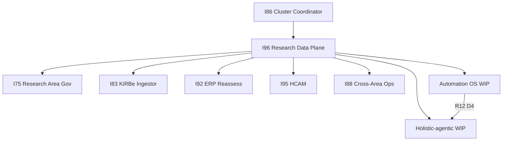

# I96 initiative cluster map

## Diagram

## Table

| ID | I96 consumes | I96 produces |
|:---|:---|:---|
| **I86** | Cluster burndown cadence | Program-line tracking row |
| **I75** | Research area SOP buildout | Radar queue panel semantics |
| **I83** | KiRBe ingest implementation | `ledger-to-vault-ingest-contract.md` |
| **I92** | ERP shell + MC lineage | Research Center v1 route |
| **I95** | HCAM verbs, area SSOT sweep hook | Field mapping for graph edges |
| **I99** | Supabase Auth EG-5, SMTP, inbox tiers | Auth redirect + email tranche (P2); I96 consumer |
| **I88** | Research OPS 10-pillar lens | Data-consumer inventory (OPS-86-29) |
| **AUTO** | R7–R12 charter | 950-row ledger + D4 |
| **HOL** | D4 unblock | R4–R12 resume tracking |

## Research WIP lanes (linked, not duplicated)

- [`akos-automation-os-governance-2026-06-10/`](../../intelligence/akos-automation-os-governance-2026-06-10/)
- [`holistic-agentic-capability-orchestration-2026-06-10/`](../../intelligence/holistic-agentic-capability-orchestration-2026-06-10/)

Steering file: [`session-recap-2026-06-10.md`](../../intelligence/akos-automation-os-governance-2026-06-10/session-recap-2026-06-10.md) (`parent_initiative: INIT-OPENCLAW_AKOS-96`).
