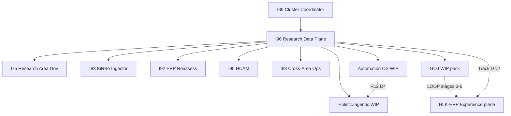

# I96 — SSOT promotion path (GOJ / prong / journey / page spec / Figma)

> **Purpose:** Coordinator packet for promoting the governed operator journey research pack (GOJ — the research topic that binds UX disposition, prong tagging, and the Research Center LOOP) from WIP intelligence into vault + registry surfaces without speculative canonical CSV mint. Maps I96 cluster lineage under I86, the three-plane stack, OPS Register treatment, operator P9b Gate A/B/C ratifications, Gate B × IF-09 resolution, and the five-rung promotion ladder (0–4).

## Three-plane stack (I96 program frame)

Holistika research work flows through three planes. Each plane has a single system of record; mirrors and BFFs are read paths, not competing authorities.

| Plane | System | Role |
|:---|:---|:---|
| **Govern** | AKOS (git) | Canon, ledgers, radar, disciplines, SSOT registries |
| **Execute** | KiRBe | Ingest, hybrid search, embeddings |
| **Experience** | HLK-ERP | Research Center at `/research-center` |

Detail: [`three-plane-architecture.md`](../three-plane-architecture.md).

## I96 cluster lineage (under I86)



### Sibling initiatives table

| Initiative | Relationship | I96 consumes | I96 produces |
|:---|:---|:---|:---|
| **I86** | Parent cluster coordinator | Cluster burndown cadence | Program-line tracking row |
| **I75** | Research area governance | Research area SOP buildout | Radar queue panel semantics |
| **I83** | KiRBe ingest (Track C) | KiRBe ingest implementation | [`ledger-to-vault-ingest-contract.md`](../ledger-to-vault-ingest-contract.md) |
| **I88** | Cross-area ops | Research OPS 10-pillar lens | Data-consumer inventory (OPS-86-29) |
| **I92** | HLK-ERP shell | ERP shell + MC lineage | Research Center v1 route |
| **I95** | HCAM / canonical articulation | HCAM verbs, area SSOT sweep hook | Three-plane field mapping |
| **AUTO** WIP | Automation OS ledger R7–R12 | R7–R12 charter | 950-row ledger + D4 |
| **HOL** WIP | Holistic-agentic R4–R12 | D4 unblock | R4–R12 resume tracking |
| **GOJ WIP** | Governed operator journey pack | 60-row source ledger + prong SSOT | Tier disposition, journey matrix, LOOP spec |
| **HLK-ERP** | Experience plane consumer | Page spec v2 + BFF | `/research-center` v2 UI |

Authoritative cluster file: [`i96-initiative-cluster-map.md`](../i96-initiative-cluster-map.md).

**Four tracks:** A Automation OS ledger · B data-plane specs · C KiRBe ingest · D Research Center (v1 PWF done; v2 insight machine in P8–P11).

## OPS Register treatment

The **OPS Register** (formal name: the operator action tracker in `OPS_REGISTER.csv`) is the **People/Compliance canonical CSV** that records every `OPS-XX-Y` action with RICE scores, owner, status, and forward pointers to initiatives.

| Aspect | Where SSOT lives | Class |
|:---|:---|:---|
| **OPS Register rows** | [`OPS_REGISTER.csv`](../../../references/hlk/v3.0/Admin/O5-1/People/Compliance/canonicals/OPS_REGISTER.csv) | **Canonical** (operator CSV gate) |
| **Operator inbox render** | Derived via `scripts/render_operator_inbox.py` | **Mirrored / derived** |
| **Supabase mirror** | `compliance.ops_register_mirror` | **Mirrored** |

### I96-relevant OPS rows today (no `OPS-96-*` minted yet)

| Row | Functional name | Status | I96 link |
|:---|:---|:---|:---|
| **OPS-86-29** | Research data-consumer / ETL inventory | open | Track B P2 — [`data-consumer-inventory-2026-06-11.md`](data-consumer-inventory-2026-06-11.md) |
| **OPS-86-30** | Multi-channel research-feed delivery | open | Track optional P10 — deferred per D-IH-96-D |
| **OPS-86-26** | Research legacy SSOT migration | closed | Methodology tree under `Research/` |

### Operations area mint rhythm (People → Operations)

1. **People specs first** — cross-area disciplines mint under People (`process_list` row → paired SOP + runbook per executable process catalog discipline).
2. **Operations catalogs** — PMO/SMO processes in `OPERATIONS_PROCESS_CATALOG.yaml`; RevOps adapters in `REVOPS_ADAPTER_REGISTRY.csv`; TECH adapters crosswalked at I96 P4 ([`tech-automation-registry-crosswalk-2026-06-11.md`](tech-automation-registry-crosswalk-2026-06-11.md)) — read-only prep, no CSV mint in this tranche.
3. **SOP-META order** — `process_list.csv` row **before** final v3.0 SOP; operator approval on any canonical CSV tranche.
4. **Four-registry audit** — `PRECEDENCE.md`, `CANONICAL_REGISTRY.csv`, relationship/governance registries when promoting vault doctrine (per SSOT registry audit discipline).

**OPS_REGISTER posture until rung 3:** File **OPS-96-* forward rows** for blocked mints (Figma CSV row, GOJ discipline charter) — do not speculative-promote INITIATIVE_REGISTRY.

## Operator ratifications on record (P9b gates — 2026-06-12)

| Gate | Functional name | Question | Ratified option | Binding effect |
|:---|:---|:---|:---|:---|
| **Gate A** | P9b frame content scope | Which POV frames get matrix copy @1280? | **Option A** — matrix copy on **all five POV @1280** | Figma Phase C + operator ratify must show journey-matrix copy on Director, Operator, Auditor, Finance, Compliance — not remediation-only scaffolds. Decision **D-IH-96-F**. |
| **Gate B** | Live data vs fixture for T2 widgets | How honest is localhost when BFF is partial? | **Option C** — **live-only; NO fixtures** | No `fixture` chips or seeded matrix cards labeled as data; BFF serves live aggregates or omits card types. Decision **D-IH-96-G**. |
| **Gate C** | Prong coverage widget placement | Where does prong discoverability live? | **Option C** — **prong strip on ALL lenses** | Every POV discover row includes prong-coverage widget (live aggregates from prong-fixed ledger). Decision **D-IH-96-H**. |

Source options: [`research-synthesis-journey-ui-2026-06-12.md`](../../../intelligence/governed-operator-journey-ux-uat-2026-06-12/research-synthesis-journey-ui-2026-06-12.md) §Open questions. Gates are **promoted** to I96 [`decision-log.md`](../decision-log.md) and [`operator-check-links-2026-06-12.md`](operator-check-links-2026-06-12.md) — not buried in synthesis alone.

## Gate B × IF-09 resolution (recommended)

**Tension**

- **Gate B (live-only)** forbids fixture-labeled insight cards (visual audit **VIS-B03** also flags `fixture` chips on T0).
- **IF-09** (Impeccable empty-state law in [`p9b-revision-tranche-plan-2026-06-12.md`](p9b-revision-tranche-plan-2026-06-12.md)) requires lens-specific empty states when a rail has no live cards — not a blank rail or generic paragraph.
- **VIS-B01** (visual audit) documents Auditor / Finance / Compliance as **empty insight rails** — a P9b blocker under live-only.

**These are not mutually exclusive.** Gate B bans **fake data cards**; IF-09 requires **real UX for zero-data**.

| Surface | Live-only compliant? | Implementation |
|:---|:---|:---|
| Insight **cards** with `source: fixture` | **No** | Remove fixture chips; BFF returns only live aggregates or omits card type. |
| **Lens-specific empty state** (`LensEmptyState`) | **Yes** | When `cards.length === 0`, render IF-09 component: POV label + plain-language reason + next action ("Switch to Operator lens", "Run research radar sweep", "Open FINOPS recon"). |
| **Prong strip (Gate C)** | **Yes** | Live prong aggregates from prong-fixed ledger / BFF — can show zeros without fabricating card narratives. |
| **Figma Phase C** | **Yes** | Show matrix **copy on cards where designed**, plus **empty-state frame variant** per non-Operator lens (design reference, not fixture data). |

**P9b ratification bar under this resolution:** localhost must show either live cards **or** intentional empty states on every lens — never silent blanks. Figma must mirror both populated and empty-state variants @1280.

## Asset classification table

| Asset | Functional name | Current home | Class | Promotion target |
|:---|:---|:---|:---|:---|
| **Prong lattice (14 BL-* IDs)** | Research prong lattice discipline | [`RESEARCH_PRONG_LATTICE_DISCIPLINE.md`](../../../references/hlk/v3.0/Research/Methodology/canonicals/RESEARCH_PRONG_LATTICE_DISCIPLINE.md) | **Canonical** | Already vault — pack binding is WIP overlay |
| **Prong pack binding (GOJ)** | GOJ source-ledger prong rules | [`source-ledger-prong-ssot-2026-06-12.md`](../../../intelligence/governed-operator-journey-ux-uat-2026-06-12/source-ledger-prong-ssot-2026-06-12.md) | **WIP** | Fold into research-to-decision or prong lattice appendix after 3 ERP surfaces prove LOOP |
| **GOJ LOOP** | Governed operator journey implementation spec | [`implementation-spec-2026-06-12.md`](../../../intelligence/governed-operator-journey-ux-uat-2026-06-12/implementation-spec-2026-06-12.md) | **WIP** | Future `OPERATOR_JOURNEY_DISCIPLINE.md` (People) — blocked until 3 surfaces prove LOOP |
| **Journey × component matrix** | POV × discover/triage/act/audit matrix | [`journey-component-matrix-2026-06-12.md`](../../../intelligence/governed-operator-journey-ux-uat-2026-06-12/journey-component-matrix-2026-06-12.md) | **WIP** | I96 planning annex → GOJ discipline or Brand UX canonical |
| **Journey UI synthesis** | POV widget research + gates A/B/C | [`research-synthesis-journey-ui-2026-06-12.md`](../../../intelligence/governed-operator-journey-ux-uat-2026-06-12/research-synthesis-journey-ui-2026-06-12.md) | **WIP** | Disposition → I96 decision-log + this promotion path |
| **Page spec v2** | Research Center insight-machine spec | [`research-center-page-spec-v2-2026-06-12.md`](research-center-page-spec-v2-2026-06-12.md) | **I96 planning (ratified)** | Stable until P11 closure; optional excerpt to ERP architecture canonical |
| **Figma v2 file** | Research Center hi-fi | [Figma `GTCcxT0DbEWdnVHXyrde73`](https://www.figma.com/design/GTCcxT0DbEWdnVHXyrde73/Holistika-ERP-Research-Center-v2) | **Design SSOT (unregistered)** | [`FIGMA_FILES_REGISTRY.md`](../../../references/hlk/v3.0/Envoy%20Tech%20Lab/Repositories/FIGMA_FILES_REGISTRY.md) row — **first canonical mint candidate** |
| **TECH_AUTOMATION crosswalk** | Ledger prong → adapter mapping | [`tech-automation-registry-crosswalk-2026-06-11.md`](tech-automation-registry-crosswalk-2026-06-11.md) | **I96 planning (review)** | D5 adapter-registry tranche + Operations/RevOps adapter rows |

**Registry posture (already ratified):** GOJ WIP remains authoritative until **three governed ERP surfaces** prove the LOOP; no `OPERATOR_JOURNEY_DISCIPLINE.md` forward-charter yet (`implementation-spec-2026-06-12.md` §3).

## Promotion ladder (rungs 0–4)

```
Rung 0 WIP intelligence  →  Rung 1 I96 planning  →  Rung 2 three-surface LOOP  →  Rung 3 vault/People/Operations  →  Rung 4 registry closure
```

### Rung 0 — WIP intelligence (current authoritative SSOT)

| Asset | Path |
|:---|:---|
| GOJ implementation LOOP | [`implementation-spec-2026-06-12.md`](../../../intelligence/governed-operator-journey-ux-uat-2026-06-12/implementation-spec-2026-06-12.md) |
| Tier disposition registry | [`research-synthesis-2026-06-12.md`](../../../intelligence/governed-operator-journey-ux-uat-2026-06-12/research-synthesis-2026-06-12.md) §tiered resource disposition |
| Journey × component matrix | [`journey-component-matrix-2026-06-12.md`](../../../intelligence/governed-operator-journey-ux-uat-2026-06-12/journey-component-matrix-2026-06-12.md) |
| Prong pack SSOT | [`source-ledger-prong-ssot-2026-06-12.md`](../../../intelligence/governed-operator-journey-ux-uat-2026-06-12/source-ledger-prong-ssot-2026-06-12.md) |
| Source ledger | [`source-ledger.csv`](../../../intelligence/governed-operator-journey-ux-uat-2026-06-12/source-ledger.csv) |

### Rung 1 — I96 planning bind (consumer SSOT, not vault)

| Asset | Path |
|:---|:---|
| Page spec v2 §2.6 | [`research-center-page-spec-v2-2026-06-12.md`](research-center-page-spec-v2-2026-06-12.md) |
| Master roadmap P9b–P11 | [`master-roadmap.md`](../master-roadmap.md) |
| P9b revision plan | [`p9b-revision-tranche-plan-2026-06-12.md`](p9b-revision-tranche-plan-2026-06-12.md) |
| Operator check-links | [`operator-check-links-2026-06-12.md`](operator-check-links-2026-06-12.md) |
| This promotion path | [`i96-ssot-promotion-path-2026-06-12.md`](i96-ssot-promotion-path-2026-06-12.md) |

### Rung 2 — Experience proof (three-surface LOOP bar)

| # | Surface | Status | Evidence |
|:---|:---|:---|:---|
| 1 | **Research Center v2** (`/research-center`) | In progress — P9b revision | localhost + Figma `GTCcxT0DbEWdnVHXyrde73` |
| 2 | *TBD surface 2* | Not started | Candidate: InfraMonitor health (I68) or second ERP operator route |
| 3 | *TBD surface 3* | Not started | Operator inline-ratify at P11 closure or I96 P12 program UAT |

**Advance when:** P9b revision complete + P11 Operator/Director PASS + surface-1 content audit PASS.

### Rung 3 — Vault + People/Operations mint

Follow **People discipline-of-disciplines** pattern: People mints **pattern**; consuming areas author **processes**.

| Order | Deliverable | Area | Gate |
|:---|:---|:---|:---|
| 1 | Prong appendix in Research Methodology canonical | Research | Markdown + SSOT sweep |
| 2 | `OPERATOR_JOURNEY_DISCIPLINE.md` charter OR UX_DISCIPLINE extension | People | PRECEDENCE + four-registry |
| 3 | `process_list.csv` row e.g. `hol_peopl_dtp_operator_journey_uat_001` | People | **Operator CSV gate** |
| 4 | PMO paired SOP | Operations | After process_list row |
| 5 | `FIGMA_FILES_REGISTRY` row `holistika-erp-research-center-v2` | Tech | **Operator CSV gate** |
| 6 | Four-registry sweep | Data/Governance | PRECEDENCE + CANONICAL_REGISTRY + HCAM |

### Rung 4 — Registry closure + WIP retirement

| Registry | Action |
|:---|:---|
| `FIGMA_FILES_REGISTRY.md` | Append `holistika-erp-research-center-v2` (draft in [`research-center-aic-design-pipeline-handoff-2026-06-12.md`](research-center-aic-design-pipeline-handoff-2026-06-12.md)) |
| `PRECEDENCE.md` | Row when GOJ discipline promotes |
| `CANONICAL_REGISTRY.csv` | Inventory row for promoted doctrine |
| `DECISION_REGISTER.csv` | Mint D-IH-96-F/G/H + promotion close rows — **operator CSV gate pending** |
| WIP archive | Move `governed-operator-journey-ux-uat-2026-06-12/` to `_promoted/` stub with supersession pointer |

## Next mint actions (ordered)

| Priority | Action | Artifact | Operator gate |
|:---|:---|:---|:---|
| **1** | Record P9b gates A/B/C in planning decision log | [`decision-log.md`](../decision-log.md) D-IH-96-F/G/H | **Done this tranche** (markdown only) |
| **2** | Figma registry row for Research Center v2 | `FIGMA_FILES_REGISTRY.md` + CANONICAL_REGISTRY if new row | **First canonical mint — operator CSV gate** |
| **3** | Append gates to DECISION_REGISTER | `DECISION_REGISTER.csv` D-IH-96-F/G/H | **Operator CSV gate — pending approval** |
| **4** | Close OPS-86-29 deliverable pointer | Update OPS row when inventory signed off | Operator on OPS edit |
| **5** | D5 TECH_AUTOMATION adapter gaps (LEGAL, CRM) | RevOps/Tech adapter registry + `process_list` tranche | Canonical CSV gate + paired SOP+runbook |
| **6** | GOJ discipline (deferred) | `OPERATOR_JOURNEY_DISCIPLINE.md` + process row | After **3 ERP surfaces** prove LOOP |
| **7** | Prong pack retirement | Merge GOJ binding into vault canonical | Same as #6 or earlier if LOOP closes on Research Center + 2 siblings |

**Recommended first canonical mint:** Figma files registry row for Research Center v2 — P9b Phase C gate, Quality Fabric Figma divergence check at P11, no `process_list` / `baseline_organisation` change required.

## Open blockers

| Blocker | Impact |
|:---|:---|
| **P9b revision not complete** | P10-T2 paused; first ratify rejected (visual audit FAIL) |
| **Gates A/B/C not in `DECISION_REGISTER.csv`** | Audit trail gap until operator approves CSV append |
| **FIGMA registry row missing** | P9b Phase C gate + P11 Figma divergence check blocked |
| **Gate B (live-only) vs empty rails** | Non-Operator lenses need `LensEmptyState` (IF-09) — resolved in this doc, not yet in hlk-erp |
| **Gate C (all lenses prong strip)** | UX noise risk for Operator/Finance — needs matrix copy discipline |
| **No `OPS-96-*` rows** | I96 forward work still on OPS-86-29/30 only |
| **TECH_AUTOMATION D5** | LEGAL + CRM adapter gaps — operator ratify before mint |

## Explicit non-actions (this tranche)

- No `process_list.csv` / `baseline_organisation.csv` / `FIGMA_FILES_REGISTRY` CSV commit without operator gate
- No forward-charter `OPERATOR_JOURNEY_DISCIPLINE` before three-surface bar
- No leaving tier-disposition SSOT only in WIP after P9b revision complete

## Cross-references

- Cluster map: [`i96-initiative-cluster-map.md`](../i96-initiative-cluster-map.md)
- Visual audit: [`p9b-visual-audit-2026-06-12.md`](p9b-visual-audit-2026-06-12.md)
- Journey UI synthesis (Gate A/B/C options): [`research-synthesis-journey-ui-2026-06-12.md`](../../../intelligence/governed-operator-journey-ux-uat-2026-06-12/research-synthesis-journey-ui-2026-06-12.md)
- SSOT registry audit: [`SSOT_REGISTRY_AUDIT_DISCIPLINE.md`](../../../references/hlk/v3.0/Admin/O5-1/Data/Governance/canonicals/SSOT_REGISTRY_AUDIT_DISCIPLINE.md)
- Master roadmap: [`master-roadmap.md`](../master-roadmap.md)
- Operator check-links: [`operator-check-links-2026-06-12.md`](operator-check-links-2026-06-12.md)
