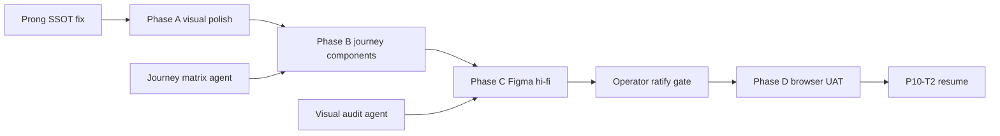

# P9b revision tranche plan — design + build scope (2026-06-12)

> **Purpose:** Replace the rejected P9b ratification path with a four-phase revision tranche. **Plan only** — no hlk-erp code in this document's authoring commit. Execution resumes in sibling repo after prong-fixed ledger lands and operator inline-ratifies revised Figma hi-fi.

## Why revision (operator signal)

The first P9b pass minted Figma scaffold frames and P10-T1 structure (POV switcher, remediation rail, drawer shell) but operator review found:

1. **Live UI craft gap** — localhost renders as a generic shadcn card grid with weak hierarchy, dark-mode breaks on freshness pills, and audit metadata (`fixture` badge, raw monospace paths) on operator-facing surfaces.
2. **Journey gap** — no governed path components (sign-in → lens → act → verify); freshness strip is status-only; non-Operator lenses return empty rails; CTAs open drawer instead of acting.
3. **Content disposition gap** — Tier A GOJ copy partially landed in BFF strings but UI still violates T0/T1 separation (paths on drawer face, hero metrics in accordion panels).

**P10-T2 stays PAUSED** until this revision tranche closes with operator inline-ratify on Figma hi-fi **and** Phase A broken-fix evidence.

## Sibling agent coordination

| Agent | Deliverable into this plan | Consumes from this plan |
|:---|:---|:---|
| **Visual audit** | Impeccable-scored finding table + screenshot callouts | Phase A fix list (§Impeccable fixes) |
| **Journey/component research** | POV × journey step × tactical component matrix | Phase B component slots (§Phase B placeholders) |
| **Prong SSOT fix** | Corrected `source-ledger.csv` prong column + validator PASS | Phase A ledger panel + freshness strip truth |

## Phase dependency



| Gate | Type | Blocks |
|:---|:---|:---|
| Prong-fixed ledger merged | Hard | Phase A ledger/freshness truth; `validate_research_action.py` on touched ledger | ✅ [`p9b-prong-ssot-fix-2026-06-13.md`](p9b-prong-ssot-fix-2026-06-13.md) |
| Journey component matrix | Soft (placeholder OK) | Phase B scope lock; Phase C Figma frame list |
| Operator inline-ratify on Figma | Hard | P10-T2, P11 Operator+Director UAT |
| Phase D manifest + check-links | Hard | P9b revision **complete** |

---

## Phase A — Visual polish + broken fixes (hlk-erp)

**Owner:** execution seat (Composer) in `root_cd/hlk-erp`  
**Prerequisite:** prong SSOT fix merged in AKOS (ledger path unchanged; prong aggregates must match git)  
**Scope:** CSS/layout/component fixes only — no new npm deps, no new BFF endpoints.

### A.1 Broken / incorrect behavior (fix first)

| ID | Symptom | File(s) | Fix |
|:---|:---|:---|:---|
| A-B1 | Freshness pills unreadable in dark mode (hardcoded `bg-emerald-50 text-emerald-900`) | `components/research-center/freshness-strip.tsx` | Replace `toneClasses()` with semantic tokens: `border-border bg-muted/50 text-foreground` + `data-tone` attribute; use `dark:` pairs or CSS variables from shadcn theme |
| A-B2 | `fixture` / `live BFF` source label leaks to operator card face | `components/research-center/insight-card-rail.tsx` | Move `source === "fixture"` badge to drawer T3 footer or remove; keep `sourceLabel` in section meta only at `text-xs` |
| A-B3 | Primary CTA always opens drawer — never copies command or opens artifact | `insight-card-rail.tsx` + BFF `ctaKind` | Wire `ctaKind`: `runbook` → copy command + toast; `artifact`/`env_fix` → link; drawer becomes secondary "Details" |
| A-B4 | v1 accordion may not default collapsed on first visit | `v1-panels-accordion.tsx` | Set `defaultValue=""` explicitly; optional `localStorage` key `rc-v1-panels-expanded` per page spec §2.4 |
| A-B5 | POV switcher wraps into 3+ ragged rows at 375px | `pov-switcher.tsx` | Below `sm`: render `Select` single control; at `sm+`: keep `ToggleGroup` in horizontal scroll container `overflow-x-auto flex-nowrap` |

### A.2 Impeccable polish (same tranche)

See **§Impeccable-driven visual fixes** below — items IF-01..IF-10 are Phase A deliverables.

### A.3 Verification (Phase A)

```powershell
# hlk-erp repo root
npm run typecheck
npm run lint
npx playwright test --grep research-center
```

Manual: localhost @ 375 / 768 / 1280 — dark + light theme toggle if ERP supports it.

---

## Phase B — Journey-aware tactical components (hlk-erp)

**Prerequisite:** Phase A merged; journey/component matrix from sibling agent (placeholder sections below until matrix lands).  
**Scope:** New presentational components + BFF field population for Operator + Director lenses first (P10-T2 scope); Auditor/Finance/Compliance stub empty states only.

### B.1 Shared journey chrome (all lenses)

| Component | Purpose | Spec anchor |
|:---|:---|:---|
| `JourneyStepIndicator` | Shows current step: Sign-in → Lens → Act → Verify | GOJ synthesis §navigation path |
| `FreshnessStripV2` | Extends strip with micro-CTA button per badge | Page spec §2.5 |
| `InsightRailHeader` | Lens label + card count + "≤7 signals" hint | NN/g dashboard cap (SRC-GOJ-20) |
| `VerifyBanner` | After CTA copy/run — prompts freshness re-check | GOJ happy path step 6 |

### B.2 POV-specific tactical components

> **PLACEHOLDER — fill when journey matrix agent delivers `reports/journey-component-matrix-2026-06-12.md`.**

#### Operator lens

| Component | Journey step | Notes |
|:---|:---|:---|
| `RemediationPriorityStack` | Act | Full-width stacked cards; critical first (not 3-col grid) |
| `EnvGapCallout` | Glance | Inline when `readerConfigured === false` |
| `RunbookCopyBlock` | Act | Drawer T1: outcome → when → copyable command |

#### Director lens

| Component | Journey step | Notes |
|:---|:---|:---|
| `IntentCriticalityCard` | Glance | Ledger completion + ICS-ranked placeholder |
| `ProgramHealthSummary` | Verify | Links freshness strip clearance |

#### Auditor lens (stub)

| Component | Journey step | Notes |
|:---|:---|:---|
| `ReadOnlyCtaBanner` | Act | Redacted CTAs → doc links only (page spec §2.1 RBAC) |

#### Finance lens (stub)

| Component | Journey step | Notes |
|:---|:---|:---|
| `SettlementRiskPlaceholder` | Glance | Empty state with forward pointer to FINOPS surface |

#### Compliance lens (stub)

| Component | Journey step | Notes |
|:---|:---|:---|
| `BlockGovernPlaceholder` | Glance | Empty state citing radar `block_govern` posture |

### B.3 BFF alignment (Operator + Director)

| Work | File | Rule |
|:---|:---|:---|
| Populate non-remediation insight cards | `lib/research-center/insights.ts` | Director: ledger completion %, radar overdue count; Operator: env/deploy cards |
| Prong-aware ledger breakdown | `lib/research-center/ledger-stats.ts` | After prong SSOT fix — top prongs match validator |
| Drawer tier sections | `insight-card-rail.tsx` | Split T1/T2/T3 with `Collapsible` for govern paths |

### B.4 Verification (Phase B)

Same as Phase A plus:

```powershell
# AKOS — only if source-ledger or GOJ pack touched
py scripts/validate_research_action.py --source-ledger docs/wip/intelligence/governed-operator-journey-ux-uat-2026-06-12/source-ledger.csv
py scripts/validate_research_action.py --source-ledger docs/wip/intelligence/akos-automation-os-governance-2026-06-10/source-ledger.csv
```

---

## Phase C — Figma hi-fi refresh (AIC owns)

**Owner:** AIC execution seat (Figma MCP)  
**Prerequisite:** Phase A+B merged or visually frozen in localhost; visual audit findings dispositioned; journey matrix final.  
**Not hlk-erp code** — design SSOT only.

### C.1 Required frames (operator-ratified scope, refreshed)

| Frame ID | Viewport | Must show |
|:---|:---|:---|
| `RC-POV-Operator-1280` | 1280 | Remediation stack, strip micro-CTAs, journey step indicator |
| `RC-POV-Director-1280` | 1280 | Intent-criticality cards + program health |
| `RC-POV-Auditor-1280` | 1280 | Read-only CTA pattern |
| `RC-POV-Finance-1280` | 1280 | Settlement risk placeholder |
| `RC-POV-Compliance-1280` | 1280 | Block govern placeholder |
| `RC-Drawer-Open-1280` | 1280 | T1/T2/T3 sections, no raw path in headline |
| `RC-Operator-375` | 375 | Select-based POV, stacked rail, strip vertical |

**File:** https://www.figma.com/design/GTCcxT0DbEWdnVHXyrde73/Holistika-ERP-Research-Center-v2

### C.2 Five lenses + 375 parity checklist

- [ ] Spacing rhythm differs hero vs rail vs accordion (not uniform `space-y-8`)
- [ ] Severity uses badge + weight, not side-stripe borders (Impeccable ban)
- [ ] Card count ≤7 visible without scroll on 1280 Operator
- [ ] Strict T3 — no `I96` / `D-IH-*` on card face or drawer title
- [ ] Dark-mode token story documented (even if ERP light-first)

### C.3 Gate

`gate_type: inline-ratify` — operator approves Figma preview URLs in check-links index.  
**FIGMA_FILES_REGISTRY.csv** row remains separate canonical-CSV commit (operator approval).

---

## Phase D — Browser UAT + screenshots + check-links

**Prerequisite:** Phase C operator ratify  
**Owner:** execution seat + operator walk

### D.1 Capture matrix

| Viewport | Lenses | Auth paths |
|:---|:---|:---|
| 375 | Operator | dev-password + magic-link |
| 768 | Operator, Director | dev-password |
| 1280 | All five POV | dev-password + magic-link |

**Output folder:** `artifacts/uat-screenshots/i96-research-center-v2-revision-2026-06-12/`  
**Manifest:** `MANIFEST.json` with sha256 per [`akos-planning-traceability.mdc`](../../../../.cursor/rules/akos-planning-traceability.mdc) browser-evidence bar.

### D.2 Minimum shots

1. Operator remediation stack (post Phase A grid fix)
2. Freshness strip with micro-CTA visible
3. Drawer T1 runbook + T3 collapsed govern paths
4. Director lens ≥1 non-remediation card
5. POV Select at 375
6. v1 accordion collapsed default
7. Dark mode freshness strip (if theme toggle exists)

### D.3 Deliverables

| Artifact | Path |
|:---|:---|
| Workflow notes | `artifacts/uat-screenshots/i96-research-center-v2-revision-2026-06-12/00-workflow-notes.md` |
| Impeccable disposition | Section in workflow notes or `reports/impeccable-audit-research-center-revision-2026-06-12.md` |
| Operator index | [`operator-check-links-2026-06-12.md`](operator-check-links-2026-06-12.md) |

### D.4 P9b revision complete criteria

- Operator inline-ratify: Figma + localhost parity "good enough to resume P10-T2"
- Manifest + check-links updated
- `master-roadmap.md` P9b status → **revision complete**
- P10-T2 unpaused in GOJ implementation-spec

---

## Impeccable-driven visual fixes (concrete)

Framework: Impeccable shared design laws + product register (`reference/product.md`) — hierarchy, no side-stripe borders, no hero-metric template, card grid monotony, copy redundancy, dark-mode scene sentence.

| ID | Impeccable law | Current issue | Concrete change |
|:---|:---|:---|:---|
| **IF-01** | Theme / color tokens | `freshness-strip.tsx` `toneClasses` uses light-only Tailwind (`bg-emerald-50`, `bg-amber-50`, `bg-rose-50`) | Switch to shadcn semantic variants: wrap each pill in `Alert` or custom `FreshnessPill` using `bg-card border-border` + `text-foreground`; severity via `Badge` variant only |
| **IF-02** | Layout rhythm | `research-center-client.tsx` uniform `space-y-8` | Hero `space-y-4`, rail `mt-6`, accordion `mt-10 pt-6 border-t` — vary vertical rhythm |
| **IF-03** | Absolute ban: hero-metric template | `ledger-summary-panel.tsx` `text-2xl font-semibold` on Total rows / Completion | Demote to `text-sm` inline stats row inside accordion T3; remove large numerals from operator default view |
| **IF-04** | Absolute ban: identical card grids | `insight-card-rail.tsx` `grid md:grid-cols-2 xl:grid-cols-3` for remediation | Remediation cards: `flex flex-col gap-3` full-width stack; future non-critical cards may use 2-col |
| **IF-05** | Progressive disclosure | Monospace `governArtifact` path visible in drawer body | Move path to `Collapsible` "Audit details" (T3); T1 shows `governArtifactLabel` link only |
| **IF-06** | Copy — no restated intros | Hero subtitle duplicates insight rail description | Shorten hero to one line; delete "v1 panels remain below" from hero — move to accordion trigger only |
| **IF-07** | Adapt / responsive | `pov-switcher.tsx` five toggles wrap at 375 | `Select` below `sm`; `ToggleGroup` in `overflow-x-auto snap-x` horizontal strip |
| **IF-08** | Cognitive load (NN/g ≤7) | No card cap; remediation + future cards unbounded | Slice render to `cards.slice(0, 7)` with "Show audit panels for more" link to accordion |
| **IF-09** | Onboard / empty states | Empty lens returns plain paragraph in Card | Lens-specific empty state component with POV label + next action ("Switch to Operator lens" / "Run radar sweep") |
| **IF-10** | Motion / interaction | CTA has no copy feedback | Add `navigator.clipboard.writeText` + shadcn `Toast` on runbook CTAs; `Button` `active:scale-[0.98]` transition |

---

## Verification matrix (revision tranche)

| Step | Command / action | When |
|:---|:---|:---|
| Typecheck | `npm run typecheck` (hlk-erp) | After Phase A, B |
| Lint | `npm run lint` (hlk-erp) | After Phase A, B |
| Playwright smoke | `npx playwright test --grep research-center` | After Phase A, B |
| AKOS fast gate | `py scripts/verify.py pre_commit_fast` | AKOS docs/planning commits |
| Research action | `py scripts/validate_research_action.py --source-ledger docs/wip/intelligence/governed-operator-journey-ux-uat-2026-06-12/source-ledger.csv` | If GOJ ledger touched |
| Research action | `py scripts/validate_research_action.py --source-ledger docs/wip/intelligence/akos-automation-os-governance-2026-06-10/source-ledger.csv` | If Automation OS ledger touched (prong fix) |
| Browser smoke (AKOS) | `py scripts/browser-smoke.py --playwright` | Optional regression; not substitute for Phase D |
| Operator ratify | Inline-ratify on Figma URLs + localhost | End Phase C |
| Check-links | Update [`operator-check-links-2026-06-12.md`](operator-check-links-2026-06-12.md) | End each phase |

---

## Explicit dependencies

| Dependency | Owner | Unblocks |
|:---|:---|:---|
| **Prong-fixed ledger** | prong SSOT sibling agent | Ledger summary top-prong list, Director completion cards, freshness strip row counts | ✅ 2026-06-13 — [`p9b-prong-ssot-fix-2026-06-13.md`](p9b-prong-ssot-fix-2026-06-13.md) |
| **Journey component matrix** | journey research sibling | Phase B component list (replace placeholders) |
| **Visual audit report** | [`p9b-visual-audit-2026-06-12.md`](p9b-visual-audit-2026-06-12.md) — **delivered** | Phase A priority ordering + Phase C Figma diffs |
| **Operator ratify gate** | operator | P10-T2, P9b complete, P11 start |

---

## Risk register (revision-specific)

| ID | Risk | Mitigation |
|:---|:---|:---|
| R-P9b-01 | Figma ↔ localhost drift repeats | Phase C after Phase A+B; operator ratifies both |
| R-P9b-02 | Scope creep into P10-T3 lenses | Phase B stubs only for Auditor/Finance/Compliance |
| R-P9b-03 | Prong fix delayed | Phase A may ship non-prong fixes first; ledger panel stays behind |

---

## Cross-references

- Page spec v2: [`research-center-page-spec-v2-2026-06-12.md`](research-center-page-spec-v2-2026-06-12.md)
- GOJ implementation spec: [`implementation-spec-2026-06-12.md`](../../../intelligence/governed-operator-journey-ux-uat-2026-06-12/implementation-spec-2026-06-12.md)
- GOJ synthesis: [`research-synthesis-2026-06-12.md`](../../../intelligence/governed-operator-journey-ux-uat-2026-06-12/research-synthesis-2026-06-12.md)
- Master roadmap: [`master-roadmap.md`](../master-roadmap.md)
- Operator index: [`operator-check-links-2026-06-12.md`](operator-check-links-2026-06-12.md)
- P9b visual audit: [`p9b-visual-audit-2026-06-12.md`](p9b-visual-audit-2026-06-12.md)
- Prior v2 UAT notes: [`artifacts/uat-screenshots/i96-research-center-v2-2026-06-12/00-workflow-notes.md`](../../../../artifacts/uat-screenshots/i96-research-center-v2-2026-06-12/00-workflow-notes.md)
