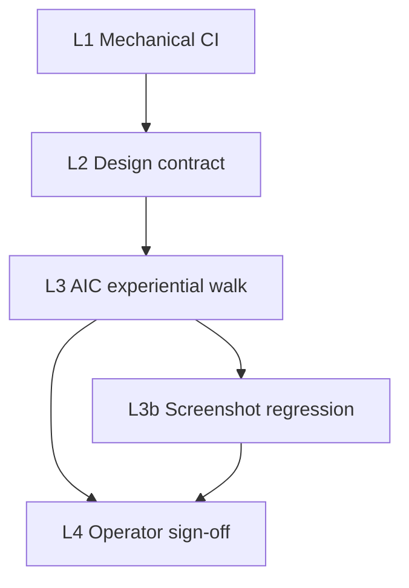

# Research Center — experiential UAT ladder (L1 → L4)

> **Purpose:** Scale **experiential** UX/UI verification for I96 Research Center v2 beyond mechanical validators (typecheck, pytest, anonymous Playwright). This ladder composes the **MADEIRA experiential UAT workflow** (AIC performs the walk the operator would), the **GOJ-UX-UAT LOOP** (governed operator journey design → build → per-lens UAT → iterate), **closure UAT discipline** (11-section bar + browser-evidence audit trail), **Impeccable** craft disposition, **sha256 browser manifests**, a **per-lens journey checklist**, and **screenshot regression** baselines — without minting a parallel validator framework.

## Why a ladder (not one gate)

| Failure mode | Wrong gate | Correct tier |
|:---|:---|:---|
| `validate_uat_report.py` green while UI untested | Treating document shape as product PASS | L3+ required for sibling-repo UI |
| Playwright anonymous redirect PASS | Mechanical auth only | L1 — does not prove post-login insight rail |
| Code-level Impeccable audit | Design review without live pixels | L3 — disposition after browser snapshots |
| Agent chat summary | Operator substitutes for evidence | L4 — operator ratifies **check-links**, not chat |
| Screenshot file exists but shows favicon/loader only | Trusting Playwright exit code without visual read | **L3.0 Agent self-verify** — agent reads PNG before check-links |

**Binding rule:** Higher tiers **assume** lower tiers green. L4 never substitutes for a missing L3 manifest.

### L3.0 — Agent self-verify gate (BINDING — 2026-06-13; amended 2026-06-14)

Added after B1.5 invalid captures (`01-operator-b15-1280.png` = favicon only). **Re-amended after I96 Preview v1** — subagent marked 8/8 VALID without reading PNGs; director `06`/`08` were byte-identical sidebar crops.

| Step | Agent (four hats — **same foreground session**) | PASS |
|:---|:---|:---|
| 1 | **Capture:** viewport 1280×800; **collapse sidebar** before each shot; wait for Research Center heading | File on disk + MANIFEST sha256 |
| 2 | **Visual review (non-delegable):** parent agent **Read** every canonical journey PNG; write `agent_visual_review.json` | VALID row + observations per file; `delegation_allowed: false` |
| 3 | **Mechanical gate:** `py scripts/validate_uat_screenshot_evidence.py --session-dir …` | exit 0 (no DUP-HASH / UNDERSIZE / missing review) |
| 4 | **Journey hat:** walk Discover → Triage → Act (drawer) → Audit (scroll audit into view) | Checklist rows in experiential report |
| 5 | **Brand/copy hat:** scan T0 for localhost/BFF/fixture jargon | Matches page spec v2 + GOJ Strict T3 |
| 6 | Update **§ Check now** only — never mark READY FOR REVIEW if step 2–3 FAIL | Operator sees ≤7 priority links |

**Tranche FAIL** if: invalid screenshots, skipped visual read, subagent-only review, or duplicate journey hashes. Operator review is L4; agent must complete L3.0 first.

**SOP:** [`SOP-EXPERIENTIAL_UAT_AGENT_VISUAL_REVIEW_001.md`](reports/SOP-EXPERIENTIAL_UAT_AGENT_VISUAL_REVIEW_001.md) (I96 mint; promote to v3.0 when ratified).

---

## Ladder overview



| Tier | Who runs | Primary artifacts | What it **proves** | What it **does not** prove |
|:---|:---|:---|:---|:---|
| **L1 — Mechanical** | CI / AIC on every commit | `verify.py pre_commit_fast`, hlk-erp tsc/lint, `research-center.spec.ts`, BFF pytest | Auth gate, JSON contracts, no compile regressions | Operator can **act** from the page; lens differentiation; craft |
| **L2 — Design contract** | AIC before experiential tranche | Page spec v2, GOJ pack PASS, Figma frame IDs, journey matrix rows | Intent is ratified; copy tier (T0–T3); per-lens component inventory | Live UI matches intent; CTAs execute |
| **L3 — AIC experiential walk (localhost)** | AIC execution seat (Cursor Browser MCP or Playwright @ 3.12) | Per-lens manifest + Impeccable disposition + axe row + journey checklist PASS table | What the operator **would see** is captured on **Local dev** badge | Production or Preview deploy proof |
| **L3.5 — Preview deploy walk** | AIC execution seat on Vercel Preview URL | Preview manifest + deploy MCP evidence (`deploy_id`, sha, **Preview** badge) | Vercel build + branch SHA parity; same journey checklist as L3 | Operator production ratify |
| **L3b — Screenshot regression** | hlk-erp CI (Playwright snapshot project) | Golden baselines under `hlk-erp/tests/e2e/__screenshots__/research-center/` | Visual drift is **detected** on repeat runs; multi-viewport parity | Semantic correctness; copy quality; empty-data honesty |
| **L4 — Production + operator sign-off** | Operator via check-links on `erp.holistikaresearch.com` | 7-item checklist + production manifest; magic-link auth row | Operator confirms **insight machine** on live ERP; **Production** badge | — |

---

## L1 — Mechanical (necessary, not sufficient)

**Run on:** every hlk-erp / AKOS commit touching Research Center.

| Probe | Command / artifact | PASS |
|:---|:---|:---:|
| AKOS fast gate | `py scripts/verify.py pre_commit_fast` | exit 0 |
| Anonymous auth | `npx playwright test tests/e2e/research-center.spec.ts` | redirect + BFF 401 |
| v2 spec (when landed) | `research-center-v2.spec.ts` — POV URL persist, drawer shell | green |
| BFF insights contract | pytest on `/api/research-center/insights` | schema + auth |
| UAT report self-test | `py scripts/validate_uat_report.py --self-test` | circuit breaker |

**L1 verdict:** `MECHANICAL-PASS` — safe to start L2/L3 tranche; **not** P11 closure.

---

## L2 — Design contract (GOJ LOOP stages 1–4)

**Prerequisites before L3 experiential capture:**

| # | Gate | Tool | PASS signal |
|:---|:---|:---|:---|
| 1 | Research pack | `validate_research_action.py` on GOJ + analytics ledgers | exit 0 |
| 2 | Page spec v2 ratified | [`research-center-page-spec-v2-2026-06-12.md`](research-center-page-spec-v2-2026-06-12.md) | operator inline-ratify recorded |
| 3 | Figma hi-fi (P9b) | Five POV @ 1280 + Operator @ 375 + drawer frame | preview URL ratified; drawer frame not truncated |
| 4 | Journey matrix coverage | [`journey-component-matrix-2026-06-12.md`](../../../intelligence/governed-operator-journey-ux-uat-2026-06-12/journey-component-matrix-2026-06-12.md) | T2 lenses (Operator, Director) rows have owners |
| 5 | P9b visual audit blockers | [`p9b-visual-audit-2026-06-12.md`](p9b-visual-audit-2026-06-12.md) VIS-B* | **scheduled** disposition per tranche — not P11 blockers if tracked |

**L2 verdict:** `CONTRACT-PASS` — intent + component inventory locked; localhost build may still FAIL Impeccable.

---

## L3.0 — Agent self-verify gate (BINDING)

Before any tranche is marked **READY FOR REVIEW** in [`operator-check-links-2026-06-12.md`](operator-check-links-2026-06-12.md) § Check now, the **execution-seat agent** MUST:

1. **Read every PNG** in the session folder (image tool or equivalent — not filename/size heuristics alone).
2. Confirm **full-page UI** — Holistika ERP chrome + Research Center hero + POV switcher or insight rail visible.
3. Confirm **"Research Center" heading** (or equivalent `h1` / page title in capture) is legible — not favicon-only, loader-only, or blank viewport.
4. Record self-verify outcome in session `00-workflow-notes.md` (VALID / INVALID per file) and in the experiential walk report §3.4.

**Invalid capture = tranche FAIL.** Do not delegate visual proof to the operator alone. Operator L4 ratifies **after** L3.0 passes — not instead of it.

**Worked failure (2026-06-13 B1.5):** `01-operator-b15-1280.png` / `02-director-b15-1280.png` were favicon-only; check-links marked INVALID until L3 re-capture with `waitFor` heading timeout 45000 ms.

---

## L3 — AIC experiential walk (MADEIRA layers + UAT §3.4)

Maps to **MADEIRA experiential UAT charter** layer cake + **GOJ LOOP stage 5**.

### Auth matrix (binding — both paths in manifest)

| Prefix | Entry URL | Required captures |
|:---|:---|:---|
| `auth-dev-password` | `http://localhost:3010/api/dev/sign-in?next=/research-center` | All T2 lenses @ 1280 minimum |
| `auth-magic-link` | `http://localhost:3010/sign-in?next=%2Fresearch-center` | Operator lens @ 1280 + sign-in ready shot |

Production `https://erp.holistikaresearch.com/...` is the deployed ratify host (see [`research-center-domain-and-cicd-ssot-2026-06-13.md`](research-center-domain-and-cicd-ssot-2026-06-13.md)). Cursor MCP may block production SSL (-107) — **localhost L3 is dev evidence only**, not production PASS.

### Per-lens journey checklist (GOJ stages)

For **each** POV lens in scope for the tranche, walk **Discover → Triage → Act → Audit** and record PASS / FAIL / SKIP in the closure UAT §4 table.

**Tranche order (binding):** Operator + Director (T2) **before** Auditor + Finance + Compliance (T3).

| Stage | Time budget | Operator lens PASS (example) | Evidence filename token |
|:---|:---|:---|:---|
| **Discover** | ≤15s | Hero + POV switcher + freshness strip v2 visible; `?pov=` persists | `{lens}-discover-{viewport}` |
| **Triage** | ≤45s | ≥1 plain-language headline + primary CTA; remediation sorts first; **no** fixture/debug on T0 | `{lens}-triage-{viewport}` |
| **Act** | ≤90s | CTA executes taxonomy (`copy` / `open` / `env_fix` / `doc_link`); drawer T1 outcome→when→command | `{lens}-drawer-open-{viewport}` |
| **Audit** | optional | T3 accordion collapsed default; manifest link on Auditor lens | `{lens}-audit-{viewport}` |

**Lens minimum card counts (P11 charter alignment):**

| Lens | Tranche | Min insight cards @ 1280 | Empty-state rule (Gate B × IF-09) |
|:---|:---|:---|:---|
| Operator | T2 | 3 remediation OR live cards | `LensEmptyState` — no fixture badges on face |
| Director | T2 | 3 (ICS / ledger / phase) | same |
| Auditor | T3 | 2 evidence cards | deliberate empty state + guidance |
| Finance | T3 | 2 FINOPS stub cards | same |
| Compliance | T3 | 3 drift / block_govern cards | same |

Full component inventory: [`journey-component-matrix-2026-06-12.md`](../../../intelligence/governed-operator-journey-ux-uat-2026-06-12/journey-component-matrix-2026-06-12.md).

### Impeccable disposition (MADEIRA layer 6)

Run **after** L3 snapshots exist — not code-only.

| Axis | Source | L3 PASS bar |
|:---|:---|:---|
| Layout / hierarchy | Impeccable + [`p9b-visual-audit-2026-06-12.md`](p9b-visual-audit-2026-06-12.md) IF table | No **blocker** (VIS-B*) open without PWF tracker |
| T0–T3 copy | GOJ Strict T3 | No codes/fixture/BFF jargon on card face |
| Responsive | 375 / 768 / 1280 | Operator lens minimum; all five @ 1280 before P11 PASS |
| Figma parity | Quality Fabric RULE 4 | Spot-check vs `figma-{lens}-1280-ref.png` |
| a11y | axe on post-login route | PASS or documented SKIP (Python 3.12 path) |

Output: dated disposition section in [`impeccable-audit-research-center-2026-06-11.md`](impeccable-audit-research-center-2026-06-11.md) **amendment** or new `impeccable-audit-research-center-v2-<date>.md`.

### Browser manifest (UAT discipline §3.4)

Every L3 decision point: **screenshot + accessibility snapshot + sha256 + timestamp + route + auth_state + pov_lens**.

---

## Manifest naming convention (scalable)

### Session folder

```
artifacts/uat-screenshots/i96-research-center-v2-{YYYY-MM-DD}/
artifacts/uat-screenshots/i96-research-center-v2-revision-{YYYY-MM-DD}/   # P9b tranche only
artifacts/uat-screenshots/i96-research-center-v2-p11-{YYYY-MM-DD}/        # P11 closure session (preferred)
```

One folder per **experiential session** (not per commit). Revision folders **supersede** prior captures for the same subject — mark superseded entries in `MANIFEST.json` (`"supersedes": "01-pov-switcher-…"`).

### Screenshot filename pattern

```
{seq}-{lens}-{stage}-{detail}-{viewport}-{auth}.png
```

| Token | Values | Example |
|:---|:---|:---|
| `seq` | `01`–`99` zero-padded | `07` |
| `lens` | `operator`, `director`, `auditor`, `finance`, `compliance`, `chrome` | `operator` |
| `stage` | `discover`, `triage`, `drawer-open`, `drawer-runbook`, `audit`, `sign-in`, `figma-ref` | `drawer-runbook` |
| `detail` | optional slug | `ledger-validator`, `tier-a-remediation`, `lens-empty` |
| `viewport` | `375`, `768`, `1280` | `1280` |
| `auth` | `auth-dev-password`, `auth-magic-link`, `anonymous` | `auth-dev-password` |

**Examples:**

- `05-operator-triage-tier-a-remediation-1280-auth-dev-password.png`
- `12-director-discover-1280-auth-dev-password.png`
- `18-auditor-triage-lens-empty-1280-auth-dev-password.png`
- `03-operator-drawer-runbook-1280-auth-dev-password.png`
- `90-figma-ref-operator-1280-figma-export.png`

### MANIFEST.json schema (normative)

Prefer unified `captures[]` array (revision session shape):

```json
{
  "initiative": "I96-research-center-v2",
  "session": "2026-06-13-p11-closure",
  "verdict_scope": "p11-per-lens-experiential",
  "capture_tool": "cursor-ide-browser | playwright",
  "ladder_tier": "L3",
  "captures": [
    {
      "file": "05-operator-triage-tier-a-remediation-1280-auth-dev-password.png",
      "route": "/research-center?pov=operator",
      "viewport": "1280x800",
      "pov_lens": "operator",
      "journey_stage": "triage",
      "auth_state": "dev-sign-in-authenticated",
      "screenshot_sha256": "<hex>",
      "a11y_snapshot_ref": "optional/path/to/snapshot.txt",
      "captured_at": "ISO-8601",
      "notes": "GOJ Tier A — remediation faces",
      "supersedes": null
    }
  ]
}
```

**P11 minimum manifest row count:** ≥ **25** captures — five lenses × discover + triage @ 1280 (10) + Operator/Director drawer-open (2) + responsive Operator 375/768 (2) + auth paths (2) + v1 accordion regression (1) + Figma refs (2) + axe evidence (1) + spare for failures.

---

## L3b — Screenshot regression (automated experiential)

**Purpose:** Repeatable pixel guard on **stable** golden routes; complements manual MCP walk.

| Item | Convention |
|:---|:---|
| Location | `root_cd/hlk-erp/tests/e2e/research-center-v2.visual.spec.ts` |
| Baselines | `tests/e2e/__screenshots__/research-center/{lens}/{viewport}/` |
| Viewports | 375, 768, 1280 per I68 `playwright_baseline.py` |
| Routes | `/research-center?pov={lens}` post dev-sign-in fixture |
| Masking | Mask dynamic timestamps / git-relative dates before snapshot |
| CI | hlk-erp `visual-regression` job (I68 template); INFO until first baseline mint |
| Update policy | Baseline update only in same commit as intentional visual tranche + manifest note |

**L3b PASS:** no unexpected diff on golden set OR diff triaged in visual audit with operator ratify.

**L3b does not replace L3:** semantic/journey failures (empty lenses, non-acting CTAs) require MCP checklist.

---

## L3.5 — Preview deploy tier (Vercel Preview)

**Added 2026-06-13** — gap-closure tranche P-G5. Localhost L3 PWF **does not** satisfy this tier.

| Item | Convention |
|:---|:---|
| **When** | Feature branch → **PR to main**; Vercel Preview on PR READY (operator ratified 2026-06-13) |
| **Hostname** | PR preview URL from GitHub / Vercel (`*.vercel.app`) |
| **Badge** | **Preview** (mandatory on every capture) |
| **Charter** | [`uat-i96-research-center-preview-charter-2026-06-13.md`](uat-i96-research-center-preview-charter-2026-06-13.md) |
| **Manifest folder** | `artifacts/uat-screenshots/i96-research-center-preview-<YYYY-MM-DD>/` |
| **Minimum shots** | ≥8 @1280 (Operator + Director journey stages) |
| **Mechanical evidence** | Vercel MCP: `deploy_id` + `source_sha` + `state=READY` in UAT report frontmatter |
| **Verdict** | AIC-owned thorough walk; operator spot-check via check-links |

**L3.5 PASS** requires Preview badge + journey checklist green on preview host — not localhost folder reuse.

---

## L3.6 — Production deploy tier (`erp.holistikaresearch.com`)

**Added 2026-06-13** — gap-closure tranche P-G6. Requires L3.5 PASS or PWF with closed followups.

| Item | Convention |
|:---|:---|
| **When** | After main merge; production deploy READY |
| **Hostname** | `https://erp.holistikaresearch.com/research-center` only |
| **Badge** | **Production** |
| **Charter** | [`uat-i96-research-center-production-charter-2026-06-13.md`](uat-i96-research-center-production-charter-2026-06-13.md) |
| **Auth** | Magic-link row binding; dev-password SKIP if disabled in prod |
| **SUBDOMAINS** | Registry must be reconciled or operator waives drift per proposal |

---

## L4 — Operator sign-off

**Surface:** [`operator-check-links-2026-06-12.md`](operator-check-links-2026-06-12.md) — operator clicks previews and manifest paths, not agent chat.

### 7-item checklist (P11 closure — extends charter)

| # | Item | Tier evidence |
|:---|:---|:---|
| 1 | I can pick my lens and see **different** prioritized questions | L3 per-lens discover + triage shots |
| 2 | Top card tells me **what to do** in plain language (no code-only headline) | L3 triage + Impeccable T0 |
| 3 | Primary CTA lets me **act** in ≤2 steps (not drawer-only) | L3 act stage; VIS-B04 closed |
| 4 | Drawer runbook is **copy-complete** (outcome / when / command) | L3 drawer-runbook shot |
| 5 | Freshness strip **matches** card severity | VIS-B02 closed |
| 6 | v1 four-panel accordion still expands | L1 + L3 regression shot |
| 7 | I would use this page **before** opening five other tools | Operator explicit sign-off |

**L4 verdict:** recorded in [`uat-i96-research-center-v2-closure-<date>.md`](uat-i96-research-center-v2-charter-2026-06-12.md) (11-section closure UAT mint) — `verdict: PASS` or `PASS-WITH-FOLLOWUP` with PWF rationale.

---

## When P11 PASS (composite gate)

**P11-v2-uat PASS** requires **all** of:

| Gate | Tier | Criterion |
|:---|:---|:---|
| G-P11-01 | L1 | `pre_commit_fast` + v2 Playwright spec green |
| G-P11-02 | L2 | Page spec v2 + P9b Figma ratified; GOJ ledger PASS |
| G-P11-03 | L3 | Full per-lens journey checklist **Operator + Director PASS** @ 1280; Auditor/Finance/Compliance PASS or honest `LensEmptyState` with guidance |
| G-P11-04 | L3 | Both auth paths in manifest (`auth-dev-password` + `auth-magic-link`) |
| G-P11-05 | L3 | Multi-viewport: Operator @ 375, 768, 1280 |
| G-P11-06 | L3 | Impeccable v2 disposition — no open VIS-B blockers without PWF tracker |
| G-P11-07 | L3 | axe PASS or documented SKIP (3.12) |
| G-P11-08 | L3 | Manifest ≥25 rows, sha256 complete, naming convention followed |
| G-P11-09 | L3b | Visual regression baseline green OR triaged diff ratified |
| G-P11-10 | L3 | v1 accordion parity (charter dim 11) |
| G-P11-11 | L4 | Operator 7-item checklist acknowledged |
| G-P11-12 | L4 | Closure UAT validates: `validate_uat_report.py --report <path>` exit 0 |

**P11 PASS-WITH-FOLLOWUP** (allowed): KiRBe env green on localhost, magic-link production parity, axe on 3.14 — each with `verdict_followup_rationale` + tracker path per PWF governance.

**P11 FAIL:** any L3 journey stage FAIL on Operator lens without disposition; missing manifest; `validate_uat_report` structural FAIL; operator rejects check-links ratify.

**Not P11:** I96 program P11 index-integrity sweep (`validate_index_freshness.py`) — orthogonal phase; do not conflate in verdict prose.

---

## Execution order (single P11 session)

1. Confirm L1 green on target hlk-erp SHA.
2. Confirm L2 gates (Figma + spec + GOJ PASS).
3. Run L3 MCP walk in lens order: Operator → Director → Auditor → Finance → Compliance.
3a. **L3.0:** Agent reads every PNG — confirm Research Center heading + full-page UI before updating check-links.
4. Capture manifest with naming convention; append a11y snapshots.
5. Run Impeccable disposition against captures (not source-only).
6. Run axe (3.12) or record SKIP.
7. Update / mint L3b baselines if visual tranche landed.
8. Update operator check-links; paste path in chat.
9. Operator L4 walk via check-links.
10. Mint 11-section closure UAT with composite verdict.

---

## Cross-references

| Artifact | Path |
|:---|:---|
| Gap-closure tranche + Preview/Production charters | [`research-center-gap-closure-deploy-uat-tranche-2026-06-13.md`](research-center-gap-closure-deploy-uat-tranche-2026-06-13.md) |
| v2 UAT charter (acceptance dimensions) | [`uat-i96-research-center-v2-charter-2026-06-12.md`](uat-i96-research-center-v2-charter-2026-06-12.md) |
| MADEIRA experiential charter | [`../../../intelligence/aic-madeira-experiential-uat-2026-06-11/charter.md`](../../../intelligence/aic-madeira-experiential-uat-2026-06-11/charter.md) |
| GOJ LOOP implementation spec | [`../../../intelligence/governed-operator-journey-ux-uat-2026-06-12/implementation-spec-2026-06-12.md`](../../../intelligence/governed-operator-journey-ux-uat-2026-06-12/implementation-spec-2026-06-12.md) |
| Journey × component matrix | [`../../../intelligence/governed-operator-journey-ux-uat-2026-06-12/journey-component-matrix-2026-06-12.md`](../../../intelligence/governed-operator-journey-ux-uat-2026-06-12/journey-component-matrix-2026-06-12.md) |
| Operator check-links | [`operator-check-links-2026-06-12.md`](operator-check-links-2026-06-12.md) |
| v1 browser UAT (PWF baseline) | [`uat-i96-research-center-browser-2026-06-11.md`](uat-i96-research-center-browser-2026-06-11.md) |
| P9b visual audit (IF / VIS findings) | [`p9b-visual-audit-2026-06-12.md`](p9b-visual-audit-2026-06-12.md) |
| UAT discipline (§3.4 browser evidence) | [`../../../../references/hlk/v3.0/Admin/O5-1/People/canonicals/UAT_DISCIPLINE.md`](../../../../references/hlk/v3.0/Admin/O5-1/People/canonicals/UAT_DISCIPLINE.md) |
| Master roadmap P11 | [`../master-roadmap.md`](../master-roadmap.md) |
