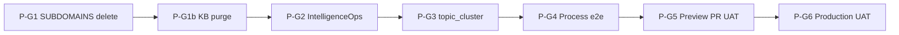

# Research Center — gap-closure + deploy UAT tranche (2026-06-13)

> **Operator intent:** Close governance gaps surfaced at B1.5 handoff end-to-end, then run **three-tier CI/CD UAT**: localhost L3 (done, PWF) → **Vercel Preview** (AIC thorough walk on **PR preview URL**) → **Production** on `erp.holistikaresearch.com` (separate thorough walk after main deploy).

## Is SUBDOMAINS_REGISTRY OK for I96 ratify?

**No.** Operator ratified **2026-06-13:** `holistika.com` is **not Holistika's domain** (external party). Intent is **DELETE** all `holistika.com` rows from the subdomain registry and **strip the hostname from the KB** — not archive-in-place. Deployed SSOT remains **`erp.holistikaresearch.com`**. See [`subdomains-registry-reconciliation-proposal-2026-06-13.md`](subdomains-registry-reconciliation-proposal-2026-06-13.md) + KB purge checklist (~36 files, ~105 line matches in AKOS).

## Three-tier UAT ladder (binding)

| Tier | Host | Badge | Who walks | Status (2026-06-13) |
|:---|:---|:---|:---|:---|
| **L3 Local** | `localhost:3010` | Local dev | AIC L3.0 + operator L4 optional | **PWF** — [`uat-i96-research-center-b15-experiential-2026-06-13.md`](uat-i96-research-center-b15-experiential-2026-06-13.md) |
| **L3.5 Preview** | PR → `*.vercel.app` | Preview | AIC thorough experiential | **PWF** — [`uat-i96-research-center-preview-2026-06-13.md`](uat-i96-research-center-preview-2026-06-13.md) (magic-link 8/8 v2; Preview env gaps) |
| **L4 Production** | `erp.holistikaresearch.com` | Production | Operator + AIC | **FAIL** (2026-06-14) — Vercel prod **READY** @ `3787f06` (`dpl_5ZdeDLcYqaUFYFJ6AR9JYo9vmw4Y`) but charter host serves **legacy v1**; `/sign-in` **404**; domain not on Vercel `hlk-erp` project — [`uat-i96-research-center-production-2026-06-14.md`](uat-i96-research-center-production-2026-06-14.md). **Scheduled:** wire domain + operator magic-link + re-walk (not dropped) |

Localhost L3 **does not** satisfy Preview or Production charters.

## Preview workflow (operator ratified 2026-06-13)

1. **Feature branch** from `main` in `hlk-erp` with B1.5 Research Center changes
2. **Open PR** to `main` → Vercel attaches **Preview** deployment to PR
3. Copy preview URL from GitHub PR checks or Vercel dashboard
4. AIC runs Preview UAT charter against that URL (Preview badge mandatory)
5. After Preview PASS/PWF-closed → merge PR → Production UAT on `erp.holistikaresearch.com`

## Phased plan

### P-G1 — SUBDOMAINS registry DELETE + holistikaresearch.com-only

| | |
|:---|:---|
| **Scope** | **Remove** all `holistika.com` apex rows from `SUBDOMAINS_REGISTRY.md`. Replace with holistikaresearch.com-only topology (`erp`, `showcase`, `kirbe`, `status` reserved, `api`/`docs` reserved). **Not** archive-in-place. |
| **Prerequisites** | Operator intent ratified 2026-06-13 |
| **Deliverables** | [`subdomains-registry-reconciliation-proposal-2026-06-13.md`](subdomains-registry-reconciliation-proposal-2026-06-13.md) (ratified shape + purge checklist) |
| **Verification** | Canonical commit: `validate_subdomains_registry.py` + `validate_hlk.py` PASS; zero `holistika.com` rows in registry |
| **Owner** | **Operator** CSV gate · **Composer** canonical commit |

### P-G1b — KB purge (`holistika.com` strip)

| | |
|:---|:---|
| **Scope** | Grep-remediate ~36 AKOS files (~105 line matches) citing `holistika.com`, `erp.holistika.com`, `madeira.holistika.com`; sibling **hlk-erp** purge in separate PR |
| **Prerequisites** | P-G1 canonical delete committed |
| **Deliverables** | Grep-clean `docs/`, `config/`, `tests/`, `supabase/`, `.cursor/` per proposal checklist |
| **Verification** | `rg holistika\.com` on purge scope → 0 live-host citations |
| **Owner** | **Composer** mechanical purge · **AIC** grep audit |

### P-G2 — IntelligenceOps population

| | |
|:---|:---|
| **Scope** | Replace scaffold/placeholder IntelligenceOps register rows with I96-relevant live intel targets; disposition DUE competitor placeholder. |
| **Prerequisites** | P-G1b underway or parallel (no holistika.com in new rows) |
| **Deliverables** | [`intelligenceops-register-i96-population-2026-06-13.md`](intelligenceops-register-i96-population-2026-06-13.md) |
| **Verification** | `research_radar_sweep.py` populated queue; `validate_intelligenceops_register.py` |
| **Owner** | **Operator** CSV gate · **Composer** CSV commit after gate |

### P-G3 — topic_cluster harmonization

| | |
|:---|:---|
| **Scope** | Field mapping + BFF contract notes |
| **Deliverables** | [`topic-cluster-intelligenceops-harmonization-2026-06-13.md`](topic-cluster-intelligenceops-harmonization-2026-06-13.md) |
| **Owner** | **AIC** doc · **Composer** BFF wiring |

### P-G4 — Process catalog e2e wiring

| | |
|:---|:---|
| **Deliverables** | [`research-center-process-catalog-e2e-2026-06-13.md`](research-center-process-catalog-e2e-2026-06-13.md) |
| **Owner** | **AIC** gap matrix · **Composer** CTA metadata |

### P-G5 — Preview deploy + UAT (feature branch + PR)

| | |
|:---|:---|
| **Scope** | hlk-erp **feature branch** → **PR to main** → Vercel Preview READY → AIC walk per [`uat-i96-research-center-preview-charter-2026-06-13.md`](uat-i96-research-center-preview-charter-2026-06-13.md) |
| **Prerequisites** | B1.5 on feature branch; PR open; preview deploy READY |
| **Deliverables** | Preview UAT report + manifest ≥8 @1280; PR URL + deploy ID in frontmatter |
| **Owner** | **Composer** branch/PR · **AIC** preview UAT |

### P-G6 — Production deploy + UAT

| | |
|:---|:---|
| **Scope** | PR merge → `erp.holistikaresearch.com` per [`uat-i96-research-center-production-charter-2026-06-13.md`](uat-i96-research-center-production-charter-2026-06-13.md) |
| **Prerequisites** | P-G5 PASS or PWF closed; P-G1 registry delete done |
| **Owner** | **Operator** merge · **AIC** production UAT · **Operator** L4 |

## Cross-references

| Artifact | Path |
|:---|:---|
| SUBDOMAINS DELETE proposal + purge | [`subdomains-registry-reconciliation-proposal-2026-06-13.md`](subdomains-registry-reconciliation-proposal-2026-06-13.md) |
| Domain + CI/CD SSOT | [`research-center-domain-and-cicd-ssot-2026-06-13.md`](research-center-domain-and-cicd-ssot-2026-06-13.md) |
| Experiential ladder | [`research-center-experiential-uat-ladder-2026-06-12.md`](research-center-experiential-uat-ladder-2026-06-12.md) |
| Check-links | [`operator-check-links-2026-06-12.md`](operator-check-links-2026-06-12.md) |

## Explicit non-actions

- No canonical commits without operator gate (SUBDOMAINS + IntelligenceOps)
- No git commit unless operator explicitly requests
