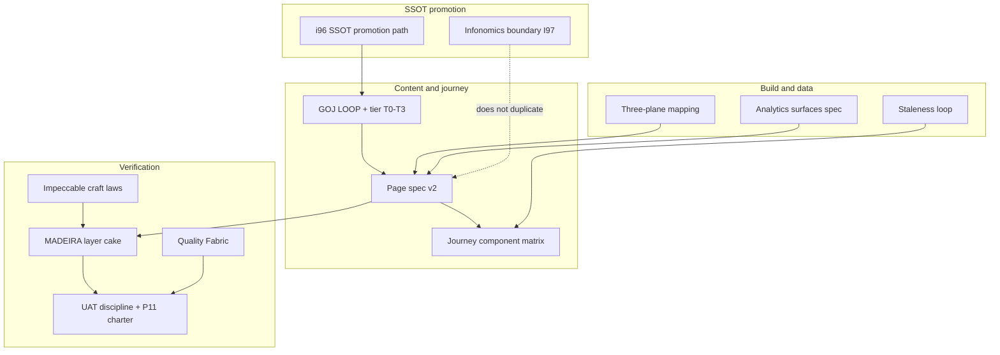

# Research Center insight dashboards — governance corpus (2026-06-12)

**Initiative:** Research Data Plane & Research Center (`INIT-OPENCLAW_AKOS-96`)  
**Scope:** Governed insight rails, POV lenses, remediation cards, drawers, freshness strip, UAT/MADEIRA loop, three-plane data honesty  
**SSOT posture:** GOJ WIP + I96 planning bind until three ERP surfaces prove the LOOP ([`i96-ssot-promotion-path-2026-06-12.md`](i96-ssot-promotion-path-2026-06-12.md))

---

## How to read this corpus

Each row is a **binding rule** for Research Center v2 insight dashboards. "Binding" means: violating it blocks ratification, UAT PASS, or tranche resume unless an explicit operator inline-ratify overrides it.

**Precedence (when sources disagree):**

1. Operator ratifications on record (P9b Gates A/B/C → `D-IH-96-F/G/H`)
2. Page spec v2 §2.6 (I96 consumer bind)
3. GOJ implementation spec LOOP
4. Cursor rules + vault canonicals
5. WIP research packs (authoritative until three-surface LOOP bar)

---

## Binding rules table

| Functional name | What it enforces | Source path |
|:---|:---|:---|
| **Operator plain-language communication** | Initiative codes, decision IDs, and raw register metrics never stand alone on operator-facing surfaces; functional names travel with any code. | `.cursor/rules/akos-operator-communication.mdc` |
| **Governed operator journey (GOJ) charter** | Research Center is first consumer of a reusable journey + content + ratify loop; fills gap between MADEIRA, Impeccable, UAT, and Quality Fabric. | `docs/wip/intelligence/governed-operator-journey-ux-uat-2026-06-12/charter.md` |
| **GOJ LOOP implementation spec** | Seven-stage cycle: research → Excalidraw → Figma hi-fi → build → per-lens UAT → content audit → iterate; reuses existing validators, no parallel framework. | `docs/wip/intelligence/governed-operator-journey-ux-uat-2026-06-12/implementation-spec-2026-06-12.md` |
| **GOJ check-links handoff** | After every execution tranche touching RC v2, agent MUST update **§ Check now** (≤7 rows) in operator check-links and paste full path in chat completion. Archive sections are not the ratify surface. | `implementation-spec-2026-06-12.md` §"Operator check-links handoff"; `operator-check-links-2026-06-12.md` |
| **L3.0 agent self-verify** | Agent MUST read every screenshot PNG before marking tranche READY FOR REVIEW; invalid capture (favicon/loader) = tranche FAIL — do not delegate visual proof to operator alone. | [`research-center-experiential-uat-ladder-2026-06-12.md`](research-center-experiential-uat-ladder-2026-06-12.md) §L3.0 |
| **Domain + Vercel CI/CD SSOT** | Production ratify only on `erp.holistikaresearch.com` after main deploy; preview on `*.vercel.app`; never `holistika.com` for I96 until registry reconciled. | [`research-center-domain-and-cicd-ssot-2026-06-13.md`](research-center-domain-and-cicd-ssot-2026-06-13.md) |
| **Topic cluster vs IntelligenceOps harmonization** | `topic_cluster` in research source ledgers (pack taxonomy) ≠ IntelligenceOps targets (`INTELLIGENCEOPS_REGISTER.csv`). Ledgers govern citations; IntelligenceOps governs verify-by dates for live intel. Thin register = weak staleness cards on T0. **Harmonization pack (2026-06-13):** [`topic-cluster-intelligenceops-harmonization-2026-06-13.md`](topic-cluster-intelligenceops-harmonization-2026-06-13.md) · population [`intelligenceops-register-i96-population-2026-06-13.md`](intelligenceops-register-i96-population-2026-06-13.md) · process e2e [`research-center-process-catalog-e2e-2026-06-13.md`](research-center-process-catalog-e2e-2026-06-13.md) | `INTELLIGENCEOPS_REGISTER.csv`; `research_radar_sweep.py`; [`staleness-loop-spec.md`](../staleness-loop-spec.md) |
| **Gap-closure deploy UAT tranche** | Phased P-G1–P-G6: SUBDOMAINS proposal → IntelligenceOps CSV → topic_cluster BFF → process CTAs → Preview UAT → Production UAT. Localhost L3 PWF does not satisfy Preview/Production charters. | [`research-center-gap-closure-deploy-uat-tranche-2026-06-13.md`](research-center-gap-closure-deploy-uat-tranche-2026-06-13.md) |
| **SUBDOMAINS DELETE + KB purge (operator ratified 2026-06-13)** | `holistika.com` is **not Holistika's domain** (external party). **DELETE** all holistika.com registry rows; holistikaresearch.com-only topology; strip ~36 AKOS files (~105 grep hits). Not archive-in-place. | [`subdomains-registry-reconciliation-proposal-2026-06-13.md`](subdomains-registry-reconciliation-proposal-2026-06-13.md) §KB purge checklist |
| **Preview / Production UAT charters** | L3.5 Preview (AIC thorough) + L4 Production on holistikaresearch.com — inherit experiential ladder journey checklist. | [`uat-i96-research-center-preview-charter-2026-06-13.md`](uat-i96-research-center-preview-charter-2026-06-13.md) · [`uat-i96-research-center-production-charter-2026-06-13.md`](uat-i96-research-center-production-charter-2026-06-13.md) |
| **Strict T3 jargon bar** | `I96`, `P10`, `D-IH-*` and raw metrics only in collapsed audit accordion (T3); never on card face or drawer headline. | `implementation-spec-2026-06-12.md` §3; `research-center-page-spec-v2-2026-06-12.md` §2.6 |
| **Figma hi-fi before P10-T2** | P10 tranche 2 (Operator + Director content disposition) **PAUSED** until P9b Figma hi-fi operator inline-ratify PASS. | `implementation-spec-2026-06-12.md` §3–4; `p9b-revision-tranche-plan-2026-06-12.md` |
| **Dual auth UAT matrix** | P11 manifest must include **both** dev-password (`/api/dev/sign-in?next=/research-center`) and magic-link (`/sign-in?next=/research-center`) evidence. | `implementation-spec-2026-06-12.md` §5; `operator-check-links-2026-06-12.md` |
| **Per-lens UAT order** | Operator + Director lenses (dimensions 5–6) before Auditor / Finance / Compliance polish. | `implementation-spec-2026-06-12.md` §5; `uat-i96-research-center-v2-charter-2026-06-12.md` |
| **Content audit checklist** | No code-only headlines; verb+object CTAs; drawer runbook = outcome → when → command; Operator remediation sorts first; Figma 1280 spot-check. | `implementation-spec-2026-06-12.md` §6 |
| **Tiered resource disposition (T0–T3)** | T0 card face; T1 drawer upper (act); T2 drawer lower (govern); T3 accordion (audit, collapsed default). Max two operator steps on happy path. | `research-synthesis-2026-06-12.md` (GOJ pack); `research-center-page-spec-v2-2026-06-12.md` §2.6 |
| **Card question framework** | Every card answers What / When / Why / How across T0–T1 fields. | `research-center-page-spec-v2-2026-06-12.md` §2.6; `journey-component-matrix-2026-06-12.md` |
| **CTA taxonomy** | Six `cta_kind` values with drawer minimums: runbook, artifact, env_fix, initiative_phase, doc_link, ticket. | `research-center-page-spec-v2-2026-06-12.md` §2.6 |
| **Journey stage vocabulary** | Discover → Triage → Act → Audit with time budgets and PASS signals per stage. | `journey-component-matrix-2026-06-12.md` §"Journey stages" |
| **POV × component matrix** | ~59 tactical components across five lenses; T2 min card counts; BFF field hooks; anti-patterns (metric-only cards, codes on face). | `journey-component-matrix-2026-06-12.md` |
| **Research Center page spec v2** | One job: highest-priority governed actions in ≤90s; remediation cards first; read-only ERP; five POV lenses; BFF contracts. | `reports/research-center-page-spec-v2-2026-06-12.md` |
| **Remediation cards priority #1** | Operator lens MUST surface ledger-zero, radar-empty, KiRBe-unhealthy before other insight types. | Page spec v2 §1; `governed-actionable-analytics-surfaces-2026-06-12/implementation-spec-2026-06-12.md` |
| **Insight card actionable unit** | Headline, severity, type chip, one-line detail, primary CTA, drill-down; anti-pattern = metric-only status board. | Page spec v2 §2.2 |
| **Freshness strip v2** | Each badge: label + status + why + micro-CTA (not color alone). | Page spec v2 §2.5 |
| **v1 panel accordion regression** | Four v1 panels preserved below rail; **collapsed** default; no duplicate hero metrics. | Page spec v2 §2.4 |
| **Governed actionable analytics surfaces** | P10 priority order, BFF schema, shadcn Card rail (no Tremor in P10), read-only D-IH-96-B preserved. | `governed-actionable-analytics-surfaces-2026-06-12/implementation-spec-2026-06-12.md` |
| **AIC MADEIRA experiential UAT** | Sibling-repo UI: document-structure PASS ≠ experiential PASS; layer cake (spec → mockup → impl → Playwright → MCP → Impeccable → axe → manifest). | `aic-madeira-experiential-uat-2026-06-11/charter.md` |
| **FAIL-until-evidence posture** | Track D browser UAT stays FAIL until localhost walk + manifest + Impeccable + axe; Playwright anonymous smoke is mechanical only. | MADEIRA charter §"Failure mode" |
| **Localhost-first browser UAT** | Port 3010; production SSL (-107) is not excuse to skip localhost MCP walk. | MADEIRA charter §"Localhost-first workflow" |
| **UAT validator ≠ experiential PASS** | `validate_uat_report.py` green checks report shape only; proposed `UAT-FM-12-SIBLING-UI-BROWSER-MANIFEST-MISSING` for sibling UI. | MADEIRA charter §"Anti-pattern"; `validator-hardening-spec-2026-06-12.md` |
| **Planning traceability UAT evidence** | Sibling-repo UI requires browser/MCP evidence with screenshot + snapshot + sha256 + timestamp; not validator-only closure. | `.cursor/rules/akos-planning-traceability.mdc` §"UAT evidence contract" |
| **Closure UAT quality bar (11 sections)** | ≥5-phase / sibling-repo / browser UAT initiatives need 11-section closure shape + mandatory frontmatter when closing waves. | `akos-planning-traceability.mdc` §"UAT quality bar"; `UAT_DISCIPLINE.md` |
| **UAT discipline rule** | 11-section structure, frontmatter schema, browser-evidence §3.4, sibling deploy verification when applicable. | `.cursor/rules/akos-uat-discipline.mdc` |
| **Research Center v2 UAT charter (P11)** | 15 dimensions: remediation, POV, drill-down, per-lens walks, Figma parity, manifest per-lens, Impeccable, axe; v1 gaps G1–G7 mapped. | `reports/uat-i96-research-center-v2-charter-2026-06-12.md` |
| **Quality Fabric five-axis composition** | Audience × channel × scenario × brand × governance compose multiplicatively; resolve axes before drafting insight copy. | `.cursor/rules/akos-quality-fabric.mdc` |
| **Sibling-repo deploy verification** | Closure UAT for hlk-erp deploy work must include vendor MCP deploy ID + sha + state evidence. | `akos-quality-fabric.mdc` RULE 3 |
| **Figma divergence check (RULE 4)** | Brand-class UAT must compare live UI to `FIGMA_FILES_REGISTRY` entry at documented breakpoint when registry row exists. | `akos-quality-fabric.mdc` RULE 4 |
| **Impeccable design craft (product register)** | Dashboard UI: semantic tokens (no light-only pills); layout rhythm; progressive disclosure; ≤7 signals (NN/g); empty states; no side-stripe borders, hero-metric template, identical card grids. | `.cursor/skills/impeccable/SKILL.md`; `p9b-revision-tranche-plan-2026-06-12.md` §IF-01..IF-10 |
| **P9b revision tranche plan** | Four phases A–D: visual polish → journey components → Figma refresh → browser UAT; blocks P10-T2 until operator ratify on Figma + Phase A evidence. | `reports/p9b-revision-tranche-plan-2026-06-12.md` |
| **P9b Gate A (frame content)** | Matrix-driven copy on **all five POV @1280** — not remediation-only scaffolds (`D-IH-96-F`). | `i96-ssot-promotion-path-2026-06-12.md`; `operator-check-links-2026-06-12.md` |
| **P9b Gate B (data honesty)** | **Live-only, NO fixtures** on T2 widgets; no `fixture` chips on operator card face (`D-IH-96-G`). | Same |
| **P9b Gate C (prong strip)** | Prong coverage widget on **ALL lenses** discover row (`D-IH-96-H`). | Same |
| **Gate B × IF-09 resolution** | Live-only forbids fake data cards; **requires** lens-specific `LensEmptyState` when rail empty — not blank rails. | `i96-ssot-promotion-path-2026-06-12.md` §"Gate B × IF-09 resolution" |
| **Three-plane architecture** | Govern (AKOS git) → Execute (KiRBe) → Experience (HLK-ERP); mirrors/BFFs are read paths, not SSOT. | `three-plane-architecture.md` |
| **Three-plane field mapping** | Every insight type maps govern source → mirror → execute → ERP surface; git canonical wins over mirror. | `three-plane-field-mapping.md` |
| **Staleness loop** | Radar sweep → register `block_govern` → govern update → KiRBe re-ingest → ERP freshness; ERP read-only (no CSV writes). | `staleness-loop-spec.md` |
| **Intent-ranked regression** | Director lens ICS cards rank by operator-intent value; run `intent_ranked_regression.py --rank`; attribute findings new/pre-existing/known-deferred. | `.cursor/rules/akos-intent-ranked-regression.mdc`; `INTENT_RANKED_REGRESSION_DISCIPLINE.md` |
| **SSOT promotion ladder** | Rung 0 GOJ WIP → Rung 1 I96 planning → Rung 2 three-surface LOOP proof → Rung 3 vault mint → Rung 4 registry closure; no `OPERATOR_JOURNEY_DISCIPLINE` before three surfaces. | `i96-ssot-promotion-path-2026-06-12.md` |
| **Prong SSOT (BL-* only)** | Source-ledger `prong` column uses baseline `BL-*` consumer IDs; BFF prong aggregates must match git after prong fix. | `source-ledger-prong-ssot-2026-06-12.md`; `p9b-prong-ssot-fix-2026-06-13.md` |
| **Infonomics discipline boundary** | Enterprise register/mirror economics (I97) ≠ Research Center insight-machine UX economics (I96); no parallel Infonomics doctrine in I96 pack; I96 waits for P6b vocabulary (`D-IH-96-J`). | `INFONOMICS_DISCIPLINE.md` §7 |
| **Infonomics WIP (reference only)** | BL-UX prong cites RC v2 UAT lineage for *economic framing* of ratify-ready surfaces; overlap tracker `CO-97-004` — scheduled P5 ratify, not I96 binding doctrine. | `infonomics-holistika-data-economics-2026-06-12/`; `docs/wip/planning/_trackers/i96-i97-infonomics-scope-overlap-tracker.md` |
| **Inline ratification gates** | Evidence-dependent decisions use `AskQuestion` inline-ratify, not file-based pause records; P9b Figma gate = `gate_type: inline-ratify`. | `.cursor/rules/akos-inline-ratification.mdc` |
| **Research action validator** | GOJ + analytics WIP packs must PASS `validate_research_action.py` on their source ledgers before govern-stage promotion. | `akos-research-action.mdc` RULE 1–3; GOJ charter §Verification |
| **Research radar per-target cadence** | Staleness cards pull from `INTELLIGENCEOPS_REGISTER` + `research_radar_sweep.py`; no global hardcoded cadence. | `.cursor/rules/akos-research-radar.mdc` |
| **RBAC on Research Center route** | Level 4+ for route/API; Auditor lens demo at 1+ with redacted CTAs (doc links only). | Page spec v2 §2.1, §6 |
| **No canonical CSV writes from ERP** | Insight dashboards are read-only; no `process_list` / register edits from UI. | Page spec v2 §1; three-plane architecture §Experience |
| **AIC owns mockups; operator ratifies** | Figma/Excalidraw construction is AIC-owned; operator inline-ratifies preview URLs only. | MADEIRA charter §"Anti-pattern"; page spec v2 §5 |

---

## Layer composition (how rules stack)

---

## Operator ratifications on record (binding decisions)

| Gate | Ratified option | Decision | Effect on dashboards |
|:---|:---|:---|:---|
| **Gate A** | All five POV @1280 get matrix copy | `D-IH-96-F` | Figma + localhost must show journey-matrix widgets per lens, not remediation-only |
| **Gate B** | Live-only, no fixtures | `D-IH-96-G` | No `fixture` badges on T0; BFF omits card types without live data |
| **Gate C** | Prong strip on all lenses | `D-IH-96-H` | Discover row includes prong coverage on every POV |
| **P9b first ratify** | **REJECTED** | — | Revision tranche A–D required before P10-T2 resume |

---

## Explicit non-actions (this corpus tranche)

- No `FIGMA_FILES_REGISTRY.csv`, `DECISION_REGISTER.csv`, or other canonical CSV commits
- No forward-charter `OPERATOR_JOURNEY_DISCIPLINE.md` (blocked until three-surface LOOP)
- No duplicate Infonomics enterprise doctrine inside I96 intelligence WIP

---

## Cross-references (primary index)

| Artifact | Path |
|:---|:---|
| Operator check-links | `reports/operator-check-links-2026-06-12.md` |
| SSOT promotion path | `reports/i96-ssot-promotion-path-2026-06-12.md` |
| P9b revision plan | `reports/p9b-revision-tranche-plan-2026-06-12.md` |
| Phase B+C unified plan | `reports/research-center-phase-bc-tranche-plan-2026-06-12.md` |
| Journey gap analysis | `reports/research-center-journey-gap-2026-06-12.md` |
| Master roadmap | `master-roadmap.md` |
