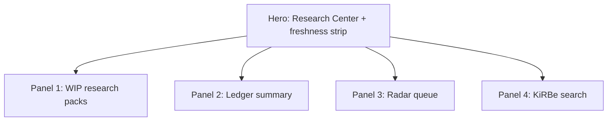

# Research Center page spec — `/research-center` (HLK-ERP v1)

Operator approval gate before P7 build. Anchors: I65 planning workspace BFF pattern, I62 Mission Control KiRBe panel, [`three-plane-field-mapping.md`](../three-plane-field-mapping.md).

## 1. Audience and one job

| Persona | Access | Time budget | One job |
|:---|:---|:---|:---|
| Research Director | level 5+ | <60s | See ledger progress + radar queue + search vault |
| Operator / PMO | level 4+ | <90s | Scan WIP packs + freshness without opening git |
| Auditor (demo) | level 1 | <120s | Confirm read-only research surfaces exist |

**Read-only v1.** No canonical edits from UI (D-IH-96-B).

## 2. Four-panel layout

### Panel 1 — WIP research packs

| Field | Source | Display |
|:---|:---|:---|
| Pack slug | GitHub Contents `docs/wip/intelligence/*/` | Card title |
| Last commit | GitHub API | Relative time chip |
| Parent initiative | pack frontmatter | Badge `I96` / lane id |
| Row count | optional ledger stats API | Subtitle |

**BFF:** `GET /api/research-center/wip-packs` — wraps GitHub Contents (I65 pattern).

### Panel 2 — Ledger summary

| Metric | Source |
|:---|:---|
| Total rows | `source-ledger.csv` line count |
| By prong | aggregated BL-* counts |
| Last tranche | session-recap or git log |
| Completion % | rows / 950 charter budget |

**BFF:** `GET /api/research-center/ledger-stats`

### Panel 3 — Radar queue

| Column | Source |
|:---|:---|
| Target | `INTELLIGENCEOPS_REGISTER.csv` |
| Staleness posture | `block_govern` highlight |
| next_verify_by | date chip |
| volatility_class | badge |

**BFF:** `GET /api/research-center/radar-queue` — reads register CSV or cached mirror.

### Panel 4 — KiRBe search

| Element | Source |
|:---|:---|
| Search input | client component |
| Results | `lib/services/kirbe.ts` → `/api/kirbe/*` |
| Health badge | `/api/kirbe/health` |

Reuse existing KiRBe BFF; no new KiRBe routes in v1.

## 3. Freshness badges (hero strip)

| Badge | Probe | Stale threshold |
|:---|:---|:---|
| Ledger | git commit age of ledger file | >7d warning |
| Radar | min `next_verify_by` in queue | overdue = red |
| KiRBe | health endpoint | unhealthy = red |
| Mirrors | optional drift flag | OPS-86-32 class |

## 4. RBAC

Map to `baseline_organisation.access_level`:

| Route | Min level |
|:---|:---|
| `/research-center` | 4 (operator) |
| `/api/research-center/*` | 4 |
| KiRBe search | 4 (existing kirbe matrix) |

## 5. Anti-patterns rejected

- Duplicate I89 persona rollup panels
- Write path to canonical CSV from ERP
- Merging KiRBe Neo4j with AKOS graph UI
- Placeholder cards without data hooks (current stub)

## 6. Verification (P7)

- Playwright smoke `/research-center` — four panels render with data or honest empty states
- Multi-viewport 375 / 768 / 1280
- `/api/kirbe/health` reflected in hero strip

## 7. Handoff

I92 expands [`92-hlk-erp-reassess-dashboard/master-roadmap.md`](../../92-hlk-erp-reassess-dashboard/master-roadmap.md) with I96-P6 as P1 dependency.
