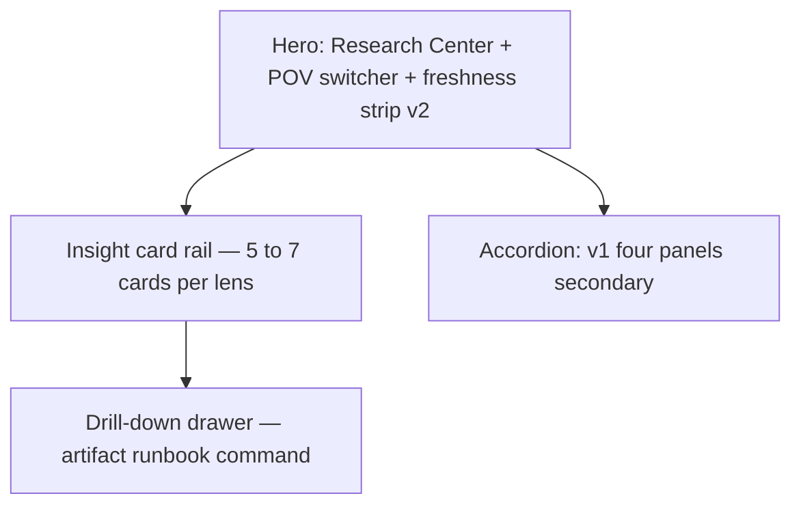

# Research Center page spec v2 — insight machine (HLK-ERP)

Operator approval gate before **P10-v2-implementation**. Extends v1 four-panel read-only shell (D-IH-96-B). Topic research packs (I96 consumer): [`governed-actionable-analytics-surfaces-2026-06-12/`](../../../intelligence/governed-actionable-analytics-surfaces-2026-06-12/) (insight machine taxonomy); [`governed-operator-journey-ux-uat-2026-06-12/`](../../../intelligence/governed-operator-journey-ux-uat-2026-06-12/) (content disposition + journey + UAT loop).

## 1. One job (v2)

**From any POV lens, show the highest-priority governed actions for research program health in under 90 seconds — with drill-down to artifacts and runbooks, not raw counts alone.**

Read-only. No canonical CSV writes from ERP.

### P10 priority #1 — remediation cards (binding)

Before any other insight types render, the Operator lens (and Director lens when env gaps block program metrics) MUST surface **remediation cards** for v1 UAT failures:

| Remediation ID | v1 gap | Card requirement |
|:---|:---|:---|
| `remediation-ledger-zero` | Ledger panel 0 rows | Explain BFF vs git path; CTA to ledger validator or env fix |
| `remediation-radar-empty` | Radar queue empty | Distinguish empty register vs error; CTA to radar sweep |
| `remediation-kirbe-unhealthy` | KiRBe red | Env + DB view remediation; I83 handoff link |

Remediation cards use `type: remediation` and `severity: critical` until resolved or labeled `source: fixture` on localhost.

## 2. Layout — multi-POV (not four static panels first)

### 2.1 POV switcher

| Lens | Label (UI) | Default sort | Min cards when data exists |
|:---|:---|:---|:---|
| Director | Director | intent-criticality desc | 3 |
| Operator | Operator | staleness overdue first | 3 |
| Auditor | Auditor | evidence + RBAC | 2 |
| Finance | Finance | settlement risk | 2 |
| Compliance | Compliance | block_govern + drift | 3 |

**Control:** Segmented control in hero; persists in session storage; URL query `?pov=operator` shareable.

**RBAC:** Route still requires level 4+; Auditor lens available at level 1+ **read-only demo mode** with redacted CTAs (commands shown as doc links only).

### 2.2 Insight card (actionable BI unit)

Each card MUST include:

| Field | Rule |
|:---|:---|
| **Headline** | Plain language outcome ("Radar target overdue — governance blocked") |
| **Severity** | info / warning / critical — maps to badge color |
| **Type chip** | staleness \| drift \| intent-criticality \| settlement-risk \| env \| evidence |
| **One-line detail** | Why now (date, threshold, env) |
| **Primary CTA** | Verb + object ("Run radar sweep", "Open ledger validator") |
| **Drill-down** | Opens drawer with three-plane mapping link |

**Anti-pattern rejected:** cards that only restate v1 panel metrics without CTA.

### 2.6 Content disposition (GOJ-UX-UAT — operator ratified 2026-06-12)

Every insight card and drawer section follows the **governed operator journey — UX design + UAT loop** ([`governed-operator-journey-ux-uat-2026-06-12/`](../../../intelligence/governed-operator-journey-ux-uat-2026-06-12/)). Binding rules:

**Plain language first on the card face; govern codes and raw metrics live in tiered surfaces below.**

#### Tier model (T0 → T3)

| Tier | Surface | Operator job | Default visibility |
|:---|:---|:---|:---|
| **T0 Glance** | Card face + freshness strip | Scan ≤7 cards; pick one action | Always visible |
| **T1 Act** | Drawer upper (side sheet) | Run, open, fix — outcome before command | On drill-down or primary CTA |
| **T2 Govern** | Drawer lower | Three-plane row, SOP link, optional phase hook | Same drawer; scroll if needed |
| **T3 Audit** | v1 accordion panels | Raw counts, IDs, register excerpts | **Collapsed** default |

Progressive disclosure: max **two** operator steps for the happy path (glance → act → govern). Accordion is expert/audit tier — not required to clear a remediation card.

#### Resource placement registry

| Resource | Tier | Surface | Actionable? |
|:---|:---|:---|:---|
| Plain outcome headline | T0 | Card face | Yes — orients |
| Severity + type chip | T0 | Card face | Yes — prioritizes |
| One-line when/why | T0 | Card face | Yes — urgency |
| Primary CTA | T0 | Card face | **Yes — act** |
| Freshness strip + micro-CTA | T0 | Hero strip | **Yes — act** |
| Runbook outcome + when + command | T1 | Drawer §Runbook | **Yes — copy/run** |
| Govern artifact (human name + path) | T1–T2 | Drawer §Artifact | **Yes — open route** |
| Three-plane mapping row | T2 | Drawer §Three-plane | Read + navigate |
| SOP functional name + paired runbook | T2 | Drawer §Runbook footer | **Yes — read SOP** |
| Initiative hook (program + phase) | T2 | Drawer footer optional | Review phase |
| Decision ID / initiative code alone | T3 | Accordion only | **Audit-only** |
| Raw panel counts / BFF vs git | T3 | Accordion (v1 panels) | **Audit-only** |
| Validator output / manifest sha256 | T3 | UAT manifest | **Audit-only** |

SSOT: tier rules authoritative in [`research-synthesis-2026-06-12.md`](../../../intelligence/governed-operator-journey-ux-uat-2026-06-12/research-synthesis-2026-06-12.md) §tiered resource disposition; **UX discipline** (`UX_DISCIPLINE.md`) owns component/IA mechanics only — not this registry.

#### Card question framework

| Question | Field | Tier | Rule |
|:---|:---|:---|:---|
| **What** | Headline | T0 | Plain outcome ≤12 words |
| **When** | One-line detail | T0 | Date, threshold, or env state |
| **Why** | Severity + detail | T0 | Program-health consequence |
| **How** | Primary CTA + drawer | T0 + T1 | Verb + object; runbook shows outcome first |

#### Anti-jargon (binding)

- **Ban initiative codes alone** on T0/T1 — `I96`, `P10`, `D-IH-*` never on card face or drawer headline.
- **Functional discipline name required** when citing a govern artifact at T1–T2 (e.g. "Research staleness queue (research radar discipline)").
- **T3 accordion** may show codes **with** functional names for audit traceability.
- **`initiative_hook` drawer footer optional** — T2 phase reference only; never the headline.

#### CTA taxonomy

| `cta_kind` | Operator can | Label pattern | Drawer minimum |
|:---|:---|:---|:---|
| `runbook` | Copy command + run | Run / Sweep / Validate + object | Outcome + when + command + SOP link |
| `artifact` | Open route | Open + human artifact name | Path + three-plane row |
| `env_fix` | Open env checklist | Fix + subsystem | Env checklist + handoff link |
| `initiative_phase` | Review program phase | Review + **program functional name** | Phase purpose + roadmap link |
| `doc_link` | Read SOP | Read + SOP functional name | Paired SOP + runbook |
| `ticket` | File OPS / issue | Log + gap type | Pre-filled context + tracker link |

**Audit-only (T3):** raw metrics, register schema, decision IDs without plain summary, validator stdout — no primary CTA.

#### Navigation path (tranche 2 lenses)

Sign-in (dev-password **or** magic-link) → Research Center hero → POV lens (Operator or Director first) → insight rail (≤7 cards, T0) → primary CTA or drill-down → drawer (T1 runbook → T2 govern) → verify via freshness strip or card clearance. Accordion (T3) optional for audit.

**P10 tranche 2** implements tiered disposition copy only — **blocked until P9b Figma hi-fi** operator ratify.

Example CTAs by discipline:

| Discipline (functional name) | CTA pattern |
|:---|:---|
| Research radar (staleness queue discipline) | Link to runbook + `research_radar_sweep.py` command text |
| Intent-ranked regression (value-ordered sweep) | Open initiative phase + ICS-ranked finding |
| Quality Fabric (five-axis quality bar) | Link to UAT/evidence manifest gap |
| FINOPS ops (finance registers + recon) | Route to FINOPS dashboard or recon SOP |
| Deploy health (consumer-repo smoke discipline) | Vercel/Render check + deploy ID |

### 2.3 Drill-down drawer

| Section | Content |
|:---|:---|
| Summary | Repeat headline + severity rationale |
| Three-plane | Table row from [`three-plane-field-mapping.md`](../three-plane-field-mapping.md) |
| Govern artifact | Clickable repo path (GitHub link pattern) |
| Runbook | **Outcome** + **When** + **Command** (`py scripts/...`) + paired SOP functional name |
| Initiative hook | Optional footer — program functional name + phase; never headline |

### 2.4 v1 panels (secondary)

Four v1 panels move to **collapsible accordion** below insight rail — default **collapsed** on desktop; expanded on first visit per session optional (localStorage).

Preserves v1 UAT investment; avoids duplicate hero metrics.

### 2.5 Freshness strip v2

Each badge: **label + status + why + micro-CTA** (not color alone).

| Badge | v2 addition |
|:---|:---|
| Ledger | "483 rows in git; 0 in BFF — env path" + CTA |
| Radar | "N overdue / M current" + sweep CTA |
| KiRBe | Health + env remediation card link |

## 3. BFF contracts (v2 additions)

| Endpoint | Purpose |
|:---|:---|
| `GET /api/research-center/insights?pov=` | Ranked insight cards |
| `GET /api/research-center/insights/:id` | Drill-down payload |
| v1 endpoints | Unchanged — power accordion panels |

See [`implementation-spec-2026-06-12.md`](../../../intelligence/governed-actionable-analytics-surfaces-2026-06-12/implementation-spec-2026-06-12.md) for schema.

## 4. Three-plane field mapping links

Every insight type MUST map to a row in [`three-plane-field-mapping.md`](../three-plane-field-mapping.md):

| Insight type | Govern source | Experience surface |
|:---|:---|:---|
| Staleness | INTELLIGENCEOPS_REGISTER + radar sweep | Radar panel + insight card |
| Drift | git vs mirror freshness | Freshness strip + drift card |
| Intent-criticality | planning initiative ICS / regression outputs | Director lens cards |
| Settlement risk | FINOPS registers | Finance lens cards |
| Env / deploy | KiRBe health, deploy registry | Operator lens cards |

## 5. Mockup gate (P9 complete)

**AIC design pipeline (2026-06-12):** Excalidraw wireframes (seat 1, done) → Figma mint (seat 2, AIC-owned) → Next.js + Impeccable (seat 3). Operator **inline-ratifies preview URL**; does not construct mockups.

| Asset | Location |
|:---|:---|
| Excalidraw wireframes | Scene [`2yBmIbavOEj`](https://app.excalidraw.com/s/9pWFxghRFBg/2yBmIbavOEj) — hero/POV/freshness, remediation trio, Operator lens + drawer |
| AIC design pipeline handoff | [`research-center-aic-design-pipeline-handoff-2026-06-12.md`](research-center-aic-design-pipeline-handoff-2026-06-12.md) |
| Figma file | AIC execution seat mint; registry row draft in handoff doc (CSV gate pending); Composio `figma` blocked until connected |

**Excalidraw+** satisfies engineering wireframe gate for P10 start. **Figma** URL (AIC-minted) required before P11 Quality Fabric divergence row.

## 5.1 Next.js UI library (hlk-erp)

Audit of `root_cd/hlk-erp/package.json` (Next.js 14 App Router):

| Library | Status | v2 use |
|:---|:---|:---|
| **shadcn/ui** (Radix + CVA) | In-repo pattern | Card rail, Badge severity, Sheet drawer, POV Tabs |
| **Recharts** | Dependency present | Drill-down sparklines only — not glance rail |
| **TanStack Table + Query** | Dependencies present | Drawer evidence tables; BFF caching |
| **Tremor** | Not installed | **Deferred** — P9 docs spike: use shadcn Card for rail; Recharts in drawer only |

Governance: `thi_tech_dtp_1` → `env_tech_dtp_8` (Components UI Development) + `env_mkt_dtp_7` (High-Level Web design) + `thi_mkt_dtp_19` (Analytics).

See [`implementation-spec-2026-06-12.md`](../../../intelligence/governed-actionable-analytics-surfaces-2026-06-12/implementation-spec-2026-06-12.md) for P10 handoff.

## 6. RBAC (unchanged from v1)

| Route | Min level |
|:---|:---|
| `/research-center` | 4 (operator); lens demo redaction at 1+ |
| `/api/research-center/*` | 4 |

## 7. Verification (P11-v2-uat)

| Check | Bar |
|:---|:---|
| Each lens renders ≥1 card with CTA | localhost seeded or live |
| Drill-down shows three-plane row | CDP text or snapshot |
| v1 accordion regression | four panels still reachable |
| Multi-viewport | 375 / 768 / 1280 per lens sample |
| Manifest | `artifacts/uat-screenshots/i96-research-center-v2-*` |

## 8. Handoff

- **I92** — implementation owner
- **I96** — spec + insight taxonomy + UAT v2
- Ratify at **P9-pov-spec-ratify** before **P10-v2-implementation**

## Cross-references

- v1 spec: [`research-center-page-spec-2026-06-11.md`](research-center-page-spec-2026-06-11.md)
- Topic research (analytics): [`governed-actionable-analytics-surfaces-2026-06-12/`](../../../intelligence/governed-actionable-analytics-surfaces-2026-06-12/)
- Topic research (journey + UAT loop): [`governed-operator-journey-ux-uat-2026-06-12/`](../../../intelligence/governed-operator-journey-ux-uat-2026-06-12/)
- Synthesis: [`research-synthesis-2026-06-12.md`](../../../intelligence/governed-actionable-analytics-surfaces-2026-06-12/research-synthesis-2026-06-12.md)
- v1 UAT: [`uat-i96-research-center-browser-2026-06-11.md`](uat-i96-research-center-browser-2026-06-11.md)
- v2 UAT charter: [`uat-i96-research-center-v2-charter-2026-06-12.md`](uat-i96-research-center-v2-charter-2026-06-12.md)
