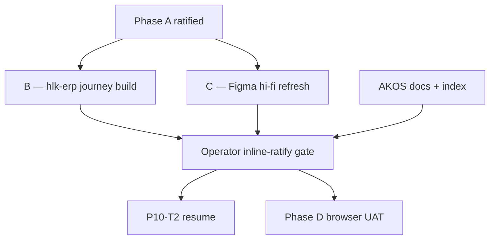

# Research Center Phase B+C — unified insight-machine tranche (2026-06-12)

> **Purpose:** One bounded tranche that turns Research Center v2 from a **remediation card grid** into a **governed insight machine**: profile-aware journey surfaces (discover → triage → act → audit), live BFF data, and Figma hi-fi that matches localhost — not parallel design and code drift.

**Assumption:** Phase A (visual polish + broken fixes) is **operator-ratified**. Prong SSOT fix is **complete** ([`p9b-prong-ssot-fix-2026-06-13.md`](p9b-prong-ssot-fix-2026-06-13.md)).

## What changes vs the original P9b plan

The original revision plan split **Phase B** (hlk-erp journey components) and **Phase C** (Figma refresh) sequentially. This unified tranche **locks them together**:

| Old shape | Unified B+C shape |
|:---|:---|
| B builds components; C redraws Figma after | **B2/C1 run in parallel** — Figma frames use matrix copy; code implements same component IDs |
| Card grid = remediation only | **T2 widgets** per journey matrix (staleness, ICS, prong, phase blocker) |
| Freshness strip = status pills | **FreshnessStripV2** with micro-CTAs on every lens |
| CTAs open drawer only | Primary CTA **acts** (Phase A); drawer = secondary detail |
| Fixture cards on localhost | **Gate B (D-IH-96-G): live-only** — `LensEmptyState`, not fixture cards |

Phase D (browser UAT manifest) stays **after** this tranche's operator ratify gate — not in scope for the B+C commit bundle, but the **experiential UAT ladder** below defines what ratify must prove.

## Insight-machine definition (PASS bar)

An operator landing on `/research-center` can, in **≤90 seconds**:

1. **Discover** (≤15s) — pick POV, read freshness strip with **why + micro-CTA**, see prong coverage (all lenses — D-IH-96-H).
2. **Triage** (≤45s) — scan ≤7 cards sorted by POV policy; every card has plain headline + **primary CTA** (not metrics alone).
3. **Act** — runbook copy, open artifact, or env fix without opening five other tools.
4. **Audit** (optional) — accordion T3 collapsed; codes only with functional names.

**Anti-pattern rejected:** prettier remediation grid with no staleness/ICS/prong/phase widgets ([`journey-component-matrix-2026-06-12.md`](../../../intelligence/governed-operator-journey-ux-uat-2026-06-12/journey-component-matrix-2026-06-12.md) §Anti-patterns).

---

## Three workstreams



| Workstream | Owner | Repo / tool | Delivers |
|:---|:---|:---|:---|
| **B — Build** | Execution seat (Composer) | `root_cd/hlk-erp` | Journey chrome + T2 Operator/Director widgets + T3 stubs + BFF ranking |
| **C — Design SSOT** | AIC (Figma MCP) | Figma `GTCcxT0DbEWdnVHXyrde73` | Matrix-driven frames; tier T0/T1/T2 zones; 375 parity |
| **AKOS — Traceability** | Execution seat | `openclaw-akos` | This plan, check-links, files-modified, optional GOJ ledger row if copy touched |

**No new npm deps.** Extend existing shadcn / BFF patterns only ([`research-center-page-spec-v2-2026-06-12.md`](research-center-page-spec-v2-2026-06-12.md) §5.1).

---

## Phase B — hlk-erp (journey-aware build)

### B.0 Prerequisites (hard)

| Prerequisite | Evidence |
|:---|:---|
| Phase A operator verify @ 375/768/1280 | Revision manifest or operator sign-off |
| hlk-erp Research Center bundle committed | Sibling repo clean commit |
| Journey matrix final | [`journey-component-matrix-2026-06-12.md`](../../../intelligence/governed-operator-journey-ux-uat-2026-06-12/journey-component-matrix-2026-06-12.md) |
| Prong aggregates match git | [`p9b-prong-ssot-fix-2026-06-13.md`](p9b-prong-ssot-fix-2026-06-13.md) |

### B.1 Shared journey chrome (all five POV)

| Component ID | Journey stage | File (hlk-erp) | Spec |
|:---|:---|:---|:---|
| `JourneyStepIndicator` | Discover | `components/research-center/journey-step-indicator.tsx` | Discover → Triage → Act → Verify; highlight current |
| `FreshnessStripV2` | Discover | `freshness-strip.tsx` (extend) | Per-badge label + status + **why** + `micro_cta_kind` |
| `ProngCoverageStrip` | Discover | `components/research-center/prong-coverage-strip.tsx` | BL-* chips + counts; **all lenses** (D-IH-96-H) |
| `InsightRailHeader` | Triage | `insight-card-rail.tsx` | Lens label + count + "≤7 signals" hint |
| `VerifyBanner` | Act → Verify | `components/research-center/verify-banner.tsx` | Post-CTA freshness re-check prompt |

### B.2 Operator lens — T2 tactical (build first)

| Component ID | Matrix row | BFF `type` | Min when live |
|:---|:---|:---|:---|
| `RemediationPriorityStack` | Remediation trio | `remediation` | 1 (when env gap) |
| `StalenessOverdueCard` | Staleness overdue | `staleness` | 1 |
| `MirrorDriftCard` | Mirror drift | `drift` | 0 (conditional) |
| `EnvDeployGapCard` | Env / deploy | `env_deploy` | 0 |
| `WipPackStaleCard` | WIP pack stale | `staleness` | 0 |
| `RunbookCopyBlock` | Drawer T1 | — | 1 on drill-down |

**Sort order (binding):** `remediation > staleness > env_deploy > drift` ([`research-synthesis-journey-ui-2026-06-12.md`](../../../intelligence/governed-operator-journey-ux-uat-2026-06-12/research-synthesis-journey-ui-2026-06-12.md) §2).

### B.3 Director lens — T2 tactical

| Component ID | Matrix row | BFF `type` | Min when live |
|:---|:---|:---|:---|
| `IntentCriticalityCard` | ICS top | `intent_criticality` | 1 |
| `LedgerCompletionCard` | Ledger completion % | `intent_criticality` | 1 |
| `PhaseBlockerCard` | Phase blocker | `intent_criticality` | 1 |
| `ProgramHealthSummary` | Program health chip | — | 0 |
| `ResearchPackStaleCard` | Pack staleness | `staleness` | 0 |

**Sort order:** `intent_criticality > ledger_completion > phase_blocker > remediation (when BFF untrusted)`.

### B.4 Auditor / Finance / Compliance — T3 stubs only

Scope cap per R-P9b-02 — no full FINOPS/compliance build in B+C.

| Lens | Component | Behavior |
|:---|:---|:---|
| Auditor | `ReadOnlyCtaBanner` | Commands → doc links; `cta_redacted` |
| Auditor | `LensEmptyState` | "Switch to Operator" / manifest link |
| Finance | `SettlementRiskPlaceholder` | FINOPS forward pointer + doc-link CTA |
| Compliance | `BlockGovernPlaceholder` | block_govern posture + validator CTA |

### B.5 BFF alignment (`lib/research-center/`)

| Work | File | Rule |
|:---|:---|:---|
| POV-aware ranking | `insights.ts` | Sort keys per matrix §BFF hooks |
| Non-remediation cards | `insights.ts` | Director: ICS, ledger %, phase blocker; Operator: staleness, env |
| Prong breakdown | `ledger-stats.ts` | Top prongs match `validate_research_action.py` |
| Freshness micro-CTAs | `freshness.ts` or strip payload | `micro_cta_kind`: runbook / env_fix / artifact |
| Drill-down tiers | `insight-card-rail.tsx` | T1 RunbookCopyBlock; T2 three-plane; T3 collapsible paths |
| Live-only T2 | all card builders | **No `source: fixture`** on operator card face (D-IH-96-G) |

**No new endpoints** unless `insights/:id` payload needs tier fields — prefer extending existing `/api/research-center/insights`.

### B.6 Verification (B stream)

```powershell
cd root_cd/hlk-erp
npm run typecheck
npm run lint
npx playwright test --grep research-center
```

Manual: Operator + Director @ 375/768/1280 — journey step indicator visible; ≥3 non-remediation cards on Director when git data available; strip micro-CTA fires.

---

## Phase C — Figma hi-fi refresh (design SSOT)

**Owner:** AIC execution seat (Figma MCP)  
**File:** https://www.figma.com/design/GTCcxT0DbEWdnVHXyrde73/Holistika-ERP-Research-Center-v2  
**Prerequisite:** B.1 chrome names frozen OR localhost screenshots from B.1 for pixel reference.

### C.1 Required frames (matrix-driven copy)

| Frame ID | Viewport | Must show (insight machine) |
|:---|:---|:---|
| `RC-POV-Operator-1280` | 1280 | Journey indicator; strip v2 + micro-CTAs; prong strip; remediation **stack** + staleness card; ≤7 cap |
| `RC-POV-Director-1280` | 1280 | ICS card + ledger completion + phase blocker; prong strip |
| `RC-POV-Auditor-1280` | 1280 | Read-only CTA banner; empty-state pattern |
| `RC-POV-Finance-1280` | 1280 | Settlement risk placeholder |
| `RC-POV-Compliance-1280` | 1280 | block_govern placeholder |
| `RC-Drawer-Open-1280` | 1280 | T1 outcome→when→command; T2 three-plane; T3 collapsed |
| `RC-Operator-375` | 375 | Select POV; vertical strip; stacked rail; bottom-sheet drawer |

Each frame annotates **T0 / T1 / T2 zones** per GOJ synthesis ([`research-synthesis-journey-ui-2026-06-12.md`](../../../intelligence/governed-operator-journey-ux-uat-2026-06-12/research-synthesis-journey-ui-2026-06-12.md) §Design rec #1).

### C.2 Figma parity checklist

- [ ] Spacing rhythm: hero `space-y-4`, rail `mt-6`, accordion `mt-10 border-t` (matches IF-02)
- [ ] Severity = Badge variant only — no side-stripe borders (Impeccable ban)
- [ ] ≤7 cards visible without scroll @1280 Operator
- [ ] Strict T3 — no `I96` / `D-IH-*` on card face or drawer title
- [ ] Dark-mode token story documented (ERP may stay light-first)
- [ ] Gate A copy on all five POV @1280 (D-IH-96-F)

### C.3 Design gate

`gate_type: inline-ratify` — operator approves Figma preview URLs **and** localhost parity "good enough to resume P10-T2".  
**FIGMA_FILES_REGISTRY.csv** remains separate canonical-CSV commit (operator approval).

---

## AKOS docs workstream (same tranche)

| Artifact | Action |
|:---|:---|
| This plan | Mint at `reports/research-center-phase-bc-tranche-plan-2026-06-12.md` |
| [`master-roadmap.md`](../master-roadmap.md) | Brief P9b status update (see patch below) |
| [`operator-check-links-2026-06-12.md`](operator-check-links-2026-06-12.md) | Add B+C section + ratify gate row |
| [`files-modified.csv`](../files-modified.csv) | Append rows for touched planning files |
| GOJ `source-ledger.csv` | Only if BFF copy cites new external patterns — run validator |

```powershell
py scripts/verify.py pre_commit_fast
py scripts/validate_research_action.py --source-ledger docs/wip/intelligence/governed-operator-journey-ux-uat-2026-06-12/source-ledger.csv
```

---

## Experiential UAT ladder (MADEIRA layers → ratify)

Ratify requires **L0–L3 PASS**; L4–L6 are Phase D / P11 closure.

| Level | Layer | Command / action | PASS criteria |
|:---|:---|:---|:---|
| **L0** | Mechanical | `npm run typecheck`; `npm run lint`; Playwright `--grep research-center` | All green |
| **L1** | Journey smoke | Localhost Operator @1280 — 4 stage screenshots | Discover/triage/act/audit components visible per matrix |
| **L2** | Per-lens T2 | Operator + Director dedicated walks @1280 | ≥3 cards each with working primary CTA; sort order correct |
| **L3** | Figma parity | Side-by-side Figma vs localhost Operator+Director | "Good enough" — operator inline-ratify |
| **L4** | Dual auth | dev-password + magic-link paths | Both reach Research Center (P11 charter) |
| **L5** | Impeccable | Disposition IF-01..IF-10 vs revision baseline | No FAIL on layout/journey (copy may PASS-WITH-FOLLOWUP) |
| **L6** | axe | `a11y.spec.ts` or Python 3.12 axe | Severity not color-only |

Manifest folder (Phase D): `artifacts/uat-screenshots/i96-research-center-v2-bc-2026-06-12/` with prefixes `journey-operator-discover-*`, `journey-director-triage-*`, etc.

Cross-ref: [`aic-madeira-experiential-uat-2026-06-11/charter.md`](../../../intelligence/aic-madeira-experiential-uat-2026-06-11/charter.md), [`uat-i96-research-center-v2-charter-2026-06-12.md`](uat-i96-research-center-v2-charter-2026-06-12.md).

---

## Operator ratify gate (`gate_type: inline-ratify`)

**When:** B.1–B.5 merged (or localhost frozen) **and** C.1 frames updated.

**Evidence packet:**

1. Figma URLs — five POV @1280 + drawer + Operator @375 ([check-links](operator-check-links-2026-06-12.md))
2. Localhost URLs — `?pov=operator` and `?pov=director` after B stream
3. L1 journey screenshot set (4 minimum)
4. One-line delta vs rejected P9b: "what is no longer a card grid only"

**AskQuestion options (recommended default first):**

| Option | Meaning |
|:---|:---|
| **A — Ratify B+C; resume P10-T2** | Insight machine bar met for Operator+Director; Auditor/Finance/Compliance stubs acceptable |
| **B — Ratify Figma only; BFF follow-up** | Design locked; live data gaps tracked in P10-T2.1 |
| **C — Rework B stream** | Localhost still card-grid / journey chrome missing — return to B.2 |
| **D — Rework C stream** | Figma drift from matrix — return to C.1 |

**Hard gates already on record (do not re-ask):** D-IH-96-F (frame content), D-IH-96-G (live-only T2), D-IH-96-H (prong strip all lenses).

---

## P9b revision complete criteria (after ratify + Phase D)

- Operator inline-ratify option **A**
- Manifest + check-links updated
- `master-roadmap.md` P9b → **revision complete**
- P10-T2 **unpaused** in GOJ implementation-spec
- P11 charter prerequisites checked

---

## Risk register (B+C specific)

| ID | Risk | Mitigation |
|:---|:---|:---|
| R-BC-01 | Figma ↔ localhost drift | Parallel B2/C1; ratify requires both |
| R-BC-02 | Live-only leaves empty Director rail | `LensEmptyState` + prong strip still populate from git |
| R-BC-03 | Scope creep into P10-T3 full lenses | B.4 stubs only |
| R-BC-04 | ICS data not wired | Phase blocker + ledger cards from git aggregates first |

---

## Cross-references

- Prior revision plan: [`p9b-revision-tranche-plan-2026-06-12.md`](p9b-revision-tranche-plan-2026-06-12.md)
- Phase A status: [`p9b-phase-a-status-2026-06-13.md`](p9b-phase-a-status-2026-06-13.md)
- Page spec v2: [`research-center-page-spec-v2-2026-06-12.md`](research-center-page-spec-v2-2026-06-12.md)
- Journey matrix: [`journey-component-matrix-2026-06-12.md`](../../../intelligence/governed-operator-journey-ux-uat-2026-06-12/journey-component-matrix-2026-06-12.md)
- Analytics handoff: [`implementation-spec-2026-06-12.md`](../../../intelligence/governed-actionable-analytics-surfaces-2026-06-12/implementation-spec-2026-06-12.md)
- SSOT promotion: [`i96-ssot-promotion-path-2026-06-12.md`](i96-ssot-promotion-path-2026-06-12.md)
