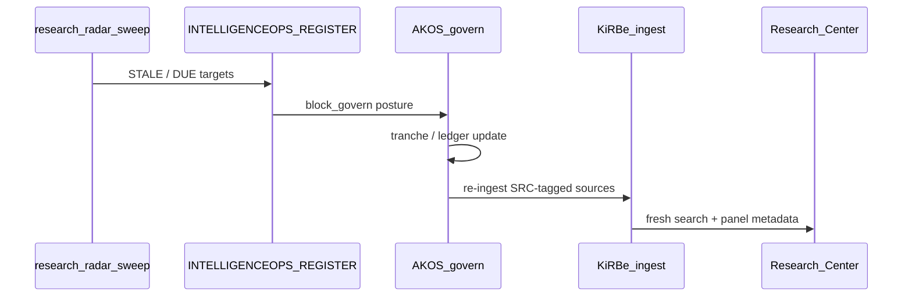

# Staleness loop specification

Anti-staleness: **Research Radar drives re-ingest**, not calendar re-embedding alone.

## Sequence

## Triggers

| Signal | Source | Action |
|:---|:---|:---|
| `staleness_posture=block_govern` | Register row | Block govern until `next_verify_by` refreshed |
| `volatility_class=fast` | Register | Shorter verify cadence (30d default for Automation OS pack) |
| Mirror drift | `check-drift.py` / emit scripts | Operator-visible warning on ERP freshness badge |

## Outputs

| Artifact | Consumer |
|:---|:---|
| Sweep JSON/markdown report | I96 evidence-matrix |
| Updated `next_verify_by` | ERP radar panel |
| Re-embed job id | KiRBe ops log |

## Non-goals (v1)

- Automated multi-channel push (P10)
- Write path from ERP to canonical CSV
