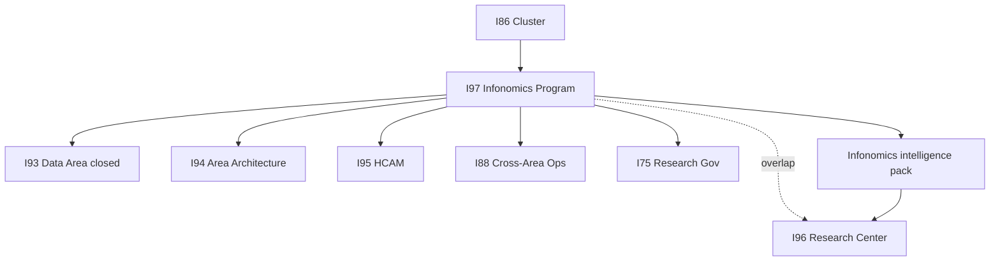

# I97 initiative cluster map

## Diagram

## Table

| ID | I97 consumes | I97 produces |
|:---|:---|:---|
| **I93** | DAMA/Data canon (closed) | Citations only — no rewrite |
| **I94** | Area maturity grid | Optional economic-value component (P6c) |
| **I95** | HCAM entity patterns | Information-asset wiring (P6) |
| **I88** | FINOPS / RevOps examples | BL-FIN / BL-OPS ledger rows |
| **I96** | Research Center UX context | Overlap ratify at P5 — not duplicate Track D |
| **I75** | Methodology + radar posture | Research Action rows |
| **I86** | Wave-close cadence | Program-line tracking |
| **I17** | Context economics | BL-ENVOY prong |
| **I67** | Pricing narrative | Forward consumer handoff |

Overlap tracker: [`../_trackers/i96-i97-infonomics-scope-overlap-tracker.md`](../_trackers/i96-i97-infonomics-scope-overlap-tracker.md).
