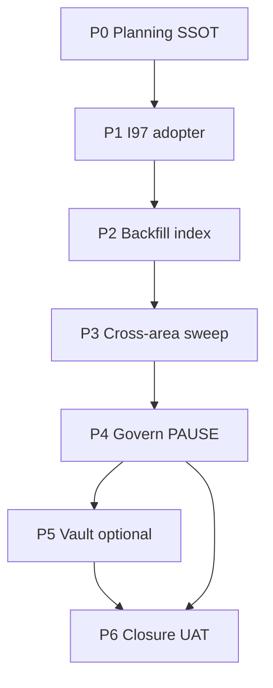

# I98 — Carryover Posture Clarity (scheduled ≠ dropped)

> **Problem.** Initiative-level status is governed (**D-IH-59-D**), but work-item language ("deferred", "forward-charter", "open") is inconsistent — humans and AIC agents confuse **scheduled after evidence** with **dropped**.
>
> **Outcome.** Layer-2 carryover posture SSOT + cross-initiative index + validator + 8-area vault/WIP sweep with operator govern gate before optional vault promotion.

## Phase dependency chain



| Phase | Purpose | Key deliverable |
|:---|:---|:---|
| **P0** | Mint SSOT + templates + rules | `carryover_posture.py`, index stub, validator |
| **P1** | I97 first adopter | Scheduled rows for D-IH-97-E/F/G |
| **P2** | Backfill ~30 high-signal items | `p2-backfill-2026-06-12.md` |
| **P3** | 8-area vault+WIP sweep | `p3-cross-area-sweep-2026-06-12.md` |
| **P4** | Operator inline-ratify | `p4-govern-ratify-2026-06-12.md` |
| **P5** | Vault optional (gated) | SOP extension OR stay planning-only |
| **P6** | Closure UAT + index sync | `uat-i98-carryover-posture-2026-06-12.md` |

## Verification

```powershell
py scripts/validate_carryover_posture.py --self-test
py scripts/validate_carryover_posture.py --index docs/wip/planning/_trackers/carryover-posture-index.md
py scripts/render_wip_dashboard.py
```

## Cross-references

- Index: [`../_trackers/carryover-posture-index.md`](../_trackers/carryover-posture-index.md)
- Row template: [`../_templates/carryover-posture-row.md`](../_templates/carryover-posture-row.md)
- Precedent: [`akos/planning/status_taxonomy.py`](../../../akos/planning/status_taxonomy.py)
