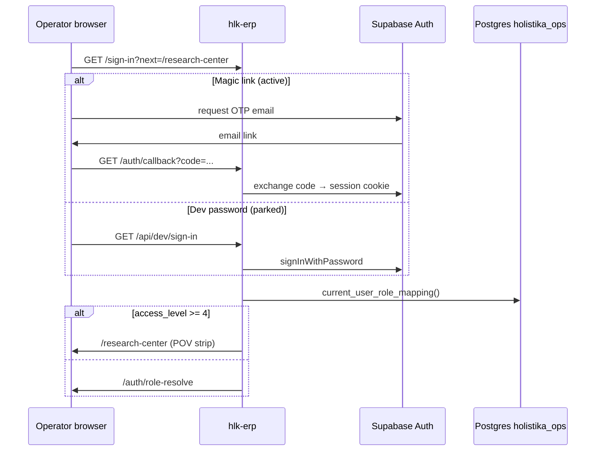

# Auth registry + I96 consumer spec (I99 P2)

> **Purpose.** Govern **Supabase Auth** (module **SUPA-MOD-22**) with a first-class registry dimension — providers, redirect URLs, hooks, SMTP, and post-auth RBAC — bound to **I96 Research Center** as the first consumer. This is **planning + draft CSV only** until **P5** operator gate.

## Outcome

Operators and AIC can answer, without opening the Supabase dashboard ad hoc:

1. Which sign-in paths are **active**, **parked**, or **scheduled**?
2. Which redirect URLs must exist for Preview vs Production?
3. Which live auth triggers are **drift** vs git SSOT?
4. What happens after sign-in before `/research-center` renders?

---

## 1. Registry shape (proposed for P5)

**Canonical path (target):**  
`docs/references/hlk/v3.0/Admin/O5-1/Data/Architecture/canonicals/dimensions/SUPABASE_AUTH_REGISTRY.csv`

**Module row update (P5 same commit):**  
`SUPABASE_MODULE_REGISTRY.csv` SUPA-MOD-22 `repo_artifact` → `dimensions/SUPABASE_AUTH_REGISTRY.csv`; `governed_status` → `governed`.

| Column | Meaning |
|:---|:---|
| `auth_row_id` | Stable ID `SUPA-AUTH-NN` |
| `row_kind` | `provider` \| `redirect_url` \| `hook` \| `smtp` \| `email_template` \| `session_policy` \| `rbac_post_auth` \| `consumer_route` \| `env_var` |
| `surface_key` | Short functional name (e.g. `email_magic_link`, `prod_callback`) |
| `config_surface` | Dashboard path, migration, or hlk-erp env |
| `consumer_initiative` | `INIT-OPENCLAW_AKOS-96` where applicable |
| `consumer_binding` | URL, route, or RPC name |
| `posture` | `active` \| `scheduled` \| `parked` \| `drift` |
| `owner_role` | From `baseline_organisation.csv` |
| `last_review_decision_id` | Decision trace |
| `notes` | Operator-readable context |

**Draft rows:** [`../drafts/SUPABASE_AUTH_REGISTRY.draft.csv`](../drafts/SUPABASE_AUTH_REGISTRY.draft.csv) (16 rows, 2026-06-13).

**P5 companion surfaces (same atomic commit per specialty mint):**

- Pydantic model + `validate_supabase_auth_registry.py`
- `CANONICAL_REGISTRY.csv` + `CANONICAL_GOVERNANCE_REGISTRY.csv` rows
- `PRECEDENCE.md` mirror row
- Paired SOP/runbook under Data Architecture area
- `process_list` row for auth registry maintenance

---

## 2. I96 consumer binding — sign-in to Research Center



### Active paths (operator evidence 2026-06-13)

| Path | Posture | Evidence |
|:---|:---|:---|
| **Magic link** | **active** | Operator Preview PASS on PR branch host (**D-IH-99-E**) |
| **Dev-password** | **parked** | 401 invalid credentials; OPS-96-8 — not blocking UAT |
| **Google OAuth** | **scheduled** | OPS-99-3; Workspace SSO at P5 |

### Redirect URL allow-list (operational SSOT)

Authoritative host list lives in I96 domain SSOT — I99 registry **references** these rows, does not fork URLs:

| Host | Callback | Registry row |
|:---|:---|:---|
| `erp.holistikaresearch.com` | `/auth/callback` | SUPA-AUTH-04 |
| `preview.erp.holistikaresearch.com` | `/auth/callback` | SUPA-AUTH-05 |
| PR branch `*.vercel.app` | `/auth/callback` | SUPA-AUTH-06 (+ per-PR adds) |
| `localhost:3010` | `/auth/callback` | SUPA-AUTH-07 |

**Security posture:** No `*.vercel.app` wildcard in Supabase redirect list — add explicit PR hostnames when running branch UAT.

Cross-ref: [`../../96-research-data-plane-and-research-center/reports/research-center-domain-and-cicd-ssot-2026-06-13.md`](../../96-research-data-plane-and-research-center/reports/research-center-domain-and-cicd-ssot-2026-06-13.md)

---

## 3. Auth hook drift (live DB)

Per [`../../96-research-data-plane-and-research-center/reports/supabase-live-db-health-discovery-2026-06-13.md`](../../96-research-data-plane-and-research-center/reports/supabase-live-db-health-discovery-2026-06-13.md):

| Trigger | Function | Registry row | Disposition (P5 or M2) |
|:---|:---|:---|:---|
| `on_auth_user_created` | `public.handle_public_user()` | SUPA-AUTH-11 | Migrate to git **or** retire with evidence |
| `on_auth_user_created_kirbe` | `kirbe.handle_new_auth_user()` | SUPA-AUTH-12 | Document KiRBe boundary; fix SECURITY DEFINER if kept |

**Why this matters for dev-password:** New user creation fails at Dashboard; existing users (magic link) unaffected. Parked dev-password may be env mismatch **or** trigger failure on password path — OPS-96-8 investigation optional.

**Two-plane rule:** Hook DDL changes → `supabase/migrations/` → operator SQL gate. Registry row updated in same commit as migration.

---

## 4. Blessed hlk-erp SSR contract (consumer repo)

I99 does **not** implement hlk-erp — it governs the contract AKOS blesses:

| Concern | Binding |
|:---|:---|
| Session transport | `@supabase/ssr` cookie pattern; middleware refreshes session |
| Post-auth identity | `holistika_ops.current_user_role_mapping()` RPC (git `20260612093000`) |
| Research Center gate | `access_level >= 4`; else `/auth/role-resolve` |
| Preview dev route | `/api/dev/sign-in` only when `ALLOW_PREVIEW_DEV_SIGNIN=1` and **not** Production |
| Deploy badge | `NEXT_PUBLIC_VERCEL_ENV` from `next.config.mjs` |

Consumer repo PR: [hlk-erp #36](https://github.com/FraysaXII/hlk-erp/pull/36) (B1.5 Research Center).

---

## 5. Email stack + templates (scheduled)

Near-term path per [`auth-email-and-identity-inbox-tranche-2026-06-13.md`](auth-email-and-identity-inbox-tranche-2026-06-13.md):

1. **Now:** Supabase built-in mail (SUPA-AUTH-08) — sufficient for Preview magic link.
2. **P5 tranche:** Resend SMTP (SUPA-AUTH-09) + Cloudflare Email Routing aliases.
3. **After SMTP:** Custom magic-link HTML template (SUPA-AUTH-10) — Holistika branding; no AKOS path names in operator-facing copy.

Google Workspace `admin@` remains corporate human mail; OAuth provider (SUPA-AUTH-03) is separate from SMTP sender.

---

## 6. What I99 P2 does **not** cover (I96 owns)

| Gap you saw on Preview | Owner | Tranche |
|:---|:---|:---|
| Discover/Act journey steps not clickable | I96 hlk-erp | B2.3 journey + CTA rewrite |
| CTAs open GitHub / name validator scripts | I96 hlk-erp | B2.3 `cta_kind` taxonomy |
| Empty prongs / env-gap cards | I96 BFF | B2.1 mirror-first fetchers |
| Governed read-only BI tables | I96 hlk-erp | B2.2 register DataTable routes |

**Data plane default (operator ratified implicit):** **Mirror-first, GitHub fallback** for planning ledgers until compliance mirror views are emitted — Preview should not require `GH_PAT_PLANNING_READER` when mirror rows exist.

Auth PASS ≠ product PASS (**D-IH-99-E**).

---

## 7. P2 verification (planning bar)

```powershell
# Draft integrity — row IDs unique; postures valid
py -c "import csv; from pathlib import Path; p=Path('docs/wip/planning/99-supabase-platform-eg5-tranche/drafts/SUPABASE_AUTH_REGISTRY.draft.csv'); rows=list(csv.DictReader(p.open())); assert len(rows)==len({r['auth_row_id'] for r in rows}); print(f'OK {len(rows)} rows')"

py scripts/validate_hlk.py
py scripts/validate_initiative_registry_frontmatter_sync.py
```

**P5 gate (not run now):** `AskQuestion` → mint canonical CSV + validator + PRECEDENCE in one commit.

---

## 8. Operator actions (optional, dashboard)

| Priority | Action | When |
|:---|:---|:---|
| P0 | Confirm redirect URLs SUPA-AUTH-04–07 in Supabase Dashboard | Before next magic-link UAT on new PR host |
| P1 | Keep magic link as Preview UAT path | Now |
| P2 | Resend domain + SMTP | Before Production auth mail |
| P3 | Google OAuth client + provider enable | When SSO ratified |
| P4 | Auth trigger disposition (M2/M3) | When Add-user needed or OPS-96-8 reopened |

---

## Cross-references

- I99 roadmap P2: [`../master-roadmap.md`](../master-roadmap.md)
- I96 domain SSOT: [`../../96-research-data-plane-and-research-center/reports/research-center-domain-and-cicd-ssot-2026-06-13.md`](../../96-research-data-plane-and-research-center/reports/research-center-domain-and-cicd-ssot-2026-06-13.md)
- Live DB discovery: [`../../96-research-data-plane-and-research-center/reports/supabase-live-db-health-discovery-2026-06-13.md`](../../96-research-data-plane-and-research-center/reports/supabase-live-db-health-discovery-2026-06-13.md)
- Email tranche: [`auth-email-and-identity-inbox-tranche-2026-06-13.md`](auth-email-and-identity-inbox-tranche-2026-06-13.md)
- Module SSOT: [`SUPABASE_MODULE_REGISTRY.csv`](../../../../references/hlk/v3.0/Admin/O5-1/Data/Architecture/canonicals/dimensions/SUPABASE_MODULE_REGISTRY.csv) SUPA-MOD-22
- Decision: **D-IH-99-F** (P2 draft complete)
