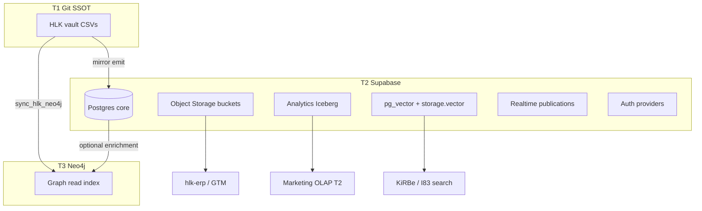

# Multi-store data plane alignment (I99 scope absorption)

> **Purpose.** Answer whether **Postgres (Supabase T2)**, **Analytics/Iceberg**, **Storage Vector**, and **Neo4j (T3)** are properly represented under Holistika data governance — and absorb Analytics + Vector into **I99 P5** (no longer `out_of_scope` in Storage draft).

## Executive answer

| Store | Tier | Governed today? | I99 role |
|:---|:---|:---|:---|
| **Git CSV canonicals** | T1 | **Yes** — `DATA_GOVERNANCE_POLICY.md`, contracts, validators | SSOT authority (unchanged) |
| **Supabase Postgres** | T2 | **Partial** — mirrors/Edge governed; Auth/Storage/Realtime ungoverned until P5 | **I99 P2–P5** closes EG-5 modules |
| **Supabase object Storage** | T2 | **Draft** — P4 bucket registry | I99 P4 + P5 DDL |
| **Supabase Analytics (Iceberg)** | T2 OLAP | **Yes at BI layer** — `BI-HOL-ANALYTICS-BUCKETS` active | **Absorbed** — linked rows in Storage registry + P5 module row |
| **pg_vector / Storage Vector** | T2 extension | **Partial** — hosted enabled; `SUPA-MOD-17` ungoverned | **Absorbed** — P5 flip + KiRBe/I83 boundary row |
| **Neo4j graph** | T3 index | **Yes at BI + articulation layer** — not a Supabase module | **Coordinate** — I91/I93 own; I99 references tier |

**Neo4j is a database but not a Supabase module.** It sits **on top of** T1/T2 as a **rebuildable read index** per `DATA_ARCHITECTURE.md` §2 — properly represented in governance policy §1 ("graph representations") and `DATA_BI_GOVERNANCE.md`, but **not** missing from I99 — it belongs to **I91 graph coverage + I93 BI registry**, with I99 providing the **Supabase-side** contract.

---

## 1. Alignment to Data Governance Policy

[`DATA_GOVERNANCE_POLICY.md`](../../../../references/hlk/v3.0/Admin/O5-1/Data/Governance/canonicals/DATA_GOVERNANCE_POLICY.md) scope (§1) already names:

- Git-canonical CSVs (T1)
- **Supabase mirrors, FDW projections, and graph representations** (T2 + T3)

**Gap before this report:** I99 P4 marked Analytics/Iceberg and Storage Vector as `out_of_scope` — that **under-represented** stores already active in `BI_CONSUMER_REGISTRY.csv` and hosted Supabase (`vector` extension enabled per P1 inventory).

**Gap (documented, not I99-owned):** `DATA_ARCHITECTURE.md` §9 still says Analytics Buckets are "non-goal until GA" while `BI-HOL-ANALYTICS-BUCKETS` is **active** and `storage.analytics` is in `config.toml`. **Scheduled** vault touch at P5 gate to reconcile §9 with `D-IH-93-J` (not dropped).

---

## 2. Three-tier + Supabase module stack



| Layer | SSOT? | Governance home | Registry / canonical |
|:---|:---|:---|:---|
| T1 | **Yes** | Data Steward / DGO | `CANONICAL_REGISTRY.csv`, contracts |
| T2 Postgres | No — projection | Database Owner + I99 | `SUPABASE_MODULE_REGISTRY.csv`, mirrors |
| T2 Storage objects | No | I99 P4/P5 | `SUPABASE_STORAGE_REGISTRY` (draft) |
| T2 Analytics Iceberg | No — OLAP projection | I93 BI + I99 link | `BI-HOL-ANALYTICS-BUCKETS`, `AREA_BI_PROFILE` |
| T2 pg_vector | No — KiRBe boundary | I99 P5 + I83 | `SUPA-MOD-17`, kirbe schema row |
| T3 Neo4j | No — rebuildable | I91 + I93 | `BI-HOL-NEO4J`, `CANONICAL_RELATIONSHIP_REGISTRY` |

**Conflict rule (unchanged):** T1 canonical wins; T2/T3 resync from T1 — `DATA_GOVERNANCE_POLICY.md` §6 + `DATA_ARCHITECTURE.md` §2.

---

## 3. Analytics / Iceberg (absorbed into I99)

| Field | Value |
|:---|:---|
| BI consumer | `BI-HOL-ANALYTICS-BUCKETS` (T2, **active**) |
| Component | `comp_i93_analytics_buckets` |
| Supabase surface | `[storage.analytics]` in `config.toml` (enabled=false locally; hosted alpha) |
| Module link | Extends **SUPA-MOD-23** Storage family — not a separate silo |
| Owner | Marketing Analytics Manager (RevOps secondary) |
| I99 posture | **scheduled** P5 — registry row + `process_list` maintenance |
| Not duplicate | I93 owns BI tier doctrine; I99 owns **Supabase module + bucket path** rows |

**Operator outcome:** Marketing OLAP and operator Storage buckets share one **Storage module governance** story at P5.

Draft rows: `SUPA-ST-20`, `SUPA-ST-25` in [`../drafts/SUPABASE_STORAGE_REGISTRY.draft.csv`](../drafts/SUPABASE_STORAGE_REGISTRY.draft.csv).

---

## 4. Storage Vector + pg_vector (absorbed into I99)

| Field | Value |
|:---|:---|
| Module | **SUPA-MOD-17** (`ext:vector`) — hosted **enabled** (P1 inventory) |
| Supabase surfaces | Postgres `vector` extension + `[storage.vector]` in config.toml |
| Consumer | **I83 / KiRBe** — embeddings live in `kirbe` schema (SUPA-MOD-07 reference-only) |
| AKOS git gap | No embedding tables in AKOS migrations — intentional app boundary |
| I99 posture | P5 → `governed_status=partial` with explicit KiRBe ownership note |

**Rule:** I99 governs **platform enablement + path registry**; KiRBe app owns **embedding table DDL** (reference-only kirbe schema row).

Draft rows: `SUPA-ST-21`, `SUPA-ST-26`.

---

## 5. Neo4j (coordinated — not Supabase)

Neo4j is **properly represented** in data governance **outside** I99 Supabase registries:

| Artifact | What it governs |
|:---|:---|
| `DATA_ARCHITECTURE.md` §2 | T3 rebuildable index; not SSOT |
| `DATA_BI_GOVERNANCE.md` | Graph index tier; Neo4j explorer T5 |
| `BI-HOL-NEO4J` / `BI-HOL-GRAPH-MCP` | Experimental BI consumers |
| `CANONICAL_RELATIONSHIP_REGISTRY.csv` | Valid triples → `neo4j_edge_type` |
| `scripts/sync_hlk_neo4j.py` | T1 → T3 projection only |
| `SOP-DATA_LINEAGE_001.md` | Lineage parity checks |
| **I91** enterprise graph store coverage | Store inventory + coverage matrix |

**I99 does not mint Neo4j bucket rows.** Coordination rule:

1. Supabase **Postgres** remains T2 relational SSOT projection (mirrors, ops tables).
2. Neo4j **never** authors compliance mirror rows — graph enrichment is optional downstream.
3. When I99 P5 adds Storage/Realtime/Auth registries, **graph parity** still runs via existing I91/I93 validators — no duplicate edge registry in I99.

**Known cross-tier consumer:** I96 Research Center BFF may eventually expose lineage questions → graph MCP (T5 experimental), not Postgres Realtime.

---

## 6. P5 absorption checklist (operator gate preview)

When P5 fires, one tranche should include:

| Registry | Rows from | Absorbs |
|:---|:---|:---|
| `SUPABASE_AUTH_REGISTRY.csv` | P2 draft | Auth |
| `SUPABASE_REALTIME_REGISTRY.csv` | P3 draft | Realtime |
| `SUPABASE_STORAGE_REGISTRY.csv` | P4 draft + ST-20..26 | Object + Analytics + Vector paths |
| `SUPABASE_MODULE_REGISTRY.csv` | D-IH-99-D eight rows | MOD-17 partial, MOD-23 governed, etc. |
| Vault touch (scheduled) | `DATA_ARCHITECTURE.md` §9 | Analytics "non-goal" line vs BI active |

---

## 7. Verification

```powershell
py scripts/validate_bi_consumer_registry.py
py scripts/validate_supabase_module_registry.py
py -c "import csv; from pathlib import Path; p=Path('docs/wip/planning/99-supabase-platform-eg5-tranche/drafts/SUPABASE_STORAGE_REGISTRY.draft.csv'); rows=list(csv.DictReader(p.open(encoding='utf-8'))); assert len(rows)==len({r['storage_row_id'] for r in rows}); print(f'OK {len(rows)} unique rows')"
```

---

## Cross-references

- Data governance policy: [`DATA_GOVERNANCE_POLICY.md`](../../../../references/hlk/v3.0/Admin/O5-1/Data/Governance/canonicals/DATA_GOVERNANCE_POLICY.md)
- Three-tier architecture: [`DATA_ARCHITECTURE.md`](../../../../references/hlk/v3.0/Admin/O5-1/Data/Architecture/canonicals/DATA_ARCHITECTURE.md)
- BI governance: [`DATA_BI_GOVERNANCE.md`](../../../../references/hlk/v3.0/Admin/O5-1/Data/Governance/canonicals/DATA_BI_GOVERNANCE.md)
- Storage spec (P4): [`storage-bucket-and-gtm-asset-spec-2026-06-13.md`](storage-bucket-and-gtm-asset-spec-2026-06-13.md)
- I91 store inventory: [`../../91-enterprise-graph-store-coverage/reports/store-inventory-2026-06-01.md`](../../91-enterprise-graph-store-coverage/reports/store-inventory-2026-06-01.md)
- Decision: **D-IH-99-I** (multi-store absorption)
