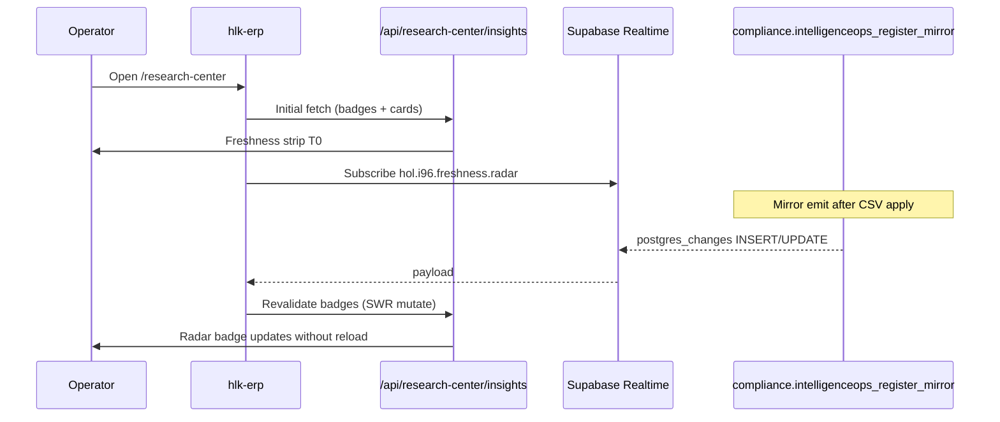

# Realtime publication contract + I96 freshness strip (I99 P3)

> **Purpose.** Govern **Supabase Realtime** (module **SUPA-MOD-21**) — publications, channels, table subscriptions, and consumer surfaces — with **I96 Research Center freshness strip** as the first product consumer. Planning + draft CSV only until **P5** operator gate.

## Outcome

1. Which Postgres tables may push **live row events** to the ERP?
2. How does the **freshness strip** get updates without full page reload?
3. What stays **polling-only** (honest, not fake Realtime)?
4. What **DDL** lands at P5 vs what **hlk-erp** wires at I96 B2.4?

---

## 1. Registry shape (proposed for P5)

**Canonical path (target):**  
`docs/references/hlk/v3.0/Admin/O5-1/Data/Architecture/canonicals/dimensions/SUPABASE_REALTIME_REGISTRY.csv`

**Module row update (P5 same commit):**  
`SUPABASE_MODULE_REGISTRY.csv` SUPA-MOD-21 → `repo_artifact` = this CSV; `governed_status` → `governed`.

| Column | Meaning |
|:---|:---|
| `realtime_row_id` | Stable ID `SUPA-RT-NN` |
| `row_kind` | `publication` \| `table_subscription` \| `channel` \| `consumer_surface` \| `fallback_policy` \| `badge_binding` \| `rls_requirement` \| `migration_ddl` \| `presence_broadcast` |
| `surface_key` | Functional name |
| `schema_table` | Qualified table or proposed view |
| `channel_name` | Holistika channel naming convention (§2) |
| `consumer_initiative` | e.g. `INIT-OPENCLAW_AKOS-96` |
| `consumer_binding` | hlk-erp component, API route, or Supabase client call |
| `posture` | `active` \| `scheduled` \| `polling_only` \| `drift` \| `out_of_scope` |
| `owner_role` | From baseline org |
| `last_review_decision_id` | Trace |
| `notes` | Operator-readable |

**Draft rows:** [`../drafts/SUPABASE_REALTIME_REGISTRY.draft.csv`](../drafts/SUPABASE_REALTIME_REGISTRY.draft.csv) (18 rows).

---

## 2. Channel naming convention (binding)

Pattern: `hol.{initiative_slug}.{surface}.{target}`

| Channel | Table / source | Consumer |
|:---|:---|:---|
| `hol.i96.freshness.radar` | `compliance.intelligenceops_register_mirror` | Research Center freshness strip — **radar** badge |
| `hol.i96.freshness.mirrors` | Proposed `holistika_ops.mirror_freshness_heartbeat` view | Freshness strip — **mirrors** badge (scheduled) |
| `hol.i62.drawer.notifications` | `holistika_ops.notifications` | Mission Control notification drawer (I62; parallel consumer) |

**Rules:**

- One channel per logical consumer surface — do not multiplex unrelated tables on one channel without registry row.
- `postgres_changes` filters must respect RLS (authenticated session required — depends on I99 P2 Auth).
- No wildcard table subscriptions.

---

## 3. Publication contract (DDL — applied MasterData 2026-06-13)

**Git SSOT:** [`supabase/migrations/20260613150000_i99_realtime_publication_i96_i62.sql`](../../../../../../supabase/migrations/20260613150000_i99_realtime_publication_i96_i62.sql) (**SUPA-RT-17**). **Applied** to MasterData (`swrmqpelgoblaquequzb`) via `supabase db push` per operator SQL gate — decision **D-IH-99-K**.

**Hosted verify (2026-06-13):** Both tables in `supabase_realtime` publication; `REPLICA IDENTITY FULL` on `compliance.intelligenceops_register_mirror` and `holistika_ops.notifications`. **SUPA-RT-01** posture → `active`.

```sql
-- I99 P5 — Realtime publication for I96 + I62 consumers (idempotent sketch)
ALTER PUBLICATION supabase_realtime ADD TABLE compliance.intelligenceops_register_mirror;
ALTER PUBLICATION supabase_realtime ADD TABLE holistika_ops.notifications;

-- Required for UPDATE/DELETE events (INSERT-only works without; set for completeness)
ALTER TABLE compliance.intelligenceops_register_mirror REPLICA IDENTITY FULL;
ALTER TABLE holistika_ops.notifications REPLICA IDENTITY FULL;
```

**Schema exposure note:** hlk-erp PostgREST client typically uses `public` views. I62 already exposes `public.notifications` → `holistika_ops.notifications`. For IntelligenceOps mirror, either:

- **Option A (preferred):** Add `public.intelligenceops_register_mirror` security invoker view (mirrors I62 pattern), subscribe via `schema: 'public'`.
- **Option B:** Extend PostgREST `db.schemas` — heavier; not default.

Ratify Option A at P5 inline-ratify if mirror subscription ships.

**Compliance schema direct exposure:** `compliance.*` mirrors are readable via existing RLS policies; view wrapper keeps ERP client consistent with I62.

---

## 4. I96 freshness strip wiring

### 4.1 Badge → transport matrix

| Badge (`FreshnessBadge.id`) | Data source (three-plane) | Transport today | Realtime target |
|:---|:---|:---|:---|
| **ledger** | Git `source-ledger.csv` aggregates | **Polling only** | — (govern plane; not mirror events) |
| **radar** | `INTELLIGENCEOPS_REGISTER.csv` → mirror | BFF poll on page load | **Scheduled** — `hol.i96.freshness.radar` |
| **kirbe** | KiRBe HTTP health | **Polling only** | — (external service) |
| **mirrors** | Mirror emit timestamps vs git | BFF poll / drift script | **Scheduled** — heartbeat view |

Per BFF spec [`research-center-bff-live-data-spec-2026-06-12.md`](../../96-research-data-plane-and-research-center/reports/research-center-bff-live-data-spec-2026-06-12.md) §4.2 and page spec v2 §2.5.

### 4.2 Data flow (target state)



### 4.3 Journey **Verify** step (polling today; Realtime-compatible)

Page spec v2: Verify = freshness strip re-check or card severity drop.

| Mechanism | When | Registry row |
|:---|:---|:---|
| User clicks **Verify** journey step | Refetch `GET /api/research-center/insights?pov=` | SUPA-RT-08 |
| Realtime event on radar mirror | Auto-refetch strip subset | SUPA-RT-07 + SUPA-RT-05 |
| Tab focus | `refetchOnFocus` if stale > 60s | SUPA-RT-09 |

**Micro-CTA** on radar badge ("Review overdue targets") → **navigate** to register table route (I96 B2.2) — not a validator script name on T0.

### 4.4 hlk-erp implementation sketch (I96 B2.4 — execution thread)

```typescript
// lib/research-center/realtime/radar-freshness.ts (hlk-erp — not AKOS)
// Pseudocode for P3 contract only
const channel = supabase
  .channel('hol.i96.freshness.radar')
  .on('postgres_changes', {
    event: '*',
    schema: 'public',
    table: 'intelligenceops_register_mirror',
  }, () => mutate('/api/research-center/insights'))
  .subscribe();
```

Cleanup on unmount; degrade to polling-only if `CHANNEL_ERROR` (SUPA-RT-10 optional T3 note).

---

## 5. Fallback policy (honest degradation)

Realtime is **optional enhancement** per `DATA_INTEGRATION_PLANE.md` — not SSOT.

| Policy | Value | Posture |
|:---|:---|:---|
| Initial load | Always BFF fetch | **active** |
| Polling staleTime | 60s default | **active** |
| Realtime disconnected | Continue polling; no blocking error on T0 | **active** |
| Degraded banner | T3 accordion only | **scheduled** |

Never imply live data when only polling — badge `why` string must reflect last fetch timestamp (`as_of` in BFF).

---

## 6. Staleness loop integration

Realtime does **not** replace the research radar sweep — it **reflects mirror updates** after govern/emit:


Cross-ref: [`../../96-research-data-plane-and-research-center/staleness-loop-spec.md`](../../96-research-data-plane-and-research-center/staleness-loop-spec.md)

---

## 7. Parallel consumer — I62 notifications (not strip)

`holistika_ops.notifications` (I62) is registered for Mission Control drawer Realtime — **separate surface**, same P5 publication migration. Do not conflate with Research Center freshness strip.

---

## 8. What P3 does **not** do

| Item | Posture |
|:---|:---|
| Apply publication migration | **P5** operator SQL gate |
| Wire hlk-erp subscription code | **I96 B2.4** execution |
| Mint canonical CSV + validator | **P5** AskQuestion |
| Ledger badge via Realtime | **out_of_scope** — git govern plane |
| Presence / broadcast channels | **out_of_scope** v1 |

---

## 9. P3 verification

```powershell
py -c "import csv; from pathlib import Path; p=Path('docs/wip/planning/99-supabase-platform-eg5-tranche/drafts/SUPABASE_REALTIME_REGISTRY.draft.csv'); rows=list(csv.DictReader(p.open(encoding='utf-8'))); assert len(rows)==len({r['realtime_row_id'] for r in rows}); print(f'OK {len(rows)} unique rows')"

py scripts/validate_hlk.py
py scripts/validate_initiative_registry_frontmatter_sync.py
```

---

## Cross-references

- I99 P2 Auth (session for Realtime): [`auth-registry-and-i96-consumer-spec-2026-06-13.md`](auth-registry-and-i96-consumer-spec-2026-06-13.md)
- I96 BFF freshness types: [`../../96-research-data-plane-and-research-center/reports/research-center-bff-live-data-spec-2026-06-12.md`](../../96-research-data-plane-and-research-center/reports/research-center-bff-live-data-spec-2026-06-12.md) §4.2
- Page spec v2 §2.5: [`../../96-research-data-plane-and-research-center/reports/research-center-page-spec-v2-2026-06-12.md`](../../96-research-data-plane-and-research-center/reports/research-center-page-spec-v2-2026-06-12.md)
- Three-plane mapping: [`../../96-research-data-plane-and-research-center/three-plane-field-mapping.md`](../../96-research-data-plane-and-research-center/three-plane-field-mapping.md)
- I62 notifications DDL: `supabase/migrations/20260506130000_i62_p1_holistika_ops_rbac.sql`
- IntelligenceOps mirror: `supabase/migrations/20260514240000_i72_intelligenceops_register_mirror.sql`
- Decision: **D-IH-99-G** (P3 draft complete)
