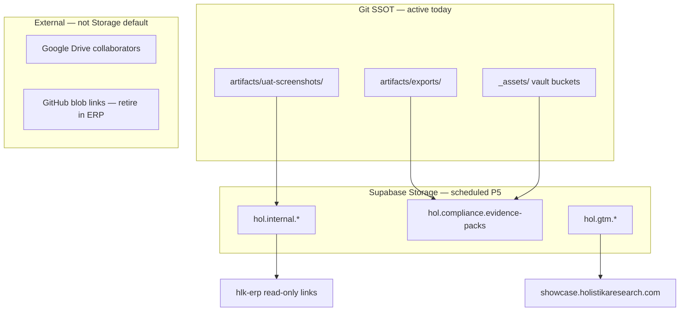

# Storage bucket/path registry + GTM asset posture (I99 P4)

> **Purpose.** Govern **Supabase Storage** (module **SUPA-MOD-23**) — buckets, path prefixes, RLS classes, and delivery posture — separating **internal operator evidence**, **compliance sealed PDFs**, and **GTM public assets**. Planning + draft CSV only until **P5** operator gate.

## Outcome

1. Which **bucket** holds which class of file?
2. What stays **git-first** (no bucket required)?
3. How do **GTM** surfaces (showcase, lead intake) differ from **ERP operator** attachments?
4. What **RLS** and **signed-URL** rules apply at the trust boundary?

---

## 1. Registry shape (proposed for P5)

**Canonical path (target):**  
`docs/references/hlk/v3.0/Admin/O5-1/Data/Architecture/canonicals/dimensions/SUPABASE_STORAGE_REGISTRY.csv`

**Module row update (P5 same commit):**  
`SUPABASE_MODULE_REGISTRY.csv` SUPA-MOD-23 → `repo_artifact` = this CSV; `governed_status` → `governed`.

| Column | Meaning |
|:---|:---|
| `storage_row_id` | Stable ID `SUPA-ST-NN` |
| `row_kind` | `module` \| `bucket` \| `bucket_drift` \| `ssot_active` \| `path_rule` \| `rls_policy` \| `delivery_posture` \| `analytics_bucket` \| `vector_bucket` \| `extension_link` \| `cross_tier_link` \| `migration_ddl` |
| `bucket_id` | Supabase bucket name or git/vault SSOT key |
| `path_prefix` | Object key prefix or glob |
| `visibility` | `private_authenticated` \| `private_service_role` \| `public_read` \| `git_repo` \| `reference_only` |
| `consumer_initiative` | Initiative or program anchor |
| `consumer_binding` | ERP route, render script, or audience |
| `posture` | `active` \| `scheduled` \| `drift` \| `reference_only` |
| `owner_role` | From baseline org |
| `last_review_decision_id` | Trace |
| `notes` | Operator-readable |

**Draft rows:** [`../drafts/SUPABASE_STORAGE_REGISTRY.draft.csv`](../drafts/SUPABASE_STORAGE_REGISTRY.draft.csv) (25 rows incl. Analytics Iceberg + Storage Vector + Neo4j cross-tier link).

---

## 2. Delivery posture — three tiers (binding)



| Tier | SSOT | When to use | Registry rows |
|:---|:---|:---|:---|
| **Git artifacts** | `artifacts/` + vault `_assets/` | UAT evidence, render PDF trail, adviser collateral source | SUPA-ST-03..05, ST-17 |
| **Supabase Storage** | Bucket registry | ERP-served attachments, lead intake uploads, optional UAT mirror | SUPA-ST-06..11 |
| **Drive / GitHub** | Out of band | External collaborators only — **not** ERP primary CTA | SUPA-ST-18; I96 B2 retires GH CTAs |

**Operator rule:** Preview UAT **PASS** does **not** require Supabase buckets (SUPA-ST-17). Git manifest + PNG remains the experiential ladder SSOT per [`../../96-research-data-plane-and-research-center/reports/research-center-experiential-uat-ladder-2026-06-12.md`](../../96-research-data-plane-and-research-center/reports/research-center-experiential-uat-ladder-2026-06-12.md).

---

## 3. Bucket catalog (scheduled — P5 DDL)

| Bucket ID | Visibility | Path prefix | Consumer | Purpose |
|:---|:---|:---|:---|:---|
| `hol.internal.uat-evidence` | private_authenticated | `uat/{initiative}/{date}/` | I96 | Optional mirror of UAT PNG + MANIFEST |
| `hol.internal.closure-reports` | private_authenticated | `closure-uat/{initiative}/` | Closure UAT | Rendered PDF packs |
| `hol.compliance.evidence-packs` | private_authenticated + signed URL | `evidence/{program}/{topic}/` | I24 / ADVOPS | J-ENISA / J-AD sealed PDFs |
| `hol.gtm.showcase-assets` | **public_read** | `showcase/{class}/` | I14 GTM | Marketing showcase host |
| `hol.gtm.lead-intake` | private_service_role write | `lead-intake/{yyyy}/{mm}/` | I14 | Form attachment staging |
| `hol.internal.erp-attachments` | private_authenticated | `erp/{surface}/{id}/` | I62 / I96 | Drawer artifact links (future B2) |

**Naming convention:** `hol.{plane}.{purpose}` — plane = `internal` \| `compliance` \| `gtm`.

**File size:** Local cap `50MiB` per `supabase/config.toml` `[storage] file_size_limit` (SUPA-ST-01).

---

## 4. GTM asset posture vs operator-private

| Asset class | Audience | Delivery surface | Storage bucket | Never |
|:---|:---|:---|:---|:---|
| Showcase demo media | J-CU / public | `web` + showcase host | `hol.gtm.showcase-assets` | Raw markdown |
| Lead form attachment | J-CU inbound | `erp` + Edge ingest | `hol.gtm.lead-intake` | Public bucket |
| Adviser / ENISA PDF | J-AD / J-ENISA | `pdf` + sha256 manifest | `hol.compliance.evidence-packs` | GitHub blob link in ERP |
| UAT screenshot | J-OP internal | git manifest + optional mirror | git first → `hol.internal.uat-evidence` | Require bucket for UAT PASS |
| Research register export | J-OP | ERP DataTable read-only | Postgres mirror (not Storage) | Storage for tabular SSOT |

Cross-ref: **external-render discipline** — PDF / Web / ERP / Mail / Slide / Broadcast at trust boundary; markdown stays internal.

Cross-ref: [`../../96-research-data-plane-and-research-center/reports/research-center-phase-bc-tranche-plan-2026-06-12.md`](../../96-research-data-plane-and-research-center/reports/research-center-phase-bc-tranche-plan-2026-06-12.md) — ERP CTAs navigate to governed surfaces, not GitHub.

---

## 5. RLS + signed URL contract (scheduled P5)

| Policy class | Who reads | Who writes | Registry |
|:---|:---|:---|:---|
| **private_authenticated** | `access_level >= 4` (JWT + role mapping) | service_role / Edge only | SUPA-ST-14 |
| **private_service_role** | service_role | Edge Functions | SUPA-ST-15 |
| **public_read** | anon | service_role (marketing pipeline) | SUPA-ST-16 |
| **signed URL** | Time-limited link recipient | createSignedUrl ≤ 900s | SUPA-ST-19 |

**SOC:** Log bucket id + object path only — never object body or pre-signed token value.

**MIME gates (upload):**

| Bucket family | Allowed | Reject |
|:---|:---|:---|
| UAT evidence | `image/png`, `image/webp`, `application/json` | `.md`, executables |
| Compliance packs | `application/pdf`, `application/json` (manifest) | raw `.md` at boundary |
| Showcase | `image/*`, `video/mp4`, `font/*` | documents with PII |

---

## 6. Proposed bucket DDL sketch (P5 — not applied in P4)

```sql
-- I99 P5 — Storage buckets (idempotent sketch; operator SQL gate)
insert into storage.buckets (id, name, public, file_size_limit, allowed_mime_types)
values
  ('hol.internal.uat-evidence', 'hol.internal.uat-evidence', false, 52428800,
   array['image/png','image/webp','application/json']),
  ('hol.compliance.evidence-packs', 'hol.compliance.evidence-packs', false, 52428800,
   array['application/pdf','application/json']),
  ('hol.gtm.showcase-assets', 'hol.gtm.showcase-assets', true, 52428800,
   array['image/png','image/jpeg','image/webp','video/mp4'])
on conflict (id) do nothing;

-- RLS policies on storage.objects per SUPA-ST-14..16 — separate migration file
```

Reconcile **hosted drift** (SUPA-ST-02) before apply — dashboard-created buckets must match registry or be retired with evidence.

---

## 7. I96 consumer binding (ERP attachments)

When I96 B2 ships governed register UI, drawer **artifact** links should resolve:

| Today (debt) | Target (P5 + I96 B2) |
|:---|:---|
| GitHub blob URL | ERP route or signed Storage URL |
| Google Drive (external) | Supabase mirror table (preferred) or Storage if binary |
| Validator script name on T0 | Navigate to register / artifact viewer |

Storage bucket `hol.internal.erp-attachments` holds **binary** artifacts (PDF preview, exported CSV snapshot). **Tabular SSOT** stays Postgres mirror — not object storage.

---

## 8. Analytics Iceberg + Storage Vector (absorbed — not out of scope)

Per [`multi-store-data-plane-alignment-2026-06-13.md`](multi-store-data-plane-alignment-2026-06-13.md) (**D-IH-99-I**):

| Surface | BI / module link | I99 posture |
|:---|:---|:---|
| **Analytics Buckets (Iceberg)** | `BI-HOL-ANALYTICS-BUCKETS` + `[storage.analytics]` | **scheduled** P5 — rows SUPA-ST-20, ST-25 |
| **Storage Vector** | `SUPA-MOD-17` + `[storage.vector]` + KiRBe/I83 | **scheduled** P5 — rows SUPA-ST-21, ST-26 |
| **Neo4j T3 graph** | `BI-HOL-NEO4J` — **not Supabase** | **coordinated** — I91/I93 own; ST-27 cross-tier link only |

I93 retains BI tier doctrine; I99 owns Supabase module + path registry rows at P5.

## 9. Remaining exclusions (explicit)

| Item | Posture |
|:---|:---|
| KiRBe app embedding **table DDL** | **reference-only** — SUPA-MOD-07 kirbe schema |
| Replacing git UAT SSOT with buckets only | **rejected** — git-first (ST-17) |

---

## 10. P4 verification

```powershell
py -c "import csv; from pathlib import Path; p=Path('docs/wip/planning/99-supabase-platform-eg5-tranche/drafts/SUPABASE_STORAGE_REGISTRY.draft.csv'); rows=list(csv.DictReader(p.open(encoding='utf-8'))); assert len(rows)==len({r['storage_row_id'] for r in rows}); print(f'OK {len(rows)} unique rows')"

py scripts/validate_hlk.py
py scripts/validate_initiative_registry_frontmatter_sync.py
```

---

## Cross-references

- I99 P2 Auth (session for private reads): [`auth-registry-and-i96-consumer-spec-2026-06-13.md`](auth-registry-and-i96-consumer-spec-2026-06-13.md)
- UAT artifact naming: [`../../96-research-data-plane-and-research-center/reports/research-center-experiential-uat-ladder-2026-06-12.md`](../../96-research-data-plane-and-research-center/reports/research-center-experiential-uat-ladder-2026-06-12.md)
- Render / PDF trail: Initiative 24 + `artifacts/exports/`
- Module SSOT: [`SUPABASE_MODULE_REGISTRY.csv`](../../../../references/hlk/v3.0/Admin/O5-1/Data/Architecture/canonicals/dimensions/SUPABASE_MODULE_REGISTRY.csv) SUPA-MOD-23
- BI Analytics buckets: [`BI_CONSUMER_REGISTRY.csv`](../../../../references/hlk/v3.0/Admin/O5-1/Data/Governance/canonicals/dimensions/BI_CONSUMER_REGISTRY.csv) BI-HOL-ANALYTICS-BUCKETS
- Decision: **D-IH-99-H** (P4 draft complete)
- Multi-store alignment: [`multi-store-data-plane-alignment-2026-06-13.md`](multi-store-data-plane-alignment-2026-06-13.md) (**D-IH-99-I**)
