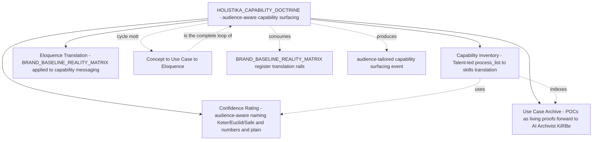

# I82 candidate — Holistika Capability Doctrine and Commercial Readiness

> **Update 2026-05-17 — I84 P4 pre-ratification cascade (CAPABILITY_REGISTRY substrate_id FK target now live).** I84 P4 closed all 4 architectural shape decisions (D-IH-84-B/C/D/E) per [`decision-log.md`](../84-substrate-doctrine-and-commercial-readiness/decision-log.md). The relevant cascade impact on I82: **`CAPABILITY_REGISTRY.csv` column-spec should extend to include `substrate_id` FK to [`SUBSTRATE_REGISTRY.csv`](../../references/hlk/v3.0/Admin/O5-1/People/Compliance/canonicals/dimensions/SUBSTRATE_REGISTRY.csv) (now live with 18 rows + Supabase mirror)** for capabilities that name an underlying technical substrate (e.g., "capability X depends on substrate Y"). This makes the Capability Registry queryable by substrate-class (e.g., "all capabilities that depend on LlamaIndex" / "all capabilities exposed via OpenClaw thin-adapter"). The FK is **nullable** — capabilities that don't name a specific substrate (e.g., methodology capabilities like "produce a Holistik diagnosis") leave it blank. I82 P0 charter should incorporate this column into the `CAPABILITY_REGISTRY.csv` mint scope (P2 facet 2a). No I82 promotion-criteria changes; just a column-spec refresh.

> **Candidate scaffold authored at I80 P7 per operator inline-ratify Round 9 (2026-05-16) framing.** **Extended 2026-05-16:** **Talent activation** (`baseline_organisation.csv`) **and authoritative `CAPABILITY_REGISTRY` seeds** SHOULD consume the **I81 P1 knowledge-base integrity matrix** (`kb-integrity-matrix-*` + audit narrative) unless the operator issues an explicit **prerequisite waiver decision** (`D-IH-82-*`). See sibling [I81 candidate](i81-full-vault-sop-addendum-retrofit.md) §2c–§2d (integrity sprint + Compliance layout reorganisation).
>
> Promoted to `active` when (a) operator confirms doctrine name + canonical home + phase shape below, (b) four facets each have ratified delivery owner OR Talent interim owner named, (c) first live capability-surfacing UAT scenario exists **OR** waived, (d) **I81 P1 integrity CLOSED or waived**.

## 1. Operating story

> **Verbatim operator framing (2026-05-16 inline-ratify Round 9):** *"From our side, we can guarantee that this knowledge base is worth investing in and selling out. Somehow."* — *"As the operation's motto goes: If we do it, we sell it."* — *"My motto: Concept to Use Case to Eloquence. We build capabilities, research use cases that are hot, actually do them with production-grade quality and translate them to operator, expert, user and business."* — *"Imagine you have a person telling you a capability and you tell them we've been able to surface it somewhere it actually helped? That's the kind of brand product knowledge research ops tech and more we talk about here in people."*

I82 mints the **third foundational doctrine** of Holistika, sibling to [`HOLISTIKA_ORGANISING_DOCTRINE.md`](../../../docs/references/hlk/v3.0/Admin/O5-1/People/canonicals/HOLISTIKA_ORGANISING_DOCTRINE.md) (I79 P1 — how we structure) and [`HOLISTIKA_AGENTIC_DOCTRINE.md`](../../../docs/references/hlk/v3.0/Admin/O5-1/People/canonicals/HOLISTIKA_AGENTIC_DOCTRINE.md) (I79 P3a — how AI fits): **how we surface what we do**.

The doctrine codifies *audience-aware capability surfacing* — the meta-capability that, when invoked, takes a request from any external counterparty (customer / advisor / investor / collaborator / regulator / recruiter) describing a need, and produces a brand-faithful audience-appropriate response that contains: (1) the relevant capability rows from our inventory; (2) the confidence rating for delivery (Keter/Euclid/Safe-style — naming TBD); (3) prior use-case proofs (POCs from past engagements); (4) eloquence-translated message in the right register for the requester.

The four named instruments — capability inventory, confidence rating, use case archive, eloquence translation — are *facets* of this single capability, not strands of a 4-track initiative. The cohering principle (**per operator Round 9 reframe**): the doctrine is *flexible* enough to draw from any inventory (mottos / capabilities / skills / use-cases / doctrines / registries) and translate to the right audience. Rigid umbrella packaging was rejected; *capability-shaped framing* was selected.

## 2. The four facets (instruments of the capability)

### 2a. Capability inventory (Talent-led)

`process_list.csv` is the **inventory** of what every area can do. The Talent role (newly activated per `D-IH-79-A` baseline forward-charter; not yet at `baseline_organisation.csv` row but anticipated) translates the inventory into a **capabilities/skills list** that external counterparties can read. Each row carries: skill_id (FK to `SKILL_REGISTRY.csv`), capability_name, area, role_owner, originating_process_ids (semicolon list), description (plain-language register for People-area; technical register for Tech-area; commercial register for cross-area presentation).

The operator framing: *"hopefully Talent will be able to translate our inventory — process_list — into capabilities/skill list, governed and that will be the best talent I've seen because not many companies are able to explain to someone 'what you guys can do' in such a governed, clear, scalable, tangible, demonstrable way."*

The governed deliverable: **`CAPABILITY_REGISTRY.csv`** lives under **`docs/references/hlk/v3.0/Admin/O5-1/People/Compliance/canonicals/dimensions/`** (same dimensional pattern as [`SKILL_REGISTRY.csv`](../../../docs/references/hlk/v3.0/Admin/O5-1/People/Compliance/canonicals/dimensions/SKILL_REGISTRY.csv)) + Pydantic SSOT (`akos/hlk_capability_registry_csv.py` — mint at charter) + `scripts/validate_capability_registry.py` + tests — **wired into `validate_hlk.py`**.

**Operational dependency:** Capability rows SHOULD trace to **audited `process_list.csv` references** surfaced in **[I81 P1](i81-full-vault-sop-addendum-retrofit.md) `kb-integrity-matrix-*`** (prevents Capability Registry launching on orphaned paths).

### 2a.1 Talent role activation (baseline facet—unblocks organisational work operators deferred)

Talent is the **human/AIC role_owner** accountable for translating process inventory ↔ external-readable capability/skills narratives. Activation requires **`baseline_organisation.csv` operator-approved tranche** (canonical-CSV gate per [`akos-governance-remediation.mdc`](../../../.cursor/rules/akos-governance-remediation.mdc)). Schedule as **I82 P1** *after* doctrine charter ratification—or **parallel** once baseline approval is queued—coordinate with **`process_list.csv`** edits if Talent owns net-new upkeep processes (`inherited_pattern_id` FK posture per I79). This tranche satisfies operator intent: *activate Talent + other prerequisites we couldn't do before* once organisational confidence improves (fed by **I81 P1** integrity run).

### 2b. Confidence rating (Keter / Euclid / Safe — names cameo, truth canonical)

Every capability carries a **confidence rating** — how sure we are we can deliver. The operator's draft naming (per Round 9 Q2 response):

- **Keter** — Low confidence. *"Something we may know how to do but not enough to warrant we won't need external resources or research or big adaptation to the scenario."*
- **Euclid** — Medium confidence. *"Something we know enough to warrant the e2e of the case, but we may not guarantee that a research is necessary or that our use case may be different from the requested one, but at least we can do things with our internal resources."*
- **Safe** — High confidence. *"Something we know we can revisit after X time and know we can activate at a moment's notice. Of course documentation and methods may vary a little but the thing will still be in the same place."*

The naming is **a cameo for methodology-curious audiences** (per the operator's lived experience: *"Mark-I sell this message to a ton of random persons that were captivated"* and *"investors ready to help me because I explained the innards of what we say here"*). The **underlying truth** (the confidence axis) is canonical regardless of naming. For different audiences:

- **Operations / internal**: numerical scale (e.g., 0.3 / 0.7 / 0.95) for unambiguous machine-readability + reporting.
- **Methodology-curious investors / advisors / depths-readers**: SCP-Foundation cameo names (Keter / Euclid / Safe) — resonates with Holistika CORPINT register.
- **General customers / first-meet conversations**: plain-language phrasing ("preliminary readiness" / "production-ready" / "moment's-notice ready") to avoid losing momentum explaining SCP Foundation references.

The deliverable: **`CAPABILITY_CONFIDENCE_REGISTRY.csv`** with paired-file body+addendum per `pattern_sop_addendum_split`. Body carries the canonical confidence axis (numerical or 3-class enum); addendum carries the SCP-cameo + plain-language audience-translation tables. Marketing/Brand cosigns the brand-naming choice.

### 2c. Use case archive (POCs as living proofs; AI Archivist forward-vision)

Every capability has **lived proofs**. The operator's named POCs (verbatim): *"GDF... home made POC in our own Microsoft environment"*; *"Hosteleria, RCD in which we showed how much would cost a self made sentiment analysis classifier for a survey of +2000 lines"*; *"documentation team in which we explained how to govern their folders to be ready for a future agentic system"*; *"creating a POC for shopify website"*. These are sales-ready evidence; future capability surfacing events return them as proofs.

The deliverable: **`USE_CASE_ARCHIVE.csv`** with `use_case_id` / `engagement_id` (FK to `ENGAGEMENT_REGISTRY.csv`) / `capability_id` (FK to `CAPABILITY_REGISTRY.csv`) / `confidence_demonstrated` / `outcome_summary` / `linked_artefacts` (semicolon list of paths to internal POC artefacts) / `external_references` (verbatim customer phrases that can be paraphrased) / `redaction_class` (none / paraphrase / anonymise; default: paraphrase). Each row is a **living proof**.

The system that surfaces these on demand is the **AI Archivist / KiRBe ingestor**. Per operator Round 9 framing: *"It's also good for other things we may build atop our system, like our AI Archivist and all-in-one ingestor (sort of like Composio, but with a wider scope), KiRBe. That's how it's tied to the knowledge base and why we also call it AI Archivist."* The Archivist is **forward-chartered to I83** as a Tech-area-led product-shaped initiative (per Round 9 Q3 recommendation).

### 2d. Eloquence translation (BRAND_BASELINE_REALITY_MATRIX applied to capability messaging)

The translation craft. Per operator motto: *"Concept to Use Case to Eloquence"* + *"translate them to operator, expert, user and business"*. The eloquence layer takes (capability + confidence + use case) and renders the right message for the right audience.

This is **BRAND_BASELINE_REALITY_MATRIX** dual-register doctrine ([`BRAND_BASELINE_REALITY_MATRIX.md`](../../../docs/references/hlk/v3.0/Admin/O5-1/Marketing/Brand/BRAND_BASELINE_REALITY_MATRIX.md)) extended from brand prose to capability messaging. Marketing/Brand-led; reuses existing translation rails.

The deliverable: **extension of `BRAND_BASELINE_REALITY_MATRIX.md`** with §N "Capability messaging extension" — per-audience translation tables for operator / expert / user / business / advisor / investor / regulator / customer. No new canonical CSV needed; the matrix table extension is sufficient.

## 3. Phase shape (proposed; ratified at P0 promotion)

**Recommended dependency:** **`CAPABILITY_REGISTRY` mint (phase P2 below)** SHOULD **not merge** until **I81 P1 knowledge-base integrity is CLOSED** OR operator documents an explicit prerequisite waiver (**e.g. `D-IH-82-PREREQ`**). Earlier work — doctrine prose (P0) and Talent `baseline` tranche prep (phase P1) — may proceed once charter approvals exist.

| Phase | Purpose | Deliverable | Effort |
|:---|:---|:---|---:|
| **P0** | Charter + doctrine mint (paired body + addendum per `pattern_sop_addendum_split`; I80 P2 precedent) | `HOLISTIKA_CAPABILITY_DOCTRINE.md` (level 4 body) + `.addendum.md` (level 5 addendum) at `People/canonicals/`; charter decisions (`D-IH-82-A..*`); OPS scaffolding rows | ~1d |
| **P1** | **`baseline_organisation.csv` Talent activation tranche** *(canonical operator gate)* + optional accompaniment row(s) in `process_list.csv` defining Talent upkeep mechanics | Formal Talent `role_owner` lineage; synced [`docs/USER_GUIDE.md`](../../../docs/USER_GUIDE.md) / [`docs/ARCHITECTURE.md`](../../../docs/ARCHITECTURE.md) per governance rule bundle when counts shift | gated |
| **P2** | Capability inventory facet | `dimensions/CAPABILITY_REGISTRY.csv` (+ Pydantic + validator + tests + `validate_hlk.py` wiring + `PRECEDENCE.md`); seed rows anchored to **audited `process_list` paths via I81 matrix** | ~1–2d |
| **P3** | Confidence rating facet | `CAPABILITY_CONFIDENCE_*` artefacts (paired body+addendum + Marketing/Brand naming co‑sign); numeric + SCP-cameo + plain registers | ~1d |
| **P4** | Use case archive facet | `USE_CASE_ARCHIVE.csv` + POC seed narratives (GDF + Hosteleria + RCD + documentation-team + Shopify) | ~1d |
| **P5** | Eloquence translation facet | `BRAND_BASELINE_REALITY_MATRIX.md` §N capability‑messaging extension | ~0.5d |
| **P6** | hlk‑erp + mirrors forward‑spec alignment | Mirrors + ERP route specs (**coordinate path hygiene with I81 P2 layout waves**) | ~0.5d |
| **P7** | Live capability‑surfacing UAT + closure + **I83** promotion bolster | UAT dossier dated OR explicit waiver narrative | ~0.5d |

Continuous execution estimate **≈ 7–10 engineer‑days excluding operator pause windows** (+ parallel **I81** work tracked separately).

## 4. Conundrums (top 7)

| ID | Question | Owner | Window |
|:---|:---|:---|:---|
| **C-82-1** | Doctrine final name (HOLISTIKA_CAPABILITY_DOCTRINE.md vs HOLISTIKA_ELOQUENCE_DOCTRINE.md vs other) | Founder + People Operations Manager | P0 inline-ratify |
| **C-82-2** | Confidence rating naming policy — SCP-cameo vs numbers vs plain language as PRIMARY vs cameo | Founder + Brand Manager | **P3** inline-ratify |
| **C-82-3** | AI Archivist / KiRBe ingestor home — I82 internal vs **I83** forward‑charter (recommended: **I83**) | System Owner + People Operations Manager | P0 charter acknowledgement |
| **C-82-4** | **Talent CSV tranche timing** vs **Capability registry** vs **integrity baseline sequencing** (`baseline` gate may land before OR after doctrine—default: **Doctrine P0 ratified → Talent CSV P1 queued → Capability registry awaits I81 integrity OR waiver**) | Founder + People Operations Manager | **P0** inline‑ratify |
| **C-82-5** | Confidence rating cadence — ownership + conflict routing to `PRECEDENCE.md` | People Operations Manager + Operations/SMO | **P3** inline-ratify |
| **C-82-6** | **Skip / waive** I81 integrity prerequisite for Capability registry acceptable when? (Only after explicit reversible decision with logged risk acceptance) | Founder + PMO | P0 charter |

## 5. Decision preview

| ID | Question | Owner | Status entering | Close-out |
|:---|:---|:---|:---|:---|
| **D-IH-82-A** | Mega-charter scope — 4-facet doctrine | Founder | Proposed | P0 |
| **D-IH-82-B** | Doctrine canonical home — `People/canonicals/` (matching existing 2 doctrines) | People Operations Manager | Recommended | P0 |
| **D-IH-82-C** | Confidence rating naming — SCP-cameo + numbers + plain (multi-register posture) | Founder + Brand Manager | Proposed | **P3** |
| **D-IH-82-D** | Capability inventory PK + FK posture (`SKILL_REGISTRY` linkage + `process_list` anchoring policy) | People Operations Manager | Proposed | **P2** |
| **D-IH-82-PREREQ** | **Prerequisite waiver / acceptance** bridging I81 integrity deliverables ↔ I82 Capability registry readiness | Founder + PMO | Optional | **P2** entrance |
| **D-IH-82-E** | Use case archive redaction policy — paraphrase default; case-by-case anonymise | Compliance Officer | Proposed | **P4** |

## 6. Risks (top 5)

| ID | Risk | L | I | Mitigation |
|:---|:---|:---:|:---:|:---|
| **R-IH-82-1** | Doctrine remains aspirational without a live test — first capability surfacing event never happens | Medium | High | **P7** acceptance binds promotion to one live external rehearsal **or explicit waiver narrative** recorded in closure decision row |
| **R-IH-82-2** | SCP-Foundation cameo confuses audiences who don't get the reference | Medium | Medium | Per Round 9 operator framing — naming is audience-aware multi-register; cameo only for methodology-curious |
| **R-IH-82-3** | Capability inventory drifts from `process_list.csv` over time | High | Medium | FK to `process_list.csv` `item_id`s; validator enforces FK resolution; quarterly sync cadence |
| **R-IH-82-4** | Use case archive contains commercially-sensitive customer references | High | High | Default redaction = paraphrase; explicit redaction_class enum; Compliance Officer sign-off per row before external surfacing |
| **R-IH-82-5** | Eloquence translation rails diverge from BRAND_BASELINE_REALITY_MATRIX over time | Low | Medium | Extension lives IN the matrix (§N), not a separate file — drift gate is the existing matrix-drift validator |

## 7. Cross-references

- [`HOLISTIKA_ORGANISING_DOCTRINE.md`](../../../docs/references/hlk/v3.0/Admin/O5-1/People/canonicals/HOLISTIKA_ORGANISING_DOCTRINE.md) — first foundational doctrine (I79 P1).
- [`HOLISTIKA_AGENTIC_DOCTRINE.md`](../../../docs/references/hlk/v3.0/Admin/O5-1/People/canonicals/HOLISTIKA_AGENTIC_DOCTRINE.md) — second foundational doctrine (I79 P3a).
- [`BRAND_BASELINE_REALITY_MATRIX.md`](../../../docs/references/hlk/v3.0/Admin/O5-1/Marketing/Brand/BRAND_BASELINE_REALITY_MATRIX.md) — dual-register translation rails (I66; capability-messaging extension at **I82 P5**).
- [`KNOWLEDGE_PAIRING_REGISTRY.csv`](../../../docs/references/hlk/v3.0/Admin/O5-1/People/Compliance/canonicals/dimensions/KNOWLEDGE_PAIRING_REGISTRY.csv) — paired-file governance (I80 P6.5).
- [`PEOPLE_DESIGN_PATTERN_REGISTRY.csv`](../../../docs/references/hlk/v3.0/Admin/O5-1/People/Compliance/canonicals/dimensions/PEOPLE_DESIGN_PATTERN_REGISTRY.csv) — `pattern_sop_addendum_split` (I80 P1) referenced by doctrine + facet paired artefacts as chartered.
- [`process_list.csv`](../../../docs/references/hlk/v3.0/Admin/O5-1/People/Compliance/canonicals/process_list.csv) — capability inventory anchoring (**I82 P2** `CAPABILITY_REGISTRY` FK surface; primed via **I81 P1 integrity matrix**).
- [`baseline_organisation.csv`](../../../docs/references/hlk/v3.0/Admin/O5-1/People/Compliance/canonicals/baseline_organisation.csv) — Talent activation tranche (**I82 P1** operator gate); see sibling [I81](i81-full-vault-sop-addendum-retrofit.md) for integrity + vault layout groundwork.
- [`SKILL_REGISTRY.csv`](../../../docs/references/hlk/v3.0/Admin/O5-1/People/Compliance/canonicals/dimensions/SKILL_REGISTRY.csv) — skill taxonomy (**FK target for I82 P2** capability rows—schema at charter-time).
- [I83 candidate](i83-ai-archivist-and-kirbe-ingestor.md) — sibling forward-charter for the AI Archivist / KiRBe ingestor system (Tech-area-led).

## 8. Promotion criteria (P0 charter trigger)

- Operator confirms doctrine name (C-82-1).
- Operator confirms primary 4-facet shape OR amends.
- At least one role_owner per facet ratified (Talent may deputise transitional ownership before role row activates—explicitly documented if so).
- **I81 P1 integrity accepted OR waived** (`D-IH-82-PREREQ` narrative) prior to **`CAPABILITY_REGISTRY` merge**.
- Talent role activation in `baseline_organisation.csv` ratified **or explicitly deferred with logged risk** (C-82-4 / C-82-6).
- A concrete capability-surfacing rehearsal (incoming external stakeholder request) satisfies **P7** **or explicit waiver narrative** binds closure transparency.
