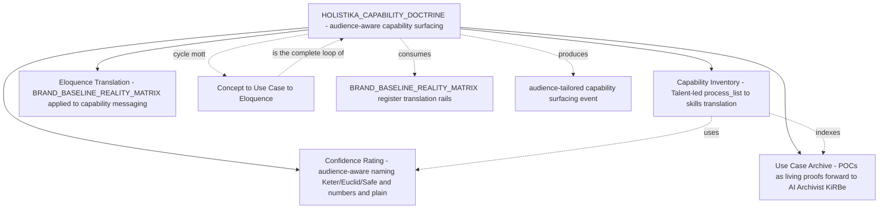

# I82 candidate — Holistika Capability Doctrine and Commercial Readiness

> **Candidate scaffold authored at I80 P7 per operator inline-ratify Round 9 (2026-05-16) framing.** Promoted to `active` when (a) operator confirms the doctrine name + canonical home + primary phase shape (P0 doctrine mint + 4 facet operationalisation phases + P5/P6 closure); (b) the four named facets (capability inventory + confidence rating + use case archive + eloquence translation) have at least one role_owner each ratified to deliver them; (c) a first concrete commercial use case (incoming customer / advisor / investor request) provides the live test for the audience-aware capability surfacing capability. The forward-charter language is deliberately *non-time-pressured*: this is a doctrine-class initiative, not a sprint deliverable.

## 1. Operating story

> **Verbatim operator framing (2026-05-16 inline-ratify Round 9):** *"From our side, we can guarantee that this knowledge base is worth investing in and selling out. Somehow."* — *"As the operation's motto goes: If we do it, we sell it."* — *"My motto: Concept to Use Case to Eloquence. We build capabilities, research use cases that are hot, actually do them with production-grade quality and translate them to operator, expert, user and business."* — *"Imagine you have a person telling you a capability and you tell them we've been able to surface it somewhere it actually helped? That's the kind of brand product knowledge research ops tech and more we talk about here in people."*

I82 mints the **third foundational doctrine** of Holistika, sibling to [`HOLISTIKA_ORGANISING_DOCTRINE.md`](../../../docs/references/hlk/v3.0/Admin/O5-1/People/canonicals/HOLISTIKA_ORGANISING_DOCTRINE.md) (I79 P1 — how we structure) and [`HOLISTIKA_AGENTIC_DOCTRINE.md`](../../../docs/references/hlk/v3.0/Admin/O5-1/People/canonicals/HOLISTIKA_AGENTIC_DOCTRINE.md) (I79 P3a — how AI fits): **how we surface what we do**.

The doctrine codifies *audience-aware capability surfacing* — the meta-capability that, when invoked, takes a request from any external counterparty (customer / advisor / investor / collaborator / regulator / recruiter) describing a need, and produces a brand-faithful audience-appropriate response that contains: (1) the relevant capability rows from our inventory; (2) the confidence rating for delivery (Keter/Euclid/Safe-style — naming TBD); (3) prior use-case proofs (POCs from past engagements); (4) eloquence-translated message in the right register for the requester.

The four named instruments — capability inventory, confidence rating, use case archive, eloquence translation — are *facets* of this single capability, not strands of a 4-track initiative. The cohering principle (**per operator Round 9 reframe**): the doctrine is *flexible* enough to draw from any inventory (mottos / capabilities / skills / use-cases / doctrines / registries) and translate to the right audience. Rigid umbrella packaging was rejected; *capability-shaped framing* was selected.

## 2. The four facets (instruments of the capability)

### 2a. Capability inventory (Talent-led)

`process_list.csv` is the **inventory** of what every area can do. The Talent role (newly activated per `D-IH-79-A` baseline forward-charter; not yet at `baseline_organisation.csv` row but anticipated) translates the inventory into a **capabilities/skills list** that external counterparties can read. Each row carries: skill_id (FK to `SKILL_REGISTRY.csv`), capability_name, area, role_owner, originating_process_ids (semicolon list), description (plain-language register for People-area; technical register for Tech-area; commercial register for cross-area presentation).

The operator framing: *"hopefully Talent will be able to translate our inventory — process_list — into capabilities/skill list, governed and that will be the best talent I've seen because not many companies are able to explain to someone 'what you guys can do' in such a governed, clear, scalable, tangible, demonstrable way."* The deliverable: **`CAPABILITY_REGISTRY.csv`** at `Admin/O5-1/People/canonicals/dimensions/` (sibling of `SKILL_REGISTRY.csv`) + Pydantic SSOT + validator.

### 2b. Confidence rating (Keter / Euclid / Safe — names cameo, truth canonical)

Every capability carries a **confidence rating** — how sure we are we can deliver. The operator's draft naming (per Round 9 Q2 response):

- **Keter** — Low confidence. *"Something we may know how to do but not enough to warrant we won't need external resources or research or big adaptation to the scenario."*
- **Euclid** — Medium confidence. *"Something we know enough to warrant the e2e of the case, but we may not guarantee that a research is necessary or that our use case may be different from the requested one, but at least we can do things with our internal resources."*
- **Safe** — High confidence. *"Something we know we can revisit after X time and know we can activate at a moment's notice. Of course documentation and methods may vary a little but the thing will still be in the same place."*

The naming is **a cameo for methodology-curious audiences** (per the operator's lived experience: *"Mark-I sell this message to a ton of random persons that were captivated"* and *"investors ready to help me because I explained the innards of what we say here"*). The **underlying truth** (the confidence axis) is canonical regardless of naming. For different audiences:

- **Operations / internal**: numerical scale (e.g., 0.3 / 0.7 / 0.95) for unambiguous machine-readability + reporting.
- **Methodology-curious investors / advisors / depths-readers**: SCP-Foundation cameo names (Keter / Euclid / Safe) — resonates with Holistika CORPINT register.
- **General customers / first-meet conversations**: plain-language phrasing ("preliminary readiness" / "production-ready" / "moment's-notice ready") to avoid losing momentum explaining SCP Foundation references.

The deliverable: **`CAPABILITY_CONFIDENCE_REGISTRY.csv`** with paired-file body+addendum per `pattern_sop_addendum_split`. Body carries the canonical confidence axis (numerical or 3-class enum); addendum carries the SCP-cameo + plain-language audience-translation tables. Marketing/Brand cosigns the brand-naming choice.

### 2c. Use case archive (POCs as living proofs; AI Archivist forward-vision)

Every capability has **lived proofs**. The operator's named POCs (verbatim): *"GDF... home made POC in our own Microsoft environment"*; *"Hosteleria, RCD in which we showed how much would cost a self made sentiment analysis classifier for a survey of +2000 lines"*; *"documentation team in which we explained how to govern their folders to be ready for a future agentic system"*; *"creating a POC for shopify website"*. These are sales-ready evidence; future capability surfacing events return them as proofs.

The deliverable: **`USE_CASE_ARCHIVE.csv`** with `use_case_id` / `engagement_id` (FK to `ENGAGEMENT_REGISTRY.csv`) / `capability_id` (FK to `CAPABILITY_REGISTRY.csv`) / `confidence_demonstrated` / `outcome_summary` / `linked_artefacts` (semicolon list of paths to internal POC artefacts) / `external_references` (verbatim customer phrases that can be paraphrased) / `redaction_class` (none / paraphrase / anonymise; default: paraphrase). Each row is a **living proof**.

The system that surfaces these on demand is the **AI Archivist / KiRBe ingestor**. Per operator Round 9 framing: *"It's also good for other things we may build atop our system, like our AI Archivist and all-in-one ingestor (sort of like Composio, but with a wider scope), KiRBe. That's how it's tied to the knowledge base and why we also call it AI Archivist."* The Archivist is **forward-chartered to I83** as a Tech-area-led product-shaped initiative (per Round 9 Q3 recommendation).

### 2d. Eloquence translation (BRAND_BASELINE_REALITY_MATRIX applied to capability messaging)

The translation craft. Per operator motto: *"Concept to Use Case to Eloquence"* + *"translate them to operator, expert, user and business"*. The eloquence layer takes (capability + confidence + use case) and renders the right message for the right audience.

This is **BRAND_BASELINE_REALITY_MATRIX** dual-register doctrine ([`BRAND_BASELINE_REALITY_MATRIX.md`](../../../docs/references/hlk/v3.0/Admin/O5-1/Marketing/Brand/BRAND_BASELINE_REALITY_MATRIX.md)) extended from brand prose to capability messaging. Marketing/Brand-led; reuses existing translation rails.

The deliverable: **extension of `BRAND_BASELINE_REALITY_MATRIX.md`** with §N "Capability messaging extension" — per-audience translation tables for operator / expert / user / business / advisor / investor / regulator / customer. No new canonical CSV needed; the matrix table extension is sufficient.

## 3. Phase shape (proposed; ratified at P0 promotion)

| Phase | Purpose | Deliverable | Effort |
|:---|:---|:---|---:|
| **P0** | Charter + doctrine mint (paired body + addendum per pattern_sop_addendum_split first instantiated at I80 P2) | `HOLISTIKA_CAPABILITY_DOCTRINE.md` (level 4 body) + `.addendum.md` (level 5 addendum) at `People/canonicals/`; charter decisions D-IH-82-A..G; OPS-82-1..5 | 1d |
| **P1** | Capability inventory facet | `CAPABILITY_REGISTRY.csv` (16-col); Pydantic + validator + tests; seed rows from current `process_list.csv` | 1d |
| **P2** | Confidence rating facet | `CAPABILITY_CONFIDENCE_REGISTRY.csv` (paired body+addendum + brand-naming canonical co-signed by Marketing/Brand); SCP-cameo + plain-language tables | 1d |
| **P3** | Use case archive facet | `USE_CASE_ARCHIVE.csv` (paired body+addendum); seed rows from named POCs (GDF + Hosteleria + RCD + documentation-team + Shopify) | 1d |
| **P4** | Eloquence translation facet | `BRAND_BASELINE_REALITY_MATRIX.md` §N capability-messaging extension; per-audience tables | 0.5d |
| **P5** | Integration with hlk-erp panels + Supabase mirror forward-spec | mirror migrations + ERP panel route specs (Tech Lab cosign); KNOWLEDGE_PAIRING_REGISTRY rows for each new paired file | 0.5d |
| **P6** | UAT (live test: one incoming customer/advisor/investor request) + closure + I83 forward-charter | UAT report + I83 candidate stub (already authored at I80 P7 — this phase ratifies + may extend) | 0.5d |

Total estimated effort: **5 days** continuous OR absorbed into existing area review cadences over 2-3 quarters.

## 4. Conundrums (top 5)

| ID | Question | Owner | Window |
|:---|:---|:---|:---|
| **C-82-1** | Doctrine final name (HOLISTIKA_CAPABILITY_DOCTRINE.md vs HOLISTIKA_ELOQUENCE_DOCTRINE.md vs other) | Founder + People Operations Lead | P0 inline-ratify |
| **C-82-2** | Confidence rating naming policy — SCP-cameo vs numbers vs plain language as PRIMARY vs cameo | Founder + Brand Manager | P2 inline-ratify |
| **C-82-3** | AI Archivist / KiRBe ingestor home — I82 internal vs I83 forward-charter (current recommendation: I83) | System Owner + People Operations Lead | P3 inline-ratify (or already ratified) |
| **C-82-4** | Talent role activation in `baseline_organisation.csv` (currently anticipated; not yet a row) — pre-condition for I82 P1 or co-deliverable? | Founder + People Operations Lead | P0 inline-ratify |
| **C-82-5** | Confidence rating cadence — when a capability's confidence rating is updated; who has approval; how conflicts surface to PRECEDENCE.md | People Operations Lead + Operations/SMO | P2 inline-ratify |

## 5. Decision preview

| ID | Question | Owner | Status entering | Close-out |
|:---|:---|:---|:---|:---|
| **D-IH-82-A** | Mega-charter scope — 4-facet doctrine | Founder | Proposed | P0 |
| **D-IH-82-B** | Doctrine canonical home — `People/canonicals/` (matching existing 2 doctrines) | People Operations Lead | Recommended | P0 |
| **D-IH-82-C** | Confidence rating naming — SCP-cameo + numbers + plain (audience-aware multi-register) | Founder + Brand Manager | Proposed | P2 |
| **D-IH-82-D** | Capability inventory primary key shape (FK to `SKILL_REGISTRY.csv` vs new ID space) | People Operations Lead | Proposed | P1 |
| **D-IH-82-E** | Use case archive redaction policy — paraphrase default; case-by-case anonymise | Compliance Officer | Proposed | P3 |

## 6. Risks (top 5)

| ID | Risk | L | I | Mitigation |
|:---|:---|:---:|:---:|:---|
| **R-IH-82-1** | Doctrine remains aspirational without a live test — first capability surfacing event never happens | Medium | High | P6 acceptance criteria binds promotion to one live external request handled end-to-end |
| **R-IH-82-2** | SCP-Foundation cameo confuses audiences who don't get the reference | Medium | Medium | Per Round 9 operator framing — naming is audience-aware multi-register; cameo only for methodology-curious |
| **R-IH-82-3** | Capability inventory drifts from `process_list.csv` over time | High | Medium | FK to `process_list.csv` `item_id`s; validator enforces FK resolution; quarterly sync cadence |
| **R-IH-82-4** | Use case archive contains commercially-sensitive customer references | High | High | Default redaction = paraphrase; explicit redaction_class enum; Compliance Officer sign-off per row before external surfacing |
| **R-IH-82-5** | Eloquence translation rails diverge from BRAND_BASELINE_REALITY_MATRIX over time | Low | Medium | Extension lives IN the matrix (§N), not a separate file — drift gate is the existing matrix-drift validator |

## 7. Cross-references

- [`HOLISTIKA_ORGANISING_DOCTRINE.md`](../../../docs/references/hlk/v3.0/Admin/O5-1/People/canonicals/HOLISTIKA_ORGANISING_DOCTRINE.md) — first foundational doctrine (I79 P1).
- [`HOLISTIKA_AGENTIC_DOCTRINE.md`](../../../docs/references/hlk/v3.0/Admin/O5-1/People/canonicals/HOLISTIKA_AGENTIC_DOCTRINE.md) — second foundational doctrine (I79 P3a).
- [`BRAND_BASELINE_REALITY_MATRIX.md`](../../../docs/references/hlk/v3.0/Admin/O5-1/Marketing/Brand/BRAND_BASELINE_REALITY_MATRIX.md) — dual-register translation rails (I66; capability-messaging extension at I82 P4).
- [`KNOWLEDGE_PAIRING_REGISTRY.csv`](../../../docs/references/hlk/v3.0/Admin/O5-1/People/Compliance/canonicals/dimensions/KNOWLEDGE_PAIRING_REGISTRY.csv) — paired-file governance (I80 P6.5; consumed by every I82 P1..P4 paired-file mint).
- [`PEOPLE_DESIGN_PATTERN_REGISTRY.csv`](../../../docs/references/hlk/v3.0/Admin/O5-1/People/Compliance/canonicals/dimensions/PEOPLE_DESIGN_PATTERN_REGISTRY.csv) — pattern_sop_addendum_split (I80 P1) used for every I82 paired-file deliverable.
- [`process_list.csv`](../../../docs/references/hlk/v3.0/Admin/O5-1/People/Compliance/canonicals/process_list.csv) — capability inventory source (I82 P1 translates to `CAPABILITY_REGISTRY.csv`).
- [`SKILL_REGISTRY.csv`](../../../docs/references/hlk/v3.0/Admin/O5-1/People/Compliance/canonicals/dimensions/SKILL_REGISTRY.csv) — skill taxonomy (I82 P1 may FK).
- [I83 candidate](i83-ai-archivist-and-kirbe-ingestor.md) — sibling forward-charter for the AI Archivist / KiRBe ingestor system (Tech-area-led).

## 8. Promotion criteria (P0 charter trigger)

- Operator confirms doctrine name (C-82-1).
- Operator confirms primary 4-facet shape OR amends.
- At least one role_owner per facet ratified.
- A first concrete commercial use case (incoming external request) provides the live test for P6 UAT.
- Talent role activation in `baseline_organisation.csv` ratified or explicitly deferred to a follow-up tranche (C-82-4).
