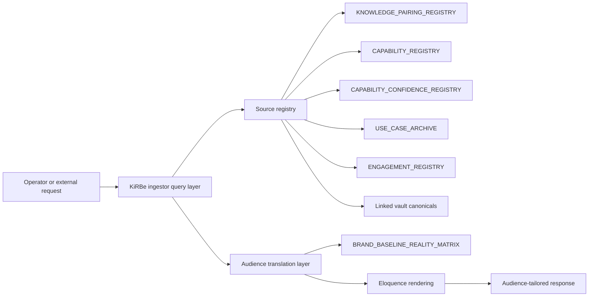

# I83 candidate — AI Archivist and KiRBe ingestor

> **Candidate scaffold authored at I80 P7 per operator inline-ratify Round 9 (2026-05-16) framing.** Promoted to `active` when (a) I82 (Capability Doctrine) is past P3 (Use Case Archive facet minted; KiRBe has a registry to consume); (b) Tech Lab has bandwidth to lead; (c) at least one concrete consumer surface (hlk-erp Knowledge panel OR external-facing capability surfacing event) provides the live test. The forward-charter language is deliberately *non-time-pressured*: this is a Tech-area product-shaped initiative, not a sprint.

## 1. Operating story

> **Verbatim operator framing (2026-05-16 inline-ratify Round 9):** *"It's also good for other things we may build atop our system, like our AI Archivist and all-in-one ingestor (sort of like Composio, but with a wider scope), KiRBe. That's how it's tied to the knowledge base and why we also call it AI Archivist. We're from People so maybe the final specs are not like that, that for other areas to answer. We've just thought about archives and thanks to Research's info we thought of this, we leave other areas to decide what's best."*

I83 builds the **system** that operationalises the Capability Doctrine's use-case-archive facet (**I82 P4**) and the audience-aware capability surfacing capability (I82 doctrine itself). The People area minted the doctrine + the registries; the Tech area builds the ingestor + the surfacing API + the UI panels.

**KiRBe** is the operator's chosen working name (see I81 candidate stub naming-flexibility commentary; final name TBD). The ingestor is conceptually similar to Composio (a unified API to many tools) but with a *wider scope*: it ingests from internal knowledge base + use case archive + capability registry + confidence registry + linked artefacts, AND from external sources (engagement reports + research diagnoses + brand canon assets + decision logs), AND surfaces them through an audience-aware translation layer.

## 2. Architectural sketch (proposed; ratified at P0 by Tech Lab Lead + System Owner)

The ingestor is **registry-driven**: every canonical asset that participates in surfacing is registered (via `KNOWLEDGE_PAIRING_REGISTRY.csv` or sibling registries minted by other areas). The query layer joins across registries; the audience translation layer applies BRAND_BASELINE_REALITY_MATRIX register rails to render the right message for the right audience.

## 3. Phase shape (proposed; ratified at P0 promotion)

| Phase | Purpose | Deliverable | Effort |
|:---|:---|:---|---:|
| **P0** | Charter + architectural decisions (Tech Lab Lead + System Owner co-author) | Charter doc; D-IH-83-A..F; OPS-83-1..4 | 1d |
| **P1** | Registry-side spec (which registries KiRBe consumes; query API spec) | Spec doc; OpenAPI schema; ratified registry-list | 1d |
| **P2** | Ingestor MVP (read-only; ingests from `KNOWLEDGE_PAIRING_REGISTRY` + `CAPABILITY_REGISTRY`) | Working KiRBe service (likely behind `holistika_ops` schema); Tech Lab framework choice ratified | 3-5d |
| **P3** | Audience translation layer (BRAND_BASELINE_REALITY_MATRIX integration) | Translation API; per-audience rendering tests | 2d |
| **P4** | hlk-erp Knowledge panel integration (consumer-side; first UI) | Panel route; UAT against capability surfacing event | 2d |
| **P5** | Closure + I84 forward-charter (operator-ratified scope expansion if needed) | Closure pause record; UAT report | 0.5d |

Total estimated effort: **9-12 days** for MVP (read-only Knowledge panel surfacing); production-ready with cross-source ingestion is a separate I84 expansion.

## 4. Conundrums (top 5)

| ID | Question | Owner | Window |
|:---|:---|:---|:---|
| **C-83-1** | Tech Lab framework choice (LangChain / LangGraph / LlamaIndex / Tech-Lab-discretion) — per `AGENTIC_FRAMEWORK_LANDSCAPE.md` | Tech Lab Lead + System Owner | P0 inline-ratify |
| **C-83-2** | Schema home — `holistika_ops.kirbe_*` (per existing two-plane Supabase contract) vs new `kirbe.*` schema | System Owner | P0 inline-ratify |
| **C-83-3** | KiRBe vs alternative naming — operator may rename pre-promotion | Founder | P0 inline-ratify |
| **C-83-4** | Audience translation depth — does KiRBe call BRAND_BASELINE_REALITY_MATRIX as a service, or does it embed the matrix offline? | Brand Manager + Tech Lab Lead | P3 inline-ratify |
| **C-83-5** | Composio comparison — do we adopt Composio + extend scope, or build native? | Tech Lab Lead | P0 inline-ratify |

## 5. Decision preview

| ID | Question | Owner | Status entering | Close-out |
|:---|:---|:---|:---|:---|
| **D-IH-83-A** | I83 mega-charter scope — KiRBe ingestor MVP + audience translation + Knowledge panel | Tech Lab Lead | Proposed | P0 |
| **D-IH-83-B** | Tech Lab framework choice | Tech Lab Lead + System Owner | Proposed | P0 |
| **D-IH-83-C** | Schema home — `holistika_ops.kirbe_*` vs `kirbe.*` | System Owner | Proposed | P0 |
| **D-IH-83-D** | Composio adoption vs native build | Tech Lab Lead | Proposed | P0 |
| **D-IH-83-E** | Read-only MVP vs read-write (forward-charter to I84 if read-write) | System Owner | Proposed | P0 |

## 6. Risks (top 5)

| ID | Risk | L | I | Mitigation |
|:---|:---|:---:|:---:|:---|
| **R-IH-83-1** | I82 not far enough along when I83 promotes — KiRBe has nothing to ingest | High | High | Hard prerequisite: **I82 P4** closed (use case archive minted) before I83 P0 |
| **R-IH-83-2** | Composio scope expansion is hard — building native is expensive | Medium | High | P0 conundrum; may scope down to read-only from existing canonical CSVs (cheap) |
| **R-IH-83-3** | RLS posture on kirbe.* schema unclear (level 5 internal-cleared canonicals must not leak) | Medium | High | Defaults: deny anon + authenticated; service_role only; classification-aware row filters per `KNOWLEDGE_PAIRING_REGISTRY.access_level` (forward-spec) |
| **R-IH-83-4** | Audience translation hallucinates beyond canonical sources | Medium | High | Hard rule: KiRBe surfaces only registered rows; no LLM inference outside the registry-bounded answer space |
| **R-IH-83-5** | hlk-erp Knowledge panel is not yet built — I83 P4 has no UI consumer | Medium | Medium | Forward-charter; if hlk-erp Knowledge panel is missing at I83 P4, scope down to API-only MVP + defer UI to I85 |

## 7. Cross-references

- [I82 candidate — Holistika Capability Doctrine](i82-holistika-capability-doctrine-and-commercial-readiness.md) — hard prerequisite (must be at **P4+** before I83 P0; P4 mints `USE_CASE_ARCHIVE.csv`).
- [`KNOWLEDGE_PAIRING_REGISTRY.csv`](../../../docs/references/hlk/v3.0/Admin/O5-1/People/Compliance/canonicals/dimensions/KNOWLEDGE_PAIRING_REGISTRY.csv) — primary registry KiRBe consumes (I80 P6.5).
- [`AGENTIC_FRAMEWORK_LANDSCAPE.md`](../../../docs/references/hlk/v3.0/Admin/O5-1/Envoy%20Tech%20Lab/canonicals/AGENTIC_FRAMEWORK_LANDSCAPE.md) — Tech Lab framework choice rails (I79 P3b).
- [`BRAND_BASELINE_REALITY_MATRIX.md`](../../../docs/references/hlk/v3.0/Admin/O5-1/Marketing/Brand/BRAND_BASELINE_REALITY_MATRIX.md) — register translation rails (I66; consumed by KiRBe audience translation layer).
- [`akos-holistika-operations.mdc`](../../../.cursor/rules/akos-holistika-operations.mdc) §"Two-plane model" — schema discipline (DDL via migrations; DML via emit) applies if KiRBe lands a new schema.
- [I76 candidate](_candidates/i76-madeira-elevation-and-aic-architecture.md) (if present) — Madeira / AIC architecture sibling; KiRBe may use the AIC pattern for the audience translation layer.

## 8. Promotion criteria (P0 charter trigger)

- **I82 P4** closed (use case archive minted; KiRBe has a registry to ingest).
- Tech Lab Lead + System Owner ratify P0 charter shape.
- One concrete consumer surface available (hlk-erp Knowledge panel OR external request UAT).
- C-83-1 (framework) + C-83-2 (schema home) + C-83-5 (Composio vs native) ratified inline at P0.
