# Initiative dependency map (I59..I79)

> **Purpose.** Single visual + tabular source of truth for how Holistika initiatives block, unblock, or loosely couple to each other. Companion to [`PLANNING_COMPENDIUM.md`](PLANNING_COMPENDIUM.md) and entry point for the agent during compendium §3.2 read-pass.
>
> **When to update.** Every initiative promotion (candidate → active); every TRIGGER-watch resolution (TRIGGER fired or formally retired); every phase commit that closes a hold-gate; every initiative closure (active → closed).
>
> **Authority.** State truth comes from [`INITIATIVE_REGISTRY.csv`](../../../references/hlk/v3.0/Admin/O5-1/People/Compliance/canonicals/INITIATIVE_REGISTRY.csv). This file mirrors `status` + `gated_on` + closure dependencies into a readable form. If they disagree, the CSV is correct; update this file.

---

## 1. Mermaid map

```mermaid
flowchart LR
    %% Closed initiatives (gold-standard reference shape)
    i59[I59 - HLK Governance Clean Slate]:::closed
    i63[I63 - External Repo Governance Codification]:::closed
    i64[I64 - Governance Mission Control]:::closed
    i65[I65 - AKOS Planning Workspace Panel]:::closed
    i66[I66 - Brand Vision Ops Sweep]:::closed
    i67[I67 - RevOps Discovery]:::closed
    i68[I68 - CICD Discipline and Observability Maturity]:::closed
    i70[I70 - Holistika OS Self-Governance Foundation]:::closed
    i71[I71 - CICD Discipline and AIOps Baseline Maturity]:::closed
    i72[I72 - Marketing Area Governance and Persona Registry Expansion]:::closed
    i73[I73 - People Operations + Engagement Models + Methodology IP]:::closed

    %% Active initiatives
    i77[I77 - Impeccable Brand-Bridge Refresh and Drift Gate]:::active
    i79[I79 - People Manifesto + Pattern Library + AI Governance + Knowledge Hygiene]:::active

    %% Candidate initiatives (promotable when hold-gates clear)
    i75[I75 - Research Area Governance]:::candidate
    i76[I76 - MADEIRA Elevation]:::candidate

    %% TRIGGER-watch candidates (dormant by design)
    i74[I74 - Brand-Tooling Productization]:::trigger
    i78[I78 - Brand-Voice LLM-as-Judge]:::trigger

    %% Hard blocks (prior must close before successor starts)
    i59 --> i63
    i63 --> i64
    i64 --> i65
    i65 --> i66
    i66 --> i70
    i67 --> i70
    i68 --> i71
    i70 --> i71
    i70 --> i73
    i70 --> i75
    i70 --> i76
    i71 --> i73
    i71 --> i77
    i72 --> i73
    i72 --> i76
    i73 --> i79

    %% Soft / strand-level cross-links (dotted)
    i71 -.->|review-stamp dimension| i73
    i71 -.->|brand canonicals lib| i77
    i72 -.->|adapter pattern| i76
    i72 -.->|paired SOP rule| i73
    i73 -.->|HR curriculum| i75
    i75 -.->|methodology pillars| i73
    i76 -.->|AIC role_owner| i72
    i79 -.->|design pattern library| i75
    i79 -.->|design pattern library| i77
    i79 -.->|agentic doctrine input| i76

    %% TRIGGER-watch hold-gates (dashed)
    i74 -.->|TRIGGER-2: >=2 external requests| extReq[External org consumption requests]
    i78 -.->|TRIGGER: >=2 regex pushback signals| extReg[Regex pushback signals]

    classDef closed stroke-width:2px,stroke-dasharray: 0
    classDef active stroke-width:3px,stroke-dasharray: 0
    classDef candidate stroke-width:1px,stroke-dasharray: 4 2
    classDef trigger stroke-width:1px,stroke-dasharray: 8 4
```

**Legend (style encoding only; no explicit fill colours per `PLANNING_COMPENDIUM.md` §10.3).**

- **Solid border, thick stroke** = closed (gold-standard reference shape).
- **Solid border, extra-thick stroke** = active (in flight).
- **Dashed border, short dashes** = candidate (promotable when hold-gates clear).
- **Dashed border, long dashes** = TRIGGER-watch (dormant by design; waits on external signal).
- **Solid arrow** = hard block (prior must close before successor starts).
- **Dotted arrow with label** = soft / strand-level cross-link (dependency exists but doesn't gate the whole initiative).

---

## 2. Per-initiative blocker table

| Initiative | State | Blockers (hard) | Blocked-by | Unblocks | TRIGGER conditions | Current phase |
|:---|:---|:---|:---|:---|:---|:---|
| **I59** — HLK Governance Clean Slate | closed | — | — | I63 | — | closed |
| **I63** — External Repo Governance Codification | closed | I59 closed | I59 | I64 | — | closed |
| **I64** — Governance Mission Control | closed | I63 closed | I63 | I65 | — | closed |
| **I65** — AKOS Planning Workspace Panel | closed | I64 closed | I64 | I66 | — | closed |
| **I66** — Brand Vision Ops Sweep | closed | I65 closed | I65 | I70 | — | closed |
| **I67** — RevOps Discovery | closed | — | — | I70 (RevOps strand input) | — | closed |
| **I68** — CICD Discipline + Observability Maturity | closed | — | — | I71 (CICD baseline + Observability evolution) | — | closed |
| **I70** — Holistika OS Self-Governance Foundation | closed | I66 + I67 closed | I66 + I67 | I71 + I73 + I75 + I76 | — | closed |
| **I71** — CICD Discipline + AIOps Baseline Maturity | closed | I68 + I70 closed | I68 + I70 | I73 (review-stamp dimension) + I77 (brand canonicals lib) | — | closed |
| **I72** — Marketing Area Governance + Persona Registry + IntelligenceOps + RevOps + Process Catalog | closed | — | — | I73 (paired SOP rule) + I76 (adapter pattern) | — | closed |
| **I73** — People Ops + Engagement Models + Methodology IP (mega-initiative) | closed | I70 + I71 + I72 closed (MET) | I70 + I71 + I72 | I75 (HR curriculum cross-link) | — | **CLOSED 2026-05-15** (`INIT-OPENCLAW_AKOS-73`; `D-IH-73-CLOSURE`) — P7–P11 kb-readability + methodology IP + UAT + integration |
| **I74** — Brand-tooling productization | TRIGGER-watch | TRIGGER-2: ≥2 external orgs request AKOS doctrine consumption without source-fork (0 today) | external market signal | (none yet) | TRIGGER-2 = ≥2 external requests | dormant |
| **I75** — Research area governance | candidate | I70 closed (MET); I71 + I72 + I73 P0 (I73 PENDING); Research Director commit (PENDING) | I73 + founder approvals | I76 (cross-strand methodology pillars) | — | candidate |
| **I76** — MADEIRA elevation | candidate | I70 + I72 closed (MET); Strand A external research on AIC F1-F5 completes (PENDING) | external research + operator ratification | (forward-charter linkage to I72 RevOps roles) | — | candidate |
| **I77** — Impeccable Brand-Bridge Refresh + Drift Gate | active | I71 P1 Pack A1 ship (MET — I71 fully closed) | I71 closed | (forward — Impeccable v3.1 chassis stays operational across all initiatives) | — | P0 charter ratified 2026-05-14; P1 Strand A pending |
| **I78** — Brand-voice LLM-as-judge advisory | TRIGGER-watch | TRIGGER: ≥2 regex pushback signals on I71 deterministic gate (0 today) | external regex pushback | (forward — advisory layer to I71's deterministic gate) | TRIGGER = ≥2 pushback signals | dormant |
| **I79** — People Manifesto + Pattern Library + AI Governance + Knowledge Hygiene (mega-initiative) | active | I73 closed (MET 2026-05-15) | I73 | I75 (design pattern library input) + I77 (design pattern library input) + I76 (agentic doctrine input) | — | **P0 charter ratified 2026-05-15** (`INIT-OPENCLAW_AKOS-79`; charter-satisfies-gate per `D-IH-79-A`); P1 manifest publish pending |

State truth: row 56 of [`INITIATIVE_REGISTRY.csv`](../../../references/hlk/v3.0/Admin/O5-1/People/Compliance/canonicals/INITIATIVE_REGISTRY.csv) (I70), row 57 (I71), row 58 (I72), row 59 (I77), row 60 (I73 — **closed 2026-05-15**), row 61 (I79 — **active 2026-05-15**). I74/I75/I76/I78 have no INIT row yet; state is read from candidate files under [`docs/wip/planning/_candidates/`](../_candidates/).

---

## 3. Cross-strand linkages

Some initiatives are loose-coupled to others via specific strands, where the dependency is real but does not block the whole initiative. These are the dotted arrows in §1.

### 3.1 I71 P4 review-stamp dimension → I73 P1 curriculum versioning

I71 P4 (closed 2026-05-14) added a `methodology_version_at_review` column to 4 mirrored canonicals + minted [`validate_review_stamps.py`](../../../../scripts/validate_review_stamps.py) + the [`REVIEW_STAMP_INBOX.md`](../REVIEW_STAMP_INBOX.md) sidecar + reserved an ERP freshness-dashboard panel slot. I73 candidate conundrum C-73-2 (curriculum versioning anchor — methodology-anchor vs own cadence) resolves toward methodology-anchor because the I71 P4 column makes drift detection automatic for methodology-anchored content. See [`docs/wip/planning/71-cicd-discipline-and-aiops-baseline-maturity/master-roadmap.md`](../71-cicd-discipline-and-aiops-baseline-maturity/master-roadmap.md) §P4 and [`docs/wip/planning/_candidates/i73-people-operations-and-learning-curriculum.md`](../_candidates/i73-people-operations-and-learning-curriculum.md) §4 C-73-2.

### 3.2 I71 P1 Pack A1 brand canonicals → I77 P1 bridge refresh

I71 P1 Pack A1 landed [`BRAND_ENGLISH_PATTERNS.md`](../../../references/hlk/v3.0/Admin/O5-1/Marketing/Brand/BRAND_ENGLISH_PATTERNS.md) + [`BRAND_LLM_TONE_TELLS.md`](../../../references/hlk/v3.0/Admin/O5-1/Marketing/Brand/BRAND_LLM_TONE_TELLS.md) as part of the 10-layer brand-DNA chassis. I77 P1 Strand A bridge refresh cross-references both into the new `BASELINE_REALITY.md` bridge. The dependency is structural (P1 cannot start before I71 P1 lands; MET), not gating (I77 P0 charter ratified 2026-05-14 regardless).

### 3.3 I72 P9 adapter pattern → I76 cross-area handoff

I72 P9 shipped 8 adapter registries (CRM / REVOPS / EMAIL / ATTRIBUTION / BILLING / COMMUNICATION / SCHEDULING / CONTRACT) under the Normalized Adapter Pattern (per Truto + Unified.to + Apideck industry consensus). I76 MADEIRA elevation will extend the REVOPS_ADAPTER_REGISTRY pattern for cross-area handoff bridges (Finance / Data / Tech / GTM-CRM / People / Legal / Research / MADEIRA). The pattern is the SSOT; I76 consumes it rather than mints a parallel system. See I72 P9 commit `297d6b7` and [`.cursor/rules/akos-executable-process-catalog.mdc`](../../../../.cursor/rules/akos-executable-process-catalog.mdc) RULE 2.

### 3.4 I72 paired SOP rule → I73 P3 People Ops SOPs

I72 P9 ratified [`.cursor/rules/akos-executable-process-catalog.mdc`](../../../../.cursor/rules/akos-executable-process-catalog.mdc) RULE 1: every executable process needs a paired human-readable SOP AND an agent-facing executable runbook AND both `acceptance_criteria_human` + `acceptance_criteria_automation` declared per catalog entry. I73 P3 People Operations SOPs (hiring + onboarding + payroll + offboarding) inherit this rule — each SOP carries a paired runbook (likely `scripts/<purpose>.py` or YAML in a sibling catalog).

### 3.5 I73 HR curriculum ↔ I75 Research methodology pillars

I73 P1 authors the Holistik Researcher onboarding curriculum (per-discipline reading list + per-pillar exercises). The pillar list is defined by I75 (Research area governance). The two initiatives co-evolve: I73 P1 lands a stub curriculum with placeholder pillars; I75 P2 (when it ships) fills the pillar definitions and triggers a curriculum revision. This is bidirectional loose-coupling, not a block.

### 3.6 I76 AIC role_owner → I72 D-IH-72-S binary AC axis

I76 candidate conundrum C-76-1 (AIC SOP-consumption posture) builds on I72's `D-IH-72-S` (Round 6): the binary AC axis classifies AIC SOP consumption on the AC-HUMAN side (humans + AIC are SOP-readers) while AC-AUTOMATION covers unattended runbook firing. I76 may extend this axis or split it; the conundrum is the architectural fork.

---

## 4. Hold-gate quick-check at a glance

For the agent: when promoting any candidate to active, confirm these gates via the per-initiative checklist below.

### I73 promotion gates (ALL MET 2026-05-15; promoted to active)

- [x] I70 closing UAT — MET 2026-05-13.
- [x] I71 P0 charter — MET (I71 fully closed 2026-05-14).
- [x] I72 P0 charter — MET (I72 fully closed 2026-05-14).
- [x] First Holistik Researcher hired (or hiring window committed) — **MET via charter-satisfies-gate reframe** per **D-IH-73-B** (bootstrapping reality: operator + Madeira AI O5-1 + ad-hoc collaborators; founder's own paid employment per [`FOUNDER_TRAJECTORY_INTERNAL.md`](../../../references/hlk/v3.0/Admin/O5-1/People/canonicals/FOUNDER_TRAJECTORY_INTERNAL.md) §2 funds Holistika bootstrap; designing the 7-class engagement-model taxonomy IS the unblock, not a traditional hire).
- [x] Founder approval to formally onboard People Operations Lead — **MET via charter-satisfies-gate reframe** per **D-IH-73-B** (same rationale; People Operations Lead role minted in [`baseline_organisation.csv`](../../../references/hlk/v3.0/Admin/O5-1/People/Compliance/canonicals/baseline_organisation.csv) at I70 P8.3 per `PEOPLE_AREA_RESTRUCTURE.md`; engagement-model-registry execution drives the role even before traditional hire).

### I75 promotion gates

- [x] I70 closing UAT — MET 2026-05-13.
- [x] I71 P0 charter — MET.
- [x] I72 P0 charter — MET.
- [ ] I73 P0 charter — **MET** (I73 **closed** 2026-05-15 per `INIT-OPENCLAW_AKOS-73`; see **D-IH-73-CLOSURE**).
- [ ] Research Director commitment — PENDING (operator decision).

### I76 promotion gates

- [x] I70 closing UAT — MET.
- [x] I72 P0 charter — MET.
- [ ] Strand A external research on AIC F1-F5 framings — PENDING.
- [ ] Operator ratification of AIC architecture (C-76-1) — PENDING (planning-time conundrum).

### I74 TRIGGER-watch

- [ ] TRIGGER-2: ≥2 external orgs request AKOS doctrine consumption without source-fork — **NOT FIRED** (0 requests as of 2026-05-15).

### I78 TRIGGER-watch

- [ ] TRIGGER: ≥2 regex pushback signals on I71 deterministic gate — **NOT FIRED** (0 signals as of 2026-05-15; I71 just closed).

---

## 5. Update history

| Date | Change | Author |
|:---|:---|:---|
| 2026-05-15 | Initial authoring. Covers I59..I78 with state truth from `INITIATIVE_REGISTRY.csv` + `_candidates/` files. I71, I72 closed reflected. | PMO |
| 2026-05-15 | I73 promoted from candidate to active (P0 charter shipped 2026-05-15; `INIT-OPENCLAW_AKOS-73` minted). Mega-initiative absorbing 8 strands (Learning + Ethics+Learning + People Ops engagement-lifecycle + Compliance/Ethics boundary + ENGAGEMENT_MODEL_REGISTRY + Historical case-law + KB human-readability + Methodology IP minting) across 11 phases. Hold-gate reframing per **D-IH-73-B** (charter-satisfies-gate; bootstrapping reality). 7 charter-time decisions ratified (D-IH-73-A..G). 10 OPS-73-* rows minted. Mermaid classDef flipped candidate → active; blocker table row updated; §4 hold-gates flipped to MET with footnote on reframe; §5 history extended. | PMO |
| 2026-05-15 | I73 **`INIT-OPENCLAW_AKOS-73` closed** — P11; **`D-IH-73-CLOSURE`** minted; **`INITIATIVE_REGISTRY.csv`** row 60 `status=closed` + `closed_at=2026-05-15`. Mermaid `i73` → `:::closed`. Blocker table + I75 promotion gate **I73 P0** → **MET**. All **`OPS-73-*`** rows closed. Carry-over: **`hlk-erp`** kb-views as sibling PR; **`release-gate.py`** environmental FAIL lanes per triage unchanged. | PMO |
| 2026-05-15 | I79 **`INIT-OPENCLAW_AKOS-79`** P0 charter ratified — Holistika People Manifesto + Knowledge Hygiene + Cross-area Design Patterns + AI Governance (mega-initiative; follow-up to closed I73 doctrinal layer). Mega-initiative absorbing 6 strands (A Manifesto + B Pattern Library + C-People AI Doctrine + Ethics Anchor + C-TechLab Framework Landscape + D Cross-area Breakthrough Propagation + E Orphan Hygiene + F process_list 8th-col FK) across 10 phases (P0..P8 with P3a/P3b split). 14 charter-time decisions ratified (D-IH-79-A..N) per round 1 + round 3 inline-ratify gates. 10 OPS-79-* rows minted. New always-applied Cursor rule [`.cursor/rules/akos-people-discipline-of-disciplines.mdc`](../../../../.cursor/rules/akos-people-discipline-of-disciplines.mdc) ratified at P0 per `D-IH-79-H`. Mermaid `i79` node added (active); `i73 --> i79` hard-block edge added; soft-link arrows `i79 -.-> i75/i77/i76` added; blocker table row added; §5 history extended. Authoritative Cursor plan: `~/.cursor/plans/i79_people_doctrine_4e309f45.plan.md`. Workspace mirror at [`docs/wip/planning/79-people-manifesto-and-pattern-library/`](../79-people-manifesto-and-pattern-library/). | PMO |
