# Initiative dependency map (I59..I87)

> **Purpose.** Single visual + tabular source of truth for how Holistika initiatives block, unblock, or loosely couple to each other. Companion to [`PLANNING_COMPENDIUM.md`](PLANNING_COMPENDIUM.md) and entry point for the agent during compendium §3.2 read-pass.
>
> **When to update.** Every initiative promotion (candidate → active); every TRIGGER-watch resolution (TRIGGER fired or formally retired); every phase commit that closes a hold-gate; every initiative closure (active → closed).
>
> **Authority.** State truth comes from [`INITIATIVE_REGISTRY.csv`](../../../references/hlk/v3.0/Admin/O5-1/People/Compliance/canonicals/INITIATIVE_REGISTRY.csv). This file mirrors `status` + `gated_on` + closure dependencies into a readable form. If they disagree, the CSV is correct; update this file.

---

## 1. Mermaid map

```mermaid
flowchart LR
    %% Closed initiatives (gold-standard reference shape)
    i59[I59 - HLK Governance Clean Slate]:::closed
    i63[I63 - External Repo Governance Codification]:::closed
    i64[I64 - Governance Mission Control]:::closed
    i65[I65 - AKOS Planning Workspace Panel]:::closed
    i66[I66 - Brand Vision Ops Sweep]:::closed
    i67[I67 - RevOps Discovery]:::closed
    i68[I68 - CICD Discipline and Observability Maturity]:::closed
    i70[I70 - Holistika OS Self-Governance Foundation]:::closed
    i71[I71 - CICD Discipline and AIOps Baseline Maturity]:::closed
    i72[I72 - Marketing Area Governance and Persona Registry Expansion]:::closed
    i73[I73 - People Operations + Engagement Models + Methodology IP]:::closed
    i79[I79 - People Manifesto + Pattern Library + AI Governance + Knowledge Hygiene]:::closed
    i80[I80 - I79 Lessons-Learned SOP Body/Addendum + Lenses + Inline-Ratify Skill]:::closed

    %% Active initiatives
    i81[I81 - KB integrity + Compliance layout + SOP retrofit]:::active
    i82[I82 - Holistika Capability Doctrine and Commercial Readiness]:::active
    i84[I84 - Substrate Doctrine and Commercial Readiness]:::active
    i85[I85 - Audience-tag canonicalization]:::active
    i86[I86 - Initiative Cluster Execution Coordinator]:::active
    i87[I87 - OpenClaw operator-runtime hardening]:::active

    %% Recently closed
    i77[I77 - Impeccable Brand-Bridge Refresh + Drift Gate + Brand-Canon Collapse + Rendering Governance]:::closed

    %% Candidate initiatives (promotable when hold-gates clear)
    i75[I75 - Research Area Governance]:::candidate
    i76[I76 - MADEIRA Elevation]:::candidate
    i83[I83 - AI Archivist and KiRBe Ingestor]:::candidate

    %% TRIGGER-watch candidates (dormant by design)
    i74[I74 - Brand-Tooling Productization]:::trigger
    i78[I78 - Brand-Voice LLM-as-Judge]:::trigger

    %% Hard blocks (prior must close before successor starts)
    i59 --> i63
    i63 --> i64
    i64 --> i65
    i65 --> i66
    i66 --> i70
    i67 --> i70
    i68 --> i71
    i70 --> i71
    i70 --> i73
    i70 --> i75
    i70 --> i76
    i71 --> i73
    i71 --> i77
    i72 --> i73
    i72 --> i76
    i73 --> i79
    i79 --> i80
    i80 --> i81
    i80 --> i82
    i82 --> i83

    %% Soft / strand-level cross-links (dotted)
    i71 -.->|review-stamp dimension| i73
    i71 -.->|brand canonicals lib| i77
    i72 -.->|adapter pattern| i76
    i72 -.->|paired SOP rule| i73
    i73 -.->|HR curriculum| i75
    i75 -.->|methodology pillars| i73
    i76 -.->|AIC role_owner| i72
    i79 -.->|design pattern library| i75
    i79 -.->|design pattern library| i77
    i79 -.->|agentic doctrine input| i76
    i80 -.->|inline-ratify skill| i76
    i80 -.->|SOP body/addendum pattern| i75
    i80 -.->|SOP body/addendum pattern| i77
    i80 -.->|KNOWLEDGE_PAIRING_REGISTRY| i82
    i80 -.->|KNOWLEDGE_PAIRING_REGISTRY| i83
    i82 -.->|capability surfacing capability| i76
    i82 -.->|use case archive consumed by KiRBe| i83
    i81 -.->|kb-integrity-matrix feeds Capability registry mint| i82

    %% I85 wiring (audience-tag canonicalization spawned from I77 P4 follow-up; per Impeccable audit 2026-05-16)
    i77 -.->|UAT §7 + Impeccable audit findings #7+#8+#9| i85
    i85 -.->|AUDIENCE_REGISTRY.csv FK; column extension to kb-integrity-matrix| i81
    i71 -.->|brand canonical home for matrix| i85
    i66 -.->|J-* codes minted in BRAND_BASELINE_REALITY_MATRIX| i85

    %% I84 charter + parallel-track + cross-area unlocks (per D-IH-84-I 2026-05-16)
    i80 -.->|inline-ratify skill first cross-area deployment| i84
    i81 -.->|parallel-track wave 1+2; I81 P3 named-milestone schema gates I84 P5 cascade| i84
    i84 -->|D-IH-84-C AIC framing ratifies| i76
    i84 -->|D-IH-84-D Madeira productization shape ratifies| i74
    i84 -->|D-IH-84-E KiRBe framework narrowing ratifies| i83
    i84 -.->|SUBSTRATE_REGISTRY FK target for capability rows| i82
    i84 -.->|Research-area canonical pair P6 needs governance frame| i75

    %% I86 cluster coordination posture (operational portfolio orchestrator; D-IH-86-A..E)
    i86 -.->|cluster-coordination| i81
    i86 -.->|cluster-coordination| i84
    i86 -.->|cluster-coordination| i85
    i86 -.->|cluster-coordination| i82
    i86 -.->|cluster-coordination| i83
    i86 -.->|cluster-coordination| i74
    i86 -.->|cluster-coordination| i75
    i86 -.->|cluster-coordination| i76
    i86 -.->|cluster-coordination| i87

    %% TRIGGER-watch hold-gates (dashed)
    i74 -.->|TRIGGER-2: >=2 external requests| extReq[External org consumption requests]
    i78 -.->|TRIGGER: >=2 regex pushback signals| extReg[Regex pushback signals]

    classDef closed stroke-width:2px,stroke-dasharray: 0
    classDef active stroke-width:3px,stroke-dasharray: 0
    classDef candidate stroke-width:1px,stroke-dasharray: 4 2
    classDef trigger stroke-width:1px,stroke-dasharray: 8 4
```

**Legend (style encoding only; no explicit fill colours per `PLANNING_COMPENDIUM.md` §10.3).**

- **Solid border, thick stroke** = closed (gold-standard reference shape).
- **Solid border, extra-thick stroke** = active (in flight).
- **Dashed border, short dashes** = candidate (promotable when hold-gates clear).
- **Dashed border, long dashes** = TRIGGER-watch (dormant by design; waits on external signal).
- **Solid arrow** = hard block (prior must close before successor starts).
- **Dotted arrow with label** = soft / strand-level cross-link (dependency exists but doesn't gate the whole initiative).

---

## 2. Per-initiative blocker table

| Initiative | State | Blockers (hard) | Blocked-by | Unblocks | TRIGGER conditions | Current phase |
|:---|:---|:---|:---|:---|:---|:---|
| **I59** — HLK Governance Clean Slate | closed | — | — | I63 | — | closed |
| **I63** — External Repo Governance Codification | closed | I59 closed | I59 | I64 | — | closed |
| **I64** — Governance Mission Control | closed | I63 closed | I63 | I65 | — | closed |
| **I65** — AKOS Planning Workspace Panel | closed | I64 closed | I64 | I66 | — | closed |
| **I66** — Brand Vision Ops Sweep | closed | I65 closed | I65 | I70 | — | closed |
| **I67** — RevOps Discovery | closed | — | — | I70 (RevOps strand input) | — | closed |
| **I68** — CICD Discipline + Observability Maturity | closed | — | — | I71 (CICD baseline + Observability evolution) | — | closed |
| **I70** — Holistika OS Self-Governance Foundation | closed | I66 + I67 closed | I66 + I67 | I71 + I73 + I75 + I76 | — | closed |
| **I71** — CICD Discipline + AIOps Baseline Maturity | closed | I68 + I70 closed | I68 + I70 | I73 (review-stamp dimension) + I77 (brand canonicals lib) | — | closed |
| **I72** — Marketing Area Governance + Persona Registry + IntelligenceOps + RevOps + Process Catalog | closed | — | — | I73 (paired SOP rule) + I76 (adapter pattern) | — | closed |
| **I73** — People Ops + Engagement Models + Methodology IP (mega-initiative) | closed | I70 + I71 + I72 closed (MET) | I70 + I71 + I72 | I75 (HR curriculum cross-link) | — | **CLOSED 2026-05-15** (`INIT-OPENCLAW_AKOS-73`; `D-IH-73-CLOSURE`) — P7–P11 kb-readability + methodology IP + UAT + integration |
| **I74** — Brand-tooling productization | TRIGGER-watch | TRIGGER-2: ≥2 external orgs request AKOS doctrine consumption without source-fork (0 today) | external market signal | (none yet) | TRIGGER-2 = ≥2 external requests | dormant |
| **I75** — Research area governance | candidate | I70 closed (MET); I71 + I72 + I73 P0 (I73 PENDING); Research Director commit (PENDING) | I73 + founder approvals | I76 (cross-strand methodology pillars) | — | candidate |
| **I76** — MADEIRA elevation | candidate | I70 + I72 closed (MET); Strand A external research on AIC F1-F5 completes (PENDING) | external research + operator ratification | (forward-charter linkage to I72 RevOps roles) | — | candidate |
| **I77** — Impeccable Brand-Bridge Refresh + Drift Gate | active | I71 P1 Pack A1 ship (MET — I71 fully closed) | I71 closed | (forward — Impeccable v3.1 chassis stays operational across all initiatives) | — | P0 charter ratified 2026-05-14; P1 Strand A pending |
| **I78** — Brand-voice LLM-as-judge advisory | TRIGGER-watch | TRIGGER: ≥2 regex pushback signals on I71 deterministic gate (0 today) | external regex pushback | (forward — advisory layer to I71's deterministic gate) | TRIGGER = ≥2 pushback signals | dormant |
| **I79** — People Manifesto + Pattern Library + AI Governance + Knowledge Hygiene (mega-initiative) | closed | I73 closed (MET 2026-05-15) | I73 | I75 (design pattern library input) + I77 (design pattern library input) + I76 (agentic doctrine input) + I80 (lessons-learned input) | — | **CLOSED 2026-05-15** (`INIT-OPENCLAW_AKOS-79`; `D-IH-79-CLOSURE`) — P0–P8 mega-initiative six strands + UAT + integration verification; 24/1165 process_list FK seeds; anti-jargon drift gate operational |
| **I80** — I79 Lessons-Learned (SOP Body/Addendum + Stakeholder Lenses + Inline-Ratify Skill) | closed | I79 closed (MET 2026-05-15) | I79 | I81 (full-vault SOP body/addendum retrofit forward-charter) + I76 (inline-ratify skill consumed) + I75/I77 (SOP body/addendum pattern adopted) | — | **CLOSED 2026-05-16** (`INIT-OPENCLAW_AKOS-80`; `D-IH-80-CLOSURE`) — 8 atomic commits P0..P7; 3 tracks delivered: stakeholder lenses paired files + SOP body/addendum pattern (8 paired-file instantiations) + inline-ratify craft skill |
| **I81** — Knowledge-base integrity sweep (vault + planning surface) + Compliance layout reorganisation + named-milestone migration + full-vault SOP retrofit | **active** | Operator approval per P2 layout-migration tranche (canonical-CSV gates); D-IH-81-F/G/I/J close at later phases | **I80 P7 closed** (`D-IH-80-CLOSURE`) **+ KNOWLEDGE_PAIRING pattern live** (`D-IH-80-H`) | **I82** (consumes integrity matrix + unlocks Confidence in folder layout hygiene) **+ all future initiatives** (named-milestone schema becomes permanent vocabulary at P3) **+ downstream mirror/ERP path consumers** | — | **P0 charter ratified 2026-05-16** (`INIT-OPENCLAW_AKOS-81`); D-IH-81-A/B/C/E/H ratified via I86 Wave 1 batch with `decision_source: agent_inline_default` after operator skip; ~10-25d total (absorbed mode per D-IH-81-A) |
| **I82** — Holistika Capability Doctrine + Commercial Readiness | **active** | P1 Talent activation + P2 CAPABILITY_REGISTRY mint (canonical-CSV gates); P2 gated on I81 P1 integrity CLOSED OR D-IH-82-PREREQ waiver | **I80 closed** + **I81 P1** (or waiver) + **Talent CSV approval queued** | **I83** (Archivist ingestor consumes registries once I82 facets land) **+ Investor/collateral surfaces** | — | **P0 charter ratified 2026-05-16** (`INIT-OPENCLAW_AKOS-82`); D-IH-82-A/B/F/G/H ratified via I86 Wave 1 batch with `decision_source: agent_inline_default` after operator skip; ~7-10d total |
| **I83** — AI Archivist + KiRBe Ingestor | candidate | I82 P4 closed (use case archive minted); **I84 P4 `D-IH-84-E` framework-class-narrowing ratified**; Tech Lab Lead bandwidth | I82 P4 + I84 P4 + Tech Lab capacity | (forward — knowledge surfacing system consuming I82 + I80 P6.5 registries) | — | candidate (Tech-area-led product-shaped; 9-12d MVP estimate); **C-83-1 framework choice now deferred to I84 P4 per `D-IH-84-E` per 2026-05-16 cluster sequencing** |
| **I84** — Substrate Doctrine + Commercial Readiness | **active** | Founder directive 2026-05-16 (MET); I79 closed (MET); I80 closed inline-ratify-craft skill consumable (MET); **parallel-track with I81 P1 wave 1 + P2+P3 wave 2** per `D-IH-84-I` | I79 + I80 closed | **I76 (D-IH-84-C AIC framing) + I74 (D-IH-84-D productization shape) + I83 (D-IH-84-E framework narrowing) + I82 (SUBSTRATE_REGISTRY FK target) + I75 (Research-area governance frame needed for P6 canonical pair) + I12/I13 (superseded — continuous Research-area discipline replaces vendor handoff)** | — | **P0 charter ratified 2026-05-16** (`INIT-OPENCLAW_AKOS-84` operator-pending); P1 substrate-landscape audit launches next session in true parallel with I81 P1; 8 D-IH-84-A..H decisions + 12 R-IH-84-1..12 risks; supersedes I12+I13 |
| **I85** — Audience-tag canonicalization | **active** | Operator-batch-approve gates per tag-migration tranche (P2); canonical-CSV gate at P1 mint | (none hard-blocking; forward-link wire to I81 P1) | I81 P1 evidence pack (adds `audience_tags_coverage` column once I85 P1 ships); future Impeccable invocations gain mechanical audience-tag identification | — | **P0 charter ratified 2026-05-16** (`INIT-OPENCLAW_AKOS-85`); D-IH-85-A..E ratified via I86 wave-1 batch with `decision_source: agent_inline_default` after operator skip; ~3.5d total |
| **I86** — Initiative Cluster Execution Coordinator | **active** | — (coordination initiative; does not replace sibling charter authority) | PMO + System Owner co-own per **D-IH-86-A** | nine coordinated siblings reach **closed** with **D-IH-86-D** cross-check logged each time | — | **P0 charter 2026-05-16** (`INIT-OPENCLAW_AKOS-86`); continuous Waves 1–5 burndown surface per [`master-roadmap.md`](../86-initiative-cluster-execution-coordinator/master-roadmap.md); cadence **event-driven** per **D-IH-86-B** |
| **I87** — OpenClaw operator-runtime hardening | **active** | — | — | Patched OpenClaw baseline before I84 Wave 3 substrate ratification (recommended slot per substrate audit §2) | — | **P0 charter ratified 2026-05-16** (`INIT-OPENCLAW_AKOS-87`); D-IH-87-A..C ratified via I86 wave-1 batch with `decision_source: agent_inline_default` after operator skip; ~5-7d total |

State truth: row 56 of [`INITIATIVE_REGISTRY.csv`](../../../references/hlk/v3.0/Admin/O5-1/People/Compliance/canonicals/INITIATIVE_REGISTRY.csv) (I70), row 57 (I71), row 58 (I72), row 59 (I77), row 60 (I73 — **closed 2026-05-15**), row 61 (I79 — **closed 2026-05-15**), row 62 (I80 — **closed 2026-05-16**), row 63 (**I86** — **`INIT-OPENCLAW_AKOS-86` active 2026-05-16**). I74/I75/I76/I78/I81/I82/I83/I84/I87 still have **no** INIT row except where noted as operator-pending in sibling stubs; I84 INIT mint remains **operator-pending** in parallel with this coordinator mint; state is read from candidate files under [`docs/wip/planning/_candidates/`](../_candidates/) and from active initiative folders under [`docs/wip/planning/<NN-slug>/`](../).

---

## 3. Cross-strand linkages

Some initiatives are loose-coupled to others via specific strands, where the dependency is real but does not block the whole initiative. These are the dotted arrows in §1.

### 3.1 I71 P4 review-stamp dimension → I73 P1 curriculum versioning

I71 P4 (closed 2026-05-14) added a `methodology_version_at_review` column to 4 mirrored canonicals + minted [`validate_review_stamps.py`](../../../../scripts/validate_review_stamps.py) + the [`REVIEW_STAMP_INBOX.md`](../REVIEW_STAMP_INBOX.md) sidecar + reserved an ERP freshness-dashboard panel slot. I73 candidate conundrum C-73-2 (curriculum versioning anchor — methodology-anchor vs own cadence) resolves toward methodology-anchor because the I71 P4 column makes drift detection automatic for methodology-anchored content. See [`docs/wip/planning/71-cicd-discipline-and-aiops-baseline-maturity/master-roadmap.md`](../71-cicd-discipline-and-aiops-baseline-maturity/master-roadmap.md) §P4 and [`docs/wip/planning/_candidates/i73-people-operations-and-learning-curriculum.md`](../_candidates/i73-people-operations-and-learning-curriculum.md) §4 C-73-2.

### 3.2 I71 P1 Pack A1 brand canonicals → I77 P1 bridge refresh

I71 P1 Pack A1 landed [`BRAND_ENGLISH_PATTERNS.md`](../../../references/hlk/v3.0/Admin/O5-1/Marketing/Brand/BRAND_ENGLISH_PATTERNS.md) + [`BRAND_LLM_TONE_TELLS.md`](../../../references/hlk/v3.0/Admin/O5-1/Marketing/Brand/BRAND_LLM_TONE_TELLS.md) as part of the 10-layer brand-DNA chassis. I77 P1 Strand A bridge refresh cross-references both into the new `BASELINE_REALITY.md` bridge. The dependency is structural (P1 cannot start before I71 P1 lands; MET), not gating (I77 P0 charter ratified 2026-05-14 regardless).

### 3.3 I72 P9 adapter pattern → I76 cross-area handoff

I72 P9 shipped 8 adapter registries (CRM / REVOPS / EMAIL / ATTRIBUTION / BILLING / COMMUNICATION / SCHEDULING / CONTRACT) under the Normalized Adapter Pattern (per Truto + Unified.to + Apideck industry consensus). I76 MADEIRA elevation will extend the REVOPS_ADAPTER_REGISTRY pattern for cross-area handoff bridges (Finance / Data / Tech / GTM-CRM / People / Legal / Research / MADEIRA). The pattern is the SSOT; I76 consumes it rather than mints a parallel system. See I72 P9 commit `297d6b7` and [`.cursor/rules/akos-executable-process-catalog.mdc`](../../../../.cursor/rules/akos-executable-process-catalog.mdc) RULE 2.

### 3.4 I72 paired SOP rule → I73 P3 People Ops SOPs

I72 P9 ratified [`.cursor/rules/akos-executable-process-catalog.mdc`](../../../../.cursor/rules/akos-executable-process-catalog.mdc) RULE 1: every executable process needs a paired human-readable SOP AND an agent-facing executable runbook AND both `acceptance_criteria_human` + `acceptance_criteria_automation` declared per catalog entry. I73 P3 People Operations SOPs (hiring + onboarding + payroll + offboarding) inherit this rule — each SOP carries a paired runbook (likely `scripts/<purpose>.py` or YAML in a sibling catalog).

### 3.5 I73 HR curriculum ↔ I75 Research methodology pillars

I73 P1 authors the Holistik Researcher onboarding curriculum (per-discipline reading list + per-pillar exercises). The pillar list is defined by I75 (Research area governance). The two initiatives co-evolve: I73 P1 lands a stub curriculum with placeholder pillars; I75 P2 (when it ships) fills the pillar definitions and triggers a curriculum revision. This is bidirectional loose-coupling, not a block.

### 3.6 I76 AIC role_owner → I72 D-IH-72-S binary AC axis

I76 candidate conundrum C-76-1 (AIC SOP-consumption posture) builds on I72's `D-IH-72-S` (Round 6): the binary AC axis classifies AIC SOP consumption on the AC-HUMAN side (humans + AIC are SOP-readers) while AC-AUTOMATION covers unattended runbook firing. I76 may extend this axis or split it; the conundrum is the architectural fork.

### 3.7 I81 + I84 parallel-track posture (Wave 1-5 sequencing)

Per `D-IH-84-I` (2026-05-16 inline-ratify Q1 Option B + Q2 Option B), I81 (KB integrity foundation) and I84 (substrate doctrine + commercial readiness) execute in **true parallel** rather than sequential. The posture preserves the time-sensitivity of substrate research (Cursor-SDK-beta competitive window flagged in the founder directive) without sacrificing the vault-integrity foundation that I82 P2 will need.

**Wave-by-wave map**:

| Wave | I81 track | I84 track | Side-channel | Coordination point |
|:---:|:---|:---|:---|:---|
| **1** (weeks 1-2) | P0 charter + P1 vault integrity baseline | P1 substrate-landscape audit (4 parallel threads) | I77 quick-win (5-6h; fires any quiet pocket) | — (zero canonical-CSV conflicts; both pure desk-research) |
| **2** (weeks 2-4) | P2 Compliance layout migration tranches + P3 named-milestone schema mint | P2 SUBSTRATE_REGISTRY.csv mint + P3 AGENTIC_FRAMEWORK_LANDSCAPE extension | I75 P0 charter (end-of-wave; Research-area governance frame ready before I84 P6 mints first Research-area canonical pair) | **I81 P3 `D-IH-81-H` named-milestone schema must ratify BEFORE I84 P5 cascade** (so cascade uses native named-milestone form, e.g. `I76-AIC-FRAMING-RATIFY`) |
| **3** (weeks 4-5) | (P3 close) | P4 batched ratification (D-IH-84-B/C/D/E fires) + P5 cross-area cascade | I82 P0 doctrine + P1 Talent activation gate in parallel; I76 P0 + I74 P0 charter within 1 week of P4 ratification | I84 P4 D-IH-84-C unlocks I76; D-IH-84-D unlocks I74; D-IH-84-E unlocks I83 framework choice |
| **4** (weeks 5-7) | P4+P5 retrofit (RevOps + Marketing strands) | P6 Research-area canonical pair + P7 first quarterly report | I82 P2-P4 (Capability → Confidence → USE_CASE_ARCHIVE; consumes I81 P1 matrix) | I82 P2 SHOULD wait for I81 P1 CLOSED (or operator-waived via `D-IH-82-PREREQ`) |
| **5** (weeks 7-9) | P6-P8 retrofit (Tech / Research / Operations strands) | P8 closure UAT | I83 P0 charter (both gates green: I82 P4 USE_CASE_ARCHIVE + I84 P4 D-IH-84-E framework) | — |

**Risk acceptance**: 2 cognitive contexts at peak during Wave 2 (I81 layout migration + I84 SUBSTRATE_REGISTRY mint). Mitigation: distinct role_owners per track (System Owner + Data Architect on I81; Research Lead + Tech Lead on I84); per-initiative pause-record discipline keeps contexts auditable. **Slippage policy**: if I81 P3 named-milestone schema lands AFTER I84 P5 cascade ships, I84 P5 references migrate during I81 P3 Wave 1 migration commits (cost: ~5 min mechanical edit; no semantic rework). See [`docs/wip/planning/84-substrate-doctrine-and-commercial-readiness/decision-log.md` §D-IH-84-I](../84-substrate-doctrine-and-commercial-readiness/decision-log.md) for full rationale.

### 3.8 I86 cluster coordination posture (Waves 1–5 burndown)

[`INIT-OPENCLAW_AKOS-86`](../86-initiative-cluster-execution-coordinator/master-roadmap.md) is an **operational portfolio orchestrator** (sibling posture to I64 / I65 mission-control surfaces): it mints **no** new vault SSOT CSV families; it runs **continuous coordination** until nine siblings (I81 I84 I85 I82 I83 I74 I75 I76 I87) each reaches **`status: closed`** in [`INITIATIVE_REGISTRY.csv`](../../../references/hlk/v3.0/Admin/O5-1/People/Compliance/canonicals/INITIATIVE_REGISTRY.csv), with **D-IH-86-D** closure cross-check evidence filed before each sibling closure ratifies.

Decisions **D-IH-86-A..E** (2026-05-16) encode: **PMO + System Owner co-own** with **per-wave spotlight facilitators**; **event-driven pulse + 14-day quiet floor**; **wave-boundary AskQuestion batches + blocker-overflow lane**; **active mint + `_candidates/` redirect stub** for discoverability.

**Wave dependency summary** (full Mermaid graph authoritative in [`master-roadmap.md` §1.1](../86-initiative-cluster-execution-coordinator/master-roadmap.md)):

| Wave | Mechanical emphasis | Coordination notes |
|:---:|:---|:---|
| **1** | I81 P0+P1 vault integrity baseline ∥ I84 P1 substrate audit dossier | I77 quick-win remains side-channel; slot **I87** execution before Wave 3 when comparing patched OpenClaw baseline |
| **2** | I81 P2+P3 Compliance layout + named-milestone schema ∥ I84 P2+P3 SUBSTRATE_REGISTRY + landscape extension | I75 P0 charter lands end-of-wave |
| **3** | I84 P4 batched ratifications (`D-IH-84-B/C/D/E`) ∥ I82 P0+P1 doctrine + Talent activation | Unlocks I76 / I74 / I83 timing per D-IH-84-C/D/E |
| **4** | I82 P2–P4 Capability + Confidence + USE_CASE_ARCHIVE | Consumes I81 integrity artefacts; may proceed loosely parallel to I84 later-phase closure work |
| **5** | I83 P0 charter when gates green ∥ I84 P5–P8 closure | USE_CASE_ARCHIVE + framework narrowing gates per sibling stubs |

---

## 4. Hold-gate quick-check at a glance

For the agent: when promoting any candidate to active, confirm these gates via the per-initiative checklist below.

### I73 promotion gates (ALL MET 2026-05-15; promoted to active)

- [x] I70 closing UAT — MET 2026-05-13.
- [x] I71 P0 charter — MET (I71 fully closed 2026-05-14).
- [x] I72 P0 charter — MET (I72 fully closed 2026-05-14).
- [x] First Holistik Researcher hired (or hiring window committed) — **MET via charter-satisfies-gate reframe** per **D-IH-73-B** (bootstrapping reality: operator + Madeira AI O5-1 + ad-hoc collaborators; founder's own paid employment per [`FOUNDER_TRAJECTORY_INTERNAL.md`](../../../references/hlk/v3.0/Admin/O5-1/People/canonicals/FOUNDER_TRAJECTORY_INTERNAL.md) §2 funds Holistika bootstrap; designing the 7-class engagement-model taxonomy IS the unblock, not a traditional hire).
- [x] Founder approval to formally onboard People Operations Lead — **MET via charter-satisfies-gate reframe** per **D-IH-73-B** (same rationale; People Operations Lead role minted in [`baseline_organisation.csv`](../../../references/hlk/v3.0/Admin/O5-1/People/Compliance/canonicals/baseline_organisation.csv) at I70 P8.3 per `PEOPLE_AREA_RESTRUCTURE.md`; engagement-model-registry execution drives the role even before traditional hire).

### I75 promotion gates

- [x] I70 closing UAT — MET 2026-05-13.
- [x] I71 P0 charter — MET.
- [x] I72 P0 charter — MET.
- [ ] I73 P0 charter — **MET** (I73 **closed** 2026-05-15 per `INIT-OPENCLAW_AKOS-73`; see **D-IH-73-CLOSURE**).
- [ ] Research Director commitment — PENDING (operator decision).

### I76 promotion gates

- [x] I70 closing UAT — MET.
- [x] I72 P0 charter — MET.
- [ ] Strand A external research on AIC F1-F5 framings — PENDING.
- [ ] Operator ratification of AIC architecture (C-76-1) — PENDING (planning-time conundrum).

### I74 TRIGGER-watch

- [ ] TRIGGER-2: ≥2 external orgs request AKOS doctrine consumption without source-fork — **NOT FIRED** (0 requests as of 2026-05-15).

### I78 TRIGGER-watch

- [ ] TRIGGER: ≥2 regex pushback signals on I71 deterministic gate — **NOT FIRED** (0 signals as of 2026-05-15; I71 just closed).

---

## 5. Update history

| Date | Change | Author |
|:---|:---|:---|
| 2026-05-15 | Initial authoring. Covers I59..I78 with state truth from `INITIATIVE_REGISTRY.csv` + `_candidates/` files. I71, I72 closed reflected. | PMO |
| 2026-05-15 | I73 promoted from candidate to active (P0 charter shipped 2026-05-15; `INIT-OPENCLAW_AKOS-73` minted). Mega-initiative absorbing 8 strands (Learning + Ethics+Learning + People Ops engagement-lifecycle + Compliance/Ethics boundary + ENGAGEMENT_MODEL_REGISTRY + Historical case-law + KB human-readability + Methodology IP minting) across 11 phases. Hold-gate reframing per **D-IH-73-B** (charter-satisfies-gate; bootstrapping reality). 7 charter-time decisions ratified (D-IH-73-A..G). 10 OPS-73-* rows minted. Mermaid classDef flipped candidate → active; blocker table row updated; §4 hold-gates flipped to MET with footnote on reframe; §5 history extended. | PMO |
| 2026-05-15 | I73 **`INIT-OPENCLAW_AKOS-73` closed** — P11; **`D-IH-73-CLOSURE`** minted; **`INITIATIVE_REGISTRY.csv`** row 60 `status=closed` + `closed_at=2026-05-15`. Mermaid `i73` → `:::closed`. Blocker table + I75 promotion gate **I73 P0** → **MET**. All **`OPS-73-*`** rows closed. Carry-over: **`hlk-erp`** kb-views as sibling PR; **`release-gate.py`** environmental FAIL lanes per triage unchanged. | PMO |
| 2026-05-15 | I79 **`INIT-OPENCLAW_AKOS-79`** P0 charter ratified — Holistika People Manifesto + Knowledge Hygiene + Cross-area Design Patterns + AI Governance (mega-initiative; follow-up to closed I73 doctrinal layer). Mega-initiative absorbing 6 strands (A Manifesto + B Pattern Library + C-People AI Doctrine + Ethics Anchor + C-TechLab Framework Landscape + D Cross-area Breakthrough Propagation + E Orphan Hygiene + F process_list 8th-col FK) across 10 phases (P0..P8 with P3a/P3b split). 14 charter-time decisions ratified (D-IH-79-A..N) per round 1 + round 3 inline-ratify gates. 10 OPS-79-* rows minted. New always-applied Cursor rule [`.cursor/rules/akos-people-discipline-of-disciplines.mdc`](../../../../.cursor/rules/akos-people-discipline-of-disciplines.mdc) ratified at P0 per `D-IH-79-H`. Mermaid `i79` node added (active); `i73 --> i79` hard-block edge added; soft-link arrows `i79 -.-> i75/i77/i76` added; blocker table row added; §5 history extended. Authoritative Cursor plan: `~/.cursor/plans/i79_people_doctrine_4e309f45.plan.md`. Workspace mirror at [`docs/wip/planning/79-people-manifesto-and-pattern-library/`](../79-people-manifesto-and-pattern-library/). | PMO |
| 2026-05-15 | I79 **`INIT-OPENCLAW_AKOS-79` closed** — P8; **`D-IH-79-CLOSURE`** minted; **`INITIATIVE_REGISTRY.csv`** row 61 `status=closed` + `closed_at=2026-05-15` + `closure_decision_id=D-IH-79-CLOSURE`. Mermaid `i79` → `:::closed` (moved from active set to closed set). Blocker table row updated to **CLOSED**. All **`OPS-79-1..OPS-79-10`** rows closed. 18 D-IH-79-* decisions ratified across 7 rounds (charter A-N + runtime O-R + closure). Phase ship SHAs: P0 `f88d600` + P1 `c1c4ab6` + P2 `b91ed97` + P3a `081614b` + P3b `b248057` + P4 `79149f6` + P5 (4-cluster atomic) `55bfaed`/`c0c74d0`/`0501420`/`83ac4f1` + P6 (4-step atomic) `38256cb`/`68dcc3f`/`cb4d7cc`/`9de986a` + P7 `1117b99` + P8 closure (this commit). Process-singularity FK adoption surface seeded: 24/1165 rows; 8 of 12 patterns adopted. Anti-jargon drift gate operational. Forward-charters carried: `pattern_classification_lattice` + `pattern_dual_register_internal_external` + `pattern_inline_ratify_via_askquestion` + `pattern_program_topic_layout` zero-adoption (universal canonicals; per-row seeding judgement-rich; deferred to future tranches per Round 7 closure rationale); SOP-PEOPLE_ORPHAN_FOLDER_AUDIT_001 mint deferred to a future I-NN per `D-IH-79-Q` cadence ratification. | PMO |
| 2026-05-16 | I80 **`INIT-OPENCLAW_AKOS-80`** P0 charter ratified — I79 lessons-learned follow-up: 3-track absorption (Track 1 stakeholder lenses paired files + agent reflection; Track 2 SOP body/addendum pattern mint + retrofit pilot; Track 3 inline-ratify craft skill + Cursor rule extension) across 8 phases (P0..P7). Charter-satisfies-gate inherits from I79 D-IH-79-A (which inherited I73 D-IH-73-B). 7 charter-time decisions ratified (D-IH-80-A..G) per round 1 inline-ratify gates: A mega-charter scope + B SOP body/addendum paired-file default for DAMA-readiness + C stakeholder lenses paired-files (level 4 body + level 5 addendum) + D retrofit Option-B pilot at I80 with Option-C forward-charter to I81 + E inline-ratify craft skill home + F jargon-gate `*.addendum.md` glob exclusion + G pattern_class taxonomy extension `documentation_layering` as 11th class. 7 OPS-80-* rows minted. Mermaid `i80` node added (active); `i79 --> i80` hard-block edge added; `i80 --> i81` forward-charter edge added; soft-link arrows `i80 -.-> i75/i76/i77` added; blocker table row added; I81 candidate row added; §5 history extended. Authoritative plan: in-repo at [`docs/wip/planning/80-i79-lessons-learned/master-roadmap.md`](../80-i79-lessons-learned/master-roadmap.md) (no out-of-repo Cursor plan companion needed for I80 — small-initiative posture). | PMO |
| 2026-05-16 | I80 **`INIT-OPENCLAW_AKOS-80` closed** — P7; **`D-IH-80-CLOSURE`** minted; **`INITIATIVE_REGISTRY.csv`** I80 row `status=closed` + `closed_at=2026-05-16` + `closure_decision_id=D-IH-80-CLOSURE`. Mermaid `i80` → `:::closed` (moved from active set to closed set). Blocker table row updated to **CLOSED 2026-05-16**. All **`OPS-80-1..OPS-80-7`** rows closed. 8 D-IH-80-* decisions total (charter A-G + closure). Phase ship SHAs across P0-P6 (P7 = this commit). 8 paired-file instantiations of `pattern_sop_addendum_split` shipped (P2 stakeholder lenses + P4 2 I79 SOPs + P5 5 I73 lifecycle SOPs). I81 candidate stub minted at P6 per `D-IH-80-D` Option C forward-charter (~40 SOP bodies remaining; non-time-pressured). DAMA-DMBOK 2.0 alignment thread woven through every architectural decision. Inline-ratify craft skill operational at `.cursor/skills/inline-ratify-craft/SKILL.md` (per `D-IH-80-E`). | PMO |
| 2026-05-16 | **I80 P6.5 follow-on** + **I81/I82 candidate stub expansion**. Minted [`KNOWLEDGE_PAIRING_REGISTRY.csv`](../../../references/hlk/v3.0/Admin/O5-1/People/Compliance/canonicals/dimensions/KNOWLEDGE_PAIRING_REGISTRY.csv) (16 cols, 10 seed rows; Pydantic SSOT [`akos/hlk_knowledge_pairing_csv.py`](../../../../akos/hlk_knowledge_pairing_csv.py); validator [`scripts/validate_knowledge_pairing_registry.py`](../../../../scripts/validate_knowledge_pairing_registry.py); 11 governance tests; wired into `validate_hlk.py`; `D-IH-80-H` + `OPS-80-8`). Per operator directive 2026-05-16, **expanded I81 scope** from "full-vault SOP retrofit" to **3-strand foundation work**: (1) **P1 KB integrity + DQ baseline run** (matrix CSV + audit narrative + pairing-registry gap list + `compliance_mirror_emit` coverage checklist); (2) **P2 Compliance vault layout reorganisation** per Initiative 22 forward layout (advops/finops/techops/dimensions wave-by-plane migrations with PRECEDENCE + validators + sync-script + ERP-route synchronisation); (3) **P3-P7 retrofit strands** unchanged. **Refreshed I82 phasing**: P0 doctrine charter → **P1 Talent activation** (`baseline_organisation.csv` operator gate) → **P2 `CAPABILITY_REGISTRY` mint** (gated on I81 P1 integrity CLOSED OR `D-IH-82-PREREQ` waiver) → P3 confidence rating → **P4 use case archive** → P5 eloquence translation → P6 ERP/mirrors → P7 UAT/closure. New dotted edge `i81 -.->|integrity matrix prerequisite for Capability registry| i82` added to mermaid. Blocker table I81/I82/I83 rows refreshed (I83 prerequisite shifted I82 P3 → **I82 P4** to match the new use-case-archive phase position). _templates/README per-initiative state table refreshed in lockstep. Regression sweep this turn fixed 4 phase-numbering drifts (I81 cross-refs to I82 P1 → P2; I83 prerequisite refs I82 P3 → P4 in dep map + README) plus 1 cosmetic typo in I82 §2a. | PMO |
| 2026-05-16 | **I84 P0 charter ratified + I81+I84 parallel-track posture encoded (`D-IH-84-I`)**. New active initiative `INIT-OPENCLAW_AKOS-84` (operator-pending): Substrate Doctrine + Commercial Readiness, Research-area-owned + Envoy-Tech-Lab-co-owned, responds to founder directive 2026-05-16 (Cursor-SDK-beta competitive window). 8 phases P0-P8 (~10-12 engineer-days; ~2-3 calendar weeks); 8 D-IH-84-A..H decisions (A ratified at P0; B-H forward-charter at later phases); 12 R-IH-84-1..12 risks. **Supersedes I12 + I13** (Madeira vendor-handoff research-request lineage → replaced by continuous Research-area discipline). **Unlocks I76 (D-IH-84-C AIC framing F1-F5) + I74 (D-IH-84-D Madeira productization shape) + I83 (D-IH-84-E framework-class-narrowing) + I82 (SUBSTRATE_REGISTRY FK target) + I75 (Research-area governance frame needed for P6 canonical pair)**. Canonicals minted: SUBSTRATE_REGISTRY.csv (compliance/dimensions; P2) + SOP-RESEARCH_SUBSTRATE_AUDIT_CADENCE_001.md (Research/Methodology/canonicals; P6) + SUBSTRATE_LANDSCAPE_DOCTRINE.md (Research/Methodology/canonicals; P6). Canonicals extended: AGENTIC_FRAMEWORK_LANDSCAPE.md §1 + §2 + §3 + new §7 OpenClaw/LlamaIndex/Cursor-SDK retrospective (P3); HOLISTIKA_AGENTIC_DOCTRINE.md (P3 jargon-free cross-reference); PRECEDENCE.md (P2). **`D-IH-84-I` sequencing posture (Q1+Q2 inline-ratify 2026-05-16)**: Wave 1 (I81 P0+P1 ∥ I84 P1) → Wave 2 (I81 P2+P3 ∥ I84 P2+P3) → Wave 3 (I84 P4 ratification ∥ I82 P0+P1) → Wave 4 (I82 P2-P4 consumes I81 P1) → Wave 5 (I83 P0 charters when both gates green). **Critical coordination point**: I81 P3 `D-IH-81-H` named-milestone schema must ratify BEFORE I84 P5 cascade (slippage policy: mechanical migration during I81 P3 Wave 1). Mermaid `i84` node added (active); hard-block edges `i84 --> i76 / i74 / i83` added; soft-link edges `i80 -.->|inline-ratify skill first cross-area deployment| i84` + `i81 -.->|parallel-track wave 1+2| i84` + `i84 -.->|SUBSTRATE_REGISTRY FK| i82` + `i84 -.->|Research-area canonical pair| i75` added; blocker table I84 row added + I83 row updated (C-83-1 framework choice now deferred to I84 P4); new cross-strand §3.7 "I81 + I84 parallel-track posture" wave-by-wave map authored. Workspace mirror at [`docs/wip/planning/84-substrate-doctrine-and-commercial-readiness/`](../84-substrate-doctrine-and-commercial-readiness/) (master-roadmap + decision-log + risk-register + asset-classification + evidence-matrix + files-modified.csv). I77 also forward-flagged as 5-6h side-channel quick-win firing this week (no I8x cluster conflict). | PMO |
| 2026-05-16 | **I77 closed V2 + I85 candidate spawned**. I77 closed V2 via `D-IH-77-CLOSURE-V2` after same-day P3→P4 reopen (brand-canon-collapse remediation + visual UAT render + rendering-pipeline governance discovery; 193 instances swept; 18-row `RENDERING_PIPELINE_REGISTRY.csv` minted with Pydantic + validator + SOP + runbook + 20 tests). Mermaid `i77` flipped to `:::closed`. Real `/impeccable audit` on `BASELINE_REALITY.md` ratified verdict PASS with 4 neutral findings (1 accepted em-dash tension; 3 collapse into new I85 candidate). **I85 candidate minted**: Audience-tag canonicalization — `AUDIENCE_REGISTRY.csv` canonical + Pydantic chassis + validator + drift gate + tag-migration runbook + paired SOP + tests + CANONICAL_REGISTRY rows; mirrors I77 P4.C wiring pattern row-for-row (~3.5d / 5 phases). Wiring: spawned from I77 (UAT §7 + audit findings #7+#8+#9); loose-coupled to I81 (P1 evidence pack consumes `audience_tags_coverage` column once I85 P1 ships); brand canonical home at I71+I66. New mermaid edges added: `i77 -.-> i85`, `i85 -.-> i81`, `i71 -.-> i85`, `i66 -.-> i85`. New blocker-table row for I85. | PMO |
| 2026-05-16 | **I81 Wave 2 expansion (planning-surface integrity strand)** — operator inline-ratify response selecting **option F + C combined, long-term target, properly governed, folded into existing initiatives**. Class B regression sweep run as one-shot historical baseline: confirmed **0 unresolved drifts in active surfaces** post `76838d3` regression-fix commit; closed-initiative roadmaps + reports flagged as **frozen historical records** (out of migration scope). I81 candidate stub absorbed a **fourth foundation strand** (§2e) introducing **named-milestone schema** (`<I_ID>-<PURPOSE_SLUG>` form, e.g. `I82-CAPABILITY-REGISTRY-MINT` replacing magic-number `I82 P2`-style references) as a **permanent governance vocabulary** for all future initiatives. New phase **P3 — Planning-surface integrity + named-milestone migration + Class B validator** inserted between Compliance layout reorg (P2) and SOP retrofit strands; retrofit phases shifted P3-P7 → P4-P8; closing UAT shifted P8 → P9. P3 deliverables: `akos/hlk_planning_milestone.py` Pydantic SSOT + `scripts/validate_planning_cross_refs.py` validator + `tests/test_planning_cross_refs.py` + dated `reports/p3-class-b-regression-sweep-*.md` baseline + Wave 1/2/3 migration commits + `validate_hlk.py` + `release-gate.py` + `pre_commit` profile wiring + `akos-planning-traceability.mdc` §"Plan-quality bar" extension. New conundrums **C-81-8** (schema design) + **C-81-9** (validator strictness) + **C-81-10** (closed-initiative migration policy); new decisions **D-IH-81-H** (named-milestone vocabulary) + **D-IH-81-I** (validator wiring scope) + **D-IH-81-J** (closed-initiative frozen-reference policy); new risks **R-IH-81-8** (mid-flight breakage) + **R-IH-81-9** (validator over-strict false positives) + **R-IH-81-10** (closed-initiative policy mis-applied). Title extended to "Knowledge-base integrity sweep (vault + planning surface) + Compliance layout reorganisation + named-milestone migration + full-vault SOP body/addendum retrofit". I81/I82/I83 cross-references in §8 of i81 stub migrated to named-milestone form preview (`I82-CAPABILITY-REGISTRY-MINT (currently I82 P2)`-style); full migration of all sibling stubs deferred to P3 execution wave. | PMO |
| 2026-05-16 | **I86 coordinator mint + I87 candidate stub.** New **`INIT-OPENCLAW_AKOS-86`** active initiative — Initiative Cluster Execution Coordinator (Waves 1–5 burndown). Ratifies **D-IH-86-A..E** (ownership + spotlight posture; event-driven cadence with quiet floor; wave-boundary AskQuestion batches + blocker-overflow; gated sibling closure cross-check; active mint with `_candidates/` redirect). Opens **`OPS-86-1`**. Mermaid gains **`i86` active** + **`i87` candidate** nodes plus nine **`cluster-coordination`** dotted edges from `i86` to `i81/i84/i85/i82/i83/i74/i75/i76/i87`. New cross-strand **§3.8** documents coordinator posture + wave summary table. Blocker table gains **I86** + **I87** rows. Candidate stub [`i87-openclaw-operator-runtime-hardening.md`](../_candidates/i87-openclaw-operator-runtime-hardening.md) absorbs substrate audit §2 five-strand scope verbatim. Workspace mirror at [`docs/wip/planning/86-initiative-cluster-execution-coordinator/`](../86-initiative-cluster-execution-coordinator/). | PMO |
| 2026-05-16 | **I86 Wave 1 cluster batch ratify — I85 + I87 promoted to active.** Per **D-IH-86-C** (wave-boundary AskQuestion batches with blocker-overflow lane), 4 parallel batches surfaced 18 P0 decisions across I85 / I87 / I81 / I82. Operator response: skip ("continue with information you already have"). Per [`akos-inline-ratification.mdc`](../../../../.cursor/rules/akos-inline-ratification.mdc) §"Time-box recovery" + the inline-ratify-craft skill §"Time-box recovery is a safety valve", agent ratified all 8 decisions for I85 + I87 (5 + 3) with `decision_source: agent_inline_default` and proceeded with recommended-option defaults. **I85 P0 charter promoted** — folder + 6 standard planning artefacts ([`docs/wip/planning/85-audience-tag-canonicalization/`](../85-audience-tag-canonicalization/)) + INITIATIVE_REGISTRY/DECISION_REGISTER/OPS_REGISTER rows + INITIATIVE_DEPENDENCIES + planning README. D-IH-85-A..E ratified. **I87 P0 charter promoted** — folder + 6 standard planning artefacts ([`docs/wip/planning/87-openclaw-operator-runtime-hardening/`](../87-openclaw-operator-runtime-hardening/)) + rows. D-IH-87-A..C ratified. I85 + I87 Mermaid nodes flipped `:::candidate → :::active`. Blocker table rows updated. I81 P0 + I82 P0 charters queued for the same turn (Wave 1 burndown continuation). | PMO |
| 2026-05-16 | **I86 Wave 1 cluster batch ratify (continued) — I81 + I82 promoted to active.** Same `agent_inline_default` posture per D-IH-86-C + user 2026-05-16 evening directive ("answered all 18 questions; please continue; for next time await answers"). **I81 P0 charter promoted** — folder + 6 standard planning artefacts ([`docs/wip/planning/81-vault-integrity-layout-milestones-retrofit/`](../81-vault-integrity-layout-milestones-retrofit/)) + INITIATIVE_REGISTRY/DECISION_REGISTER/OPS_REGISTER rows. D-IH-81-A/B/C/E/H ratified; D-IH-81-D/F/G/I/J deferred to later phases. **I82 P0 charter promoted** — folder + 6 standard planning artefacts ([`docs/wip/planning/82-holistika-capability-doctrine/`](../82-holistika-capability-doctrine/)) + rows. D-IH-82-A/B/F/G/H ratified (D-IH-82-F/G/H renamed from -NAME/-ARCHIVIST/-SEQUENCE during commit-time fix to satisfy DECISION_REGISTER regex `^D-IH-\d{1,3}-[A-Z]{1,2}$`). D-IH-82-C/D/E/PREREQ deferred. I81 + I82 Mermaid nodes flipped `:::candidate → :::active`. Blocker table rows updated. Wave 1 charter chartering now complete; sibling burndown across I85 P2-P4 + I87 P1-P6 + I81 P1-P9 + I82 P1-P7 + I84 + I83 / I76 / I74 / I75 follows per [I86 master-roadmap §1.1](../86-initiative-cluster-execution-coordinator/master-roadmap.md). | PMO |
